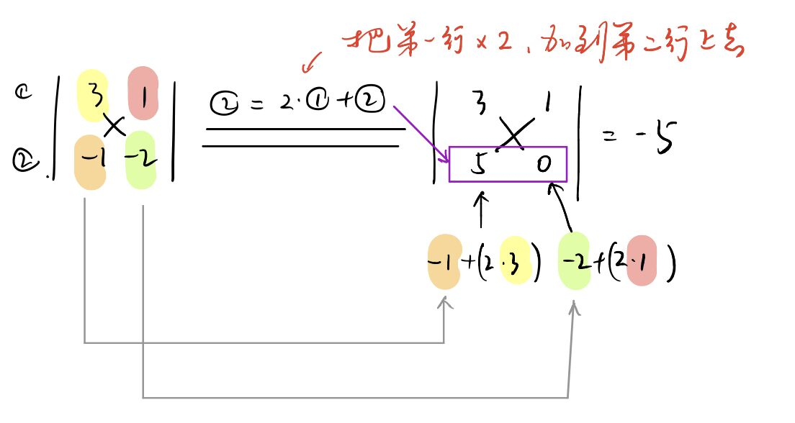
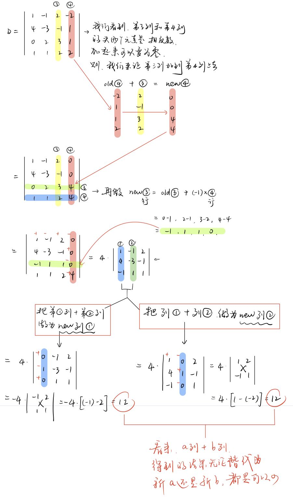

-
- 行列式的性质: 对行的"倍加运算", 其值不变
- ==什么叫"倍加运算"? 就是 把某一行(如a行)的若干倍, 再加到另一行(如b行)上去.==
- 将A的第j行（列）加上第i行（列）的α倍，叫做倍加行（列）变换.
- 如:
- 
- 行列式的计算, 就是把它逐步"降维度", 即"展开"来算. 如, 4阶 变成 "4个三阶的和";   每个3阶又展开成 "3个二阶的和", ...  为了降低"计算的繁琐度", 我们尽量用"倍加性质", 来把行或列上的元素, 变成0.  然后选择0元素多的 行或列, 来进行展开.
- > 
-
-