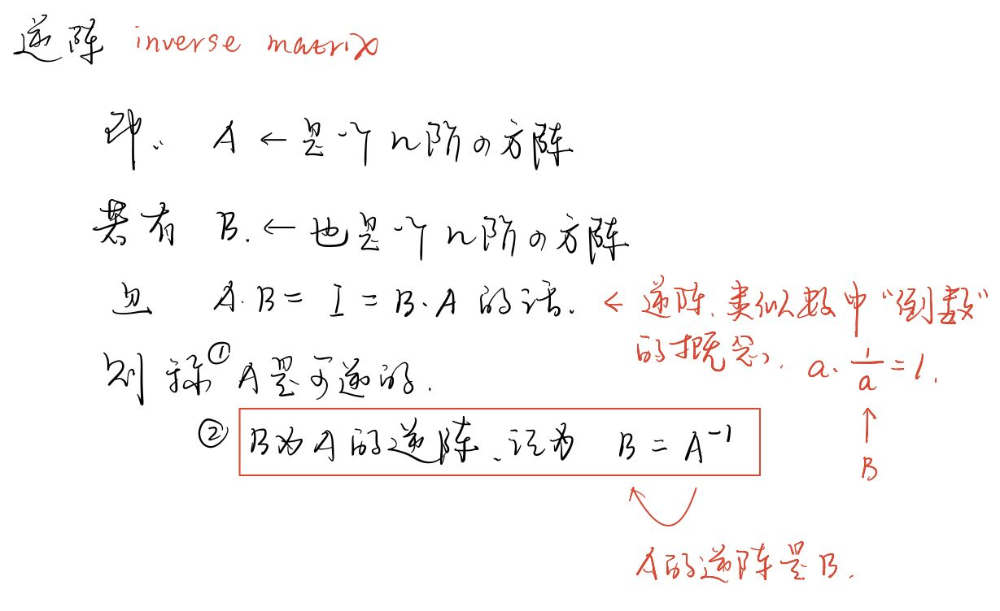
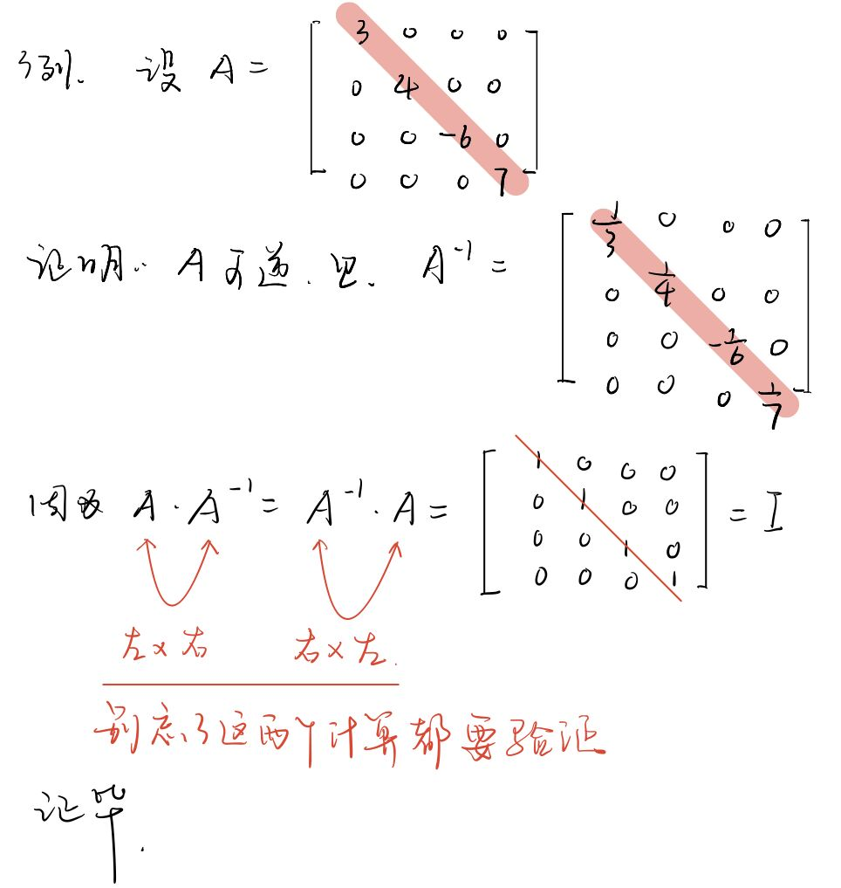
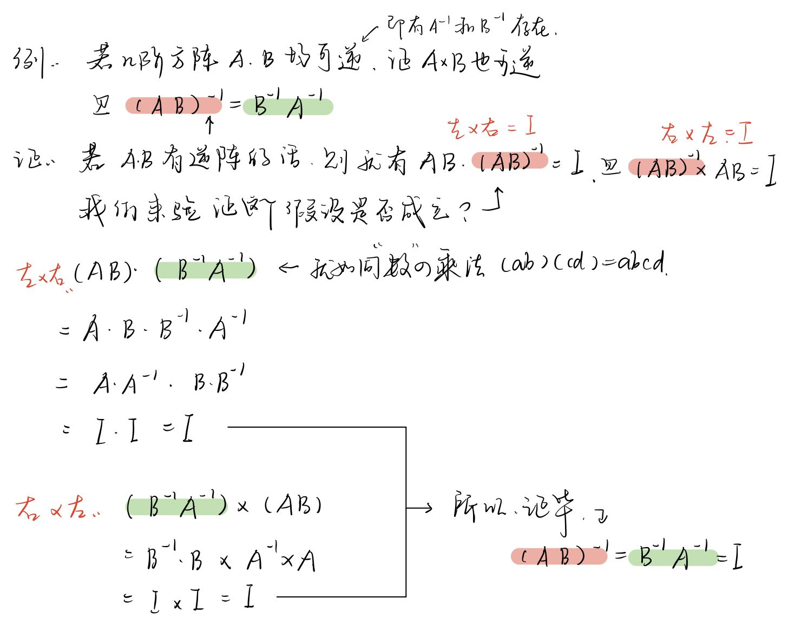
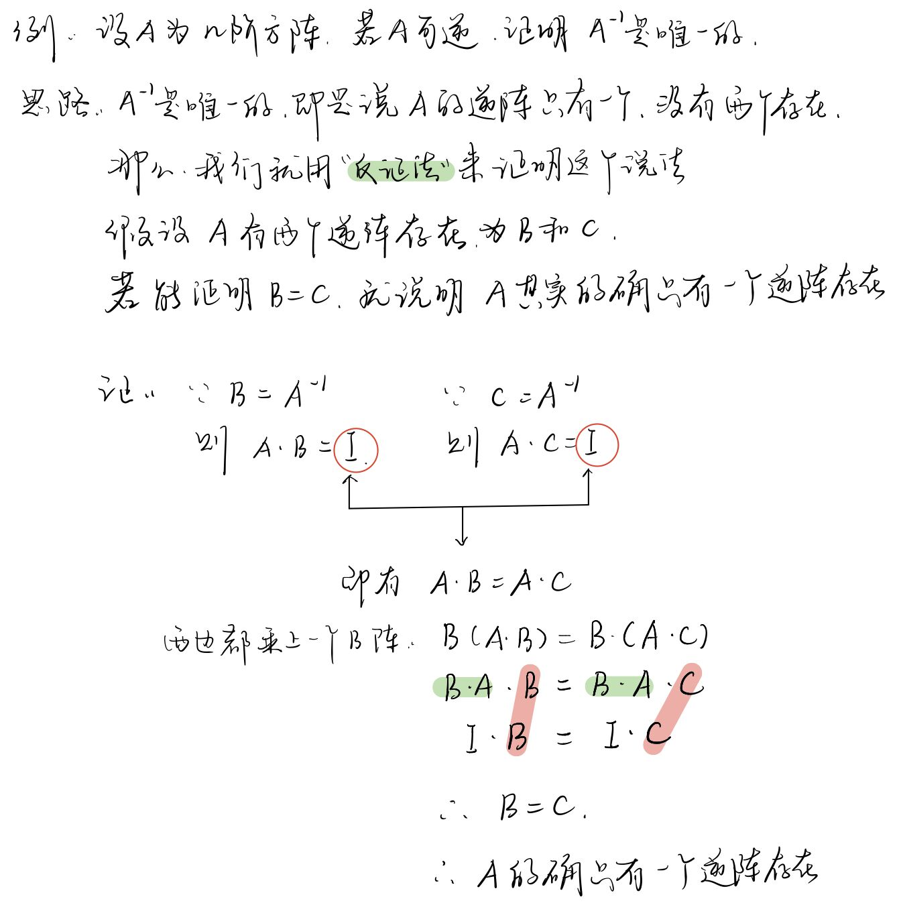

- 设A是一个n阶矩阵，若存在另一个n阶矩阵B，使得： AB=BA=E ，则称方阵A可逆，并称方阵B是A的"逆矩阵".
- 
- ---
- {:height 427, :width 392}
- ---
- 
- ---
- {:height 427, :width 529}
-
- 从上例, 我们可以得出"逆矩阵"的一个性质:
	- ==若矩阵A, B 都可逆,  则 ①"它们的乘积"也一定是可逆的. ②且这"两个矩阵乘积"的逆阵, 等于"它们逆阵"的乘积, 但先后次序要颠倒一下.==
	  即: 
	  \begin{align*}
	  \boxed{
	  (A*B)^{-1} =B^{-1} * A^{-1}
	  }
	  \end{align*}
- ---
- 
-
- 从上例, 我们可以得出"逆矩阵"的又一个性质:
	- 若一个矩阵A 是可逆的, 则它的逆矩阵 A^{-1}, 是唯一的
- ---
- 是否任何一个方阵, 都有"逆阵"存在呢? 并非如此, 比如, ==零阵, 就没有倒数存在.  "零阵"和任何一个矩阵相乘, 都等于零阵, 而不等于"单位阵". ==
- ---
-
-