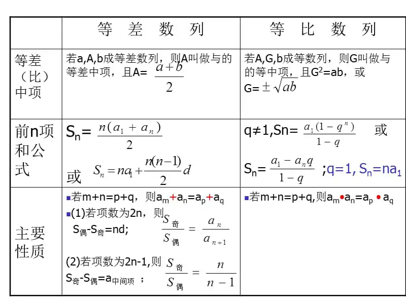
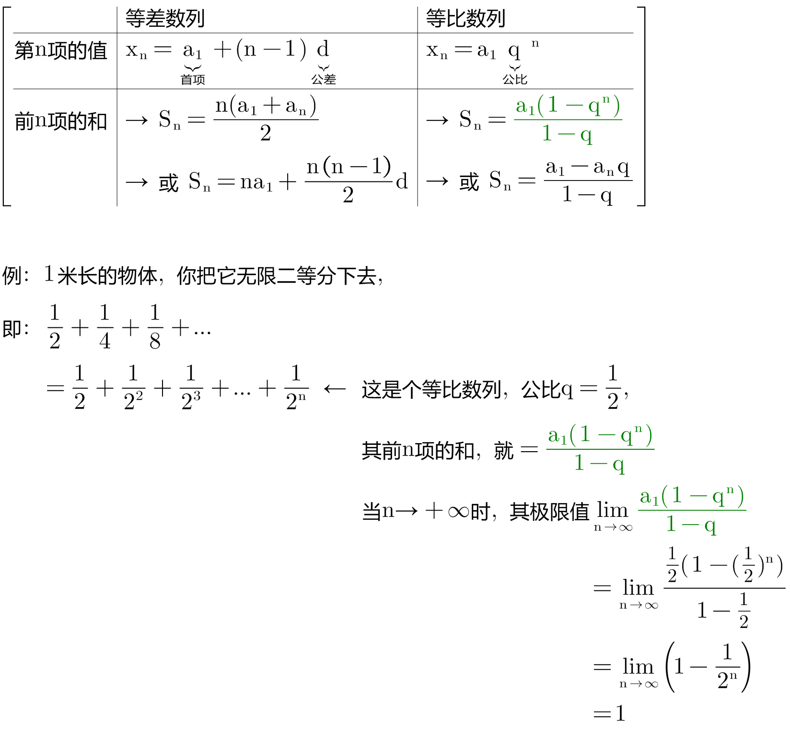
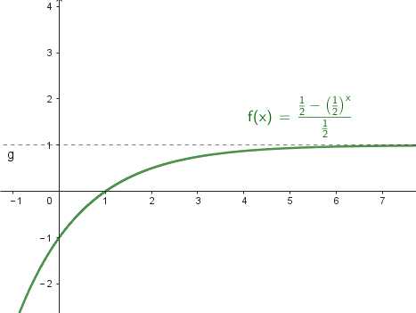
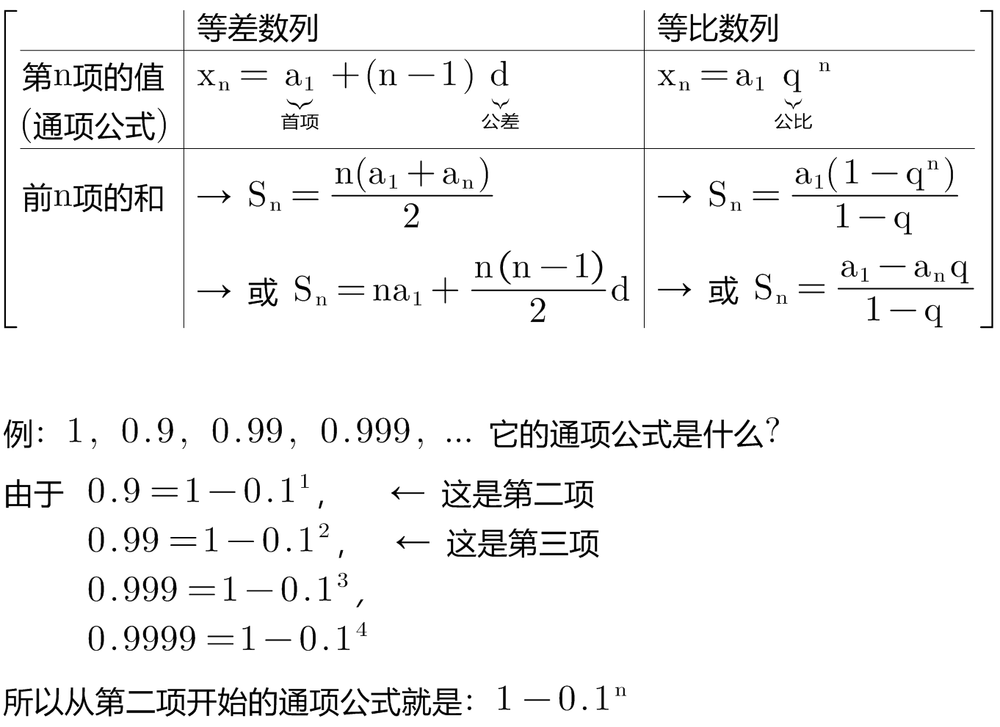
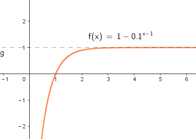

= 数列的极限
:toc: left
:toclevels: 3
:sectnums:

---

.标题
====
例如： +

====

.标题
====
例如： +

可以看出, 它的极限趋近于1.

====

https://www.bilibili.com/video/BV1mz4y127ue?p=4&vd_source=52c6cb2c1143f8e222795afbab2ab1b5

