= 基础_三角函数
:toc: left
:toclevels: 3
:sectnums:

---

image:img/320.jpg[,]

- sec是 与角度"相邻近"的左右两条边相比, 斜边在分子上. 即"斜边"比上"邻边".
- csc是 "斜边"比上"较远处的对边".

---

==== stem:[sin^2 x + cos^2 x = 1]

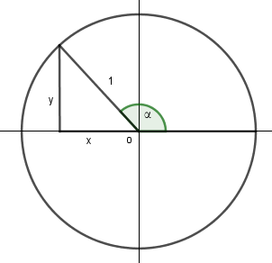

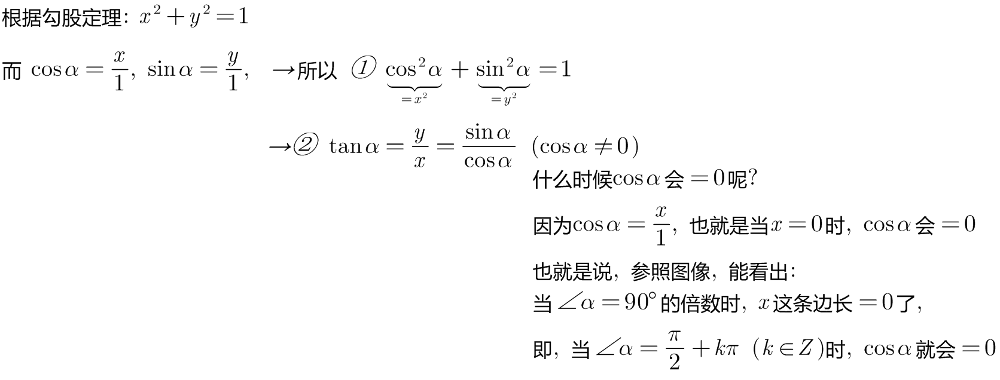

---

== 六边形

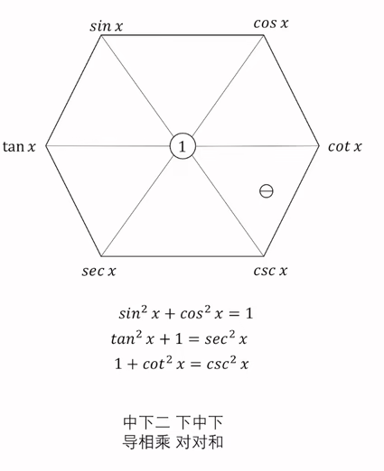

==== 按顺时针旋转, 每个元素的值, 是它下两个元素的比值的结果.

如:
[options="autowidth"]
|===
|Header 1 |验证

|tan x, 其顺时针方向, 下两个元素是 sin x 和 cos x,  +
所以, stem:[ tanx = \frac{sinx} {cosx}].
|

|stem:[ sin x = \frac{cos x} {cot x}]
| stem:[ \frac{\cos x}{\cot x}=\frac{\frac{b}{c}} {\frac{b}{a}} =\frac{b}{c} \cdot  \frac{a}{b} =\frac{a}{c} =\sin x]

|stem:[ cos x = \frac{cot x} {csc x}]
|stem:[ \frac{\cot x}{\csc x} =\frac{\frac{b}{a}} {\frac{c}{a}} =\frac{b}{a} \cdot \frac{a}{c }=\frac{b}{c} =\cos x]

|stem:[ cotx = \frac{csc x} {sec x}]
|stem:[ \frac{\csc x}{\sec x} =\frac{\frac{c}{a}}{\frac{c}{b}} =\frac{c}{a}\cdot \frac{b}{c} =\frac{b}{a}=\cot x]
|===

---

==== 里面的三个倒三角形, 每个倒三角形, 两个顶角元素的平方和 = 底角元素的平方.

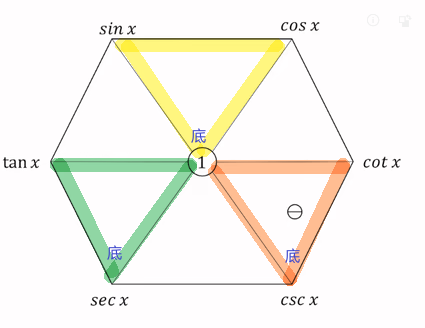

如:
[options="autowidth"]
|===
|Header 1 |验证

|stem:[sin^2 x + cos^2 x = 1^2]
|

|stem:[tan^2 x + 1^2 =  sec^2 x]
|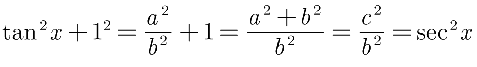

|stem:[1^2 + cot^2 x =  csc^2 x]
|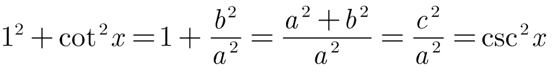
|===

---

==== 求导, 求积分, 规律: 中则下二, 下则中下, 导相乘, 对对和

[options="autowidth"  cols="1a,1a"]
|===
|Header 1 |Header 2

|中则下二
|*"中", 就是指六边形中间的两个元素, 即 tanx 和 cotx, 它们的"导数"就是其各自"下面"的元素, 乘"两次".* 如:

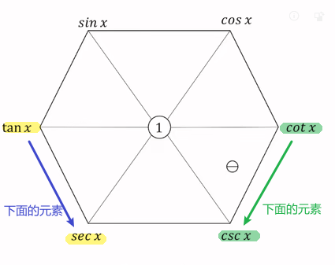

- tan x 下面的元素, 是 sec x,  把 sec x 乘两次, 就是 tan x 的导数. +
即: stem:[ tan'x= secx \cdot sec x = sec^2 x]

- cot x 下面的元素, 是 csc x,  把 csc x 乘两次, 就是 cot x 的导数. +
即: stem:[ cot'x=- csc x \cdot csc x = - csc^2 x]

求积分亦然. *tanx 和 cotx, 它们的"求积分"就是其各自"下面"的元素, 相加"两次".* 如:

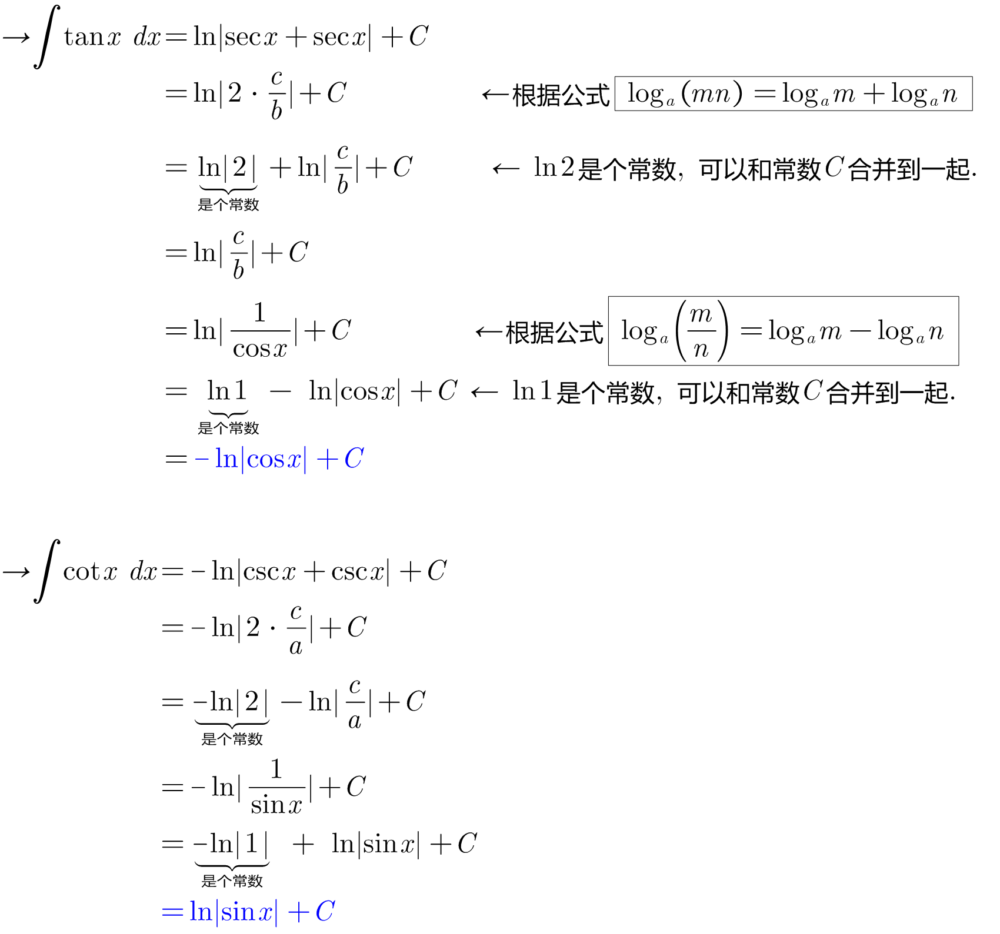

|下则中下
|*"下"就是六边形最下面的两个元素: secx 和 cscx. 对它们的求导或积分, 就是取它们各自"上面"(即六边形中间)和"其自身"(即六边形下面)元素的组合.*

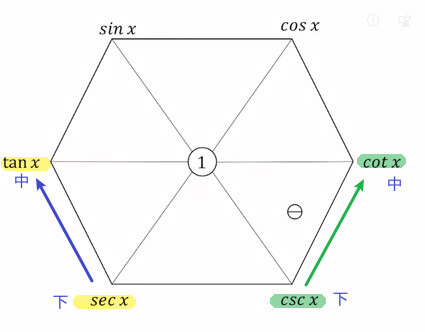

如: 六边形"下面"的元素 secx, 其导数, 就是其一侧的六边形"中间"的元素 tanx, 和六边形"下面"的元素(即secx自身)的组合.  这就是"下则中下"的意思.

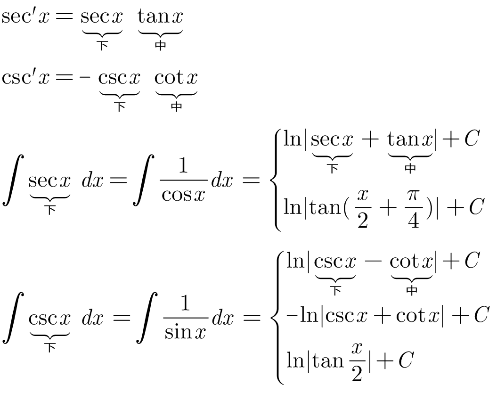

|导相乘
|如果你求的是导数, 就把你组合中的两个元素, 相乘就行了.

如: +
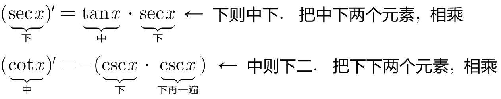

|对对和
|对于积分, +
第一个"对": 是取"对数ln"的意思. +
第二个"对": 是取"绝对值"的意思. +
"和": 就是取加号

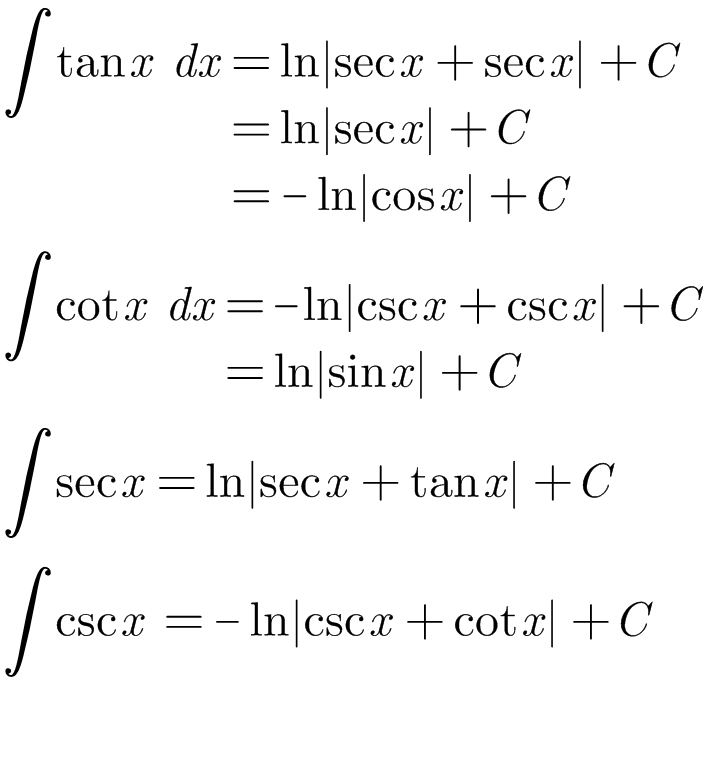

|===

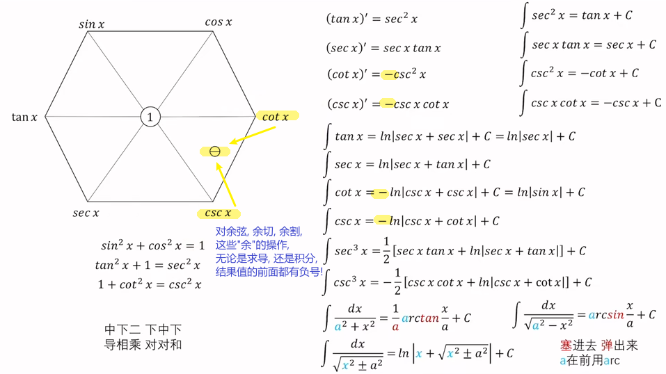

---

==== stem:[ sec^3 x 和 csc^3 x] 的积分公式

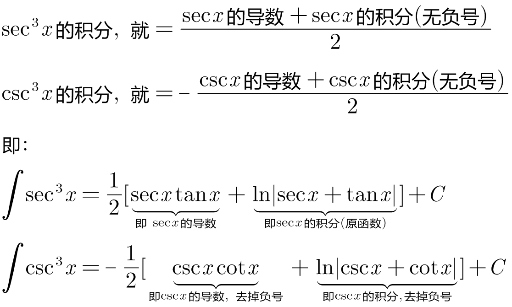

---

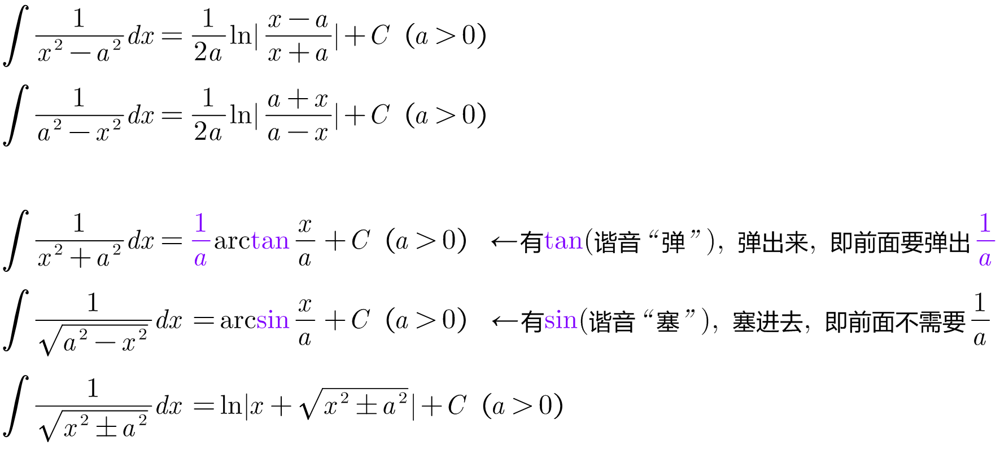

---

---

https://zhuanlan.zhihu.com/p/390928056?utm_source=wechat_session&utm_medium=social&utm_oi=35541970059264
