= 基础_复数 Z=a+bi
:toc: left
:toclevels: 3
:sectnums:

---

== 复数 complex number  -> stem:[ Z=a+bi]

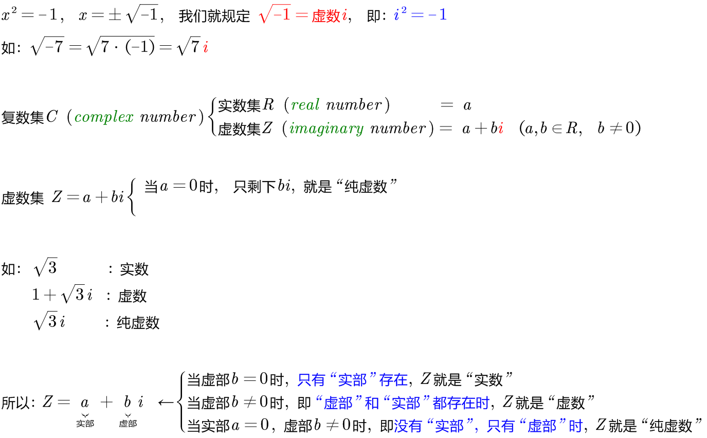

---

=== 虚数 i 是个周期函数 -> 在 stem:[ i^1 =i, \quad  i^2 =-1, \quad  i^3 =-i, \quad  i^4 =1] 之间循环

\begin{align}
& i^1 = i \\
& i^2 = -1 \\
& i^3 = i^2 \cdot i = -i \\
& i^4 = (i^2) ^2 = 1 \\
& i^5 = (i^2) ^2 \cdot i = i \\
\end{align}

.标题
====
例如： +
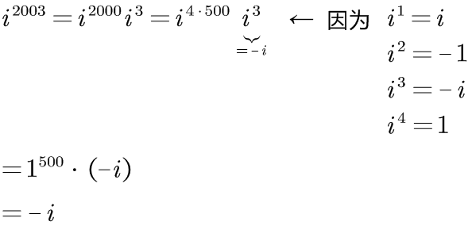
====

---

== 复平面 complex plane

两个不同"复数"间, 是可以比大小的. 怎么比较呢? 就是看它们与"原点"间的距离(即"线性代数"中的"模长"的概念).

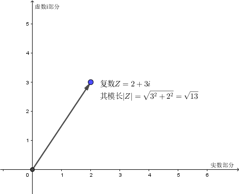

即: 和"线性代数"中的"向量"相似,  复数 stem:[Z=a+bi] 的模长 stem:[|Z|= \sqrt{a^2 + b^2} ]

若两个复数相等, 则它们一定是"实部"与"实部"相等, "虚部"与"虚部"相等.

.标题
====
例如： +
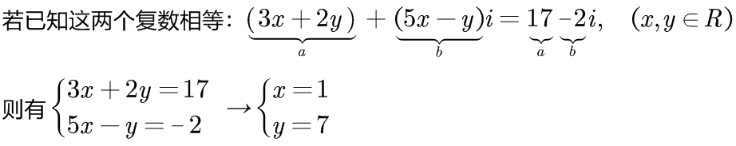
====

---

== 复数的四则运算

=== 加减法 -> 符合"向量"的加减法规则

.标题
====
例如： +
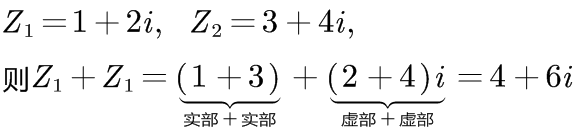
====

"复数"的加减法, 和"向量"的加减法一模一样, 符合平行四边形法则:

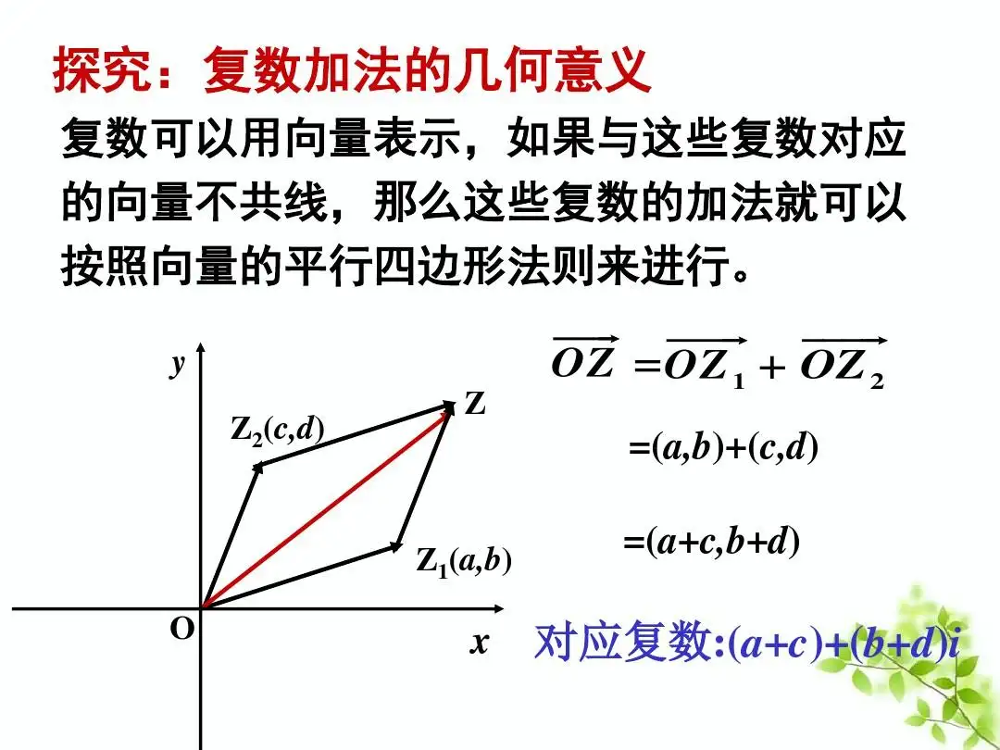

---

=== 乘法

复数的乘法, 你把虚数i 当做变量x 来进行就行了:

.标题
====
例如： +
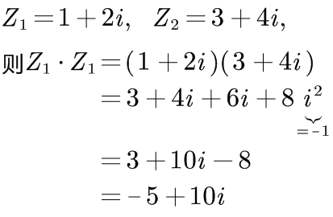
====

---

=== 共轭复数 conjugate complex number -> stem:[Z_1 = a+ bi, and  Z_2 = a- bi]

两个复数, 若它们的"实部"相等，"虚部"互为"相反数". 则它们就称为"共轭复数".

共轭复数, 一般用在将分母上的"复数", 转化成"实数"的过程中.  即: 如果一个分式, 分母上为复数, 我们想把分母变成实数, 就利用共轭复数, 让它们相乘, 即stem:[ (a+bi)(a-bi)= a^2 - b^2 i^2 =a^2 + b^2 ], 就把虚数i 的部分化解掉了.

.标题
====
例如： +
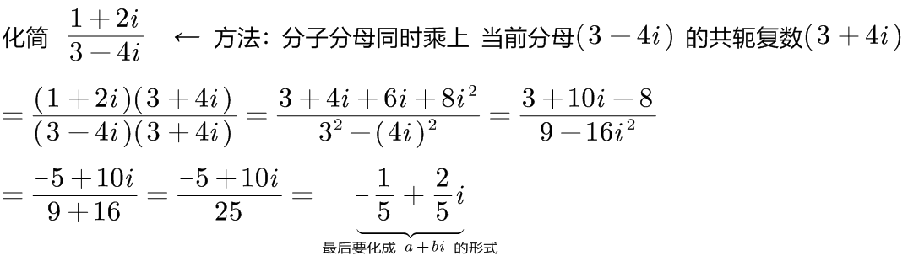
====

.标题
====
例如： +
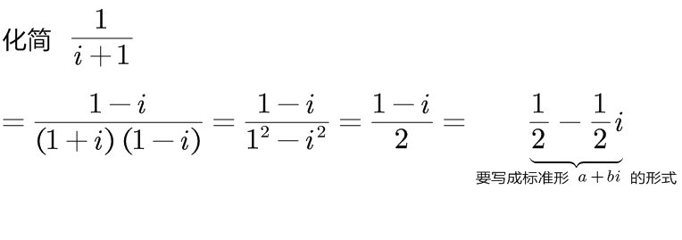
====

.标题
====
例如： +
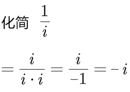
====

---

== 复数的 三角函数表示 ->  复数 stem:[ Z= r(cos θ + i sin θ)] , r是模长, θ是幅角主值.

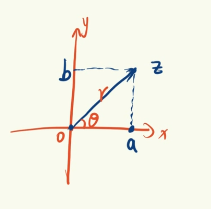

如上图(是个复平面):

[options="autowidth"]
|===
|Header 1 |Header 2

|->  r 为"模长 norm"
|

|-> θ 为"幅角 argument"
|在复平面上，复数所对应的向量, 与x轴正方向的夹角, 称为复数的"辐角". 显然一个复数的辐角有无穷多个，它们相差 2π 的整数倍. 但是在区间（0，2π] 内的只有一个，这个辐角就是该向量的"辐角主值"，也称"主辐角 principal argument angle"，记为argZ.
|===

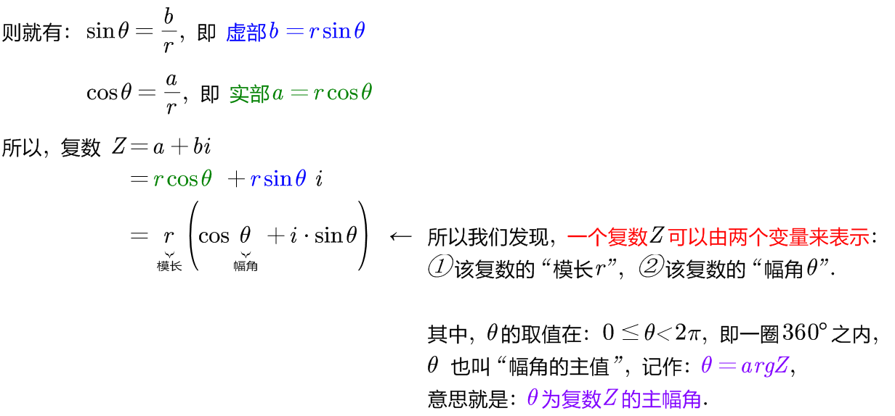

.标题
====
例如： +
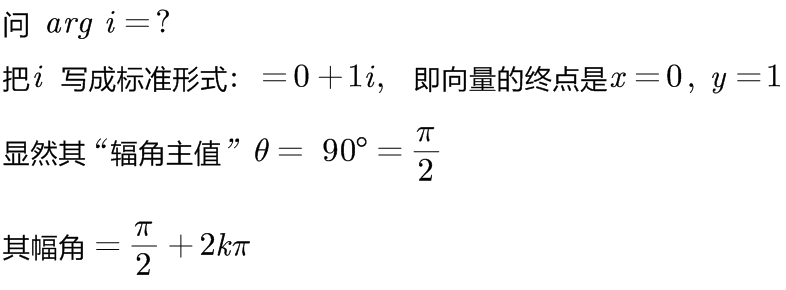

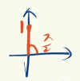
====

.标题
====
例如： +
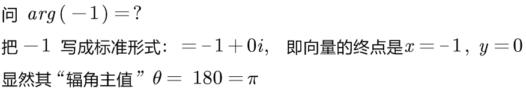

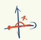
====

.标题
====
例如： +
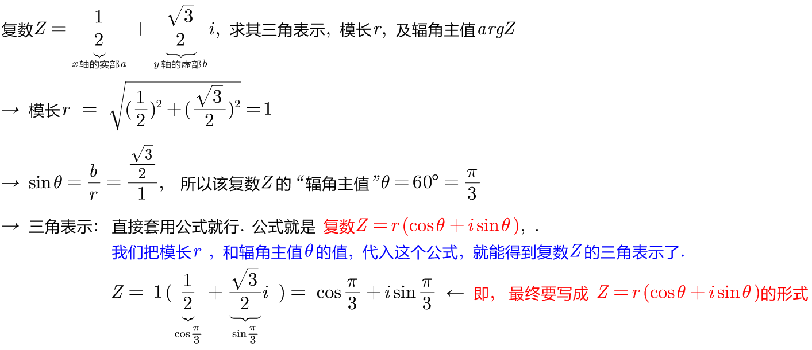

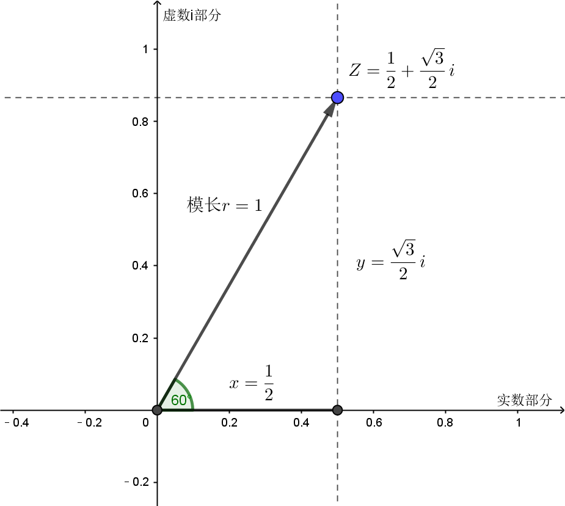
====

.标题
====
例如： +
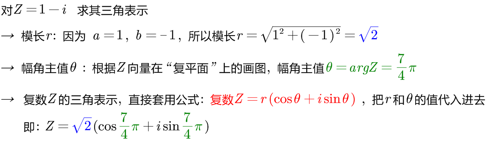

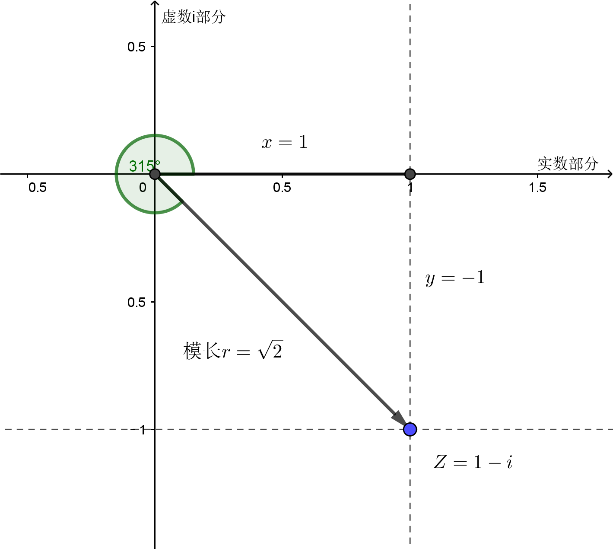
====

---

=== 复数的"三角表示", 有什么用处? 用处就在于, 当两个复数"相乘"或"相除"时, 能利用"三角表示"很快算出答案.

=== 两个复数"相乘"的结果 :  stem:[ Z_1 Z_2 = r_1 r_2 \[ cos(θ_1 + θ_2) + i sin(θ_1 + θ_2) \]]

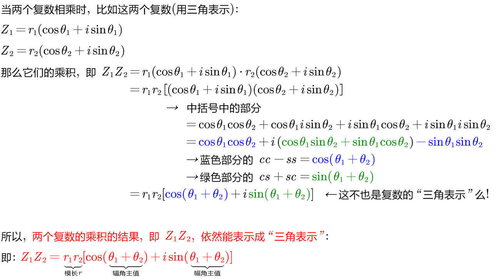

即: 两个复数α, β 相乘的结果, 是个新复数 γ.  而 γ依然可以用"三角表示": +
-> γ的 模长r, 就等于α和β的模长的"乘积". 即: stem:[ r_γ = r_α r_β] +
-> γ的"辐角主值"θ, 就等于α和β的θ的"和", 即: stem:[ θ_γ = θ_α + θ_β]

---

=== 两个复数"相除"的结果 :  stem:[ \frac{Z_1} {Z_2}  = \frac{r_1} {r_2}   \[ cos(θ_1 - θ_2) + i sin(θ_1 - θ_2) \]]

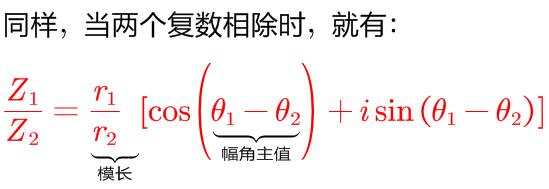

即: 两个复数α, β "相除"的结果, 是个新复数 γ.  而 γ依然可以用"三角表示": +
-> γ的 模长r, 就等于α和β的模长的"相除". 即: stem:[ r_γ = r_α / r_β] +
-> γ的"辐角主值"θ, 就等于α和β的θ的"差", 即: stem:[ θ_γ = θ_α - θ_β]

.标题
====
例如： +
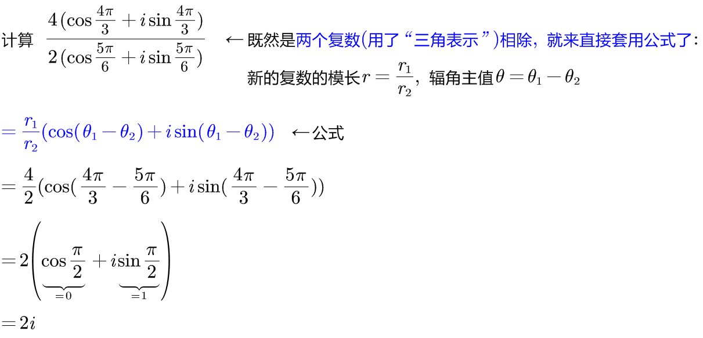
====

---

