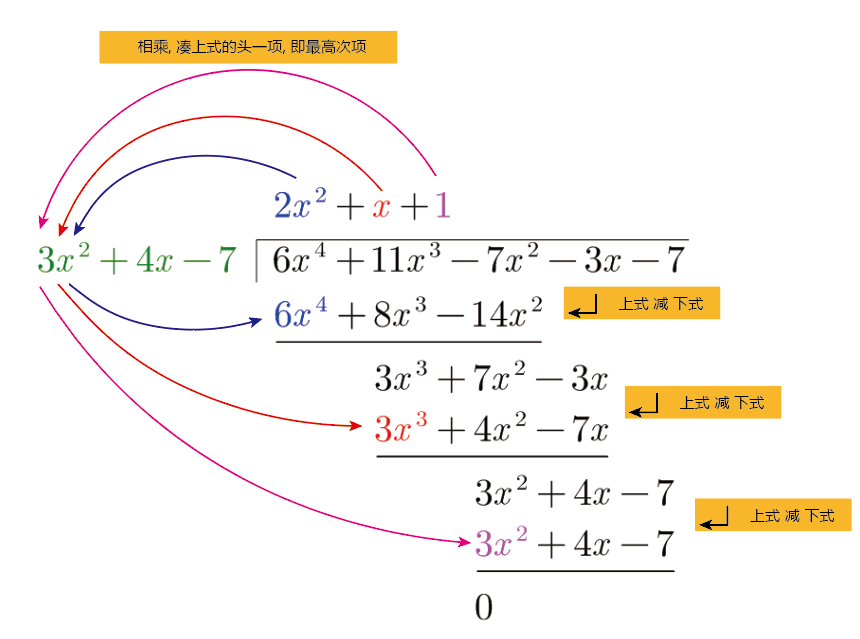
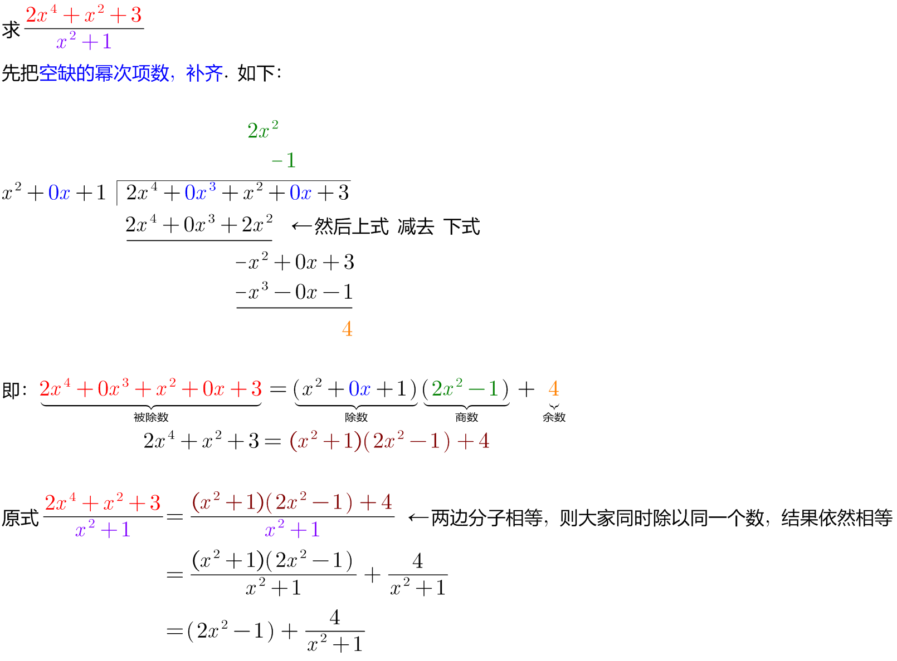

= 基础_多项式的除法
:toc: left
:toclevels: 3
:sectnums:

---

== 多项式的除法

被除式 ÷ 除式 = 商式 + 余式

- 多项式除以多项式, 必须首先把被除式、除式, 按某个字母作"降幂"排列，并把所缺的项, 用零补齐．
- 被除式=除式×商式+余式

.标题
====
例如： +

====

.标题
====
例如： +

====

