= 极坐标 Polar Coordinate System
:toc: left
:toclevels: 3
:sectnums:

---

== 极坐标 Polar Coordinate System -> stem:[ x= ρ cos θ, \ y = ρ sin θ]

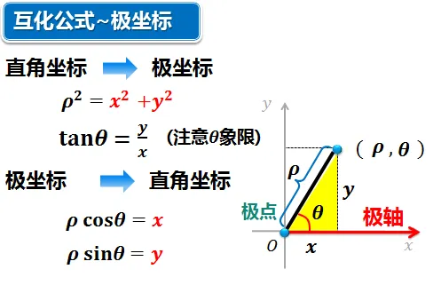

== ρ 扫过的是"边线"

[options="autowidth"]
|===
|Header 1 |Header 2 |

|

stem:[ ρ = r]

|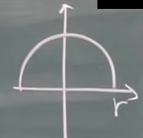

\begin{align}
 ρ = r,  \\ 0 \leq θ \leq π
\end{align}

|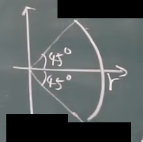

\begin{align}
 ρ = r,  \\
-\frac{π} {4} \leq θ \leq \frac{π} {4}
\end{align}

|

注意, 这里, 圆心不在原点了. ρ就会是变化的了. +
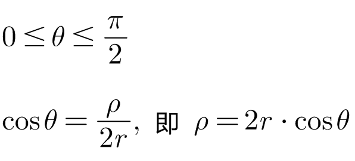

|

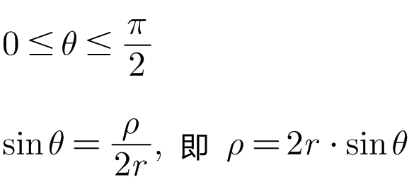

|
|===

---

== ρ 扫过的是"整个面积", 圆心在原点上.

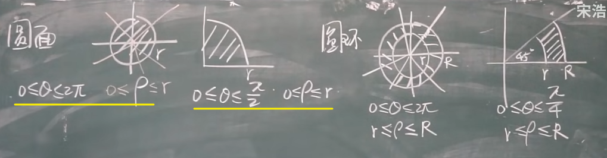 +

为什么 ρ会贯穿"0到r"的全部范围? 因为这里, 是指向的"整个一大片面积区域", 都要扫过, 而不是圆周长的边线.

---

== ρ 扫过的是"整个面积", 但圆心不在原点上.

[options="autowidth"]
|===
|Header 1 |Header 2

|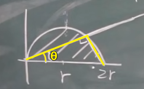

\begin{align}
0 \leq θ \leq \frac{π} {2} \\
0 \leq ρ \leq 2r \cdot cosθ
\end{align}

|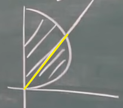

\begin{align}
0 \leq θ \leq \frac{π} {2} \\
0 \leq ρ \leq 2r \cdot sinθ
\end{align}
|===

---

== 用极坐标, 来表示"线段"

.标题
====
例如： +
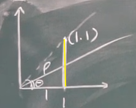

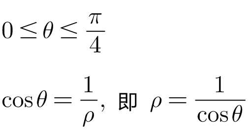
====

.标题
====
例如： +
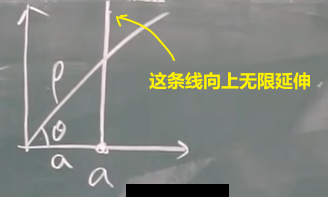

\begin{align}
& 0 \leq θ < \frac{π} {2} \\
& cosθ = \frac{a} {ρ} , \ 即: ρ= \frac{a} {cos θ}
\end{align}
====

.标题
====
例如： +
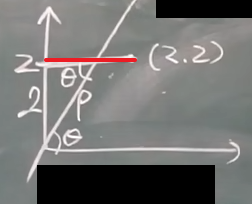

红线段这个, 就是: +
\begin{align}
& \frac{π} {4} \leq θ \leq \frac{π} {2} \\
& sinθ = \frac{2} {ρ} , \ 即: ρ= \frac{2} {sin θ}
\end{align}
====

.标题
====
例如： +
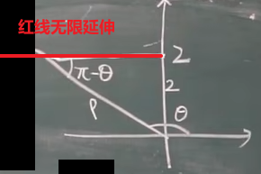

无限延伸的红线这个, 就是: +
\begin{align}
& \frac{π} {2} \leq θ \leq π \\
& sin(π-θ) = \frac{2} {ρ} , \\
& 即: ρ= \frac{2} {sin(π-θ)} = \frac{2} {sin θ}
\end{align}
====

.标题
====
例如： +
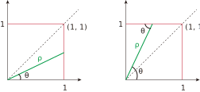

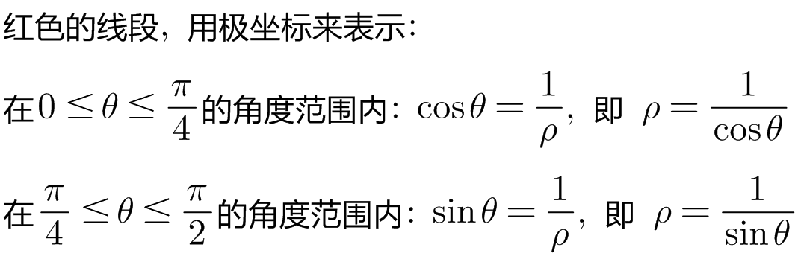

其实, 套用"极坐标公式" (stem:[ x= ρ cos θ, \ y = ρ sin θ]), 能更快速的解出答案: +

\begin{align}
& 对于 x=1 这条线段, 套用  [x = ρ cos θ] 公式, 就有: ρ cos θ =1, 即: ρ = \frac{1} {cos θ} \\
& 对于 y=1 这条线段, 套用  [y = ρ sin θ] 公式, 就有: ρ sin θ =1, 即: ρ = \frac{1} {sin θ} \\
\end{align}

====

.标题
====
例如： +
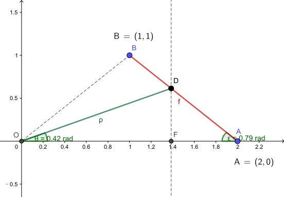

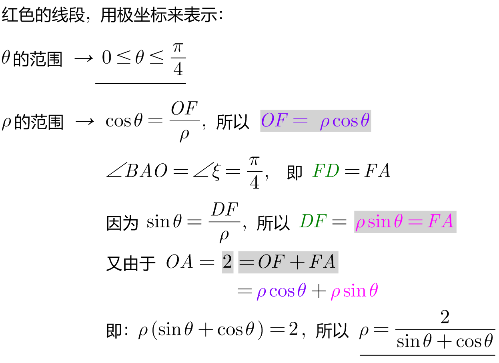

下面, 我们套用"极坐标公式" (stem:[ x= ρ cos θ, \ y = ρ sin θ]) 来做:

\begin{align}
& 首先, 求出红色线段的公式, 用直线公式 : y = kx + b.  把 [x= ρ cos θ, \ y = ρ sin θ ]代进去. \\
& ρ sin θ = k(ρ cos θ) +b \\
& ρ sin θ - k(ρ cos θ) = b \\
& ρ (sin θ - k cos θ) = b \\
& ρ = \frac{b} {sin θ - k cos θ} \\
\end{align}

====

---

== 用极坐标, 来表示"面积"

.标题
====
例如： +
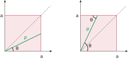

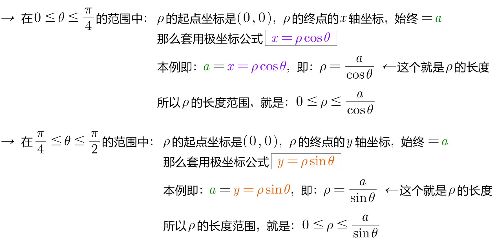
====

.标题
====
例如： +
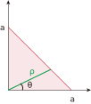

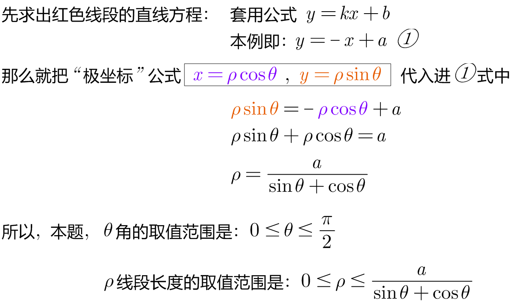
====

---

