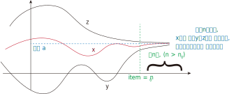
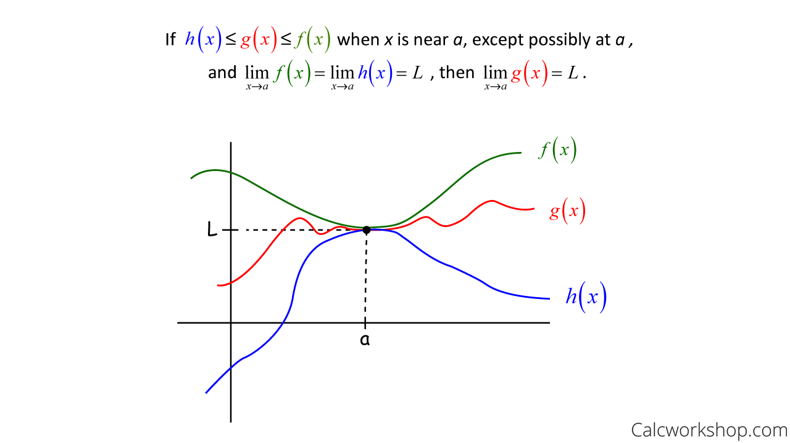

= 极限_夹逼定理
:toc: left
:toclevels: 3
:sectnums:

---

== 夹逼定理 Squeeze Theorem, Sandwich Theorem

夹逼定理就是:: 假设有两个数列 stem:[{x_n}] 和 stem:[{y_n}], 随着item项的增长, 到了某一项(即到第stem:[n_0]项)时, x数列中 该项(即第stem:[n_0]项)后的所有项( 假设它们叫第n项, stem:[n > n_0] ), 都满足这些个关系:

1. stem:[y_n <= x_n <= z_n], <- stem:[z_n] 是另一个数列.
2. 随着item项数 n 趋近于∞,  数列y 和数列z 的极限, 都是a. 即 stem:[\lim_{x \to ∞} y_n = a ], stem:[\lim_{x \to ∞} z_n = a ]

则: x的极限(随着项数n趋近于∞), 也等于a. 即: stem:[\lim_{x \to ∞} x_n = a ]

这个就是夹逼定理.

---
