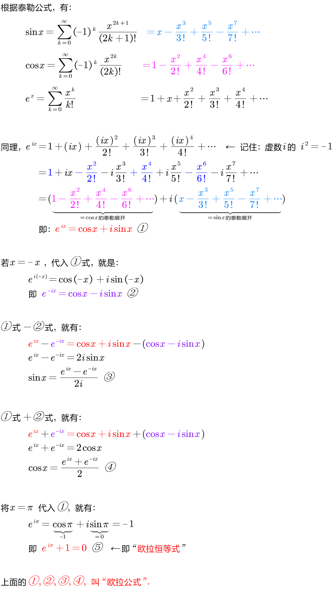
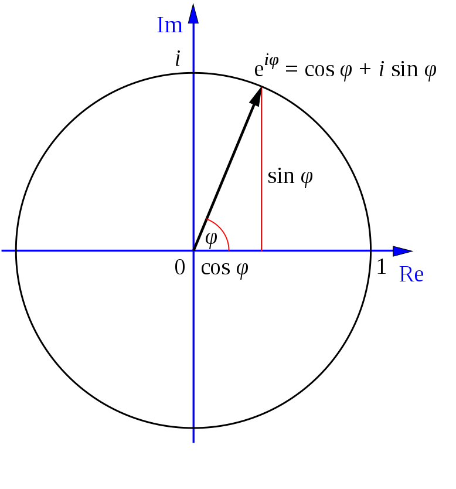
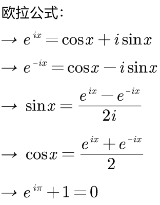
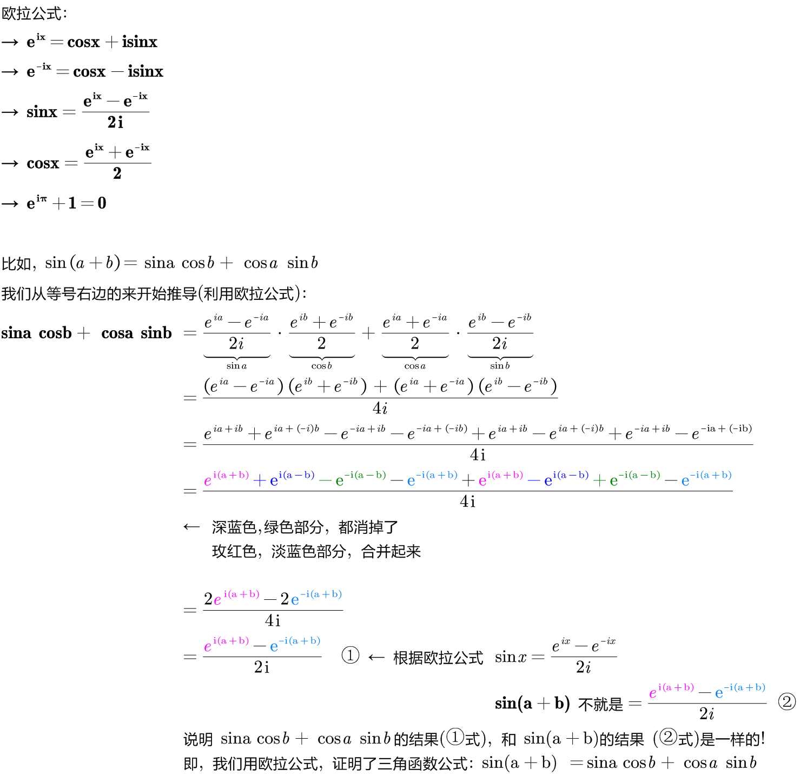

= 基础_欧拉公式
:toc: left
:toclevels: 3
:sectnums:

---

== 欧拉公式 Euler's formula -> stem:[e^(ix)= (cos x +i sin x) ],  e是自然对数的底，i是虚数单位。

从欧拉公式  stem:[e^(ix)= (cos x +i sin x) ] 可以知道,  stem:[ cos x +i sin x] 这部分, 不就是复数的 stem:[ Z= a+bi] 的形式吗 ! 说明 stem:[ e^(ix)]是个复数.

欧拉公式, 把"复指数函数"与"三角函数"联系起来了. 它将指数函数的定义域, 扩大到复数.

---

=== stem:[e^{ix}  =\cos x +i \sin x  ]

=== stem:[ e^{-ix}  =\cos x -i \sin x ]

=== stem:[\sin x  =\frac{e^{ix} -e^{-ix}}{2i} ]

=== stem:[\cos x  =\frac{e^{ix} +e^{-ix}}{2}  ]

=== stem:[ e^{i\pi} +1 = 0 ]

---

== 欧拉公式的用处

=== 用处1: 所有的"三角函数"公式, 都可以用"欧拉公式"来证明

.标题
====
例如： +

====

---

=== 用处2: 可以用于积分运算. "欧拉公式"是连接"指数函数"和"三角函数"的桥梁, 可以实现"指数函数"和"三角函数"的转换.

---

