= 定积分_无界函数的反常积分 improper integral
:toc: left
:toclevels: 3
:sectnums:

---

== 无界函数 的反常积分

在实际中，会遇到一些函数, 是"无界"的, 即函数y=f(x) 在定义域上只有上界(或只有下界)；或者既没有上界又没有下界. 那么对它们来考虑类似于"定积分"的问题, 就是"无界函数的反常积分".

被积函数带有"瑕点"(无界处), 它的积分, 就称为"瑕积分" improper integral.

[options="autowidth"]
|===
|Header 1 |Header 2

|第1种情况: 右侧无界
|比如下图: b点处是无界的, 那么怎么处理该函数的积分呢? 我们可以在b点的左侧一点点, 取一个t点, 这样, [a-t]这段区间, 就是有界函数了. 然后, 我们让t点趋向于b点 (方向是从b的左侧, 来趋向于b). 如果这个极限存在, 则积分就是收敛的. 否则积分就是发散的.

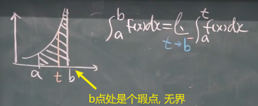

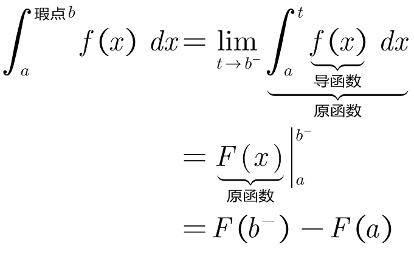

|第2种情况: 左侧无界
|如下图: a点处是无界的, 那么我们可以在a点的右侧一点点, 取一个t点, 这样, [t-b]这段区间, 就是有界函数了. 然后, 我们让t点趋向于a点 (方向是从a的右侧, 来趋向于a). 如果这个极限存在, 则积分就是收敛的. 否则积分就是发散的.

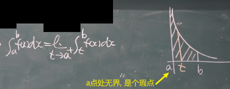

|第3种情况: 瑕点在曲线的中间
|如下图, c点是瑕点. 那么我们就把函数拆成两段, [a-c] 和 [c-b], 然后对两段, 分别在它们瑕点附近, 取一个t点. 之后的操作如前面介绍过的两种情况一样.

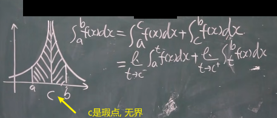
|===

==== stem:[\int_0^a \frac{1} {\sqrt{a^2 - x^2}} dx]
.标题
====
例如： +
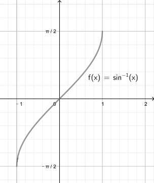

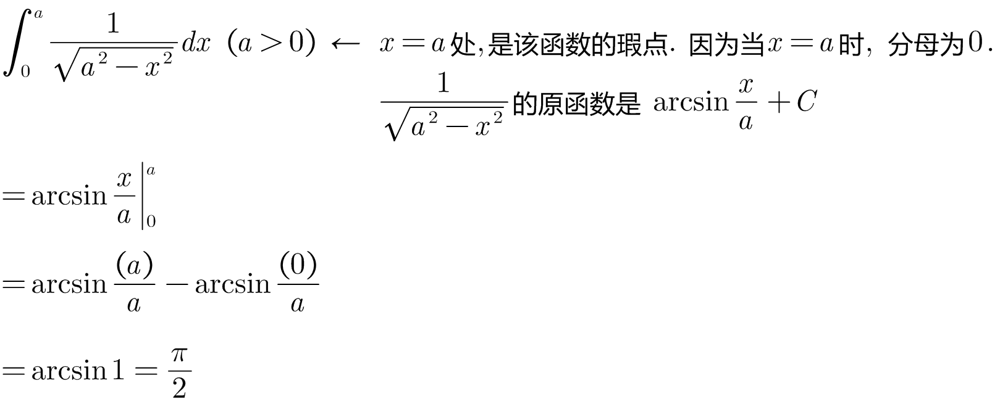
====

==== stem:[\int_-1^1 \frac{1}  {x^2} dx]
.标题
====
例如： +
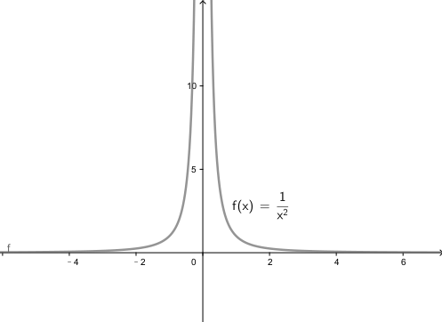

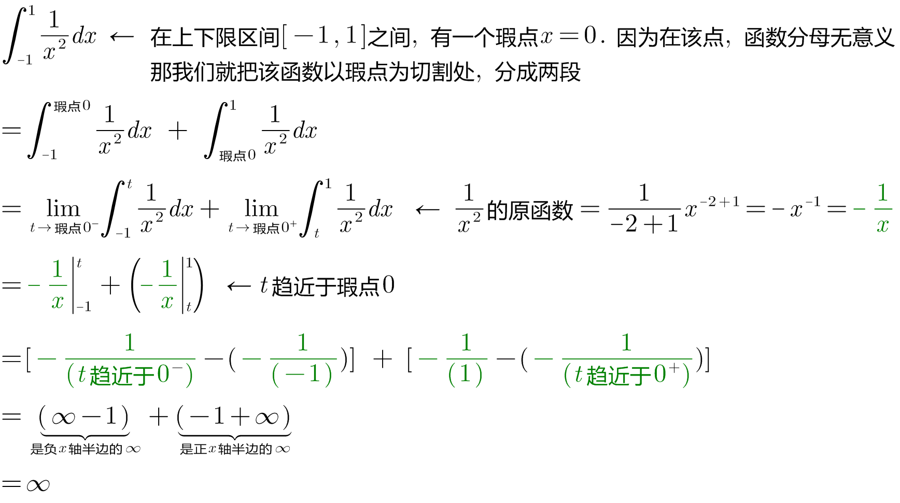
====

==== stem:[ \int_0^(+∞) \frac{1} {\sqrt{x(x+1)^3}} dx]
.标题
====
例如： +
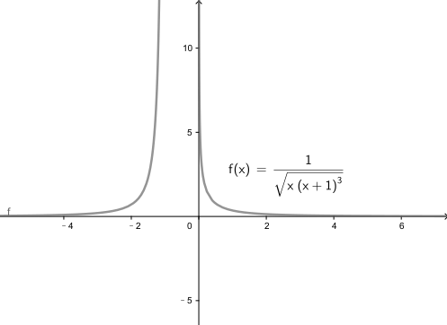

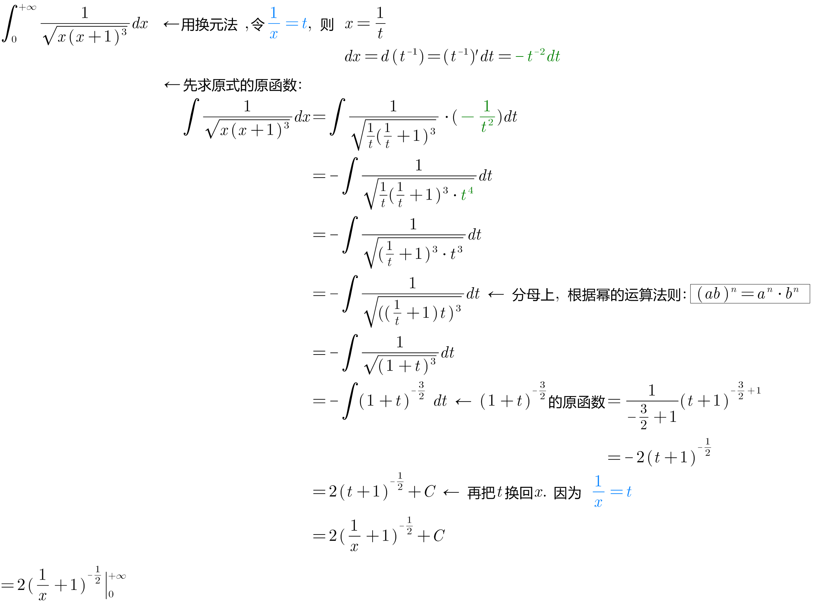
====

---

== 瑕积分 的欺骗性

.标题
====
例如： +

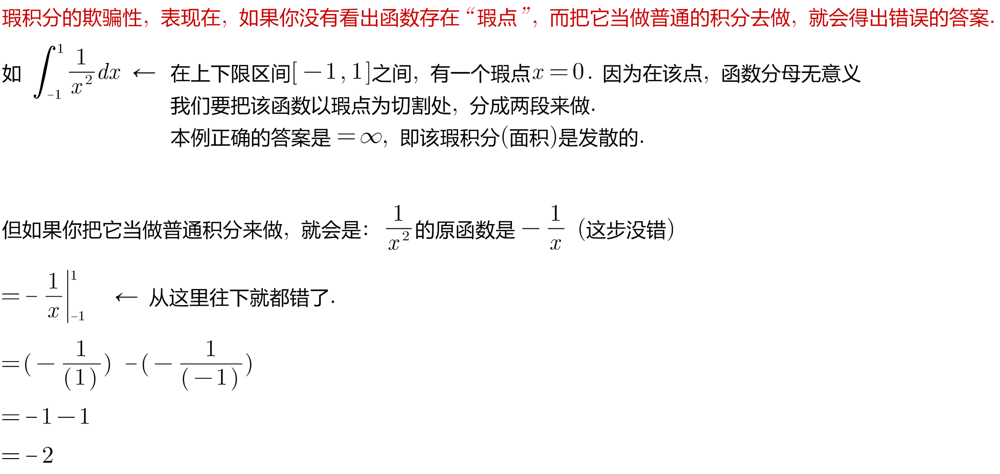
====

---

