= 极坐标 Polar Coordinate System
:toc: left
:toclevels: 3
:sectnums:

---

== Polar Coordinate System

极坐标, 其实就是用"向量"和"该向量与x轴(正方向)的夹角角度", 来定位物体.

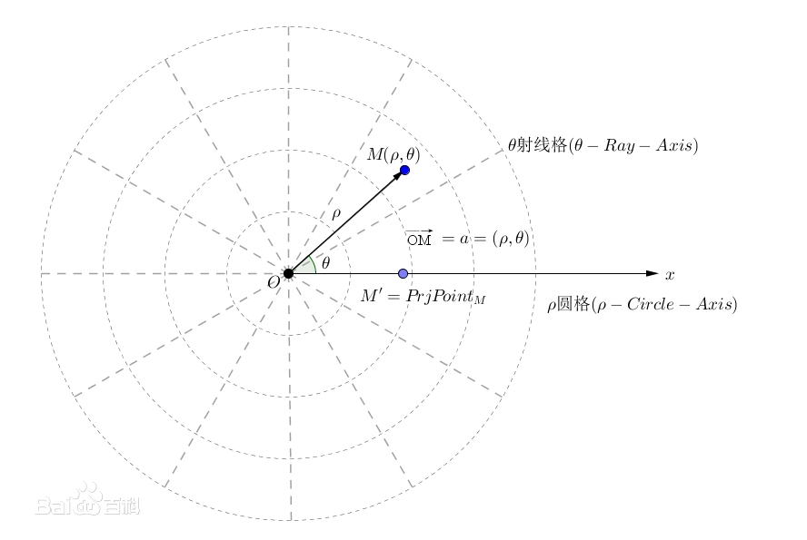

极坐标是指:  +
在平面内取一个定点O，叫极点， +
引一条射线Ox，叫做极轴， +
再选定一个长度单位, 和角度的正方向（通常取逆时针方向）。

对于平面内任何一点M:

[options="autowidth"]
|===
|Header 1 |表示

|ρ 或 r
|线段OM的长度

|θ
|从Ox到OM的角度

|ρ
|点M的"极径"

|θ
|点M的"极角"

|有序数对 (ρ,θ)
|点M的"极坐标"
|===

这样建立的坐标系叫做极坐标系。

通常情况下，M的极径坐标单位为1（长度单位），极角坐标单位为rad（或°）。

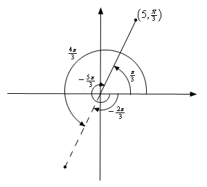

---

== "笛卡尔直角坐标系", 与"极坐标系" 的转化

[options="autowidth"]
|===
|Header 1 |Header 2

|笛卡尔 -> 极坐标
|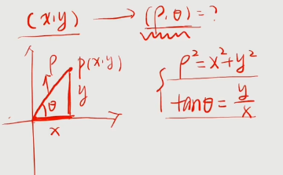

即, 极坐标系下: +
-> 角度θ 满足 stem:[ tan θ = y/x] +
-> 向量的模长满足 stem:[ ρ^2 = x^2 + y^2]

|极坐标 -> 笛卡尔
|反过来, 若已知"极坐标", 要转换为"直角坐标":

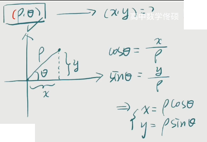

即: 用极坐标的两个参数 θ 和 ρ, 来表示直角坐标中的 x 和 y, 为: +
stem:[ x = ρ cos θ] +
stem:[ y = ρ sin θ] +
|===

.标题
====
例如： +
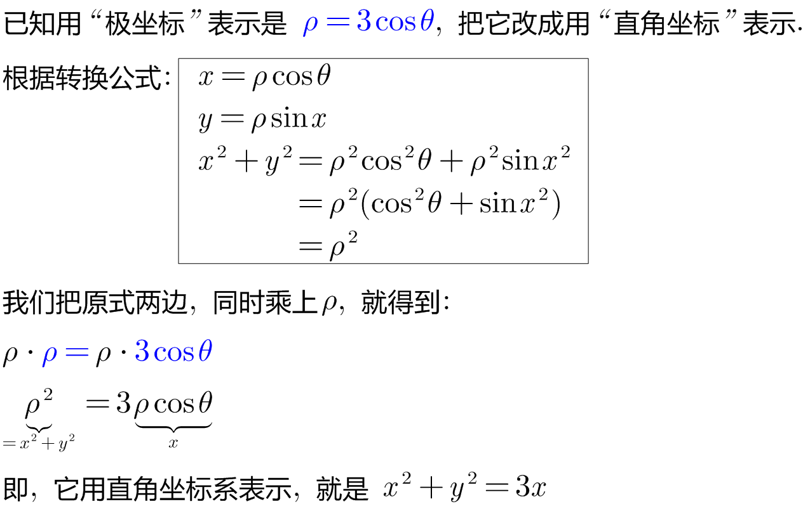
====

.标题
====
例如： +
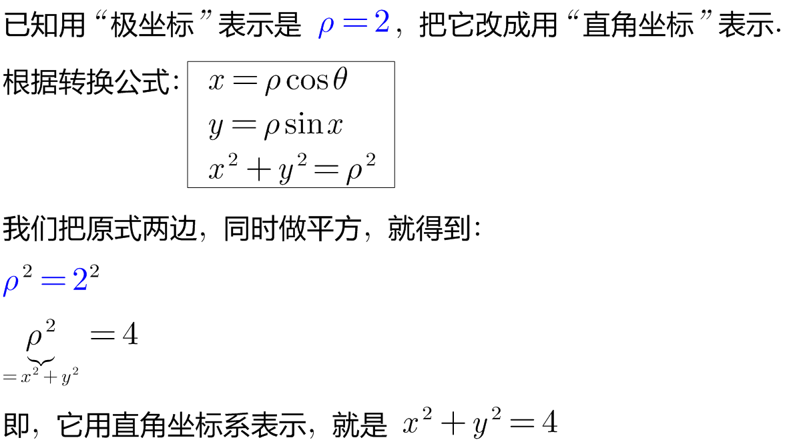
====

---

https://www.bilibili.com/video/BV1AJ411e7YF?spm_id_from=333.337.search-card.all.click&vd_source=52c6cb2c1143f8e222795afbab2ab1b5

https://www.bilibili.com/video/BV1Eb411u7Fw?p=60&vd_source=52c6cb2c1143f8e222795afbab2ab1b5

---

== 平面曲线的弧长

用定积分来表示弧长公式, 有三种写法 (下图中为 式子①, ②, ⑥), 都是从第一种推导出的.

[options="autowidth"]
|===
|Header 1 |Header 2

|第1, 2 种公式

|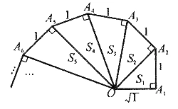

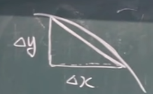

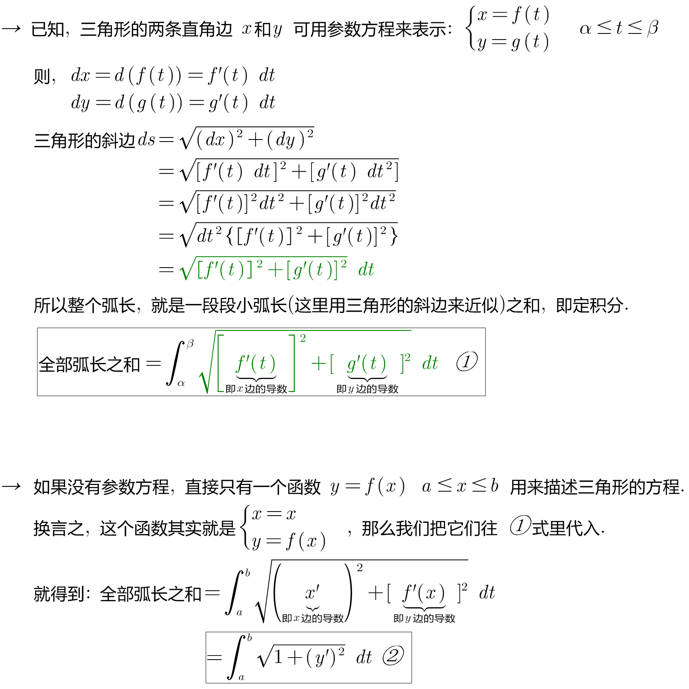

|第3种公式
|下面再来看, 如果三角形是用"极坐标"来表示的话: +
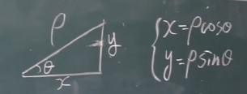

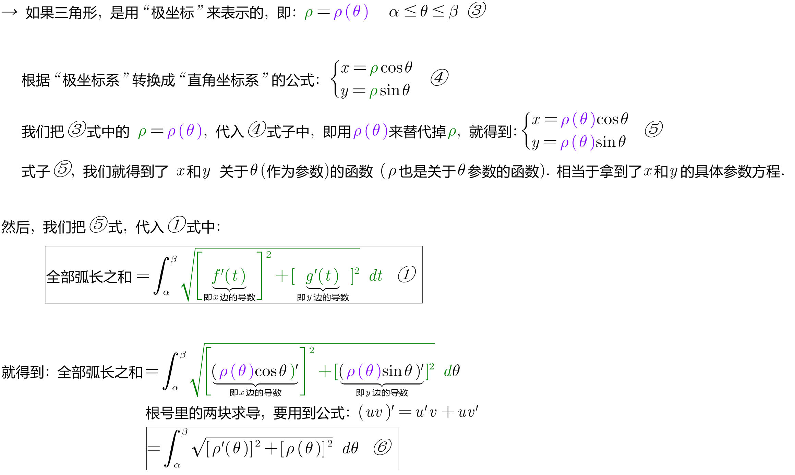
|===

.标题
====
例如： +
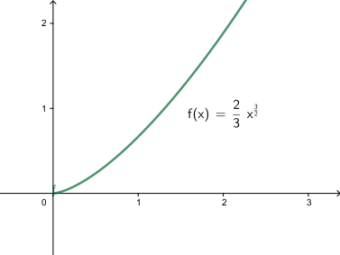

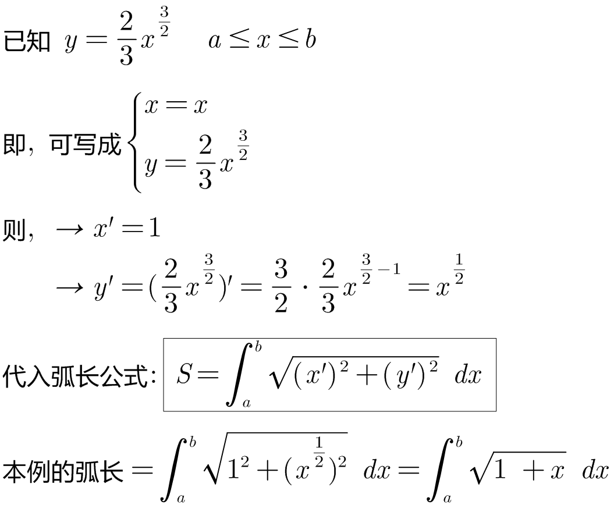
====

.标题
====
例如： +
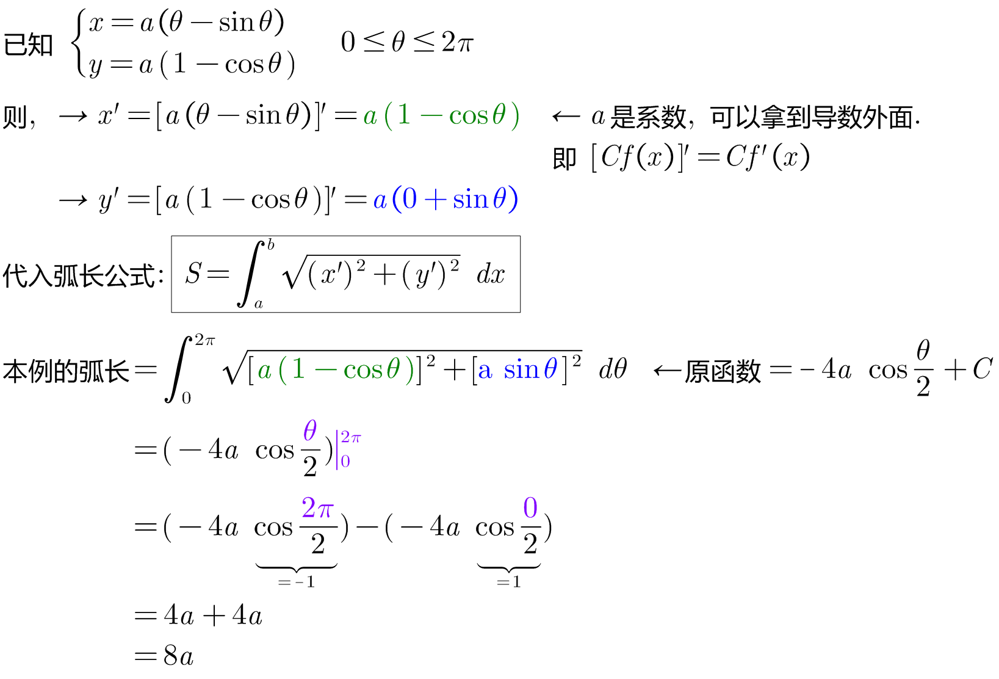
====

.标题
====
例如： +
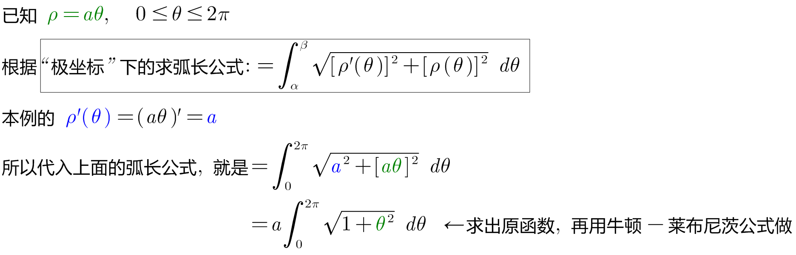
====

---

