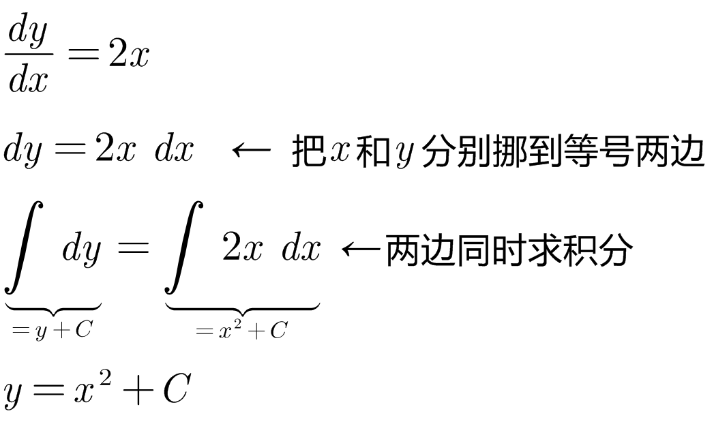
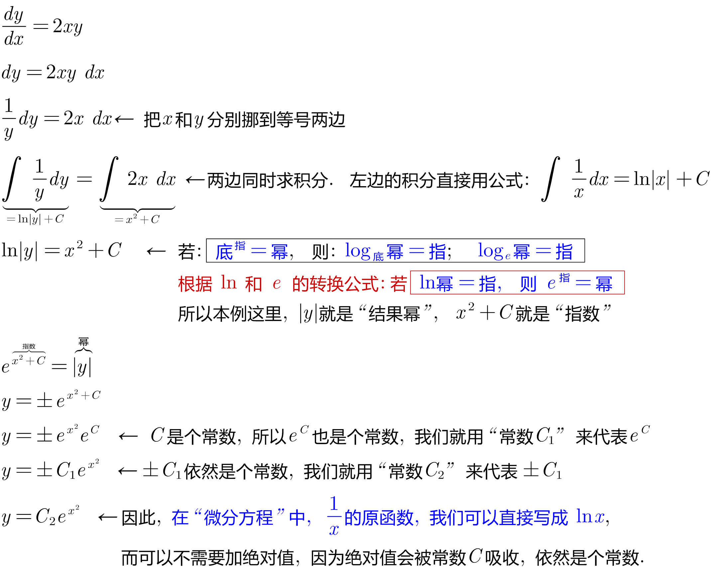
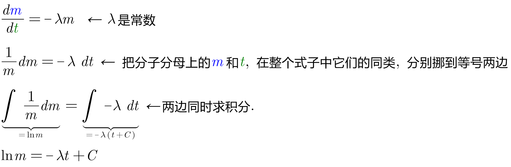
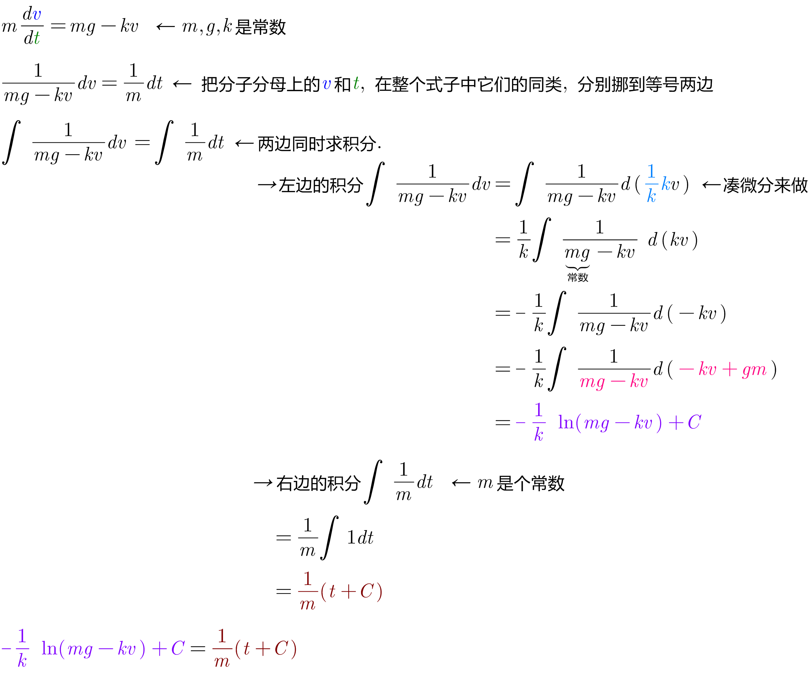

= 微分方程 differential equation
:toc: left
:toclevels: 3
:sectnums:

---

== 微分方程 differential equation

.标题
====
例如： +
image:img/574.png[,]
====

一些概念:

[options="autowidth"]
|===
|Header 1 |Header 2

|微分方程
|什么是"微分方程"? 含有导数的, 就是微分方程.

|阶数
|求导的阶数, 就叫"微分方程的阶数".

|通解
|含常数的个数 = 阶数. +
对一个微分方程而言，它的解会包括一些常数，对于n阶微分方程，它的含有n个独立常数的解, 就称为该方程的"通解"。

如下图中, 对二阶导的求原函数, 原函数中就含有两个常数. +
image:img/575.png[,]

|===

---

== 可分离变量的微分方程 Separable Equation

什么是可分离的微分方程? 如果原来的方程,  stem:[y'= \frac{dy} {dx}],  经过整理后, 能变成这样的形式: stem:[g(y) \ dy = f(x) \ dx], 即 dy 和 含y的表达式, 在等号的一边; dx 和 含x的表达式, 在等号的另一边. 即, x和y 在等号两边完全分开, 就叫"可分离变量".

即:
\begin{align*}
& 第1步, 做到形如:  g(y) \ dy = f(x) \ dx \\
& 第2步, 等号左右同时求积分: \int  g(y) \ dy = \int f(x) \ dx \\
\end{align*}

.标题
====
例如： +

====

.标题
====
例如： +

====

.标题
====
例如： +

====

.标题
====
例如： +

====

---
