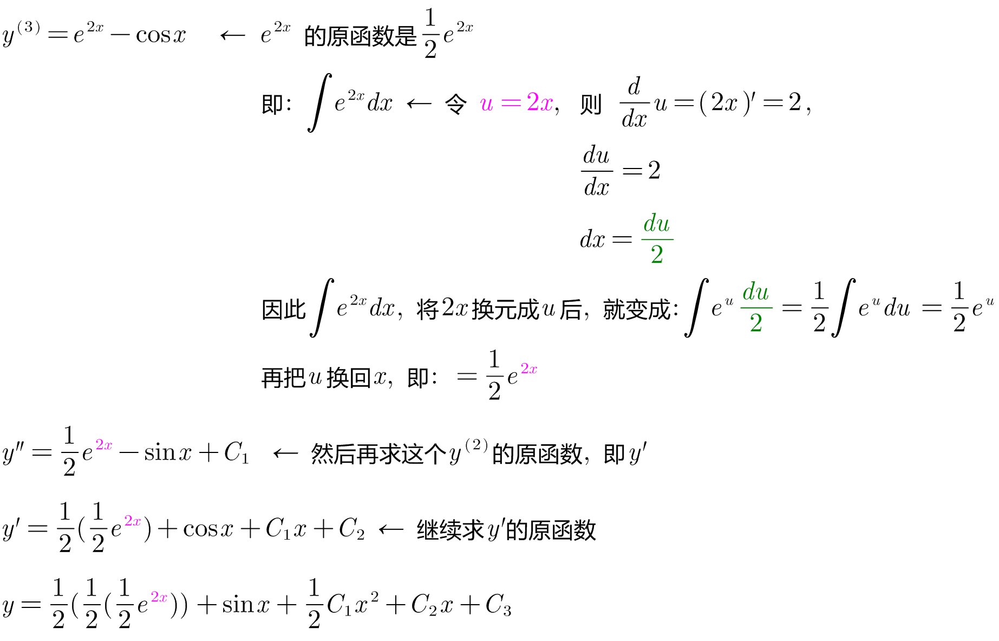
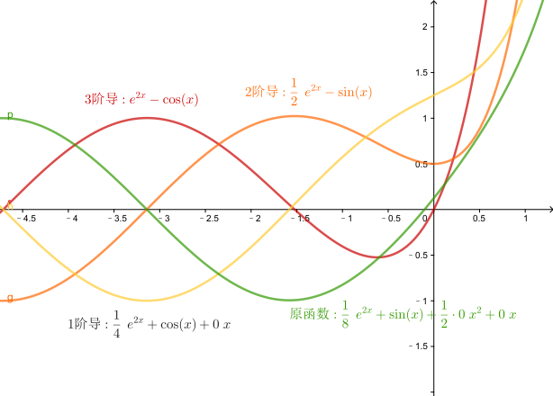
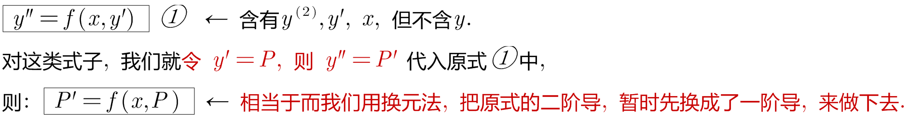
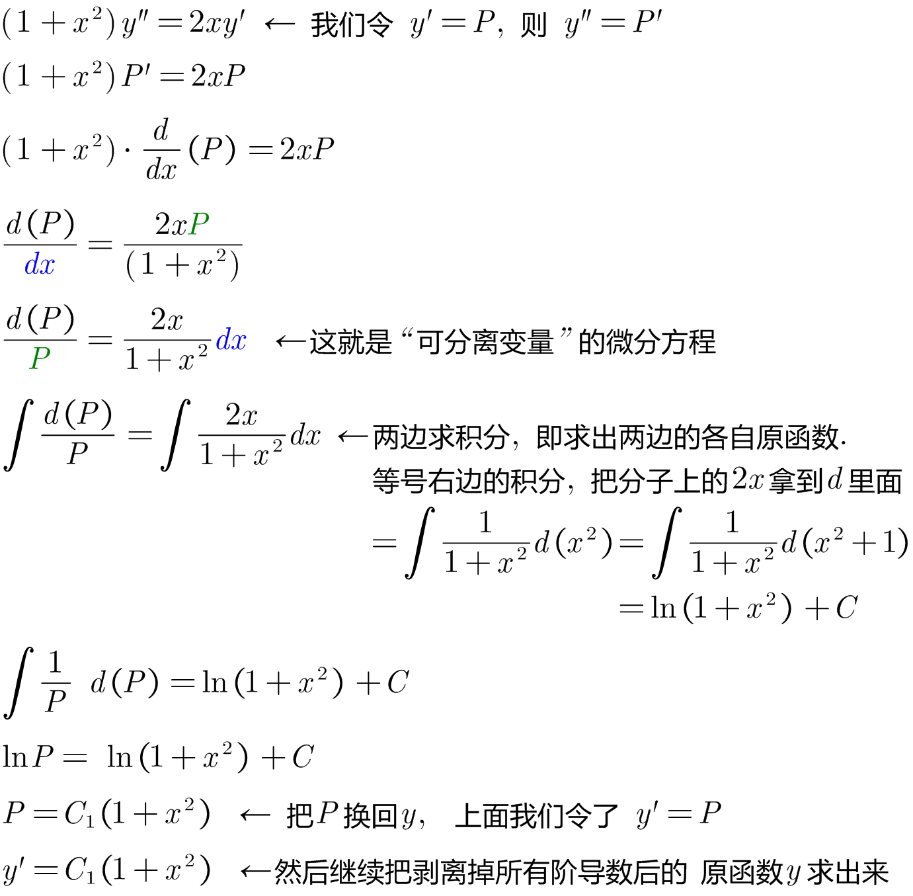
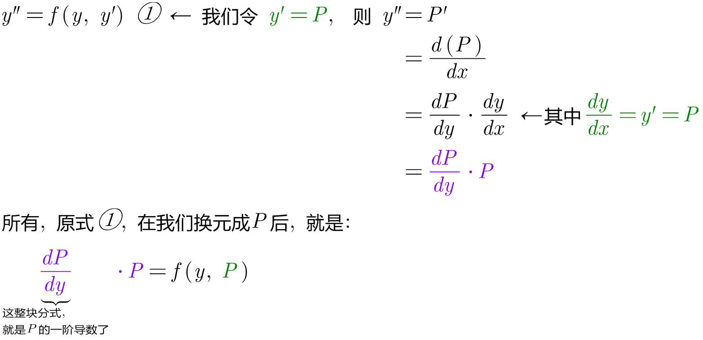
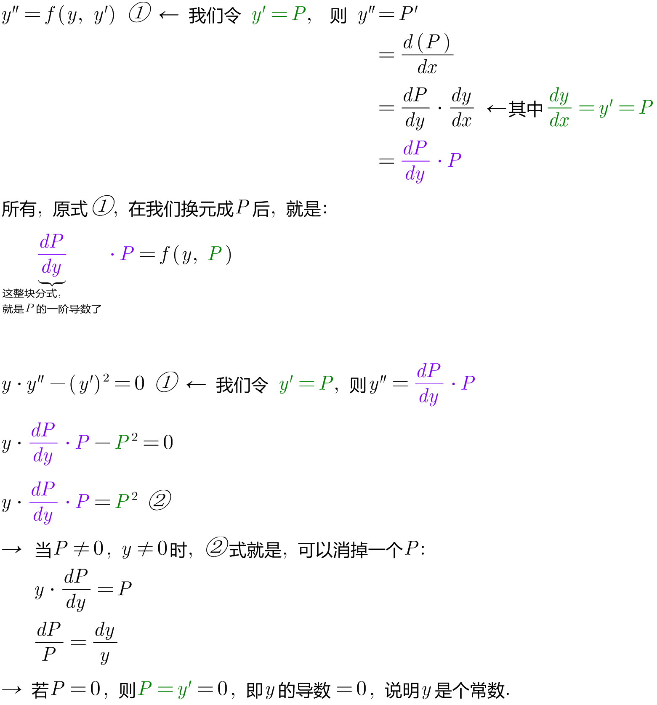

= 可降阶的高阶微分方程
:toc: left
:toclevels: 3
:sectnums:

---

== stem:[ y^((n)) = f(x)] 类型的式子,  则 stem:[  y^((n-1)) = \int f(x) dx + C]

若 y 的"n阶导数"是 f(x), 则, 要求"y的最初原函数", 就对 stem:[y^((n)) ] 这个高阶导数, 一层层退阶, 一层层求原函数:   如, 3阶导数 ->2阶导数 -> 1阶导数 -> 最终的原函数.

.标题
====
例如： +

====

---

== stem:[ y^((2)) = f(x, y')] 类型的式子 ← 即, 它含有 y'', 也含有 y', 也含有x, 但它里面不含有 y.

.标题
====
例如： +

====

---

== stem:[ y^((2)) = f(y, y') ] 类型的式子 ← 即: y方面的都有, 有y, y', y'', 但就是没有x

.标题
====
例如： +

====

---

