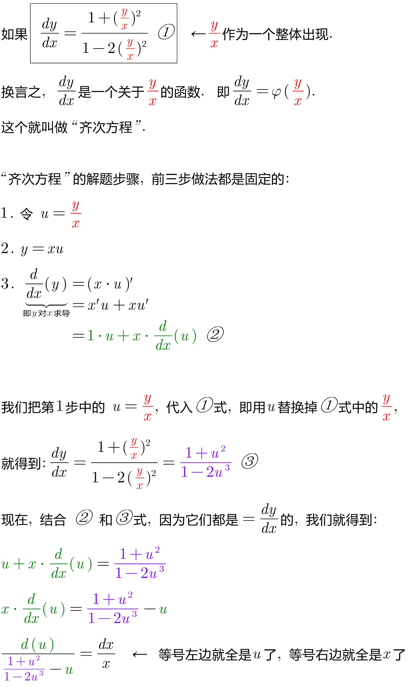
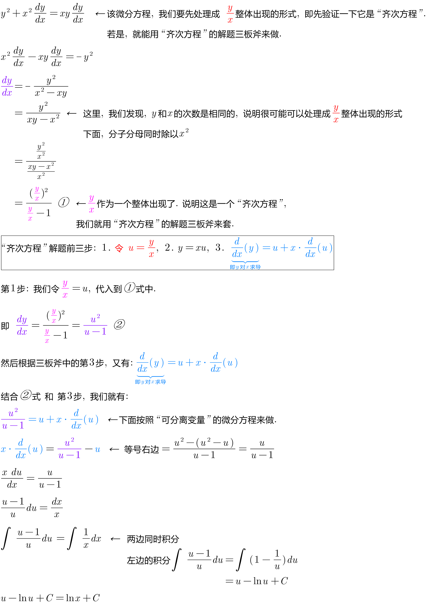
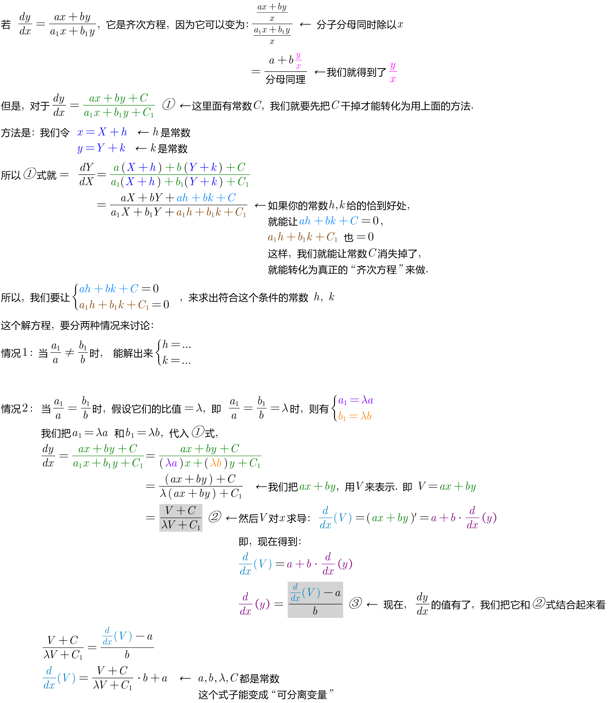

= 齐次方程 homogeneous equation
:toc: left
:toclevels: 3
:sectnums:

---

== 齐次方程 homogeneous equation

微分方程中, 有两个地方用到“齐次”的叫法：

[options="autowidth"  cols="1a,1a"]
|===
|Header 1 |Header 2

|1.
|如果一个一阶微分方程 stem:[ \frac{dy} {dx}=f(x,y)] 中的函数 stem:[f(x,y)] 可写成 stem:[y/x] 的函数，即 stem:[ f(x,y)=g(y/x)]，则这个方程是"齐次方程"。

形如 stem:[y'=f(y/x)] 的方程称为**“齐次方程”，这里是指方程中每一项关于x、y的次数都是相等的，例如 stem:[x^2, xy, y^2] 都算是二次项，而 stem:[y/x] 算0次项.**

- 例如: 方程 stem:[y'= 1+ y/x]中每一项都是0次项，所以这个方程例子, 就是个“齐次方程”。

|2.
|形如 stem:[y''+py'+qy=0] 的方程, 也称为“齐次线性方程”.

这里“齐次”是指: 方程中每一项关于未知函数y 及其导数y'，y''，……的次数, 都是相等的（都是一次），方程中没有自由项（不包含y及其导数的项）.

*“线性”则表示: 导数之间是线性运算（简单地说就是各阶导数之间的只能加减）.*

- 比如, 方程 stem:[y''+py'+qy=x] 就不是“齐次”的,因为方程等号右边的项x, 不含y及y的导数，是关于y,y',y'',……的0次项，因而就要称为“非齐次线性方程”. +
- 方程 stem:[yy'=1也]不是，因为它首先不是线性的。
|===

注意: 下面的 ①式只是一个例子, 不是一个公式! +

.标题
====
例如： +

====

---

== 可化为齐次的方程

---

