= 向量及线性运算
:toc: left
:toclevels: 3
:sectnums:

---

== 向量及线性运算

零向量的方向是任意的.

如果两个向量的夹角, 是0°(即两个向量同方向) 或 180°(即两个向量互为反方向), 则它们平行(或共线).

.标题
====
例如： +
image:img/608.png[,]
====

---

== 向量的模长 : stem:[ = \sqrt{x^2 + y^2 + z^2}]

image:img/609.png[,]

绿线是一个直角三角形的条斜边, 绿色斜边的长度 stem:[ = \sqrt{x^2 + y^2}]
+
image:img/611.png[,]

如下图: 红线就是向量的模长. 它和绿色, 蓝色线段, 构成一个直角三角形. 红色是斜边. 所以 stem:[ 蓝^2 + 绿^2 = 红^2].  即: 红色向量的模长 stem:[ = \sqrt{(x^2 + y^2) + z^2}]  +
image:img/610.png[,]

---

== 两点之间距离公式 : stem:[ |AB| = \sqrt{(x_2 - x_1)^2 + (y_2 - y_1)^2 + (z_2 - z_1)^2)]

---

== 方向余弦 direction cosine

image:img/613.gif[]

image:img/614.png[,]

一个向量的三个"方向余弦", 分别是: 这向量与三个坐标轴之间的角度的余弦。 +
两个向量之间的"方向余弦", 指的是这两个向量之间的角度的余弦。

*向量r 的方向余弦, 就是与r同方向的"单位向量".*

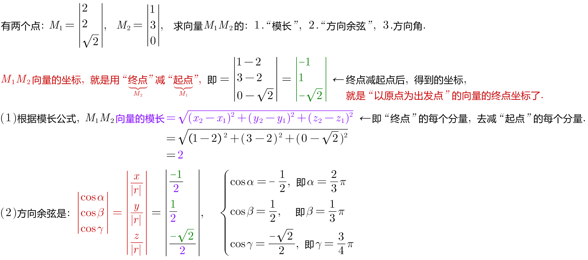

---

== 向量在轴上的投影

image:img/616.gif[,]

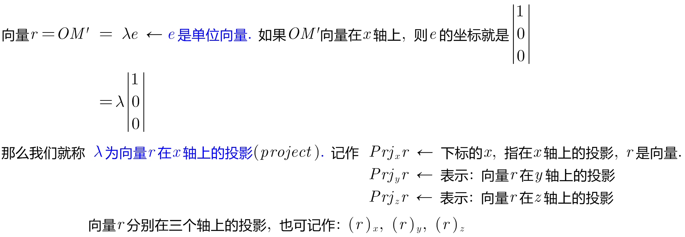

[options="autowidth"]
|===
|Header 1 |Header 2

|λ是"正数"时,就表示"投影"(红线段部分) 和"轴"(如, 本例为x轴) 是处在"同一方向"的.
|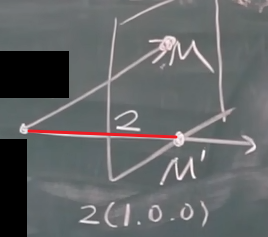

|λ是"负数"时,就表示"投影"和"轴"(如, 本例为x轴) 是处在"相反方向"的.
|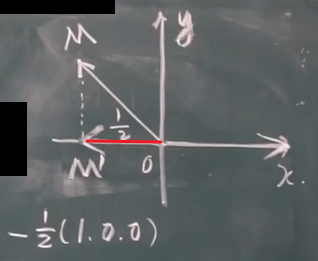

|λ=0 时,就表示"投影"和"轴"(如, 本例为x轴) 是处在"垂直方向"的.
|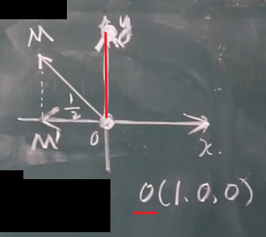
|===

λ是"负数"时,就表示"投影"和"轴"(如, 本例为x轴)是处在"相反方向"的.

---

==== r向量在x轴上 投影的长度:  stem:[ Prj_u (r)= |r| \cdot cosθ]

一个向量OM (下面用r表示), 在u轴 (*u轴就是用来指代任何一个轴的.* 比如x轴)上的投影的长度, 就等于"该OM向量的模长"乘以"该OM向量与x轴夹角的余弦". 即: stem:[ Prj_u r= |r| \cdot cosθ]

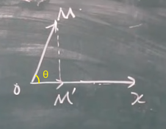

如上图, OM向量 在x轴上的投影是 OM'. 则:

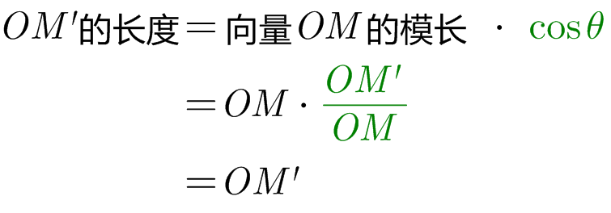

---

==== stem:[ Prj_u (a+b) = Prj_u a + Prj_u b]

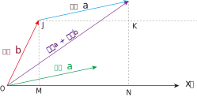

上图, a向量在x轴上的投影长度, 是=JK, 也=MN +
b向量在x轴上的投影长度, 是=OM +
a向量投影 + b向量投影 = MN + OM = ON  ← 而 ON正是 "向量a+向量b"的这个向量在x轴上的投影长度.

---

==== stem:[ Prj_u (λa) = λ \cdot Prj_u (a)]

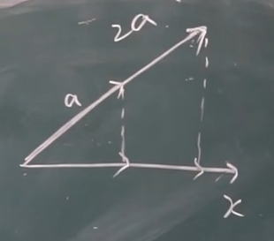

"λ倍的 a向量"的投影长度, 就等于 "a向量投影长度"乘以 λ倍.

---

== 数量积 (内积) ->  stem:[ a \cdot b = |a||b| cosθ ]

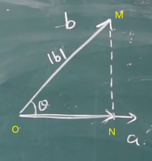

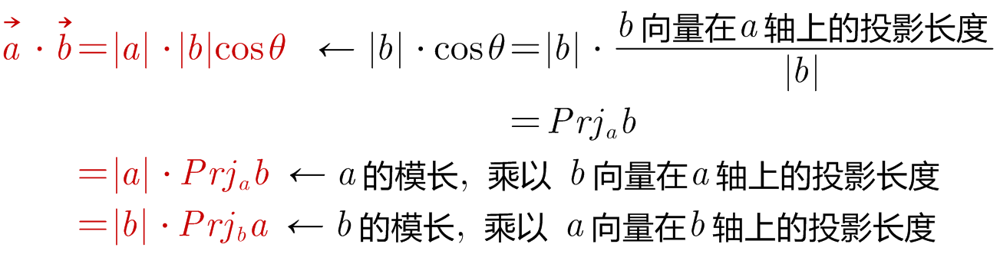

*注意: 两个向量的"数量积", 是一个"数量"! 而不是一个"向量".*

---

==== stem:[ \vec(a) \cdot  \vec(a) = |a| \cdot |a| cos0 = |a|^2]

---

==== 如果有两个非零向量 a, b, 且 stem:[ \vec(a) \cdot  \vec(b) =0 ], 则表明 它们的夹角θ =90°, 即 stem:[ \vec(a) ⊥ \vec(b) ]

零向量, 和任何向量都垂直, 也和任何向量都平行. 因为零向量指向任何方向.

---

==== stem:[  \vec(a) \cdot  \vec(b) =  \vec(b) \cdot  \vec(a)]

---

==== stem:[  (\vec(a) +  \vec(b)) \cdot \vec(c) =  \vec(a) \cdot \vec(c) +  \vec(b) \cdot \vec(c)]

---

==== stem:[ (λa)b = λ(ab)]

---

==== stem:[ a(λb) = λ(ab)]

---

==== stem:[ (λa)(μb)=λμ(ab)]

---

https://www.bilibili.com/video/BV1Eb411u7Fw?p=75&vd_source=52c6cb2c1143f8e222795afbab2ab1b5

21.03
