= 一元向量值函数 及其导数 Vector-valued function
:toc: left
:toclevels: 3
:sectnums:

---

== 一元向量值函数 Vector-valued function

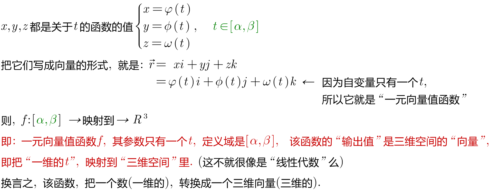

即 stem:[ f: D -> R^n] +
f 是个"一元向量值函数." 向量值函数, 也就是说, 它的输出值, 是一个向量.  +
它的"输入空间"是 stem:[ D \in R], 即自变量参数是一个实数(就是一维的). +
它的"输出空间"是 stem:[ R^n], *即函数 f 是接收一个一元的东西, 把它映射到n维空间中.*

stem:[ f(t)=f_1(t) \cdot i + f_2(t) \cdot j + f_3(t) \cdot k] +
*其中的 stem:[f_1(t) , f_2(t)  , f_3(t) ] 就是输出向量的三个分量(即坐标).*

即, 输出的向量, 就是 stem:[ \[f_1(t) , f_2(t)  , f_3(t)\]^T ]

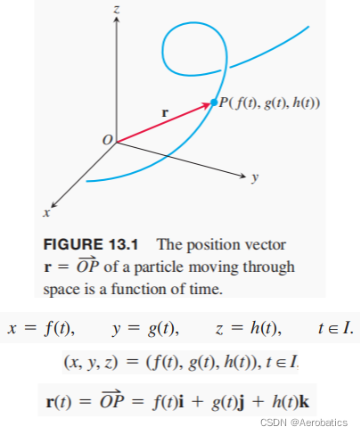

向量值函数的举例 :

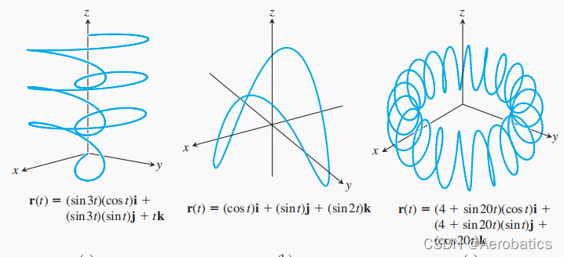

---

== 向量值函数的 极限

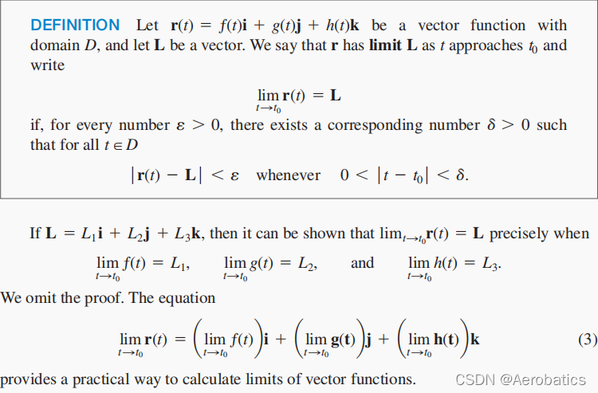

.标题
====
例如： +
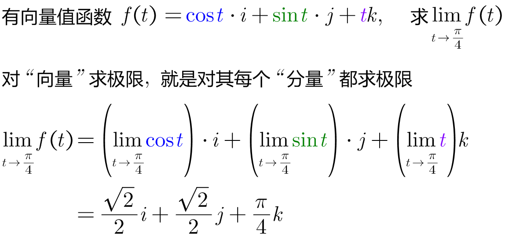
====

---

== 向量值函数的 导数

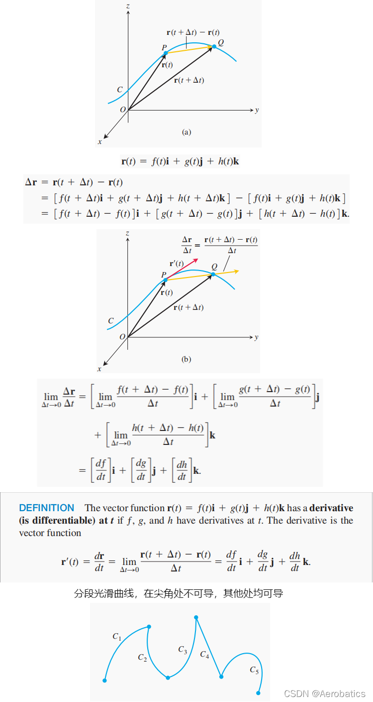

.标题
====
例如： +
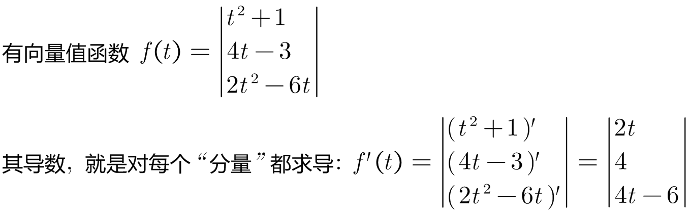
====

---

== 向量值函数的 微分法则

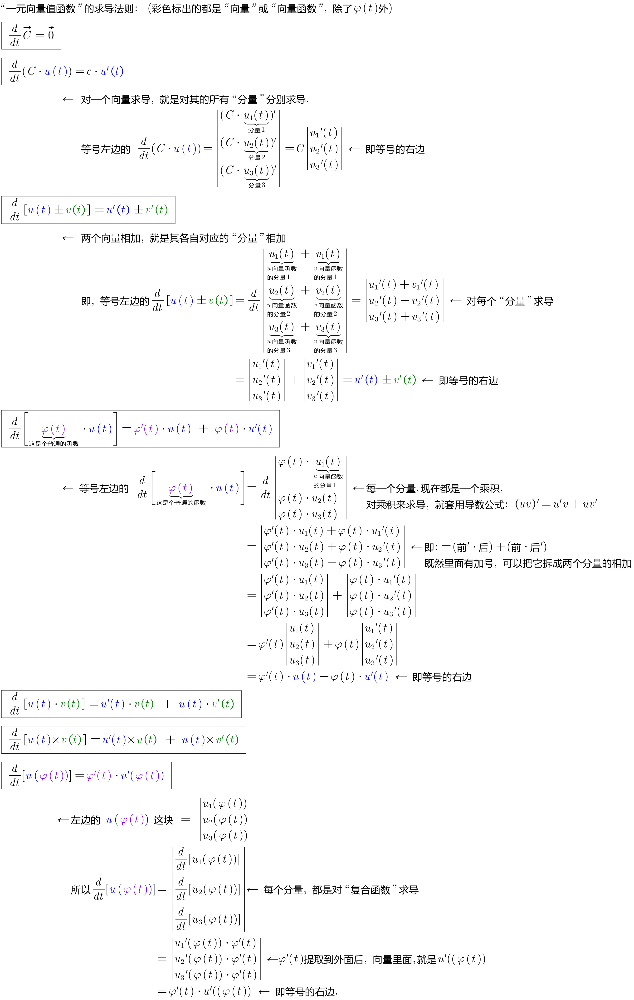

---

image:img/670.png[]

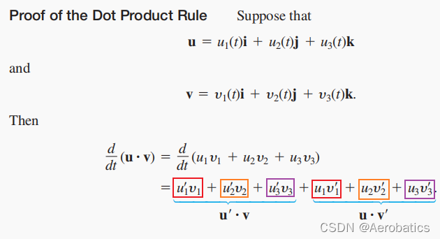

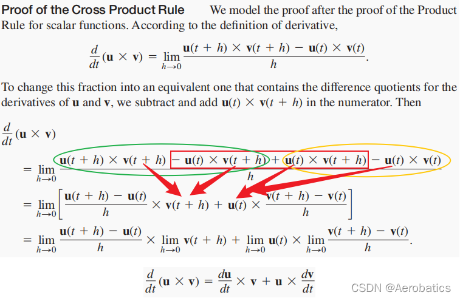

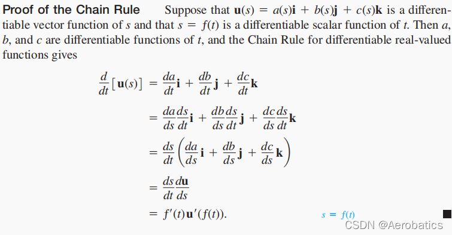

---

== 几何意义

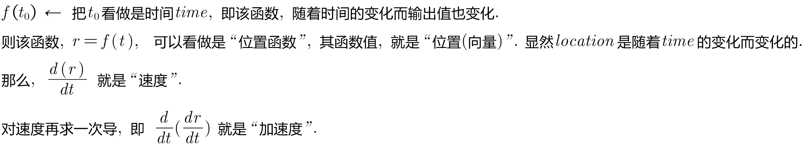

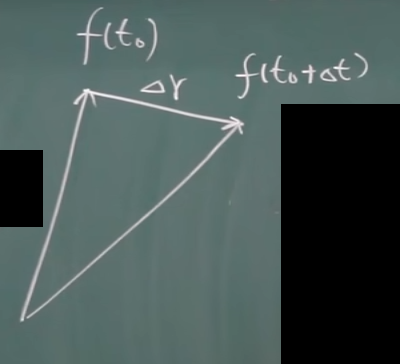

---
