= 多元函数 向量场
:toc: left
:toclevels: 3
:sectnums:

---

== 向量场 vector field

向量场也是描述某种特定方程的方式, 这种函数, 一般输入的维度数量, 和输出的维度数量相同. functions that have *the same* number of dimensions in their input *as* in their output.

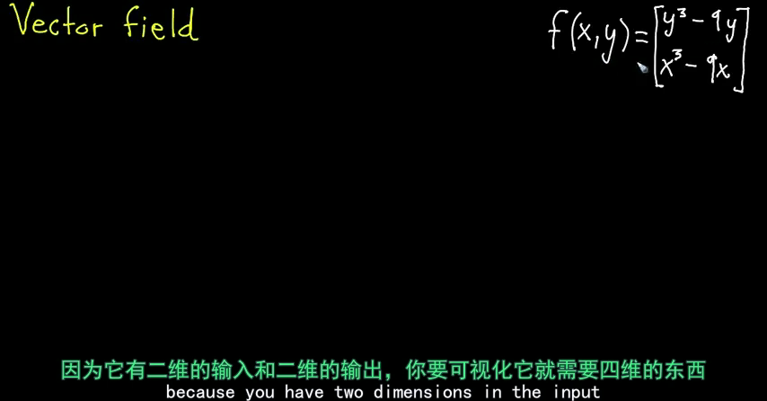

所以我们取而代之, 只在输入空间中观察它的图像. 这意味着, 我们只在 xy平面上来观察它. 对每个单独的输入点, 比如(x=1, y=2), 算出它的输出值(是一个二维空间中的向量). 本例的输出值就是 [-10, -8].  然后, 把输入值(是一个点), 和输出值(是一个二维向量), 都画在二维平面坐标系上.

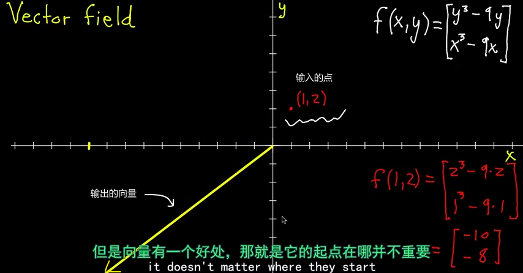

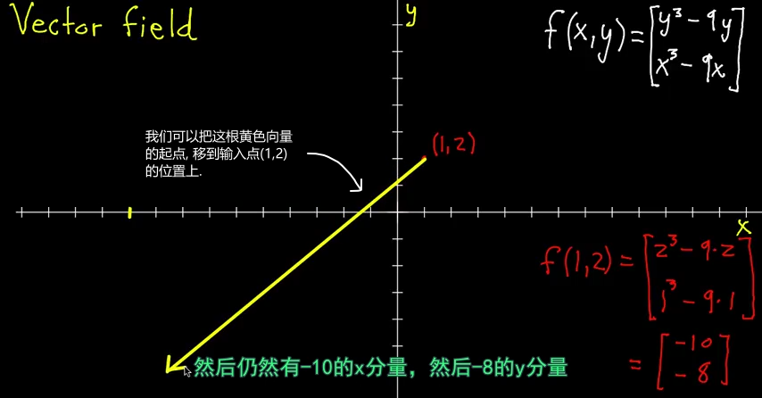

注意到向量的长度, 如果我们按照实际尺寸去绘制向量, 最终画面就会很乱, 因为向量会标满整个坐标系地图. 而且有的点(输入点)可能会附带超大的向量. 所以, 我们最好把每个输入点的"输出向量", 画成"等长"的.

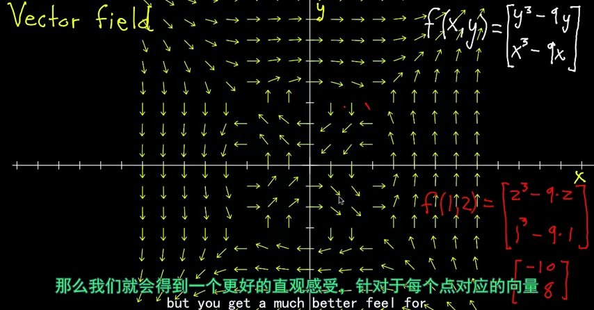

但如何表达每个向量的"实际长度"差别呢?

[options="autowidth"]
|===
|Header 1 |Header 2

|方法1是: 给这些向量, 添上不同的颜色. 不同的颜色表示不同的向量长度.
|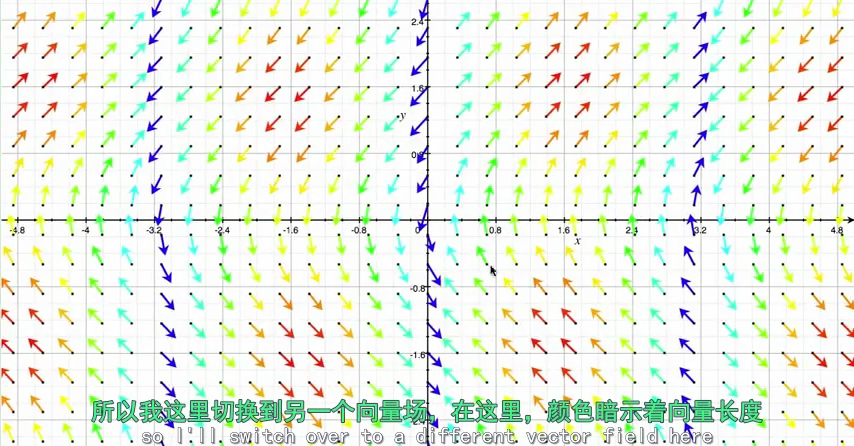

|方法2是: 缩小它们到对于的比例
|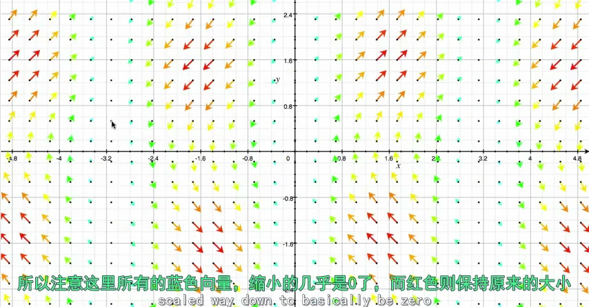
|===

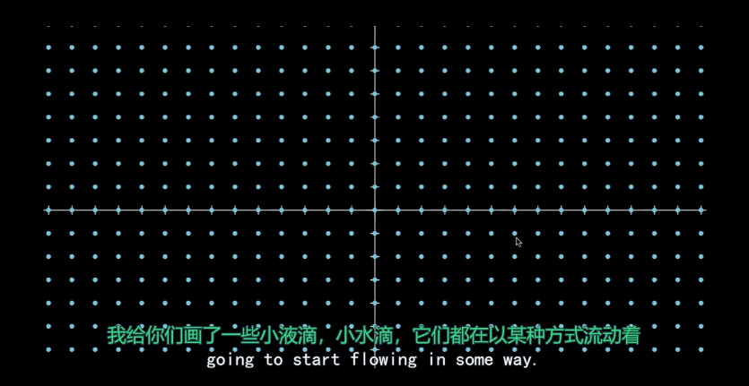

上图中, 每个粒子都以某种方式运动着, 速度也各不相同, 你如何用数学来描述它们? 方法是, 给这个坐标系空间中的每个坐标点, 分配一个向量. 这样, 如果你只看空间中给定的一个坐标点(见下图), 每一次有粒子通过这里, 它们的速度都大致相同. 你可能会问了: 随着时间的改变, 这个坐标点处的速度, 会不会变呢? 有时候的确会. 很多时候, 一些物体的流动, 是会取决于时间的. 但是很多其他的情况下, 比如本例中, 无论粒子何时通过这个坐标处, 它们都有一样的速度向量.

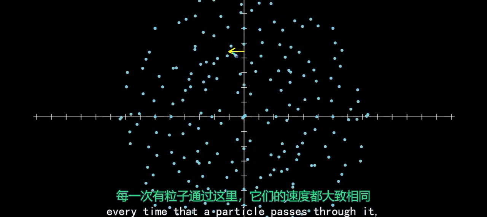

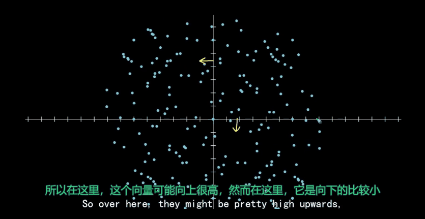

现在, 我们对空间中每一个坐标, 都分配一个向量, 来描述粒子经过此处时的运动状态, 你最终就会得到一个"向量场".

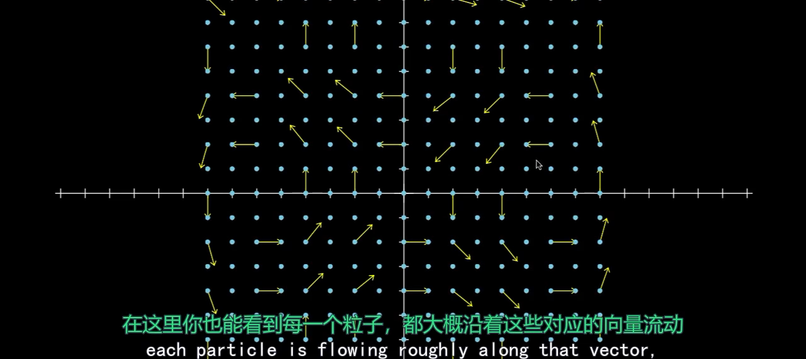

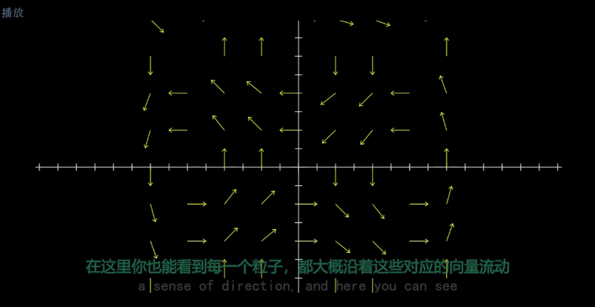

向量场中的箭头, 相当于交通指引标志, 指示所有车辆往哪个方向开.

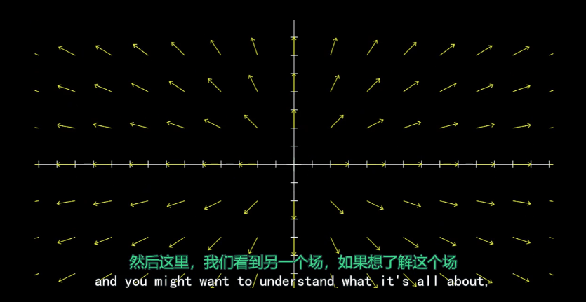

---

== 三维向量场

一个三维向量场, 也是有一个多元函数给出的. 这种特定的函数, 有三维的输入, 通常是 x, y, z 坐标, 然后有三维的向量输出. 即: +
\begin{align}
f(x,y,z)= \left[ \begin{matrix}
... \\
... \\
... \\
\end{matrix} \right]
\end{align}

.标题
====
比如:  +
\begin{align}
f(x,y,z)= \left[ \begin{matrix}
1 \\
0 \\
0 \\
\end{matrix} \right]
\end{align}

则这个函数, 会将任何输入的三维空间中的点, 变成 [1,0,0] 这个向量 (注意, 向量是没有固定起点的). 所以它的图像就是:

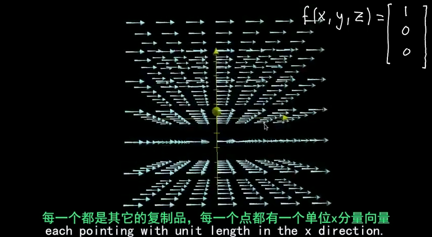
====

.标题
====
例如： +
\begin{align}
f(x,y,z)= \left[ \begin{matrix}
y \\
0 \\
0 \\
\end{matrix} \right]
\end{align}

由于输出不取决于x和y, 所以如果你沿着x方向移动, 向量的长度是不会改变的. 同样, 你沿着z方向移动, 上下走, 向量也不会改变. 它们只在你在y方向移动时改变.

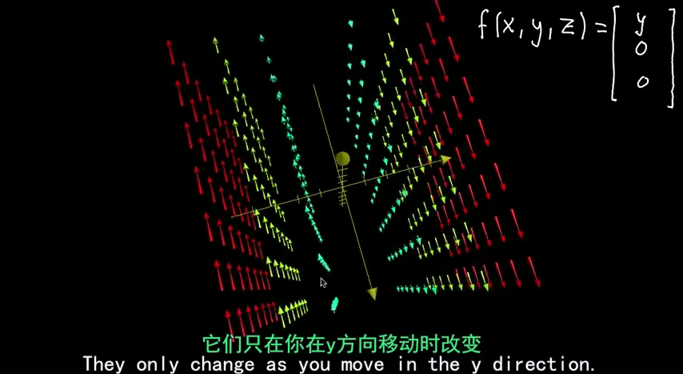
====

.标题
====
例如： +
\begin{align}
f(x,y,z)= \left[ \begin{matrix}
x \\
y \\
z \\
\end{matrix} \right]
\end{align}

这个函数, 用来输出"输入值本身的长度的向量" [x,y,z].

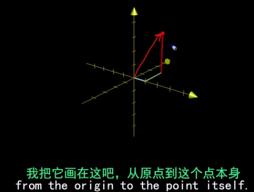

**但根据"向量场"的表达惯例, 我们要把这个向量, 移动到从"输出点的位置"开始(作为起点), 而不是让它从原点开始.**

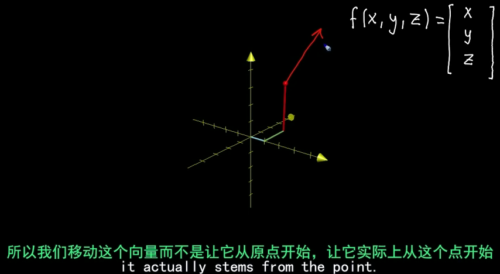

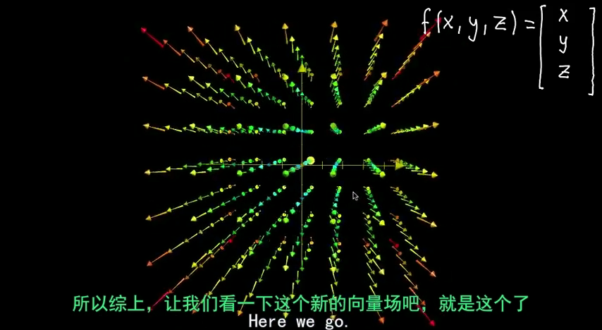

红色代表"长"的向量, 蓝色代表"短"的向量.
====

.标题
====
例如： +
\begin{align}
f(x,y,z)= \left[ \begin{matrix}
yz \\
xz \\
xy \\
\end{matrix} \right]
\end{align}

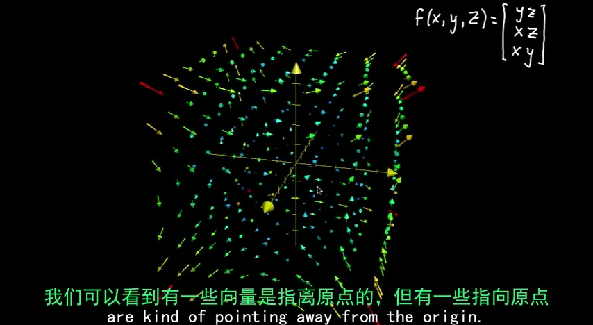

我们如何从函数本身, 去理解这个"向量场"图像呢? 一个比较好的方法, 就是去评估其中一个分量. 比如z分量, 它是有 x*y 组成的. z分量代表"向量指向上下的程度 the z component will represent how much the vector's pointing up or down".

z分量 = x*y, 即:  +
-> 当x和y都是正数时, z是正数.  +
-> x和y只要有一个是负数, z就是负数.  +
-> x, y都是负数, z也是正数.

用xy平面坐标, 来表示z的正负号, 就是: +
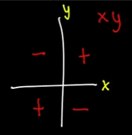

现在, 让"向量场"的z轴指向(正对)我们, 我们就能看到传统的xy坐标了. 就完全符合上图的所示了: +
-> 在第一象限, x,y都是正数, 所以z也是正数, 指向上方. +
-> 在第三象限同样如此. +
-> 在第二, 四象限, z是负数, 所以指向下方.

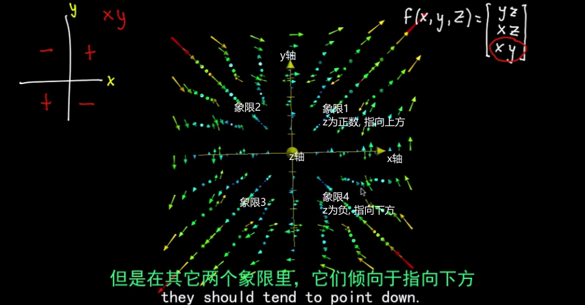
====

对于向量场, 一个很好的理解方式, 就是把它想象成"一个流体流动场" -- 空气, 水流, 电场, 重力场. "向量场"中的每一个向量会告诉你, 在那里, 粒子会被怎样推动.

---
