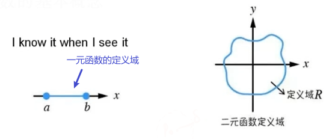
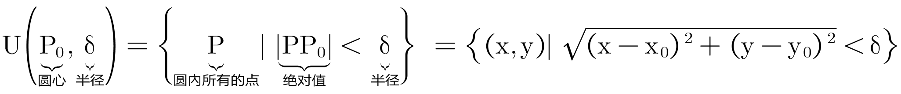
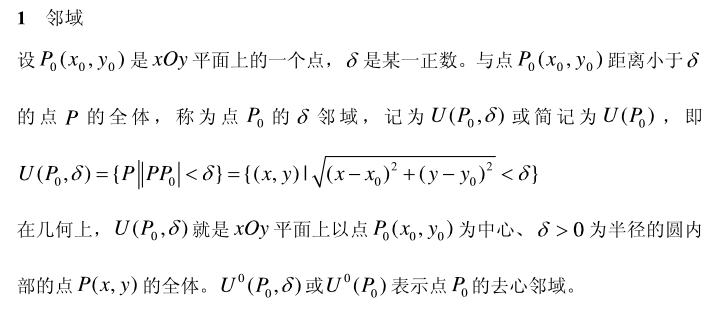

= 多元函数微分
:toc: left
:toclevels: 3
:sectnums:

---

== 定义域

一元函数的定义域, 就是 x轴的某段区间. 是一个线段区间. +
二元函数的定义域, 是由x和y这两个输入变量, 共同构成的一个平面区间.

---

== 邻域

xOy平面上有一个点stem:[P_0 {x_0, y_0}], 我们把它看做是圆心, 然后有一个正数 δ, 我们把它看做是半径. 则, 该圆面积内(包不包括圆形的边, 要看表达式中, 是小于号还是等于号)的全体的点 P(x,y), 就是点stem:[P_0]的 δ邻域. 记作:

---

==

https://www.bilibili.com/video/BV1xx411a7uV?p=5&vd_source=52c6cb2c1143f8e222795afbab2ab1b5

https://www.docin.com/p-1954345535.html
