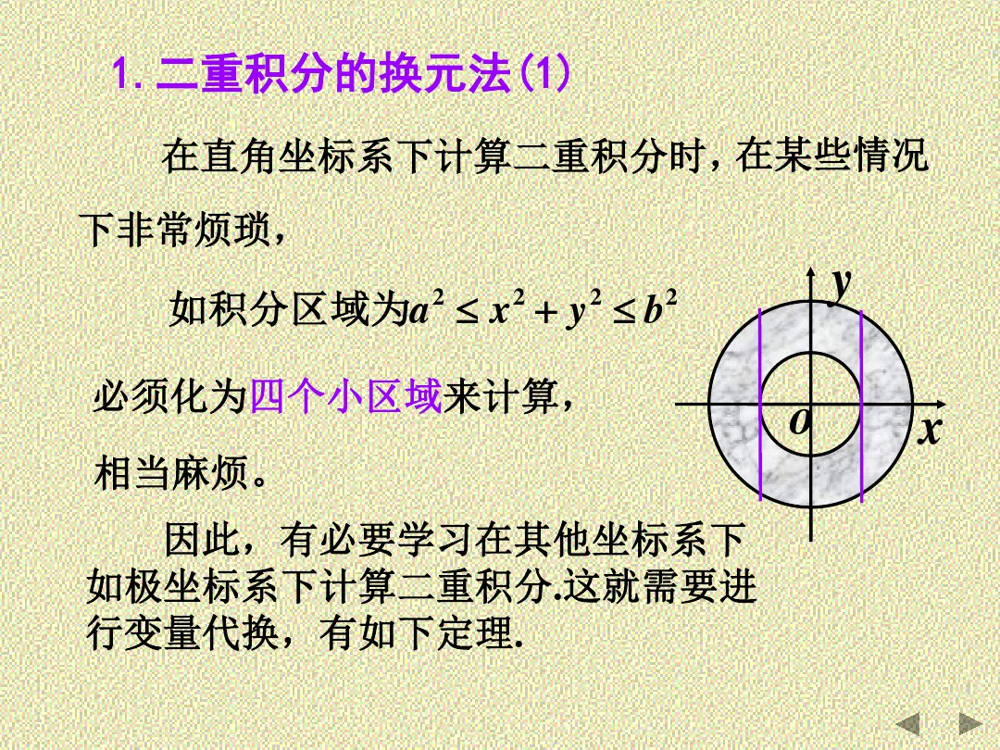
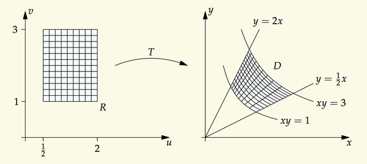
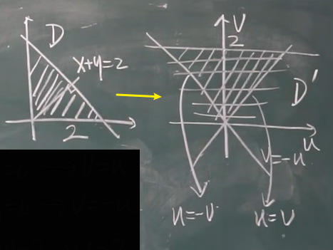
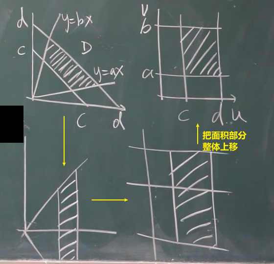
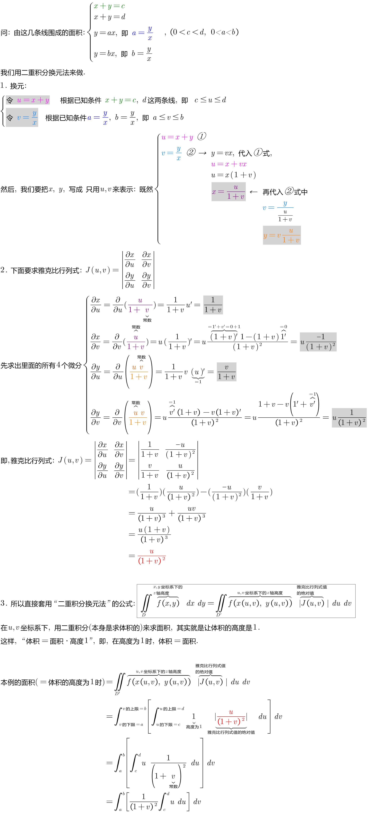
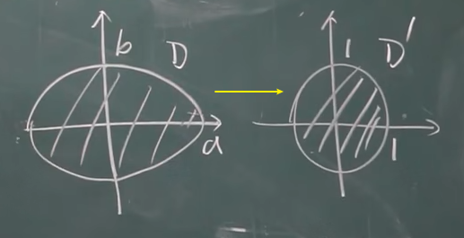
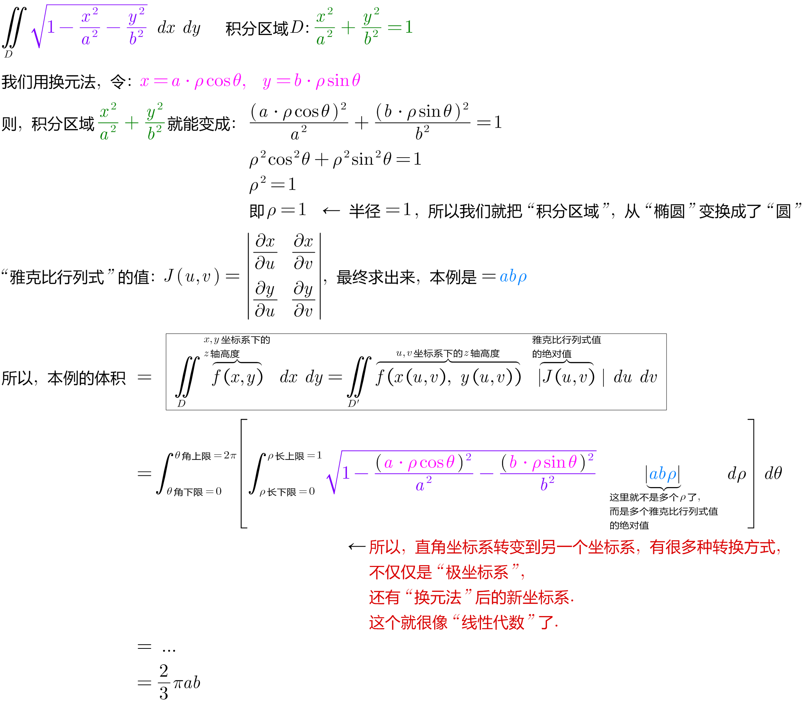

= 二重积分的换元法
:toc: left
:toclevels: 3
:sectnums:

---

image:img/778.png[]

---

== 二重积分的换元法

image:img/772.png[,]

其实这种变换操作, 就类似于"线性变换":

image:img/770.png[,]

.标题
====
例如： +

image:img/774.png[,]
====

.标题
====
例如： +

====

---

== 什么时候用换元法?

1. "被积函数"不好积的时候
2. "积分区域"不好表示的时候
3. "积分区域"是个椭圆时

---

== 积分区域是椭圆时, 我们用换元法来做

.标题
====
例如： +

====

---

