= 三重积分 Triple integral
:toc: left
:toclevels: 3
:sectnums:

---

== 三重积分 Triple integral

三重积分的意义, 其实是用来表示: 空间中一个"不均匀密度"物体的质量. *事实上, 三重积就是个4维属性的物体. 其中前三个维度, 就是"空间的三维坐标"; 第4个维度, 就是代表"密度".*

换言之, 当积分函数为1时，其密度分布均匀, 且为1，质量等于其体积值。 即:  +
\begin{align}
\iiint\limits_{Ω} 密度1 \ dV = 体积V   ← 每个点的密度都是1的话, 积分出来后, 就是体积V
\end{align}

当积分函数不为1时，说明密度分布不均匀。

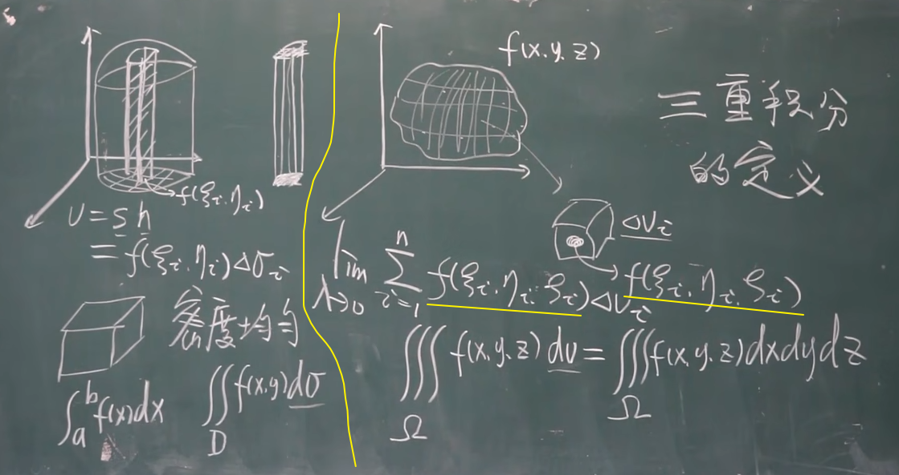

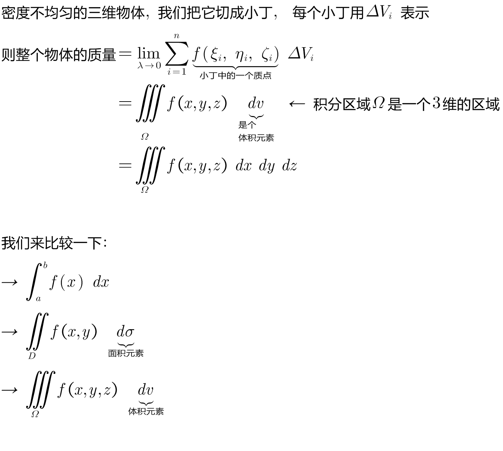

如果"被积函数" stem:[ f(x,y,z)] 表示"密度", 则三重积分的结果, 就是物体的"质量".

它最佳的理解方式是 ——空间物体的质量，即空间物体占据空间区域 Ω , 在点 (x,y,z) 处的体密度为 f(x,y,z) ，整个空间物体的总质量, 就是将 f(x,y,z) 累积遍整个空间区域 Ω .

注1： λ 取所有 stem:[ ΔV_i] 直径的最大值，该极限, 比一般极限要复杂的多（多了对任意分割）；

注2：经过该过程，三重积分已经是一个精确值（不均匀空间物体的精确质量）了；

注3：既然是任意分割，在直角坐标系下，按水平竖直分割，则微元体积 stem:[ dV=dx dy dz] :

image:img/783.jpg[,]

---

== 三重积分的计算 (直角坐标系下)

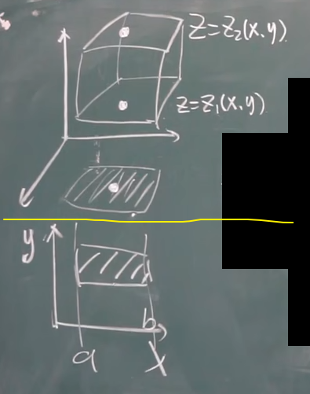

我们怎么来确定这个三维物体的高度? 就是在其下方(投影处), 用一直激光笔, 朝上方(即三维物体上)射, 就能知道该物体的高度下限, 和高度上限.

image:img/784.png[,]

.标题
====
例如： +
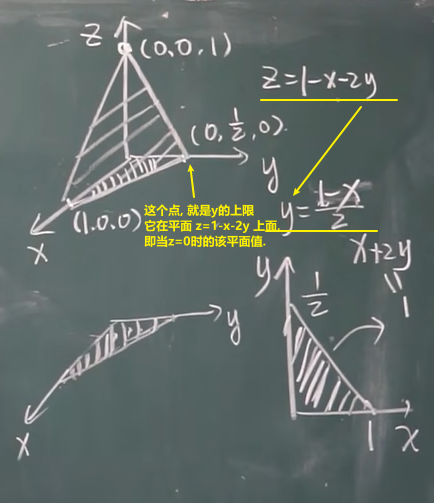

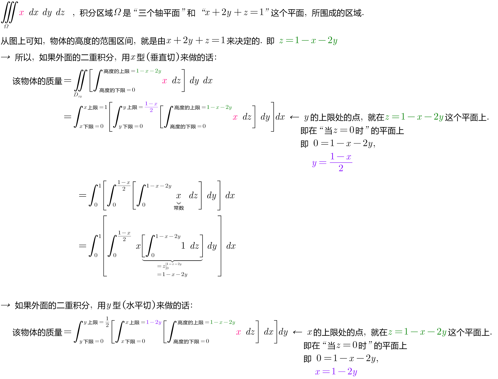
====

.标题
====
例如： +
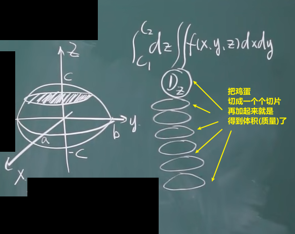

image:img/788.png[,]
====

---

== 柱面坐标系

二重积分里, 不同的坐标系有: 直角坐标系, 极坐标系 +
三重积分里, 也有不同的坐标系, 如: 柱面坐标

柱面坐标系, 就是: x, y轴 换成"极坐标"来表示, 但 z轴 依然用z来表示. 即:
\begin{align}
三个轴是: \begin{cases}
& x= ρ cosθ\\
&  y=ρ sinθ \\
&  z=z \\
\end{cases}
\ <- 其中各参数的取值范围是:
\begin{cases}
& 0 \leq θ \leq 2π \\
& 0 \leq ρ \leq +∞ \\
& -∞ < z < +∞ \\
\end{cases}
\end{align}

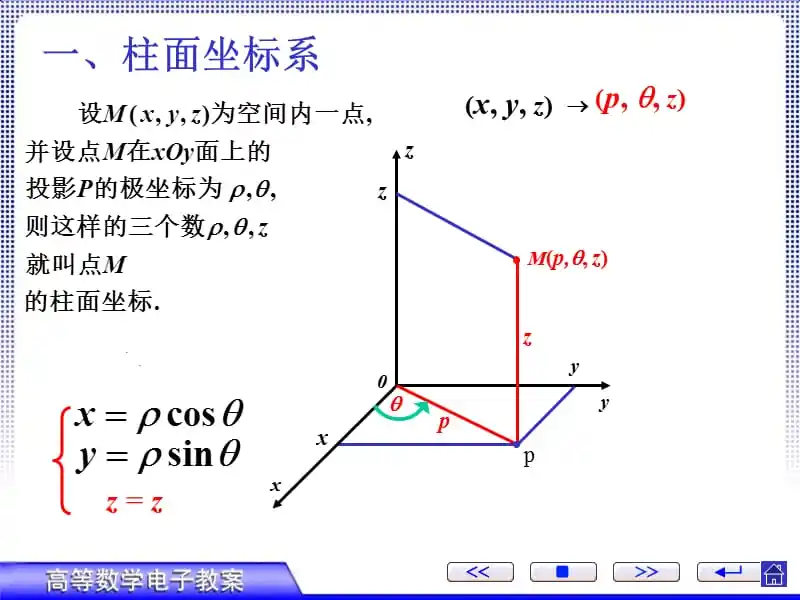

那么, 我们什么时候会选用"柱面坐标"来做呢? 当 x,y轴 比较适合用"极坐标"来表示时. 即, 在xoy 底面上, 是个圆的物体

同时, stem:[ dv= dx \ dy \ dz = ρ \ dρ \ dθ \ dz]

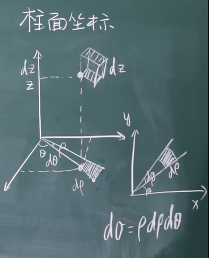

.标题
====
例如： +
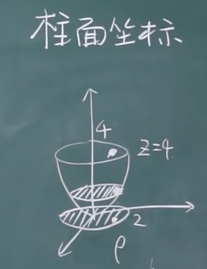

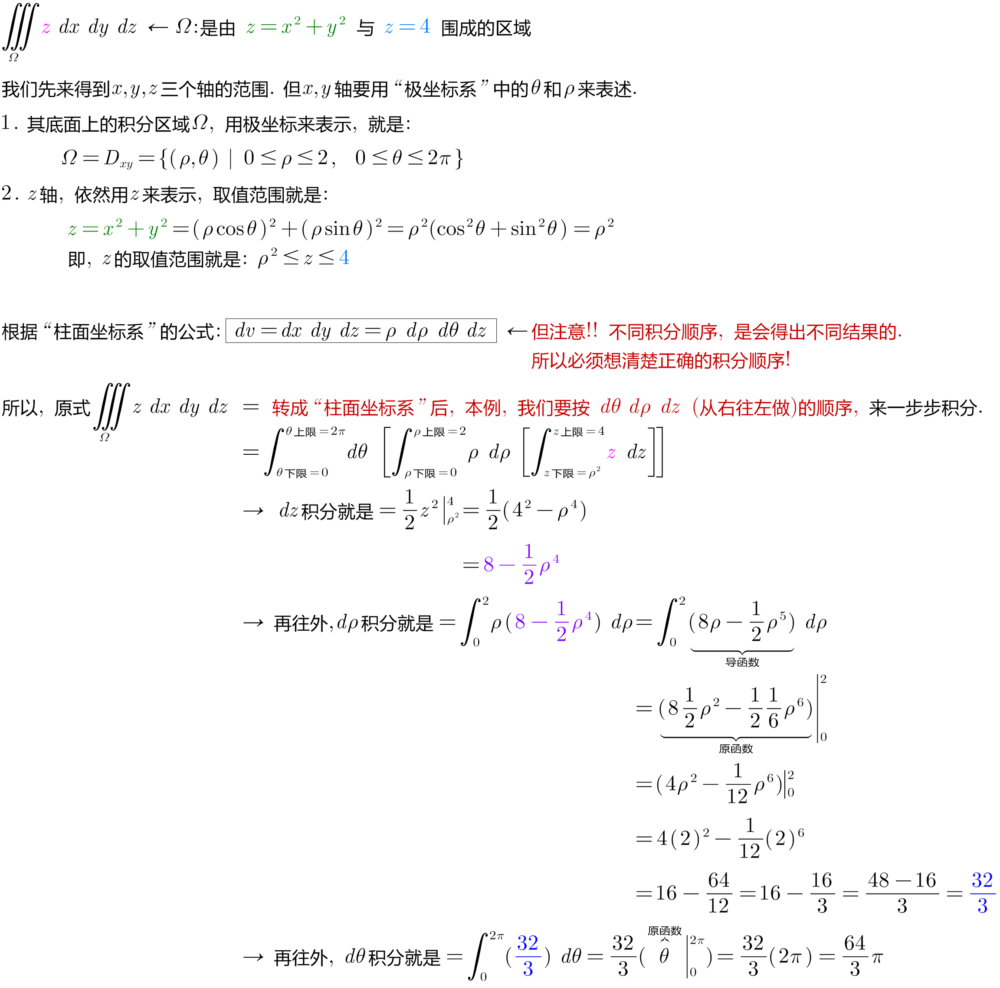
====

.标题
====
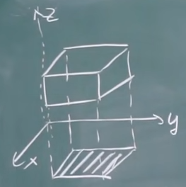

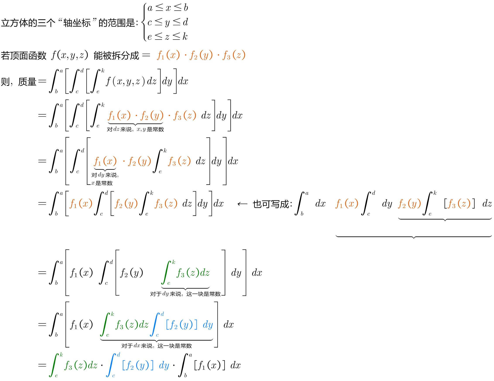
====

.标题
====
例如： +
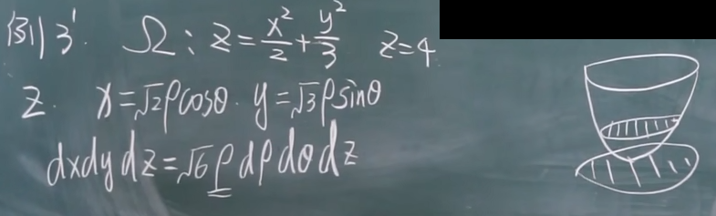
====

---

== 球面坐标系

https://www.bilibili.com/video/BV1Eb411u7Fw?p=124&vd_source=52c6cb2c1143f8e222795afbab2ab1b5
