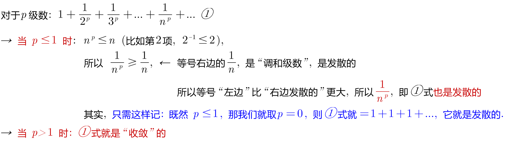

= 正项级数_p级数
:toc: left
:toclevels: 3
:sectnums:

---

== p级数

p级数，又称"超调和级数"，是指数学中一种特殊的"正项级数"。*当p=1时，p级数退化为"调和级数"。*

p级数 是重要的正项级数，*它能用来判断其它正项级数的"敛散性"。*

p级数, 就是这个样子的: stem:[ \sum_{n=1}^∞ \frac{1} {n^p}]

很明显:  +
→ 当 stem:[ p>1] 时，p级数"收敛". 它的收敛值, 用 stem:[ζ(p) ] 来表示. +
→ 当 stem:[ p<=1] 时，p级数"发散"

---

