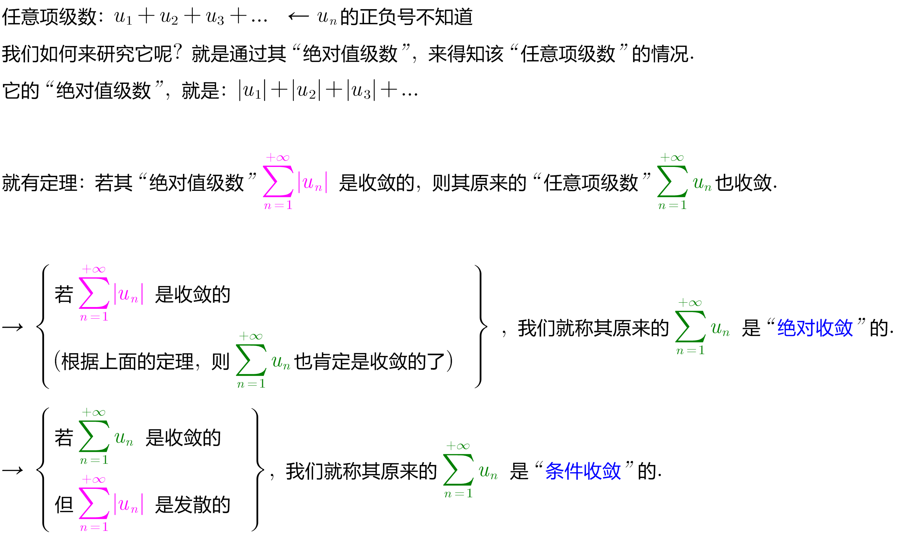
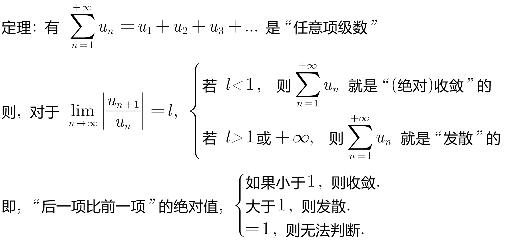
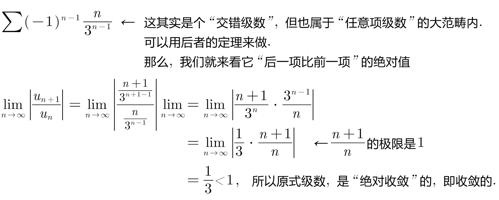
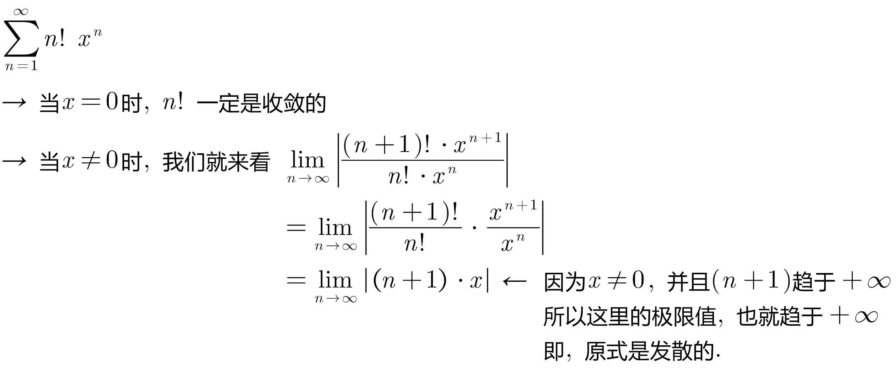
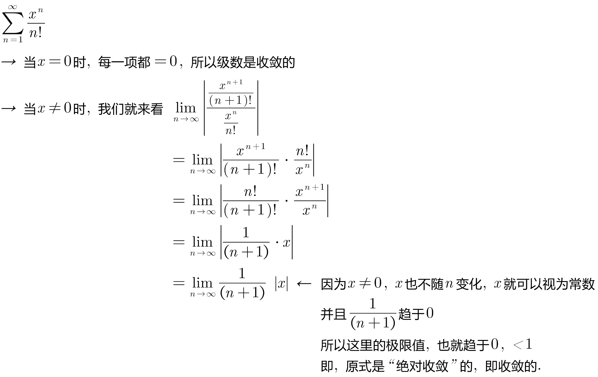

= 任意项级数
:toc: left
:toclevels: 3
:sectnums:

---

== 任意项级数

=== 定理: 若 stem:[\sum |u_n|] 是收敛的, 则其原来的  stem:[\sum u_n] 必是收敛的.

任意项级数, 也就是其中每一项的正负号, 不知道.

即 :  +
[options="autowidth"]
|===
|Header 1 |则有 |Header 3

|stem:[\sum u_n] 是"绝对收敛"的 →
|stem:[\sum \| u_n \|] 是收敛的
|stem:[\sum  u_n] 是收敛的

|stem:[\sum u_n] 是"条件收敛"的 →
|stem:[\sum \| u_n \|] 是发散的
|stem:[\sum  u_n] 是收敛的
|===

---

=== 定理: stem:[\lim |(u_(n+1))/(u_n)|=L], 若 ① L<1, 则收敛; ② L>1, 则发散; ③ L=1, 则无法判断收敛性.

.标题
====
例如： +

====

.标题
====
例如： +

====

.标题
====
例如： +

====

---

