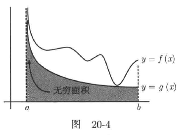
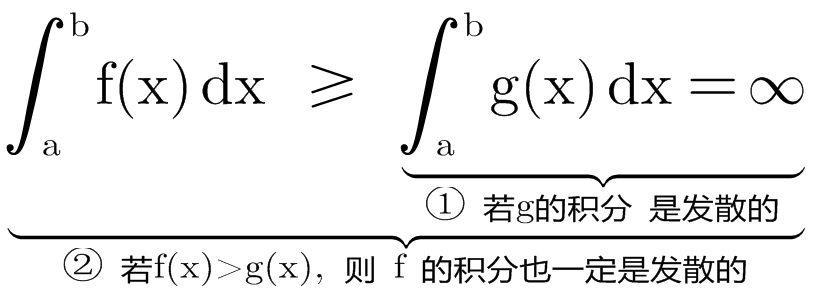
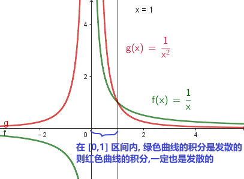
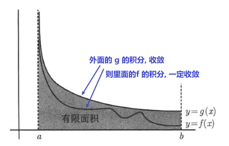

= 比较判别法 comparison test
:toc: left
:toclevels: 3
:sectnums:

---

== "比较"判别法

=== 两个嵌套的气球, 若里面的气球是发散(膨胀)的, 则外面层的气球一定会跟着发散!

假设有两个非负函数(A和B),它们至少在某些区间上是非负的. 若A函数比B大 (即y值大), 若B的积分(在这个区间内)是发散的, 则A的积分(在同样的区间内)必定也是发散的.  *就好像是 两个嵌套的气球, 若里面的气球是发散(膨胀)的, 则外面层的气球一定会跟着发散!*

换言之: 有两个函数f 和 g, 我们想知道 f在[a,b]区间上的积分情况, 但我们仅仅知道两点: ① g在[a,b]区间上的积分是发散的, ② 在[a,b]区间上, stem:[ f(x)≥g(x)≥0]. 则, 我们必然能推出: f在[a,b]区间上的积分也是发散的.

.标题
====
例如： +

====

---

=== 两个嵌套的气球, 若外面的气球是发散(膨胀)的, 则里面层的气球是否发散, 不一定!

但反过来, stem:[ 里(x) ≤ 外(x)], 若 "stem:[ \int_a^b 外(x) dx]" 是发散的, 则   "stem:[ \int_a^b 里(x) dx]" 会怎样呢? 不知道. 它既可能发散, 也可能收敛.

---

=== 两个嵌套的气球, 若外面的气球是收敛的, 则里面层的气球一定被逼着也收敛

有 stem:[ 里(x) ≤ 外(x)], 若 "stem:[ \int_a^b 外(x) dx]" 是收敛的, 则   "stem:[ \int_a^b 里(x) dx]" 一定收敛.

---

=== 两个嵌套的气球, 若里面的气球是收敛的, 则外面层的气球是否也收敛, 不一定.

有 stem:[ 里(x) ≤ 外(x)], 若 "stem:[ \int_a^b 里(x) dx]" 是收敛的, 则   "stem:[ \int_a^b 外(x) dx]" 的结果如何? 不知道. 既可能收敛, 也可能发散.

---
