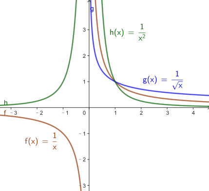
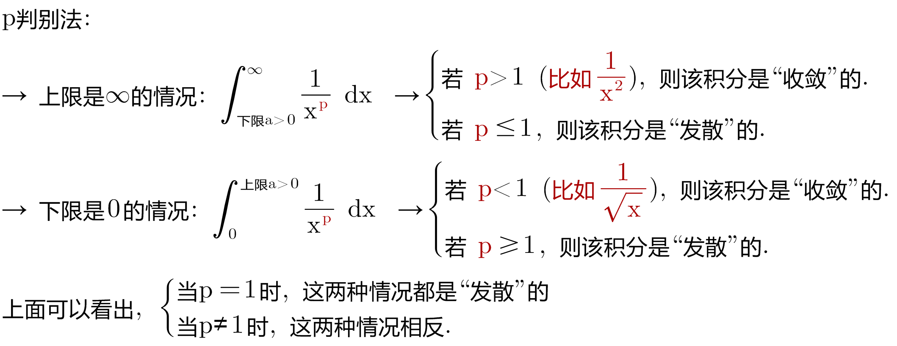
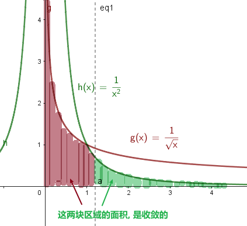
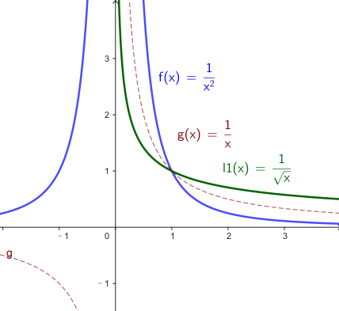
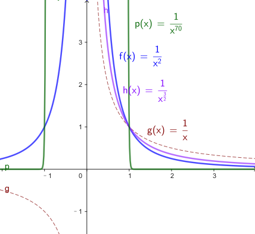
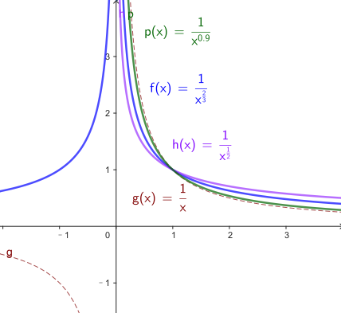

= p判别法
:toc: left
:toclevels: 3
:sectnums:

---

== p判别法 → stem:[ \frac{1} {x^p}]

我们有了"比较判别法"和"极限比较判别法",需要知道怎样去使用它们. 我们的基本策略就是: 选择一个能与函数f相比较的函数g. 我们希望函数g 足够简单到可以判断它是"收敛"的还是"发散"的.

*我们选择什么样的 g函数呢? 最常用的函数是 stem:[ \frac{1} {x^p}],其中p >0. 比如: stem:[ 1/x, 1/\sqrt{x}, 1/x^2]. 因为这些函数很容易求积分*, 所以可以使用极限公式, 得到 "p判别法".

.上面的曲线函数图, 说明了什么?
****
stem:[ y=1/x^(p=1)] 这条曲线, 就是"收敛"与"发散"的分界线.*

因此, 尽管  stem:[ \int_1^∞ \frac{1} {x^1} dx] 是发散的 , 但 stem:[ \int_1^∞ \frac{1} {x^(1.0000001)} dx] 却是收敛的. *仅仅把x的幂, 从1变为 1.0000001, 这个微小的变化足够引起质变了.* 这展示出了收敛和发散的精妙之处.
****

"p判别法"很有用, 而且应用甚广.

.其实, 你只需记住这两种情况, 就能记住全部的法则了:
****
- stem:[ \int_a^∞ \frac{1} {x^2} dx] 收敛,  (反之, 另一段区间 stem:[ \int_0^a \frac{1} {x^2} dx] 就是发散的.)
- stem:[ \int_0^a \frac{1} {\sqrt{x}} dx] 收敛.  (反之, 另一段区间 stem:[ \int_a^∞ \frac{1} {\sqrt{x}} dx] 就是发散的.)

从上图可以看出, 越贴近x和y轴的曲线, 其积分越可能是收敛的.
****

[options="autowidth"]
|===
|Header 1 |Header 2

|Column 1, row 1
|

|→ 对于 stem:[ \frac{1} {x^p}] , 任何高于1的指数, 如 stem:[ \frac{1} {x^2},  \frac{1} {x^{3/2}},  \frac{1} {x^{70}}] 的趋势, 都同 stem:[  \frac{1} {x^2}] 是一样的.
|

|→ 而任何低于1 的指数, 例如 stem:[  \frac{1} {x^{1/2}},  \frac{1} {x^{2/3}},  \frac{1} {x^{0.999}}] 的趋势, 都同 stem:[ \frac{1} {\sqrt{x}}] 是一样的.
|
|===

---

普林斯顿
406
