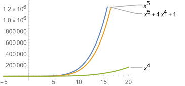
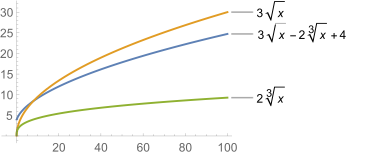
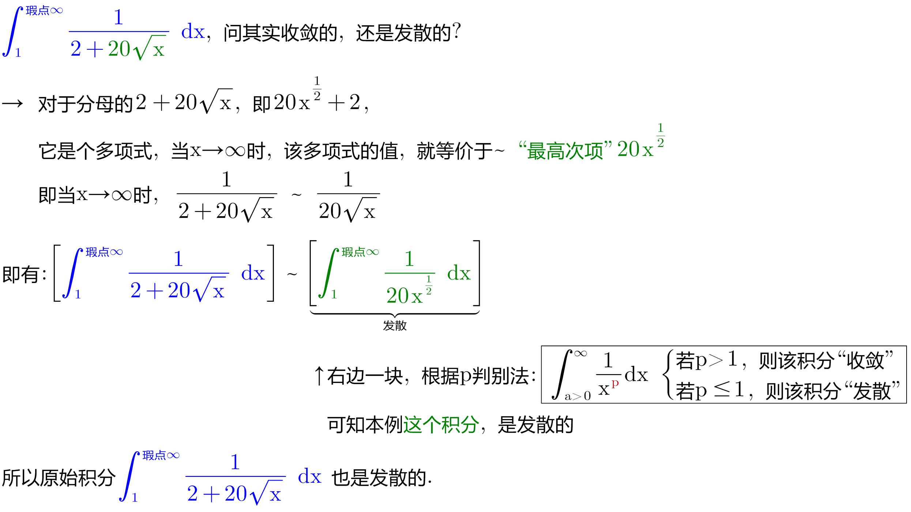
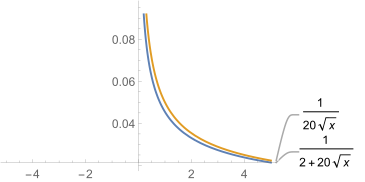
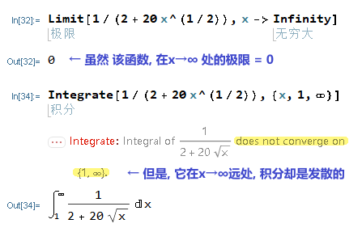

= 常见函数在 ∞ 和 -∞ 附近的表现
:toc: left
:toclevels: 3
:sectnums:

---

现在该回答最重要的问题了:如何选择用于比较的函数g? 这取决于"瑕点"是在 ±∞, 0, 还是其他的"有限值"处.

== 多项式, 和多项式型函数, 在 ±∞ 附近的表现

**在 x→ ∞ 或 x → -∞ 时, 函数的值, 由其"最高次项"决定.**

即: 若 p为多项式, 则当 x→ ∞ 或 x → -∞ 时, 有: stem:[p(x) ~  ax^n ] ← stem:[ ax^n ] 是该多项式的"最高次项".

.标题
====
例如： +
当 x → ∞时, stem:[ (x^5 + 4x^4 + 1) ~ (x^5)]

我们也可以通过比较 当 x → ∞ 时, "stem:[x^5 + 4x^4 + 1] 和 stem:[ x^5] 的比值" 的极限会=1, 来确认这一点:

stem:[ \lim_{x→∞} \frac{x^5 + 4x^4 + 1} {x^5} = \lim_{x→∞} (1+ \frac{4} {x} + \frac{1} {x_5}) = 1+ 0 + 0 = 1]
====

.标题
====
例如： +
\begin{align}
& 3\sqrt{x} - 2 \sqrt[3]{x} +4 \\
& = 3x^{1/2} - 2 x^{1/3} +4 \\
& 当 x → ∞时, (3x^{1/2} - 2 x^{1/3} +4 ) 近似于~ (3x^{1/2})
\end{align}

====

.标题
====
例如： +
\begin{align}
\int_1^{\text{瑕点}\infty}{\frac{1}{2+20\sqrt[]{\text{x}}}}\ dx
\end{align}

为什么 x→∞时, 极限为0的函数, 其积分却是发散的? 因为"极限不为0, 积分一定发散", 但"极限为0, 积分也不一定就是收敛的, 也有可能也是发散的".
====

416
