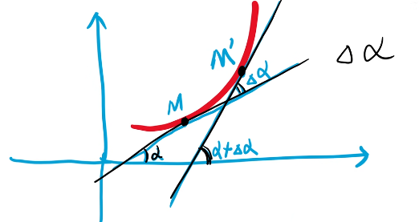

:toc: left
:toclevels: 3
:sectnums:

---

== 曲率 curvature

曲率: 用来表示曲线在某一点的"弯曲程度"的数值。 +
曲率越大，表示曲线的弯曲程度越大。曲率的倒数就是曲率半径。

https://www.bilibili.com/video/BV1Eb411u7Fw?p=40&vd_source=52c6cb2c1143f8e222795afbab2ab1b5

