= 直线
:toc:
---

== 直线

==== 斜率 -> stem:[  m = \frac{\Delta y}{\Delta x}]
斜率 slope (数学中用 m 表示):: 每进行单位距离时, 高度的变化称为直线的"斜率".

image:img_thomas_calculus/calculus_001.png[]

\begin{align}
\boxed{
m = \frac{升高}{行进的距离} = \frac{\Delta y}{\Delta x} = \frac{y_2 - y_1}{x_2 - x_1}
}
\end{align}

- 直线与 x轴的夹角小于90度，斜率为“正”. 正斜率表示匀速增加。
- 直线与 x轴的夹角大于90度，斜率为“负”. 负斜率表示匀速减 (随着x的增加, y减小)。

---

==== 两条互相垂直的直线的斜率 -> stem:[  m_1 * m_2 = -1]

两条互相垂直的直线 stem:[ L_1 ] 和 stem:[  L_2], 其斜率满足:
\begin{align}
m_1 * m_2 = -1
\end{align}

即: 每个斜率是另一个斜率的"负倒数":

\begin{align}
m_1 = \frac{1}{m_2}, \\
m_2 = \frac{1}{m_1}
\end{align}

论证如下:

image:img_thomas_calculus/calculus_002.png[]

\begin{align}
& L_1的斜率 m_1 = tan \phi_1 = \frac{a}{h} \\
& L_2的斜率 m_2 = tan \phi_2 = - \frac{h}{a} \\
& \therefore m_1 * m_2 = -1
\end{align}

---

==== 直线的方程 : 点斜式 -> stem:[  y =  m(x - x_1) + y_1 ]

只要我们知道两点信息: 1. 直线的斜率, 2. 直线上的任意一点P的坐标 (stem:[ P_1 (x_1, y_1) ]), 就能写出它的方程:
\begin{align}
& \because \frac{y - y_1}{x - x_1} = m \\
& \therefore (y - y_1) = m(x - x_1) \\
& y =  m(x - x_1) + y_1 <- 即 "点斜式"方程
\end{align}

点斜式:
\begin{align}
\boxed{
y =  m(x - x_1) + y_1 \\
m: 是直线的斜率 \\
(x_1, x_2) : 是直线上的任意一点的坐标
}
\end{align}

.标题
====
例如： 某直线过点(2,3), 且斜率是 stem:[ - 3/2 ], 该直线方程是什么?

根据点斜式:
\begin{align}
& y =  m(x - x_1) + y_1  \\
& y = -\frac{3}{2}(x-2) + 3 \\
& y = -\frac{3}{2}x + 6
\end{align}

image:img_thomas_calculus/calculus_003.png[]
====

---

==== 直线的方程: 斜截式 -> stem:[ y = mx + y轴截距b  ]

斜截式:
\begin{align}
\boxed{
y = mx + b \\
m: 斜率 \\
b : 是直线在y轴上的截距
}
\end{align}

---

==== 直线的方程: 一般线性方程 -> stem:[Ax +By = C  ]

一般线性方程
\begin{align}
\boxed{
Ax +By = C \quad (A和B 不全为0)
}
\end{align}

.标题
====
例如： 直线 stem:[ 8x + 5y = 20] 的斜率和 y轴上的截距是多少?

思考: 为了知道该直线的斜率和y轴截距, 我们先把它写成"斜截式" stem:[ y = mx + y轴截距b] :

\begin{align}
& 8x + 5y = 20 \\
& 5y = 20 - 8x \\
& y = -\frac{8}{5}x + 4 <- 斜截式 y = mx + y轴截距b
\end{align}

所以, 斜率就是 stem:[ m =  -8/5 ], y轴截距 stem:[ b=4]
====

---

== 绝对值函数 -> stem:[ y = |x| ]

\begin{align}
|x| = \begin{cases}
-x, \quad x<0 \\
x, \quad x \ge 0
\end{cases}
\end{align}

图像是y轴以上的部分, 因为它是 f(x) = |x|, y值是>0 的.

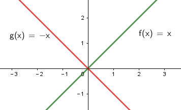

可以看出, 绝对值函数是"偶函数", 图像关于y轴对称.

---

==== 绝对值的性质

\begin{align}
& |-a| = |a| \\
& |ab| = |a| * |b| \\
& |\frac{a}{b}| = \frac{|a|}{|b|} \\
& |a+b| \le |a| + |b| <- 比如: |-2+1| \le |-2| + |1|
\end{align}

---

== 位移图像 -> y = f(x+水平位移) + 垂直位移

[options="autowidth" cols="1a,1a"]
|===
|Header 1 |Header 2

|\begin{align}
y = f(x) + 垂直位移vertical
\end{align}
|- v > 0 : 图像"向上"移位 v 个单位. +
- v < 0 : 图像"向下"移位 \|v\| 个单位. +

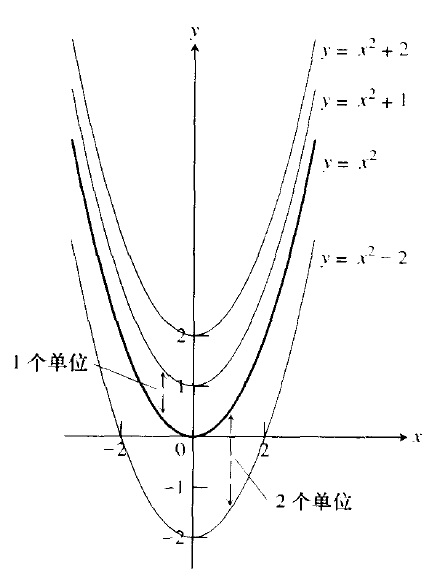

|\begin{align}
y = f(x + 水平位移horizontal)
\end{align}
|- h > 0 : 图像"向左"移位 h 个单位. +
- h < 0 : 图像"向右"移位 \|h\| 个单位. +

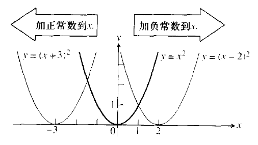
|===

---

== 复合函数 -> stem:[  f(g(x))] <- 其实就是编程中的嵌套函数. 一个函数的输出值, 作为另一个函数的输入值

\begin{align}
f(g(x)) = (f \circ g)(x)
\end{align}

---

== ----- -----

---

== 指数函数(x在指数上) -> stem:[ f(x) = a^x ] <- 即 常数a 自己乘以自己 x 次

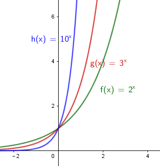

可以看出, x在0两边时, 即x是正数或负数, 对于y值的大小影响, 完全不同:

- 当x >0 时,  常数a越大, y值越大
- 当x <0 时,  常数a越大, y值越小

image:img_thomas_calculus/calculus_008.png[]

如果 x 是负数的话, 图形就相当于是 x是正数时的 沿y轴对称的图像.

==== 指数法则:

若 a>0, b>0 , 对所有实数 x, y, 以下结果成立:

\begin{align}
\boxed{
a^x * a^y = a^{x+y} \\
\frac{a^x} {a^y} =  a^{x-y} \\
(a^x) ^y = (a^y) ^x = a^{xy} \\
a^x * b^x = (ab)^x \\
\frac{a^x} {b^x} =  (\frac{a}{b})^x
}
\end{align}

---

== 自然指数函数 stem:[ e^x], stem:[ e = \lim_{n \to \infty}(1+ \frac{1}{n})^n]

对自然, 物理和经济现象的建模中, 用到的最重要的指数函数, 是"自然指数函数" : 它的基地是 e, 即 2.718 281 828.

#e, 其实就是 函数stem:[ f(x) = (1+\frac{1}{x})^x] 当 x 无穷增大时的极限.#

image:img_thomas_calculus/calculus_009.png[]

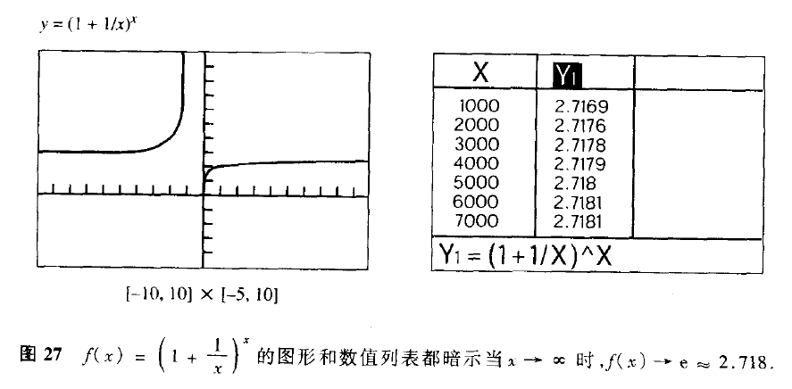

.标题
====
例如： +
你有1元钱存入银行，年利率是100%，则1年收到的2元；

假设银行会一个月算一次，月利率是1/12，那么一年得到的是:
\begin{align}
1*(1+\frac{1}{12})^{12} \approx 2.61
\end{align}

假设银行会一天算一次，天利率是1/365，那么一年得到是:
\begin{align}
1*(1+\frac{1}{365})^{365} \approx 2.71
\end{align}

假设银行丧心病狂，每时每刻都给你算一次利率，取极限：
\begin{align}
\boxed{
\lim_{n \to \infty}(1+ \frac{1}{n})^n = e
}
\end{align}

例子中给出的是年利率是100%，银行给你算复利的极限便是e。

'''

当然如果年利率不是100%，而是c的话，最终得到的极限复利, 是e的c次幂, 即 stem:[e^c]。

如:
作为指数增长的一个例子, 连续复利, 就用到模型:
\begin{align}
\boxed{
y = P * e^{rt} \\
P : 是初始投资额 \\
e : = \lim_{n \to \infty}(1+ \frac{1}{n})^n \\
r : 即 rate, 是利率 \\
t : time, 是按年计的时间.
}
\end{align}

例如: 年利率为 5.5%, 在1996投资100美元, 按连续复利计算, 到2010年时, 总金额会达到多少?

代入连续复利公式, 即:
\begin{align}
& f(t) = P * e^{rt} \\
& f(2010-1996) = 100 * e^{0.055 * (2010-1996)} \\
& f(4) = 100* e^{0.22} \\
& \approx 124.61
\end{align}

====

自然指数函数, 常被用作指数增长或衰减模型:
\begin{align}
\boxed{
 y = e^{kx} \\
k: 是一个非零常数
}
\end{align}

[options="autowidth"]
|===
|stem:[ y = y_0 * e^{kx} ] |Header 2

|k>0 时
|为"指数增长"的模型

|k<0 时
|为"指数衰减"的模型
|===

image:img_thomas_calculus/calculus_011.svg[450,450]

.标题
====
例如： 放射性衰减模型
\begin{align}
\boxed{
y(t) = y_0 * e^{-rt}, \quad r>0 \\
y_0 : 为初始时刻 t=0 时, 放射性物质的数量 \\
r : rate, 为放射性物质的衰减率.
}
\end{align}

当t 用年份度量时, 碳-14 衰减率约为 stem:[ r = 1.2 * 10^-4]

问: 866年后, 碳-14 所占的百分比是多少?

\begin{align}
& y(t) = y_0 * e^{-rt} \\
& y(866) = y_0 * e^{(- 1.2 * 10^{-4}) * 866} \\
& \approx (0.901)y_0
\end{align}

即 : 866年后, 原有的碳-14中, 还有90%的量留存. 即约有 10% 被衰减掉了.

碳-14的半衰期约为5730±40年. 所以用上面的衰减公式表示就是:
\begin{align}
& y(t) = y_0 * e^{-rt} \\
& \frac{1}{2} = y_0 * e^{-r*5730} \\
& 当 y_0 = 1 时, r =  - 1.2 * 10^{-4}
\end{align}

image:img_thomas_calculus/calculus_012.svg[500,500]

从上图可以看出, 如果初始含量为1的话:

- 经过5776年, 碳-14含量降到初始的50%;
- 经过3.8万年后, 含量降到初始的1%.

====

---

== 反函数 stem:[f^{-1 }] -> 就像时光机器, 输入原y值, 就输出原x值

若 f 和 g 互为"反函数" 则它们满足下面这种关系:

\begin{align}
& fnF(原fnG的y) = 原fnG的x <- fnF能作为fnG的时光机器, 将 fnG的输入和输出逆转过来 \\
& 即:  f \circ g (x) = x \\
\\
& 并且 fnG(原fnF的y) = 原fnF的x <- fnG 能作为fnY的时光机器 \\
& 即:  g \circ f (x) = x \\
& \\
& g = f^{-1}, 而且 f = g^{-1} <- 即f 和g互为对方的反函数
\end{align}

.标题
====
例如：
stem:[f(x) = 3x ] 和 stem:[  g(x) = \frac{x}{3} ]它们是否互为反函数?

1. 我们先把 g的y值 代入 f 中, 看看 f 能否作为 g 的时光机器, 输入g的Y值后, 能输出g的X值.

\begin{align}
f(g(x)) = 3(g的Y值) = 3(\frac{x}{3}) = x <- 即g的x值
\end{align}

上面输入g的y值, 发现输出了 g 的 x值. 所以 f 能够作为 g 的时光机器. 即 g 是 f 的反函数.

2. 我们再来看看 g 能否作为 f 的时光机器?

\begin{align}
g(f(x)) = \frac{f的Y值}{3} = \frac{3x}{3} = x <- 即输出了 f 的x值
\end{align}

所以, g也能够当做 f 的时光机器.

所以它们互为对方的反函数.
====

求反函数的步骤: 把原函数的 fn_getY = x... (即输入x, 输出y), 转变成 fn_getX = y...(即输入y, 输出x) 即可.

.标题
====
例如： stem:[ y = (\frac{1}{2})x +1 ] 的反函数是什么?

\begin{align}
& y = (\frac{1}{2})x +1 \\
& 2y = x + 2 \\
& x = 2y - 2 <- 这就是反函数形式了
\end{align}

如果你要把这个函数符合一般习惯, 可以用y 来代表x, 用x来代表y, 写成:
stem:[ y = 2x -2  ]

所以 stem:[ y = (\frac{1}{2})x +1 ] 的反函数就是 stem:[ f^{-1}(x) = 2x-2 ]

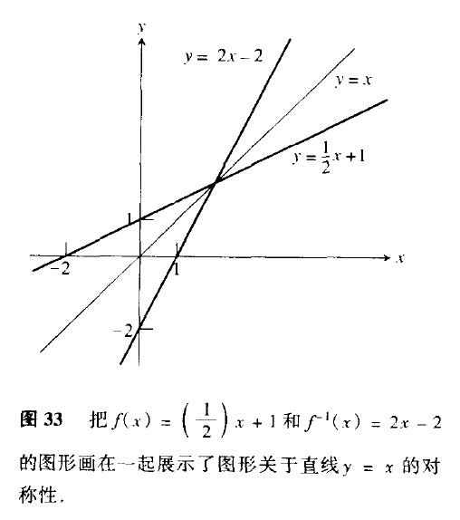

====

---

== 对数函数 -> stem:[ 原指数x = log_{原常数a}原Y值 ]

[options="autowidth"]
|===
|对数函数|原函数

|\begin{align}
原指数x = log_{原常数a}原Y值
\end{align}
|\begin{align}
y = a^x
\end{align}

2+|↑ +
它们是互为"反函数"的关系, 关于 直线y=x 对称.
|===

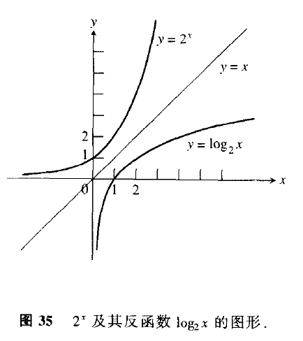

\begin{align}
\boxed{
log_e x => 写作: ln x \\
log_{10} x => 写作: lg x
}
\end{align}

正因为:  stem:[ 原指数x = log_{原常数a}原Y值 ] , 所以就可以得到对数函数的性质:

[options="autowidth"]
|===
|Header 1 |Header 2

|\begin{align}
& a^{log_a x} = x <-即原Y值 \\
& (a > 0, a \ne 1, x>0)
\end{align}

|=> 翻译成原函数就是:
\begin{align}
a^{log_{原常数a} 原Y值} = a^{原指数X值} = 原Y值
\end{align}

|\begin{align}
& log_a a^x = x <- 原指数X值 \\
& (a > 0, a \ne 1, x>0)
\end{align}

|=> 翻译成原函数就是:
\begin{align}
log_{原常数a} 原Y值 = 原指数X值
\end{align}

|\begin{align}
& e^{\ln x} = x <- 即原Y值 \\
& (x>0)
\end{align}

|=> 翻译成原函数就是:
\begin{align}
e^{log_e 原Y值} =e^{原指数X值} = 原Y值
\end{align}

|\begin{align}
& \ln e^x = x <- 原X值 \\
& (x>0)
\end{align}

|=> 翻译成原函数就是:
\begin{align}
\log_e e^{原指数X} = log_e 原Y值 = 原X值
\end{align}

|乘积法则:
\begin{align}
& log_a (xy) = log_a x + log_a y \\
& (x> 0, y>0)
\end{align}
|

|商法则:
\begin{align}
& log_a(\frac{x}{y}) = log_a x - log_a y \\
& (x> 0, y>0)
\end{align}
|

|幂法则:
\begin{align}
& log_a (x^y) = y \log_a x  \\
& (x> 0, y>0)
\end{align}
|
|===

.标题
====
例如：
\begin{align}
& \ln x = 3t + 5, 求x:  \\
& log_e x = 3t+5  <- 即: log_e 原Y值 = 原X值 \\
& e^{3t+5} = x <- log 的x, 即原函数的Y值
\end{align}
====

.标题
====
例如：
\begin{align}
& e^{2x} = 10, 求x:  \\
& \ln e^{2x} = \ln 10 <- 两边取对数 \\
& \log_e e^{2x} = \ln 10 <- 左边即: log_e 原Y值 \\
& 2x = \ln 10 \\
& x = \frac{ln 10}{2}
\end{align}
====

---

==== "指数函数"和"自然指数函数", 可以互相转换 -> stem:[a^x = e^{x \ln a} ]

每一个"指数函数", 都是"自然指数函数"的幂函数: 即:
\begin{align}
\boxed{
a^x = e^{x \ln a} \\
<- 即: 原常数^{原指数x} = e^{原指数x * (\ln 原常数)}
}
\end{align}

即: #stem:[ a^x], 和 stem:[ e^x]的 stem:[ ln a] 次幂, 是同样的.#

证明其实很简单:
\begin{align}
& x = e^{\ln x} <- 因为 e^{log_e x} = x \\
& a^x = e^{\ln (a^x)} <- 两边用 a^x 来 替换 x \\
& a^x = e^{x \ln a} \\
& a^x = e^{(\ln a) x} <- 即, 每一个"指数函数", 都是"自然指数函数"的幂函数
\end{align}

.标题
====
例如： 把指数函数, 转换写成为 e的幂函数:

(1)
\begin{align}
2^x = e^{x * ln 2} <- 原常数^{原指数x} = e^{原指数x * (\ln 原常数)}
\end{align}

(2)
\begin{align}
5^{-3x} = e^{-3x * (\ln 5)}
\end{align}
====

---

== 每个自然对数函数 stem:[ ln x] , 是对数函数 stem:[ log_a x] 的 stem:[ln a ]倍 -> stem:[ ln x = lon_a x * ln a]

[options="autowidth"]
|===
|Header 1 |证明过程

|\begin{align}
\boxed{
底变换公式(把常数a底, 换成e底) : \\
 \log_a x = \frac{\ln x}{\ln a} = \frac{\log_e x}{\log_e a} \\
(a>0, a \ne 1)
}
\end{align}

|证明很简单:
\begin{align}
& a^{log_a x} = x \\
& \ln a^{log_a x} = \ln x <- 两边取对数 \\
& (log_a x)(\ln a) = \ln x <- 等式左边, 是因为根据公式:  \log_a x^y = y \log_a x \\
& \log_a x = \frac{\ln x}{\ln a}, \quad (a>0, a \ne 1) <- 即"换底公式", 或 "底变换公式"
\end{align}

|\begin{align}
\boxed{
换底公式2 : \\
log_a Y = \frac{log_c Y}{\log_c a}
}
\end{align}

|\begin{align}
& log_a Y = 原X \\
& 即原函数是: a^x = y \\
& a = \sqrt[x]{y} \\
& log_c a = log_c \sqrt[x]{y} <-两边取对数 \\
& log_c a = log_c y^{\frac{1}{x}}  \\
& log_c a = \frac{1}{x} log_c y \\
& x = \frac{log_c y}{log_c a} \\
& log_a Y = \frac{log_c y}{log_c a} <- 等号左边因为: 原X =log_a Y
\end{align}
|===

.标题
====
例如：你本金有 1000美元, 年复利率为 5.25%, 那么要多长时间, 你的本息总额才达到2500美元?

即:
\begin{align}
& 1000 * (1+ 5.25\%)^t = 2500 \\
& 1.0525^t = 2.5 \\
& ln(1.0525^t) = ln 2.5 <- 两边取对数\\
& t * ln(1.0525) = ln 2.5 \\
& t = \frac{ ln 2.5}{ln(1.0525)}
\approx 17.9 年
\end{align}

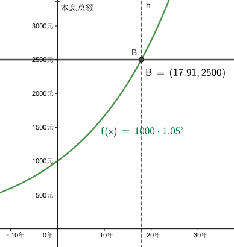

====

.标题
====
例如：
放射性元素的半衰期, 可用如下公式表示. +
其中, stem:[ y_0]是一开始所含有的放射性物质的数量, +
t值 为该元素的半衰期.

\begin{align}
& y_0 * e^{-kt} = \frac{1}{2} y_0 \\
&  e^{-kt}  = \frac{1}{2} \\
& log_e  \frac{1}{2}  = - kt \\
& t = \frac{ln \frac{1}{2}}{-k} \\
& t = \frac{ln 2^{-1}} {-k} <- 根据公式 : log_a (x^y) = y \log_a x , 所以 ln 2^{-1} = - ln 2\\
& 半衰期 t = \frac{ln 2}{k}
\end{align}

====

---

== ----- -----

---

== 三角函数

==== "弧度"和"角度"之间的换算 -> 一圈 stem:[ 360° = 2 \pi 弧度]

因为 圆的一圈 stem:[ 360° = 2 \pi 弧度], 所以:
\begin{align}
1° = \frac{2 \pi 弧度}{360}  = \frac{\pi 弧度}{180}
\approx 0.02 弧度
\end{align}

因为
\begin{align}
& 360° = 2 \pi 弧度 \\
& 1弧度 = \frac{360°}{2 \pi} = \frac{180°}{\pi} \approx 57.3°
\end{align}

所以, 传统的度数, 和弧度数的转换关系就是:

[options="autowidth"]
|===
|Header 1 |Header 2

|\begin{align}
1° = \frac{\pi 弧度}{180}
\end{align}

|\begin{align}
n° = n * \frac{\pi 弧度}{180}
\end{align}

|\begin{align}
1弧度 = \frac{180°}{\pi}
\end{align}

|\begin{align}
n弧度 = n*  \frac{180°}{\pi}
\end{align}
|===

---

==== 三角函数的值

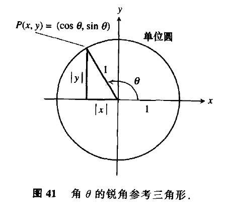

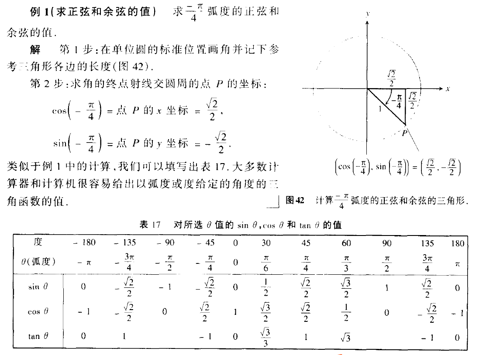

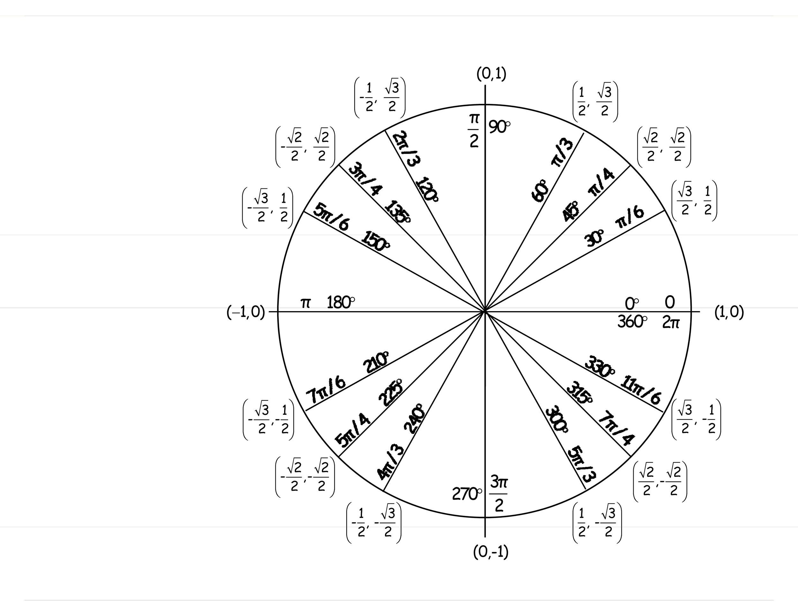

---

==== 周期 -> 若 stem:[ f(x+p) = f(x)], 则 p 即周期.

周期:: 如果存在正数p, 使得对每个x值, 有 stem:[ f
(x+p) = f(x)], 即它们的y值相等, 则最小的这样的 p值, 就是 f 的"周期".

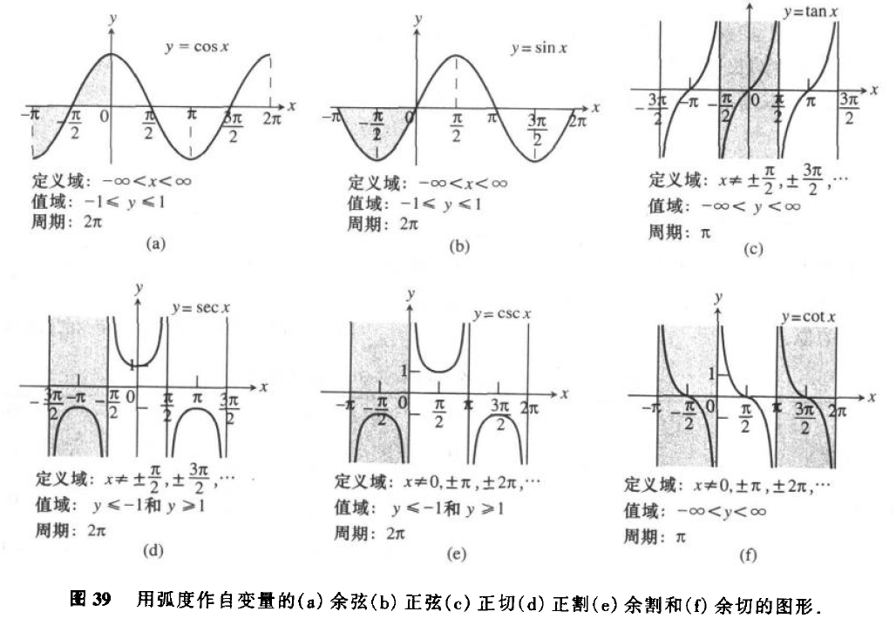

从函数图上可以看出:

[options="autowidth"]
|===
|Header 1 |周期 | 即

|sin, cos, sec, csc
|stem:[ 2 \pi]
|\begin{align}
\sin(x + 2\pi) = \sin x \\
\cos(x + 2\pi) = \cos x \\
\sec(x + 2\pi) = \sec x \\
\csc(x + 2\pi) = \csc x
\end{align}

|tan, cot
|stem:[  \pi]
|\begin{align}
\tan(x+ \pi) = \tan x \\
\cot(x+ \pi) = \cot x
\end{align}
|===

为什么在研究周期性现象(如脑电波, 心跳, 电压电流, 气候和季节)中, 三角函数是如此重要呢? 因为 *#在我们数学建模中用到的每个周期函数, 都可以表达为"sin正弦" 和"cos余弦"的代数组合.# 一旦我们学会了 sin 和 cos 的 微积分, 就能对大多数周期现象的数学表征, 进行建模.*

---

==== 奇偶性

从图上可知, 只有 cos 和 sec 是 偶函数, 关于 y轴对称.
其他都是奇函数.

---

==== 三角函数的图形变换 -> stem:[ f(x) = Y轴震荡幅度 * f(周期 *( x + 水平移位)) + 垂直移位 ]

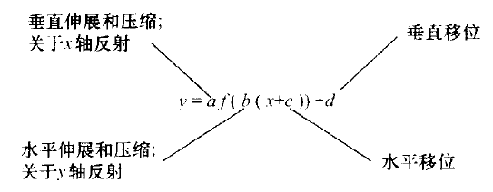

.标题
====
例如：阿拉斯加某地的全年温度变化, 可由如下正弦函数表示:

\begin{align}
f(x) = A \sin [\frac{2\pi}{B} (x-C)] + D
\end{align}

其中:

- |A| : 是幅度
- |B| : 是周期
- C : 是水平移位
- D : 是垂直移位

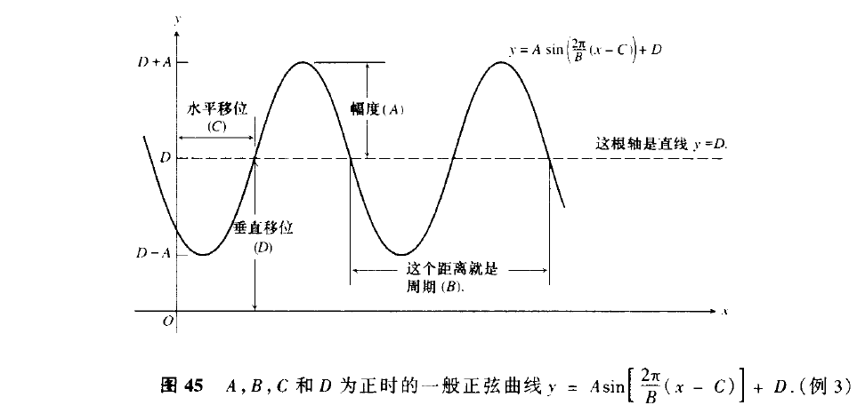

====

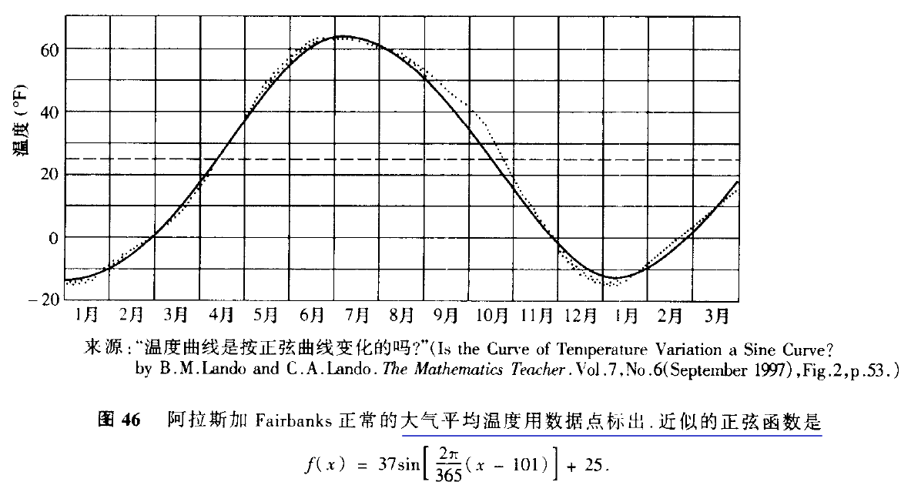

---

==== 恒等式

[options="autowidth"]
|===
|Header 1 |证明过程

|\begin{align}
\sin^2 \theta  + cos^2 \theta = 1
\end{align}

|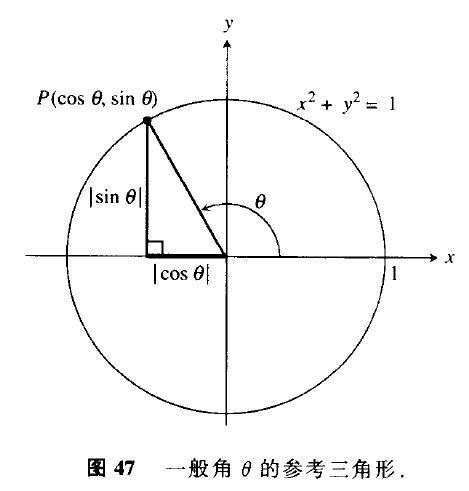

从上图可以看出:
\begin{align}
\sin^2 \theta  + cos^2 \theta = 1 <- 根据毕达哥拉斯定理
\end{align}

|\begin{align}
1 + \tan^2 \theta = \sec^2 \theta \\
1 + \cot^2 \theta = \csc^2 \theta
\end{align}
|Column 2, row 2

|和角公式 :
\begin{align}
\sin(A + B) = \sin A \cdot \cos B + \cos A \cdot \sin B \\
\sin(A - B) = \sin A \cdot \cos B - \cos A \cdot \sin B \\
\\
\cos(A + B) = \cos A \cdot \cos B - \sin A \cdot \sin B \\
\cos(A - B) = \cos A \cdot \cos B + \sin A \cdot \sin B \\
\end{align}
|

|二倍角公式 :
\begin{align}
\sin 2 \theta & = 2 \cdot \sin \theta \cdot \cos \theta  \\
\cos 2 \theta & = \cos^2 \theta - sin^2 \theta \\
& = 1- 2 sin^2 \theta \\
& = 2 cos^2 \theta -1 \\
\\
\tan 2 \theta &= \frac{2 \tan \theta}{1 - \tan^2 \theta} \\
\cot 2 \theta &= \frac{\cot^2 \theta -1}{2 \cot \theta} \\
\end{align}
|

|余弦定理 :
\begin{align}
c^2 = a^2 + b^2 - 2ab \cdot \cos \theta
\end{align}

|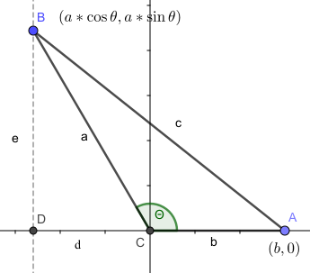

从上图可知:
\begin{align}
据勾股定理, 可知: \\
& (d+b)^2 + e^2 = c^2 \\
来求 e : \\
& \sin \theta = \frac{e}{a} \\
& e = a \cdot \sin \theta \\
来求 d : \\
& \cos \theta = \frac{d}{a} \\
& d =  a \cdot \cos \theta \\
所以 B点坐标就是 (d, e), 即 ( a \cos \theta, a  \sin \theta) \\
根据勾股定理, 有: \\
& (\|d\|+b)^2 + e^2 = c^2 \\
& (- a\cos \theta + b)^2 + (a \sin \theta)^2 = c^2 \\
& a^2 \cos^2 \theta - 2ab \cos \theta  + b^2 + a^2 sin^2 \theta = c^2 \\
&  a^2 \cos^2 \theta +  a^2 sin^2 \theta  -2ab \cos \theta  + b^2= c^2 \\
&  a^2 (\cos^2 \theta +  sin^2 \theta) -2ab \cos \theta  + b^2= c^2 <- \cos^2 \theta +  sin^2 \theta = 1 \\
&  a^2  + b^2 -2ab \cos \theta = c^2 <- 即 余弦定理\\
\end{align}

上面最后, 我们得到余弦定理是:
\begin{align}
a^2  + b^2 -2ab \cos \theta = c^2
\end{align}

可以看出: 若 stem:[  \theta = \frac{\pi}{2}], 即 90°直角时, stem:[ \cos \theta = 0 ], 于是余弦定理就会变成:
\begin{align}
& a^2  + b^2 -2ab \cos \theta = c^2 \\
& a^2  + b^2 - 2ab * 0  = c^2 <-  \theta 为\frac{\pi}{2} 即 90°直角时 \\
& 即 a^2  + b^2 = c^2 <- 可见, 余弦定理扩展了毕达哥拉斯定理
\end{align}

|===

---

==== 反三角函数

==== ---- 反正弦函数 stem:[ arcsin x]

反函数和原函数的图像, 关于直线 stem:[ y=x] 对称。

6个基本三角函数(sin, cos, tan, cot, sec, csc)中, 没有一个是一对一的, 这些函数都没有反函数. 但是, 如果限制其定义域, 就会产生一个有反函数的形函数.

受到限制定义域的 sin函数 的反函数, 叫做 "反sin函数". +
x 的 反sin函数, 就是在 stem:[ \[\frac{- \pi}{2}, \frac{\pi}{2}\] ] 中的角度. +
反正弦函数, 就记作: stem:[ sin^{-1} x ] 或 stem:[ arcsin x].

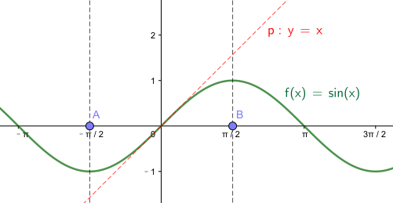

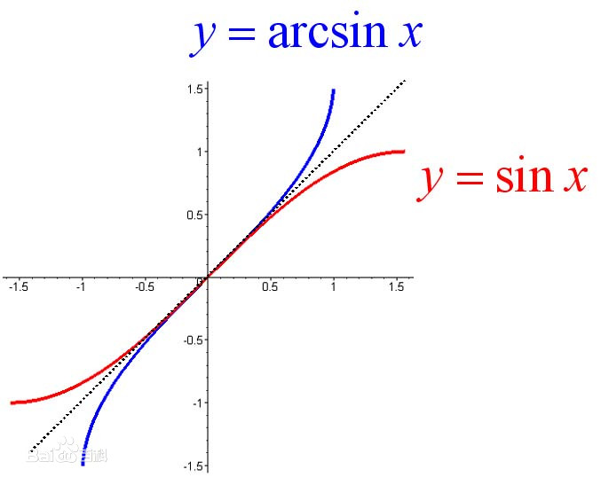

即:

[options="autowidth"  cols="1a,1a"]
|===
|Header 1 |Header 2

|正弦函数
|
\begin{align}
y = \sin x, \quad (x \in [ \frac{- \pi}{2}, \frac{\pi}{2} ])
\end{align}

|反正弦函数
|
\begin{align}
& x = \sin y , \quad (x \in [ -1, 1]) \\
& 或 y = \arcsin x
\end{align}

- 定义域:stem:[ -1,1 ]
- 值域 : stem:[  \[ \frac{- \pi}{2}, \frac{\pi}{2} \] ]
|===

---

==== 6个基本的反三角函数 Inverse trigonometric function 的 定义域和值域

同样, 可以通过限制其他基本三角函数的"定义域", 来产生它们的反函数.

[options="autowidth"]
|===
||反三角函数 |定义域 |值域

|arcsinx
|stem:[ y = \sin^{-1} x ]

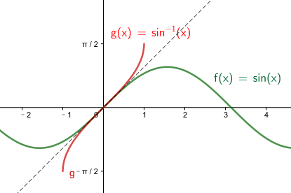

|stem:[ -1 \leq x \leq 1 ]
|stem:[ - \frac{\pi}{2} \leq y \leq \frac{\pi}{2} ]

|arccosx
|stem:[ y = cos^{-1} x ]

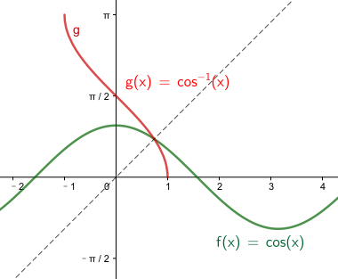

|stem:[ -1 \le x \leq 1 ]
|stem:[ 0 \le y \leq \pi ]

|arctanx
|stem:[ y = tan^{-1} x ]

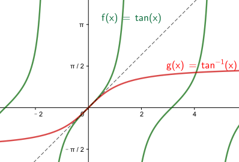

|stem:[ -\infty < x < \infty ]
|stem:[ - \frac{\pi}{2} < y < \frac{\pi}{2}]

|arccotx
|stem:[ y = cot^{-1} x = \frac{\pi}{2} - tan^{-1} x ]

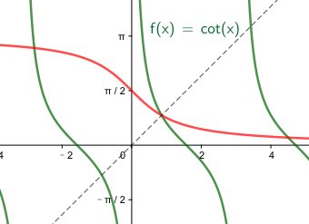

|stem:[ -\infty < x < \infty ]
|stem:[ 0 < y < \pi]

|arcsecx
|stem:[ y = sec^{-1} x = cos^{-1} (\frac{1}{x})]

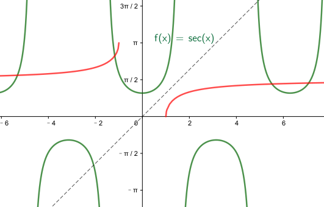

|stem:[\|x\| \ge 1] +
也即: +
stem:[ (-\infty, -1\] \cup \[1, +\infty) ]
|stem:[ 0 \le y \le \pi, \quad y \ne \frac{\pi}{2}] +
也即: +
stem:[ \[0, \pi/2 ) \cup (\pi/2, \pi\]  ]

|arccscx
|stem:[ y = csc^{-1} x = sin^{-1}(\frac{1}{x})]

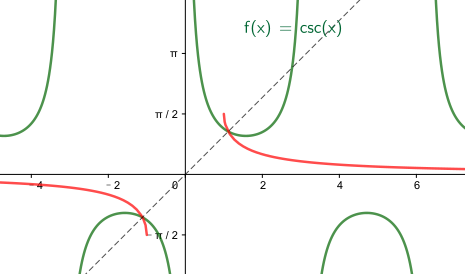

|stem:[\|x\| \ge 1] +
也即: +
stem:[ (-\infty, -1\] \cup \[1, +\infty) ]
|stem:[ - \pi/2 \le y \le \pi/2, \quad y \ne 0] +
也即 +
stem:[ \[-pi/2, 0) \cup (0, \pi/2\] ]
|===

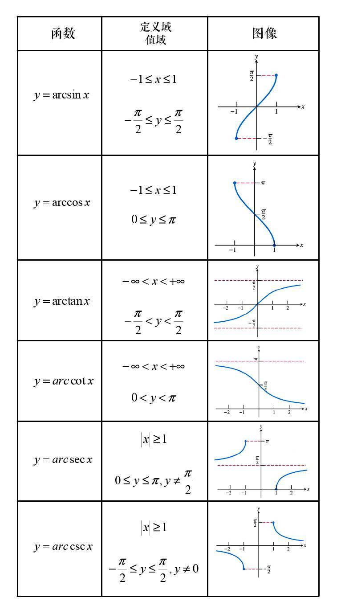

---

==== 6个反三角函数的常用值 -> ① 原三角函数, 是输入弧度角, 输出两个边长的比例; ② 其反三角函数, 是输入两个边长的比例, 输出弧度角的角度.

反三角函数与原函数的 定义域和值域, 正好对调, 所以:

[options="autowidth"]
|===
|Header 1 |定义域 x |值域 y

|原函数
|弧度角
|该弧度角的 sin/ cos /tan /cot 等值

|其反函数
|该弧度角的 sin/ cos /tan /cot 等值
|弧度角
|===

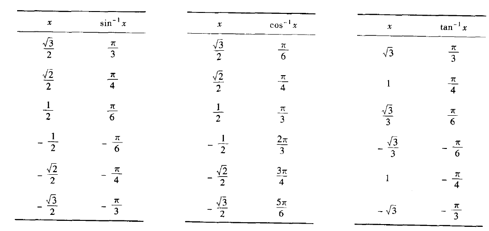

.标题
====
例如： 某飞机从芝加哥, 飞往圣路易斯. 在中途发现偏离行线12英里. 那么它要转向多少度(即 ∠a + ∠b), 才能对准目的地?

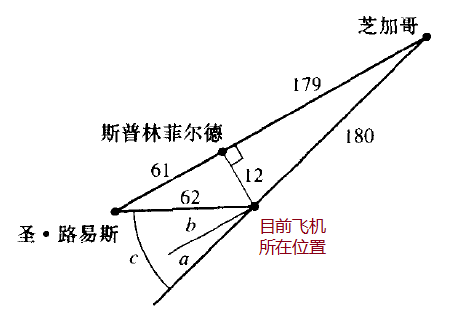

思考: 原三角函数, 是输入弧度角, 输出两个边长的比例;  其反三角函数, 是输入两个边长的比例, 输出弧度角的角度. 所以我们只要来算这里面三角函数的"反函数", 就能得到 ∠a 和 ∠b 的弧度角了.

\begin{align}
& ∠a = \sin^{-1}\frac{12}{180} \approx 0.067弧度 \approx 3.8° \\
& ∠b = \sin^{-1}\frac{12}{62} \approx 0.195弧度 \approx 11.2° \\
& ∠c = ∠a + ∠b \approx 15°
\end{align}

====

---

==== 与 sin 和 arcsin 有关的恒等式

[options="autowidth" cols="1a,1a"]
|===
|Header 1 |Header 2

|arcsin
|arcsin 的图像是关于原点对称的, 所以是奇函数. 即:
\begin{align}
\sin^{-1}(-x) = - \sin^{-1} x
\end{align}

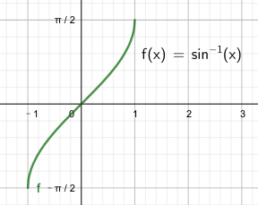

|arccos
|arccos 的图像没有对称性, 但是我们从图上可以看出:

\begin{align}
cos^{-1} x + cos^{-1} (-x) = \pi  \\
<- 反三角函数输出的是弧度角 \\
或 cos^{-1} (-x) = \pi - cos^{-1} x  \\
\end{align}

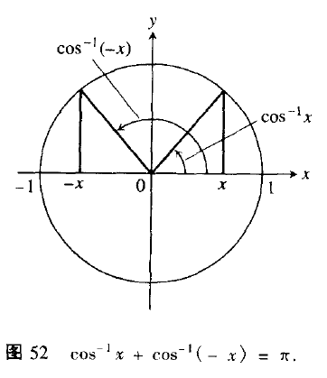

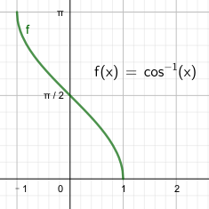

\begin{align}
cos^{-1} 1 + cos^{-1} (-1) = 0+ \pi  = \pi
\end{align}

'''

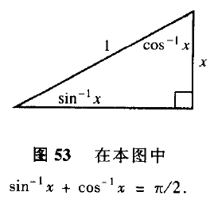

而且, 我们从上图还可以看出 : 对于 x >0, 有:
\begin{align}
sin^{-1} x + cos^{-1} x = 90° = \frac{\pi}{2} \\
<- 反函数输出的值, 是弧度角
\end{align}

|===

---

