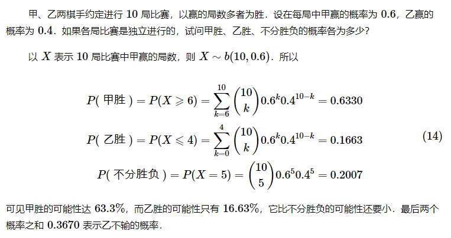
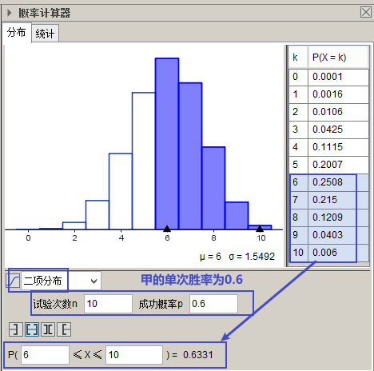
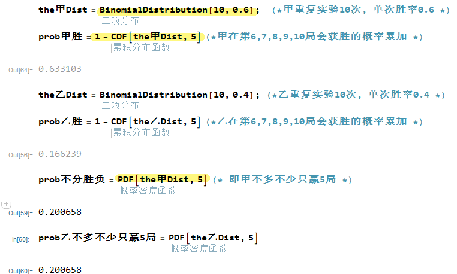

= 累积分布函数 cumulative distribution function (简称 CDF )
:sectnums:
:toclevels: 3
:toc: left

---

== ★ Mathematica 和 Geogebra 中, "累积分布函数 CDF"的用法

---

==  累积分布函数 cumulative distribution function (简称 CDF )

