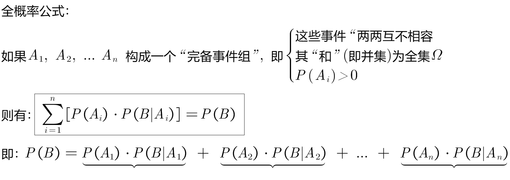
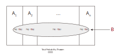
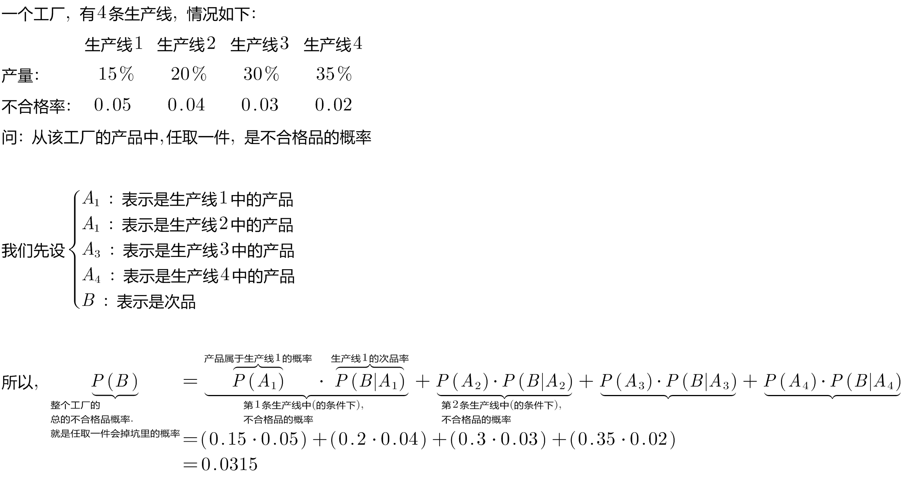
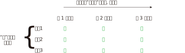

= 全概率公式 Total Probability Theorem
:toc: left
:toclevels: 3
:sectnums:

---

== 全概率公式 Total Probability Theorem

.标题
====
例如： +

====

.标题
====
例如： +
image:img/0053.png[,]

====

.标题
====
例如： +
image:img/0055.png[,]

image:img/0056.svg[,]

====

---
