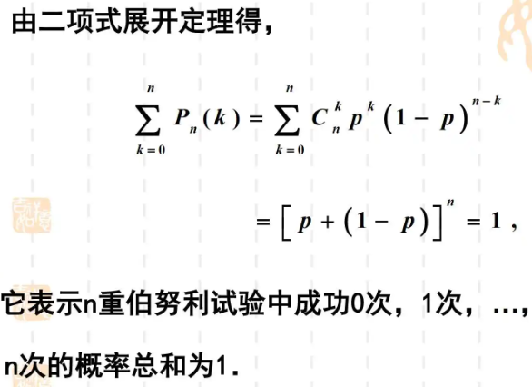
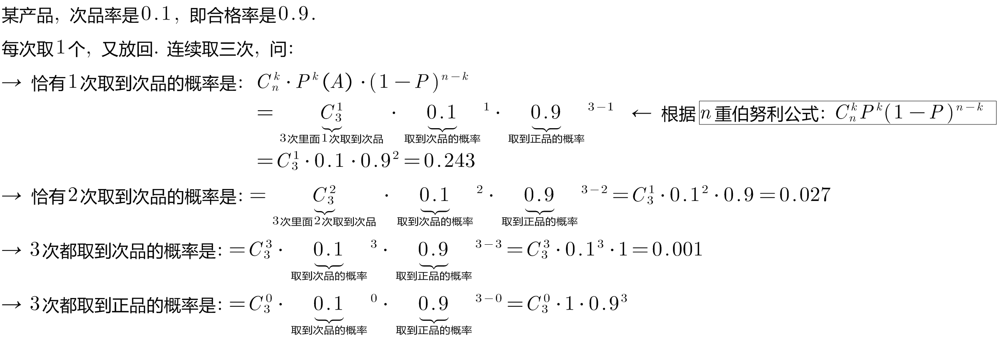
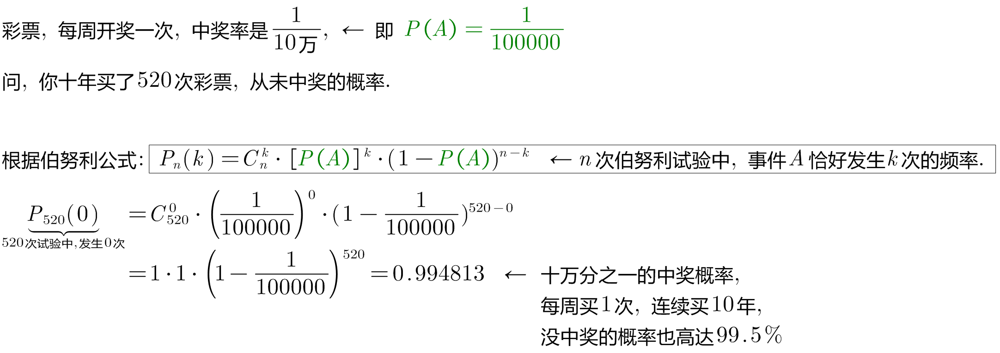

= 伯努利模型 bernoulli model
:toc: left
:toclevels: 3
:sectnums:

---

== 伯努利模型 bernoulli model

[.small]
[options="autowidth"]
|===
|Header 1 |Header 2

|独立试验序列 :
|在相同的试验条件下，进行一系列随机试验 stem:[ E_1, E_2, ... E_n], (每次做的实验, 可以是不相同的)，观察某事件A发生与否.若每次试验结果相互独立,则这样的一系列试验称为"独立试验序列".

|n重独立试验
|把一个试验, 重复做n次. 即:  stem:[ E, E, ... E], 记作: stem:[ E^n]

|伯努利试验
|其试验结果只有两种. 即: stem:[ Ω = {A, \overline {A}}] +

属于"伯努利试验"的有: +
- 掷硬币, 结果只有"正面"和"反面"两种 +
- 射击, 结果只有"击中"和"没击中"两种. +
- 检验产品, 结果只有"合格","次品" 两种.

不属于"伯努利试验"的 : +
- 掷骰子, 有6种结果

如果在一个试验中, 我们只关心某个事件A 发生与否, 那么就称这个试验为"伯努利试验". 此时, 试验的结果可以看成只有两种: A发生, 或 A不发生.  相应的数学模型, 就称为"伯努利概型".

|n重伯努利试验
|就是把"伯努利试验"重复做n次, 每次都是独立的. 并且试验结果只有两种.

设在单次试验中, 事件A发生的概率为P, 将此试验重复独立地进行n次, 则事件A恰好发生k次的概率是多少? 通常记这个概率为 stem:[ P_n(k), \quad  k= 0,1,2,...,n].

|===

---

== 定理:

A的概率是P, 则 stem:[ \overline{A} = 1-P]

n重"伯努利试验"中, 事件A恰好发生k次的概率就是:

\begin{align}
& 二项概率公式: \\
& P_n(k)= C_n^k \cdot [P(A)]^k \cdot (1-P(A))^{n-k}  ← 其中, P=P(A) \\
&或 \\
&  P_n(k)= C_n^k \cdot [P(A)]^k \cdot q^{n-k} \quad  (q=1-P(A))
\end{align}

由于 stem:[ \sum_{k=0}^n P_n(k) = \[ P+(1-P)\]^n=1], 因此也称 stem:[ P_n(k)] 为"二项概率".

什么是二项式? stem:[ (a+b)^n] 展开, 就是二项式.

.标题
====
例如： +

====

.标题
====
例如： +

====

---
