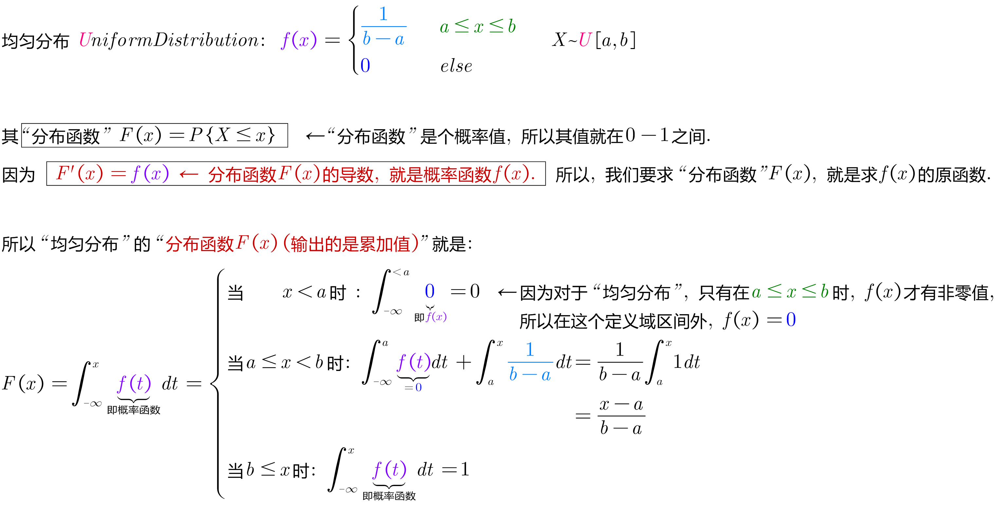
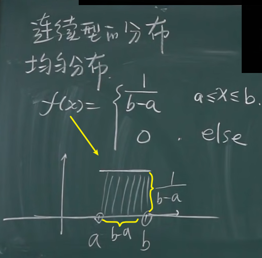
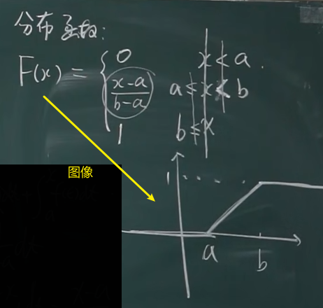
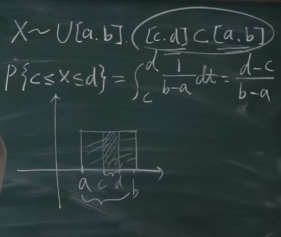
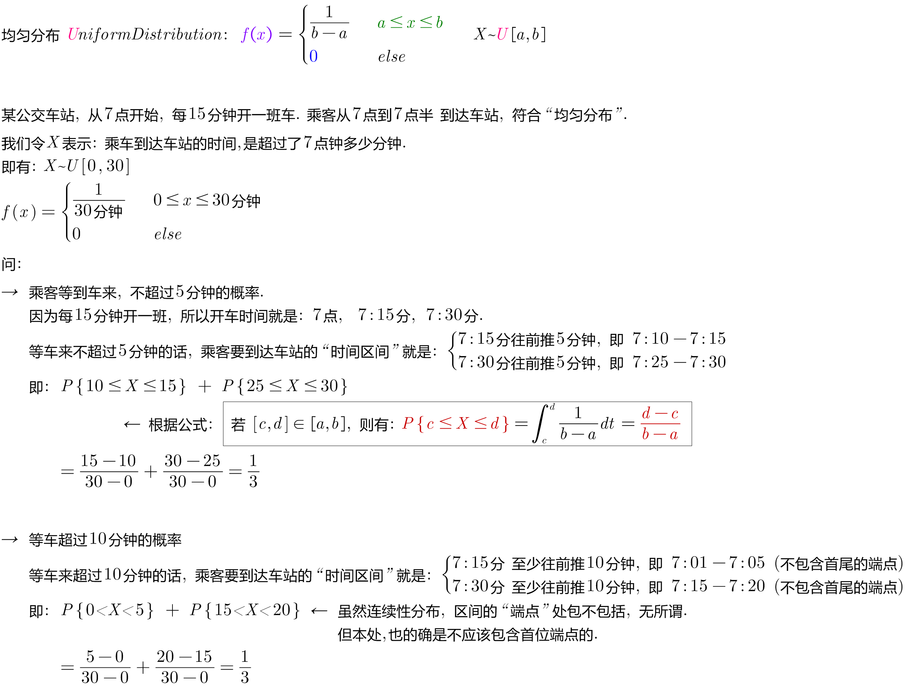
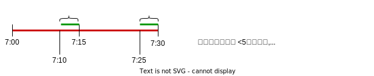
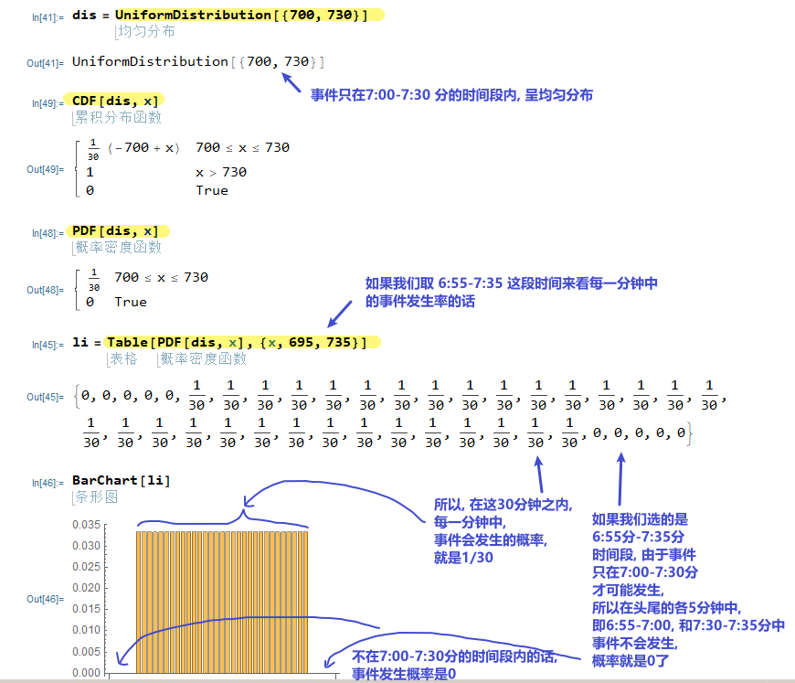

= 连续概率分布 : 均匀分布
:toc: left
:toclevels: 3
:sectnums:

---

== 连续概率分布（continuous probability distribution）

=== 均匀分布 Uniform Distribution

在概率论和统计学中，"均匀分布"也叫"矩形分布"，它是对称概率分布，*在相同长度间隔的分布概率是等可能的。*

"均匀分布"由两个参数a和b定义，它们是数轴上的最小值和最大值，通常缩写为 U（a，b）.

[.small]
[options="autowidth"]
|===
|Header 1 |Header 2

|概率函数f(x)
|

|分布函数F(x)
|
|===

对 X~U[a,b], 有[c,d]区间, 是包含在 [a,b]区间里面的, 即 stem:[ \[c,d\] ∈ \[a,b\]], 则 x落在c和d 之间的概率, 即: stem:[ P{c \leq x \leq d} = \int_c^d \frac{1} {b-a} dt = \frac{d-c} {b-a}]

也就是说, "均匀分布" 在[a,b]区间的概率值, 是一个矩形. 所以其里面的 [c,d]区间的概率, 也是一个小矩形. 这两个矩形的面积之比, 就是它们相应的"长或宽的长度"对比.

.标题
====
例如： +

用 mathematica 计算 :

====

---

