= "连续型随机变量 分布" 的方差 variance/deviation Var
:sectnums:
:toclevels: 3
:toc: left

---

常见"连续型"数据的 "E期望"与"D方差"

== 均匀分布 uniform distribution : stem:[ ① E(X)= \frac{a+b} {2}, \ ② D(X)=\frac{(b-a)^2} {12}]

连续型随机变量的"概率(密度)函数"是一个描述"这个随机变量的输出值，在某个确定的取值点附近的可能性"的函数, 即 f(x)。而随机变量的取值落在某个"区域"之内的概率, 则为"概率(密度)函数"在这个区域上的"积分"即 F(x)。

stem:[ P(a ≤ X ≤ b) = \int_a^b f(x) dx]

概率中的 "均匀分布"也叫"矩形分布"，它是对称概率分布，在相同长度间隔的分布概率, 是等可能的。  +
"均匀分布" 由两个参数a和b定义，它们是数轴上的最小值和最大值，通常缩写为U（a，b）。

假设 X 服从[a,b]上的均匀分布，则 X 的"概率(密度)函数" 如下:

\begin{align}
f(x) = \begin{cases}
 \dfrac{1} {b-a} , & a ≤x ≤b   & \\
  0  &  else &  \\
\end{cases}
\end{align}

为什么是 stem:[ \frac{1} {b-a}  ] ?  因为 f(x)曲线下的面积 (即积分) =1, 那么对于曲线下这个矩形来说, 面积就是 "宽×高", 宽就是 b-a, 高就是 f(x), 就是 stem:[ = \frac{"矩形面积"} {宽} = \frac{1} {b-a}].

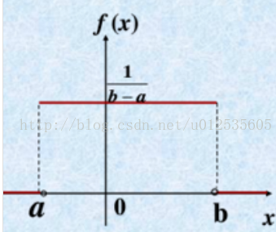

均匀分布曲线 f(x) 的形状是一个矩形，这也是"均匀分布"又称为"矩形分布"的原因。

在两个边界端点 a和b 处的f（x）的值, 通常是不重要的，因为它们不改变积分值。

"均匀分布"的"累加函数 (Cumulative Distribution Function) "就是:

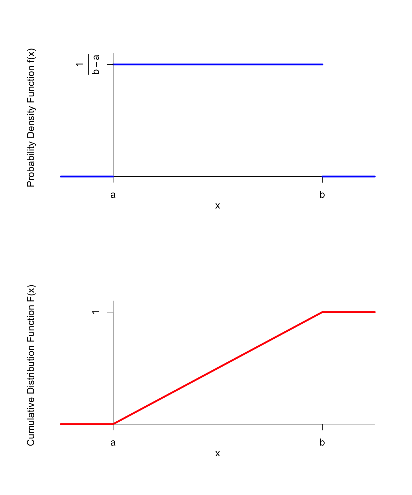

均匀分布的例子有:  投骰子, 结果是1到6。得到任何一个结果的概率是相等的.

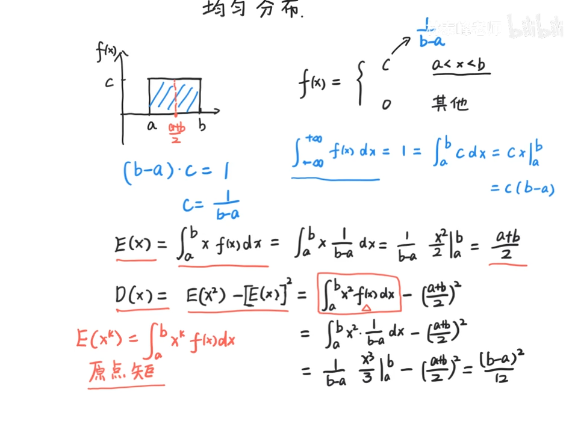

.标题
====
例如： +
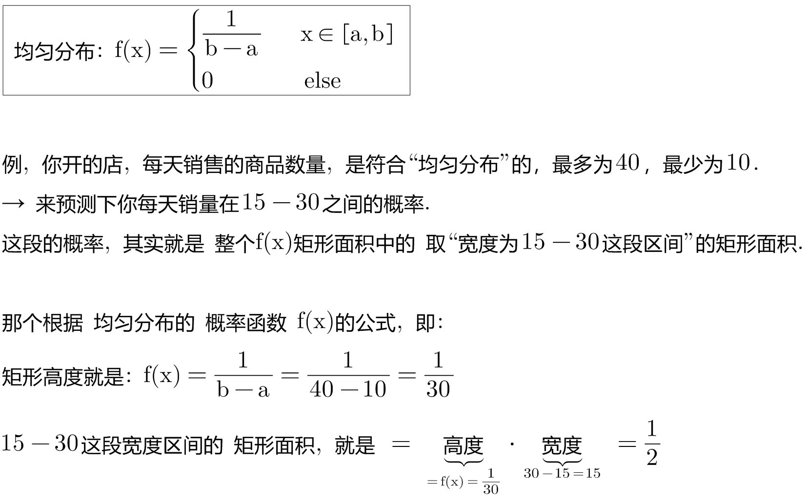
====

.标题
====
例如： +
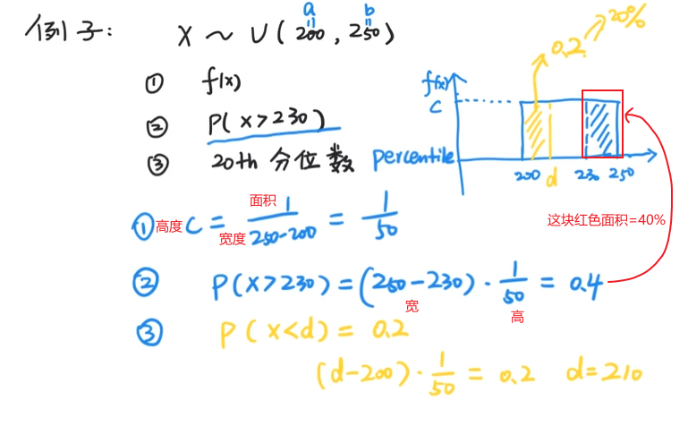
====

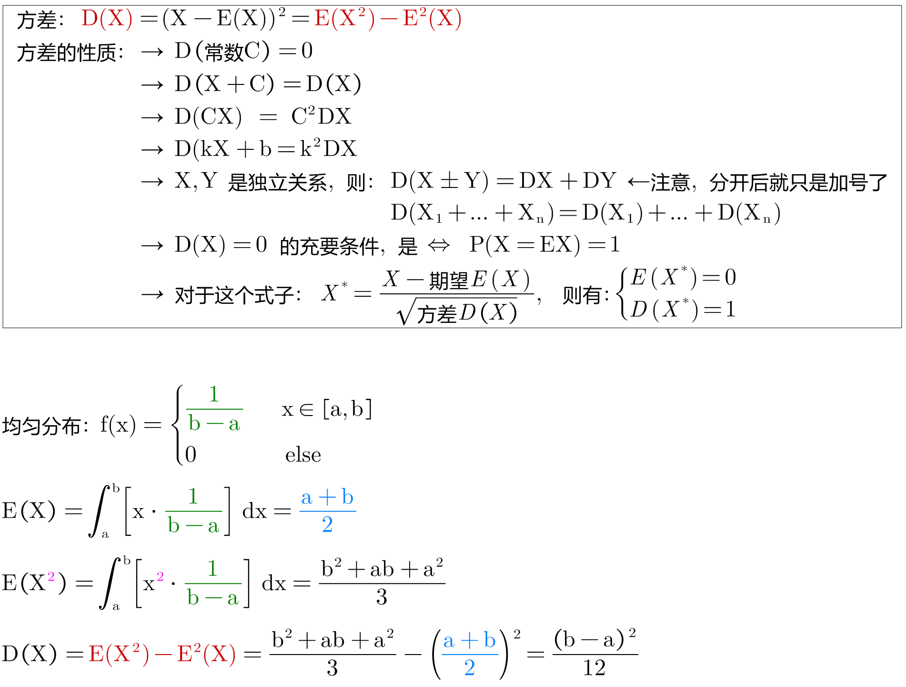

---

== 指数分布 Exponential Distribution : stem:[ ① E(X)= 1/λ, \ ② D(X)=\frac{1} {λ^2}]

....
Exponential /ˌeks-pəˈnenʃl/

1.( mathematics 数) of or shown by an exponent 指数的；幂的；由指数表示的
2.( formal ) ( of a rate of increase 增长率 ) becoming faster and faster 越来越快的

an exponential curve/function 指数曲线╱函数

ex-, 向外。-pon, 放置，词源同pose, component.即展开，描述美好的前景，引申义拥护，鼓吹。同时用来指数学术语指数（据说来自笛尔卡）。
....

"指数分布"和"泊松分布"息息相关.

.标题
====
例如： +
你的商店, 一周中的每天, 卖出馒头的起伏还是很大的, 利用泊松分布, 可以画出每日卖出馒头数的概率函数.

下面来讨论另外一个问题，馒头卖出之间的时间间隔：

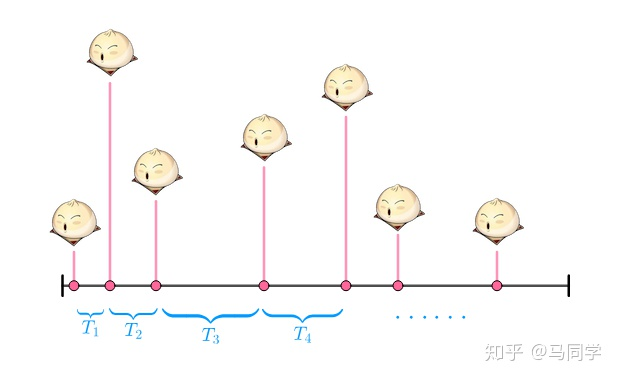

可以看出也是随机变量（也就是图中的 T1、T2、T3、⋯ ），馒头卖出的个数, 是离散型数据. 而时间间隔, 则是"连续型"的随机变量。

如果知道这个时间间隔，你就能调整好服务员人数（时间间隔短，需要的服务人员就多; 反之, 需要的就少）

之前得到的泊松分布, 让我们知道了每天卖出的馒头数，所以下面按天来分析看看。

假如某一天没有卖出馒头，比如说周三吧，这意味着，周二最后卖出的馒头，和周四最早卖出的馒头中间至少间隔了一天：

当然也可能运气不好，周二也没有卖出馒头。那么卖出两个馒头的时间间隔就隔了两天，但无论如何时间间隔都是大于一天的：

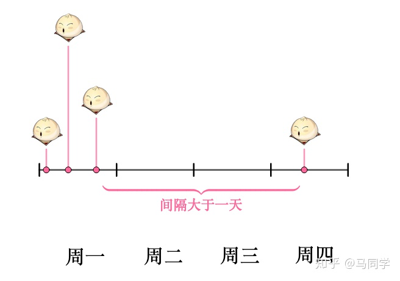

而某一天没有卖出馒头的概率, 可以由泊松分布得出：

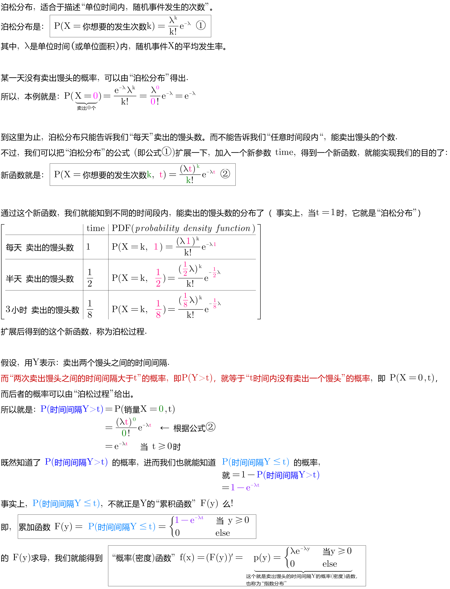

指数分布中的λ, 是"每日平均卖出的馒头数". 如果λ 越大，也就是说每日卖出的馒头越多，那么两个馒头之间的时间间隔必然越短(时间间隔越密集)，这点从图像上也可以看出。

当 λ 较小的时候，比如λ=1 ，即一天只卖出一个馒头，那么两个馒头间卖出的时间间隔Y, 大于1 (即大于1天)的可能性, 就很大（下图是"指数分布"的"概率(密度)函数"图像，对应的概率是曲线下面积.）

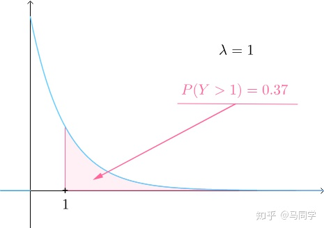

而如果λ 较大的时候，比如λ=3 ，一天卖出三个馒头，那么两个馒头之间的卖出时间间隔Y, 大于1天 的可能性, 就已经变得很小了：

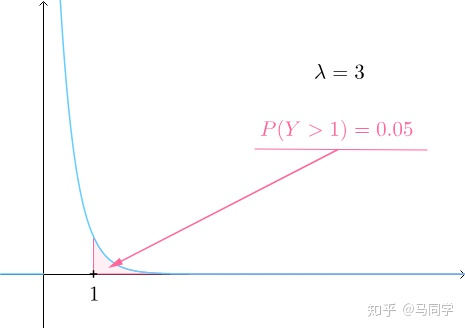

最后总结, 即: +
每日卖出馒头的数目X, 服从"泊松分布", 即 stem:[ X ~ P(λ)] +
卖出馒头的时间间隔Y, 服从:指数分布".  即 stem:[ Y ~ Exp(λ)]. "指数分布"的英文是 Exponential Distribution

它们的期望分别为： +
"泊松分布"的期望 : stem:[ E(X)=λ] +
"指数分布"的期望: stem:[ E(Y)= 1/λ]

*E(X) 的含义是"平均每日卖出的馒头数"，而E(Y) 是"每个馒头之间卖出的平均时间间隔"，所以两者是"倒数"关系：每日卖出的量越多, 自然两个馒头间的间隔时间越短，每日卖出的量越少, 自然间隔时间越长。*

====

类似于泊松分布，指数分布也有一个参数λ。实际上，指数分布与泊松分布密切相关：**如果在某时间段内事件发生的次数, 呈"泊松分布"，那么，事件之间的时间间隔便呈"指数分布"。**

例如, 如果抵达某家银行的客户人数呈"泊松分布"，比如说λ=12人/小时，那么，他们抵达的时间间隔, 则呈"指数分布"，平均值 μ= 1/λ = 1/12，或者说5分钟。

一句话总结： +
泊松分布是: 单位时间内, 独立事件发生次数的概率分布. +
指数分布是 : 独立事件的时间间隔 的概率分布.

请注意是"独立事件"，泊松分布和指数分布的前提是: 事件之间不能有关联。

.标题
====
例如： +
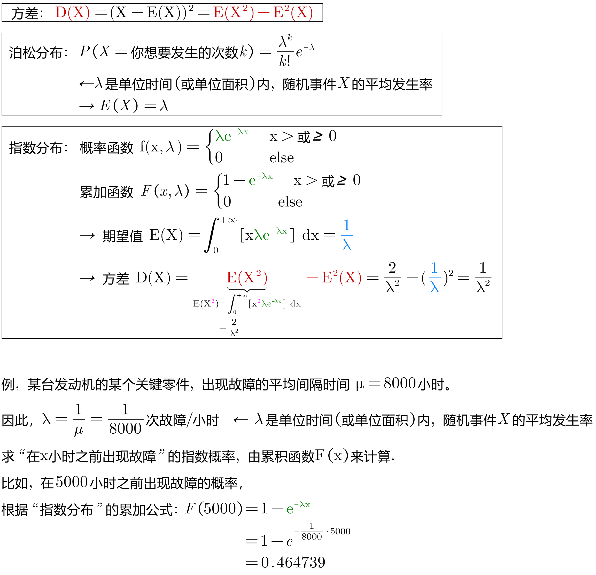

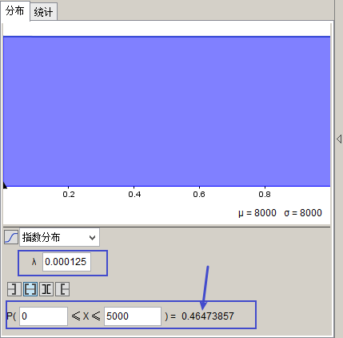

====

*指数分布, 是用来预测"直到下一个事件（即成功，失败，到达等）的等待时间".*

*一小时内到达商店的顾客数量，每年发生的地震数量， 这个是"速率, 或事件率". 即: stem:[ \frac{"事件发生的次数"} {"单位时间"}], 即 参数λ, 用在"泊松分布"中.*

**但当我们对"事件之间的经过时间"来建模时，我们倾向于是用"时间", 而不是用"速率"来表示. 如, 某机器可以正常开机的年数是10年(而不是说每年0.1次故障), 客户每10分钟到达一次. 即: stem:[\frac{"1次事件横跨的时间(即'下一次事件'与'上一次事件'发生的时间间隔)"} {"发生1次事件(即单位数量的事件)"} ], 即 stem:[ 1/λ]. 使用在"指数分布"中的.**

如果您每小时获得3个客户（stem:[ λ=\frac{"客户数量"} {"单位小时"}]），则意味着您每1/3小时获得1个客户（stem:[ 1/λ=\frac{"1个客户横跨1/3小时"} {"来1个客户"}]）。

所以, 对于指数分布来说, X〜Exp(0.25) 中的 0.25 是什么? 这个数字是 "泊松分布中的λ", 即"在单位时间内（一分钟，一小时或一年），该事件平均发生0.25次." 所以 stem:[ 1/λ]就是, stem:[ \frac{"1次事件横跨的时间"} {"发生1次事件(即单位数量的事件)"}=\frac{1"小时"} {0.25"次事件"}=\frac{"横跨4小时"} {"1次事件"}]

总结:

- "指数分布"中的参数λ, 与"泊松过程"（λ）相同.
- 指数分布中, 经常讨论的是 stem:[ 1/λ].
- stem:[ 1/λ]代表的是 "距离下一次事件发生的时间间隔".

*"指数分布"的概率分布, 研究的是"泊松过程"的事件之间的时间间隔。*

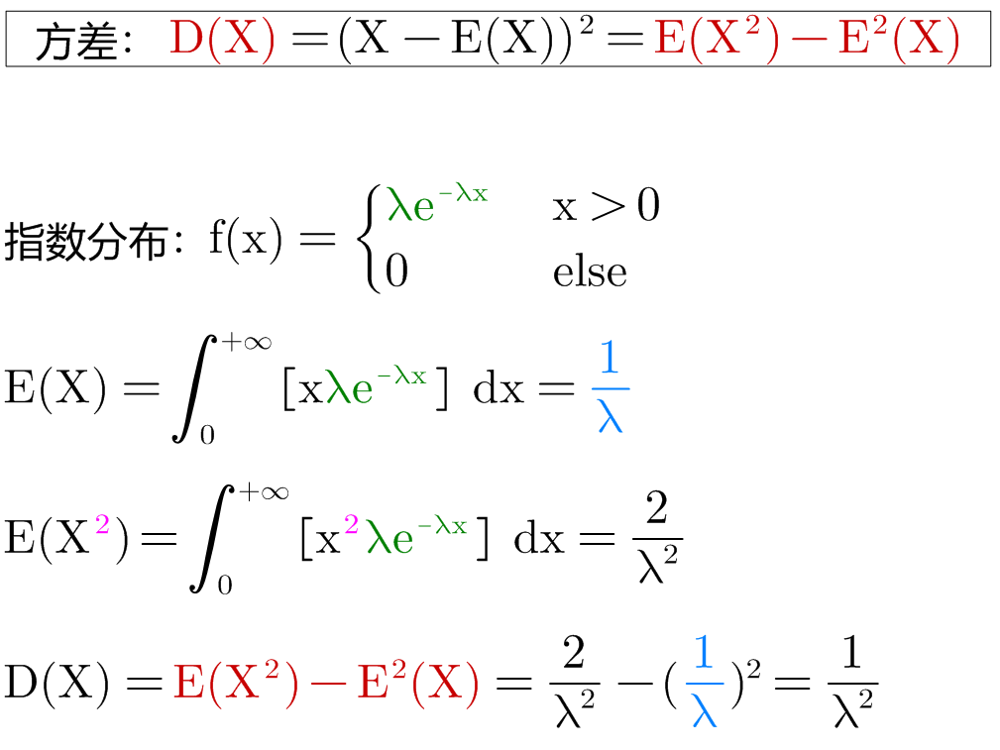

---

== 正态分布 Normal distribution

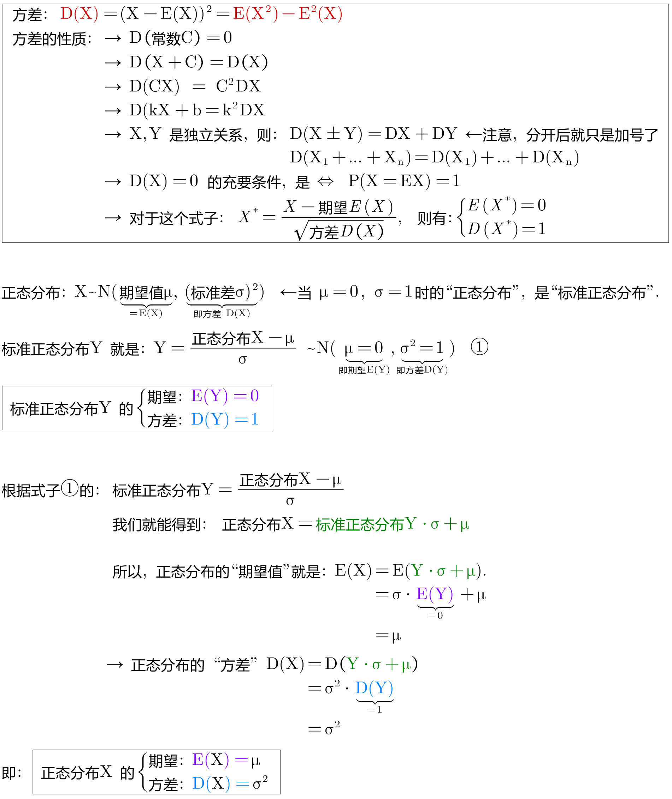

---

