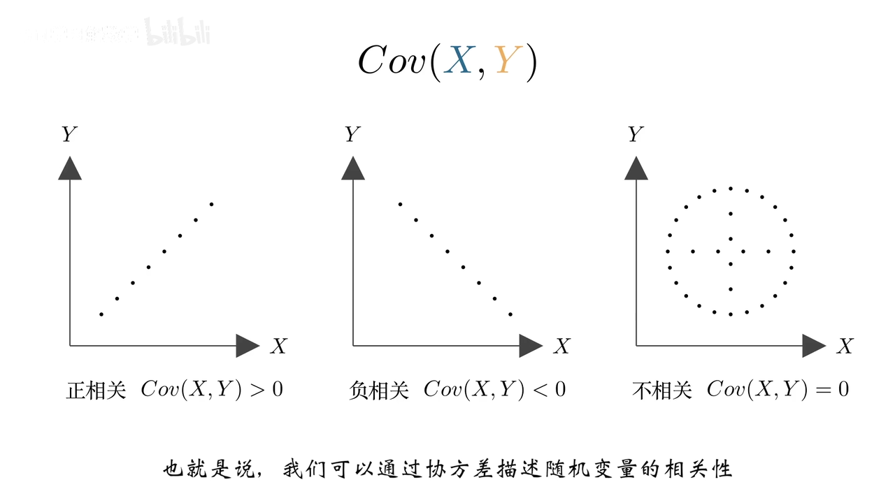
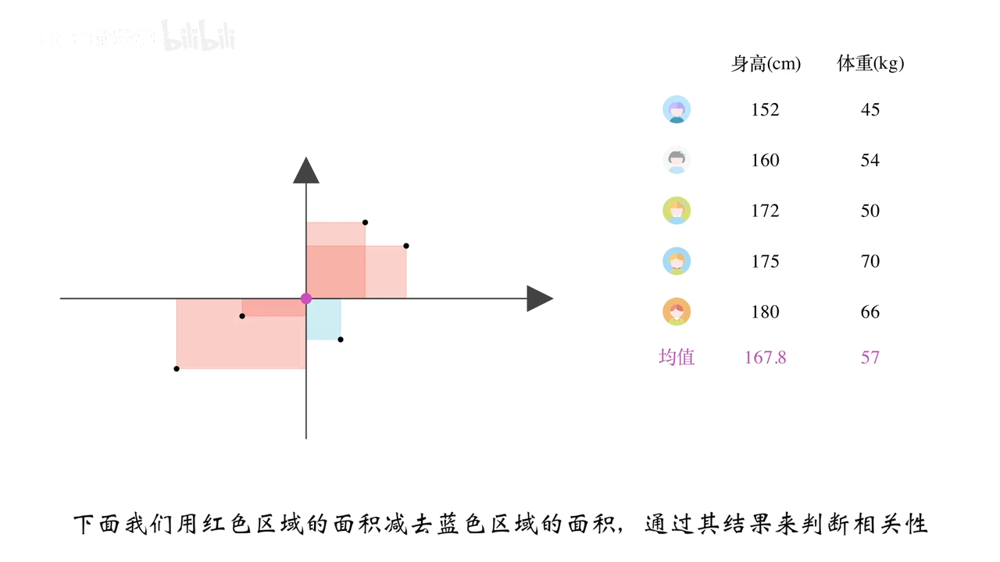
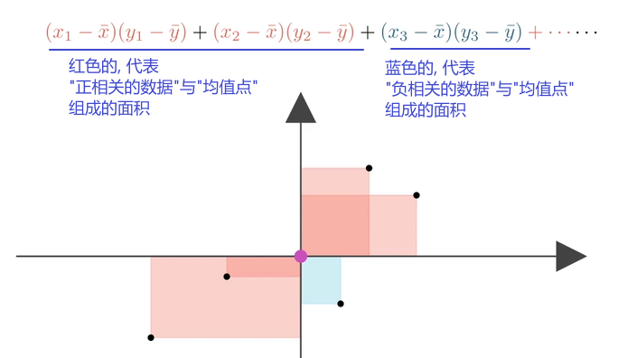
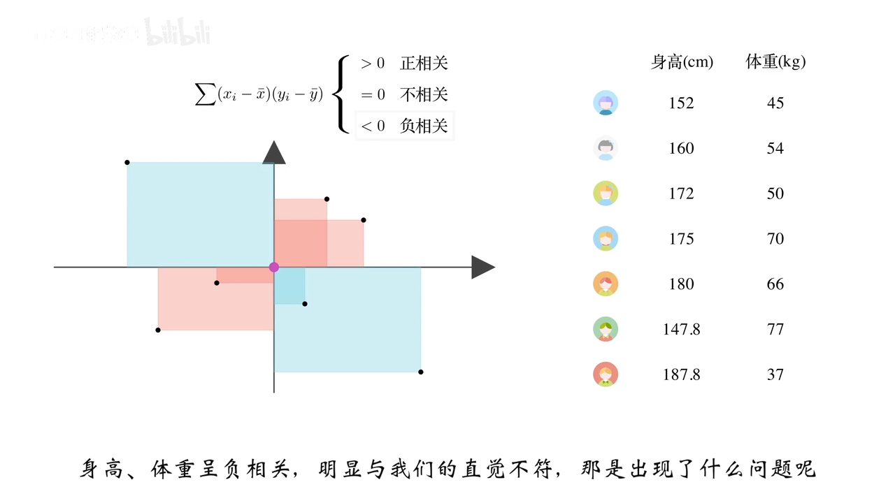
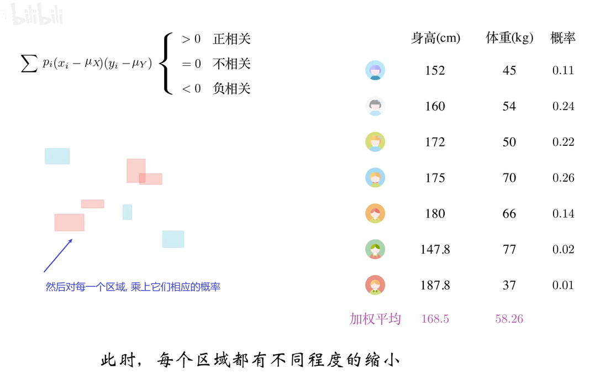
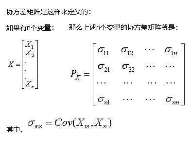
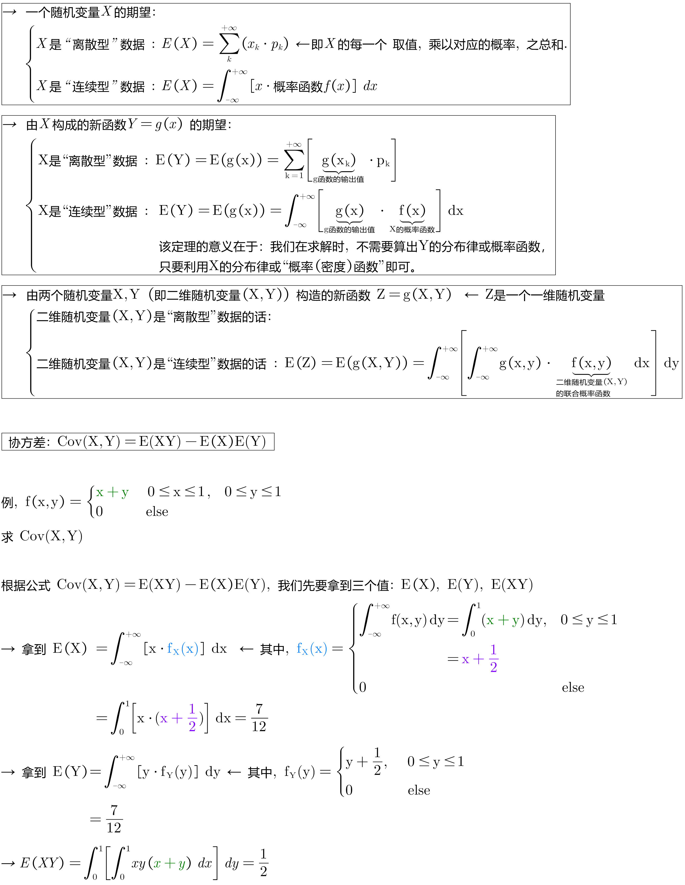
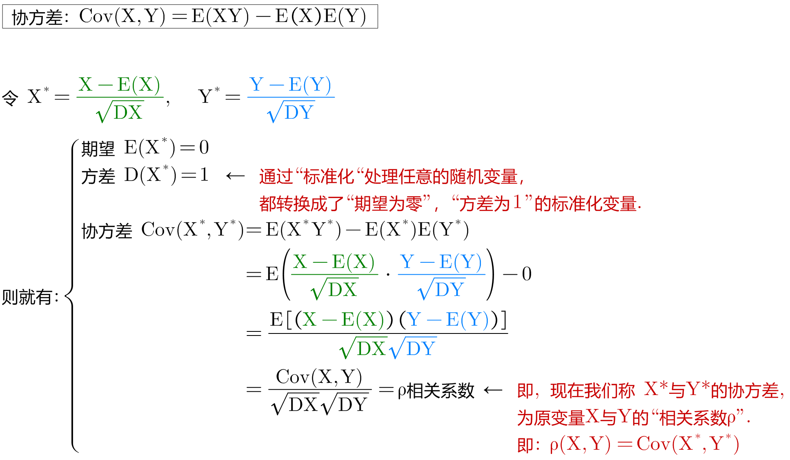
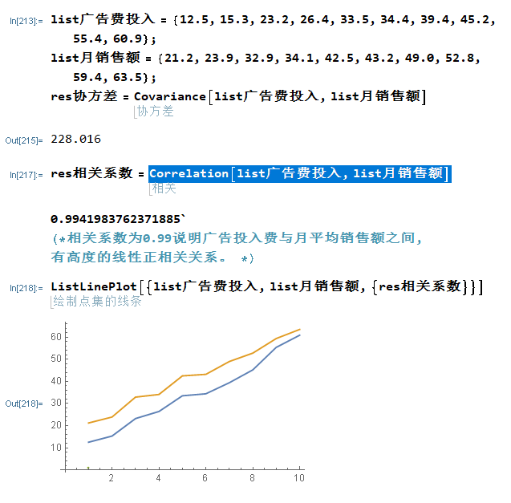

= 协方差 Covariance
:sectnums:
:toclevels: 3
:toc: left

---

== 协方差的几何意义

=== 解释

方差, 是衡量一维变量的波动情况. +
协方差, 是用来描述"二维的, 即两个随机变量"的相关性.

期望值分别为E[X]与E[Y]的两个实随机变量X与Y, 之间的"协方差"Cov(X,Y), 定义为：

协方差Cov(X,Y)的度量单位, 是X的协方差, 乘以Y的协方差。

*从直观上来看，"协方差"表示的是两个变量总体误差的期望。*

如果两个变量的变化趋势一致，也就是说, 如果其中一个(在变动过程中), 大于自身的期望值时, 另外一个(在变动过程中), 也同时大于自身的期望值，那么两个变量之间的"协方差", 就是正值；

如果两个变量的变化趋势相反，即其中一个变量, 在大于自身的期望值时, 另外一个却小于自身的期望值，那么两个变量之间的"协方差", 就是负值。

**如果X与Y是统计独立(相互独立)的，那么二者之间的"协方差"就是0，**因为两个独立的随机变量满足E[XY]=E[X]E[Y]。这就导致它们的协方差公式, 最后一步就=0了.

*但是，反过来并不成立。即如果X与Y的协方差为0，二者并不一定是统计独立的。*

*协方差为 0 的两个随机变量, 称为是"不相关"的。* +

[.small]
[cols="1a,2a"]
|===
|Header 1 |Header 2

|随机变量的相关性, 可分为三种:

1. X,Y 正相关
2. X,Y 负相关
3. X,Y 无相关关系
|

image:img/0357.png[,]

|如果把坐标原点, 移到"均值点"处的位置, 就能很容易知道, 一,三象限是"正相关"的; 二,四象限是"负相关"的.
|

|将"身高,体重表"中, 第一个样本点(第一行上的数据), 用 stem:[ (x_1, y_1)] 表示, 均值用 stem:[ (\overline(x), \overline(y))] 表示.  则, 第一个区域的面积, 就 stem:[= (x_1 - \overline(x)) \cdot  (y_1 - \overline(y)) ]
|image:img/0359.png[,]

|同理, 把其他的面积也加上去
|image:img/0360.png[,]

image:img/0361.png[,]

最终, 我们就是让 所有"正相关的红色区域面积", 减掉 "负相关的蓝色区域面积".

将上面这个式子, 用连加符号 Σ 改写成如下图, 则通过其的结果值, 就能知道 X,Y 两个数据点, 到底是何种相关关系了 : +

\begin{align*}
\sum_{}^{}{\left( x_i-\overline{x} \right)}\left( y_i-\overline{y} \right) =\left\{ \begin{array}{l}
	>0\ \text{正相关}\\
	=0\ \text{不相关}\\
	<0\ \text{负相关}\\
\end{array} \right.
\end{align*}

image:img/0364.png[,]

|不过, 上面的还不是"协方差"
|我们再加入两个样本点, 此时, 蓝色总面积, 大于红色总面积, 得出的结论是变成了"负相关"?

image:img/0366.png[,]

原因是, 新加入的两个样本点, 在现实中, 出现的概率极低. +
所以, 我们还需考虑概率问题, 即必须对每个样本点, 加入"权重分". 来重新得到"加权平均数".

然后将坐标原点, 移动到"加权平均值"的位置.  +
同时, 连加公式里的"均值", 也要替换成"加权平均值".

\begin{align*}
\sum_{}^{}{\left( x_i-\overline{x} \right)}\left( y_i-\overline{y} \right) =\left\{ \begin{array}{l}
	>0\ \text{正相关}\\
	=0\ \text{不相关}\\
	<0\ \text{负相关}\\
\end{array} \right.
\end{align*}

image:img/0369.png[,]

所以, 通过下面这个式子, 我们就能判断出随机变量的"相关性"了. +
stem:[ \sum p_i (x_i - μ_X) (y_i - μ_Y)]

这个式子, 可以改写为"期望"的形式, 就是: +
stem:[ E((X-μ_X)(Y-μ_Y)) = Cov(X,Y) ]  ← 这就是"协方差"公式. 里面的 stem:[μ_X = E(X)], 即X的期望. 同样,  stem:[μ_Y = E(Y)]
|===

---

== 协方差 Covariance : stem:[ Cov(X,Y)= E(XY)-E(X) \cdot E(Y)]

....
Covariance  /koˈve-rɪəns/

N a measure of the association between two random variables, equal to the expected value of the product of the deviations from the mean of the two variables, and estimated by the sum of products of deviations from the sample mean for associated values of the two variables, divided by the number of sample points. Written as Cov (X, Y) 协方差
....

"方差"和"标准差", 是用来度量数据的离散程度的. 但它们只能用来描述一维数据的（或者说是多维数据的一个维度）. 而现实中, 我们常常会碰到多维数据，因此人们发明了"协方差"（covariance），用来度量两个随机变量之间的关系。

"协方差"如果为正值，说明两个变量的变化趋势一致； +
如果为负值， 说明两个变量的变化趋势相反； +
如果为0，则两个变量之间"不相关"（注意：协方差为0不代表这两个变量相互独立。 "不相关"指的是两个随机变量之间没有近似的线性关系; 而"独立"是指两个变量之间没有任何关系）。

但是"协方差"也只能处理二维关系，如果有n个变量X1、X2、···Xn，那怎么表示这些变量之间的关系呢？解决办法就是把它们两两之间的协方差, 组成"协方差矩阵"（covariance matrix）。

回到协方差, 它的定义是: stem:[ Cov(X,Y)=E\[ (X-EX)(Y-EY)\]=E(XY) - E(X) \cdot E(Y)]

.标题
====
例如： +
image:img/0355.png[,]
====

.标题
====
例如： +

====

---

== 协方差的性质

=== stem:[Cov(X,Y) = Col(Y,X)]

=== stem:[ Cov(aX, bY) = ab \cdot Cov(X,Y)]

=== stem:[Cov(X_1 + X_2, Y) = Cov(X_1, Y) + Cov(X_2, Y)]

=== stem:[ Cov("常数"C, X)=0]

=== 若X,Y是独立关系, 则 stem:[ Cov(X,Y)=0]

---

== 标准化后, 得到"相关系数"

*"协方差"作为描述X和Y相关程度的量，在同一物理量纲之下有一定的作用，但同样的两个量采用不同的量纲, 使它们的协方差在数值上表现出很大的差异。为此就需要引入如下概念 -- 相关系数.*

定义
\begin{align*}
\rho _{XY}=\frac{Cov\left( X,Y \right)}{\sqrt[]{D\left( X \right)}\sqrt[]{D\left( Y \right)}}
\end{align*}

称为随机变量 X 和 Y 的(Pearson)"相关系数"。

若 stem:[ ρ_{XY}=0]，则称X与Y "不线性相关"。
即 stem:[ ρ_{XY}=0] 的 充分必要条件是 Cov(X, Y)=0，*亦即"不相关"和"协方差为零"是等价的。*

协方差的取值, 受两个变量各自的"量纲"影响，数字的意义并不明显. 所以我们要先对"协方差"进行无量纲化的修正 -- 采用的方法, 就是对变量进行"标准化"处理.

"标准化"处理, 就是对原随机变量X, 减去其期望E(X), 再除上其方差的根号 stem:[ \sqrt{D(X)}].

*"标准化"的目的, 就是消除"量纲"上的差异。*

从"相关系数"的公式可知: 相关系数, 是用X、Y的协方差, 除以X的标准差和Y的标准差之积。 所以，*"相关系数"也可以看成是一种剔除了两个变量量纲影响、标准化后的特殊"协方差"。*

*注意: "相关系数"全称应该叫"线性相关系数"，它只能反映出"线性关系"。*

由于研究对象的不同，"相关系数 Correlation coefficient "有多种定义方式，较为常用的是皮尔逊相关系数。换言之, 皮尔逊相关系数并不是唯一的相关系数，但是最常见的相关系数.

.标题
====
例如：

====

**"相关系数"**是统计学中使用的一种数值，**用于描述两个变量间的线性关系。** 相关系数是对X与Y之间联动关系的一种测度，即测量X与Y的同步性。*注意: 该"相关关系"并不意味着"因果关系".*

"相关系数"的值, 永远介于1和-1之间。

[.small]
[options="autowidth"]
|===
|Header 1 |Header 2

|相关系数=1
|*意味着两个变量"完全正相关"。也就是说，一个变量会随着另一个变量的增加而增加（减少而减少）。这种关系是完全"线性"的*—— 无论变量取值多大或多小，两个变量之间的关系都一样。

*两个变量的相关系数越大(正相关)*，它们在一系列数据点范围内的取值, 所呈现出的趋势, 就越相近（**换句话说，两个变量的曲线距离彼此较近, 走势相同, **如两只蝴蝶双飞双舞）。

|相关系数=-1
|*意味着两个变量"完全负相关"。一个变量的增加, 会导致另一个变量减小，反之亦然。* 这个关系也是"线性"的。两个变量分离的比率, 不随时间变化。

一个油井，总共能钻出一万桶油。x等于已经钻出的桶数，y等于还在油井里的桶数，那么只要x增加，y就减小。只要x增加，y就以相同的速率减少。这个关系是线性的——每钻出一桶油就意味着地下的油少了一桶。因此我们说x和y完全负相关，也就是说相关系数为-1。

|相关系数=0
|*说明这两个变量不相关。换句话说，我们不会预测一个变量增加或减少, 将导致另一个变量的增加或减少。两个变量间没有线性关系，但仍然可能存在"非线性关系"。*
|===

---

