= t分布
:toc: left
:toclevels: 3
:sectnums:

---

== t分布 t-distribution

=== 解释1

对两个样本"均值"差异, 进行"显著性测试":

[.small]
[options="autowidth" cols="1a,1a"]
|===
|Header 1 |Header 2

|在样本数量大（超过120等）时，可以应用Z检定.
|但**Z检定用在小的样本上时, 会产生很大的误差. 因此样本很小的情况下, 得改用学生t检定。**

|t检定
|*t检定, 改进了Z检定（en:Z-test），不论样本数量大或小皆可应用。*

**学生t-分布（Student's t-distribution）, 经常应用在对呈"正态分布"的总体的"均值"进行估计。**

**t-分布（t-distribution）, 用于根据小样本, 来估计"呈正态分布"且"方差未知"的总体的"均值"。** 如果"总体方差σ^2 "已知（例如在样本数量足够多时），则应该用"正态分布"来估计"总体均值μ"。

当母群体的"标准差σ"是未知的, 但却又需要估计时，我们可以运用学生t-分布。

"t分布"曲线形态, 与n（确切地说与自由度df）大小有关。 +
与"标准正态分布"曲线相比:

- 自由度 df 越小，"t分布曲线"愈平坦，曲线中间愈低，曲线双侧尾部翘得愈高.
- 自由度 df 愈大，"t分布曲线"愈接近"正态分布曲线".
- 当自由度 df=∞ 时，"t分布曲线"为"标准正态分布曲线".

*由于在实际工作中，往往"总体标准差σ"是未知的，常用"样本标准差s"作为σ的估计值，为了与"u变换"区别，称为"t变换". 统计量t 值的分布, 称为"t分布"。*

关于"u分布" : 正态分布有两个参数: "均值μ"和"标准差σ"，决定了"正态分布"的位置和形态。 为了应用方便，常将一般的正态随机变量X, 通过"u变换", 即 stem:[(X-μ)/σ]转化成"标准正态随机变量u"，以使原来各种形态的正态分布, 都转换为 μ=0，σ=1 的"标准正态分布"（standard normal distribution）,亦称"u分布"。

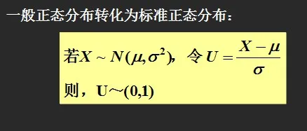

|变异数分析
|在数据有三组以上时，因为误差无法压低，此时可以用"变异数分析"代替"学生t检定"。
|===

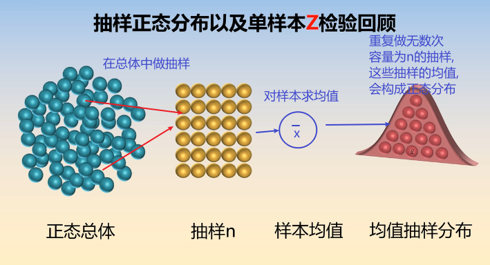
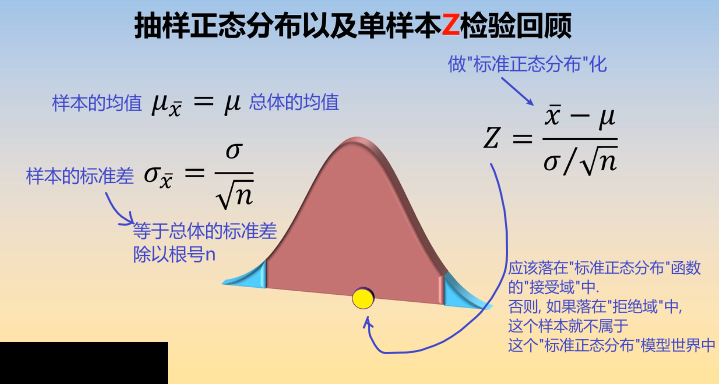

但是, 如果在做"标准化"的过程中, 总体的"标准差σ"是未知的呢?

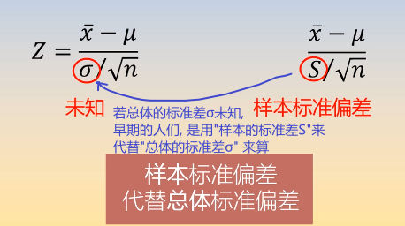

*但是, 用"样本的标准差S", 来代替"总体的标准差σ", 来计算的话, 是否合适呢? +
其实, 代替后, Z公式, 其实就不是"标准正态分布"了, 而是属于另一种分布 -- 即 "t分布".*

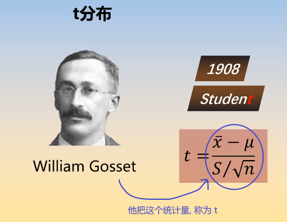
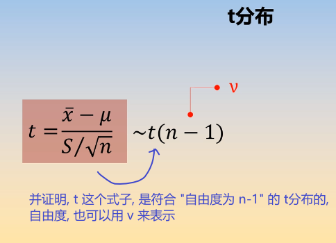

事实上:

- "t分布", 不是"正态分布".
- t统计量的公式, 只是类似于"Z值"而已.
- 自由度v, 是"t分布"的唯一的参数.
- "t分布"的均值=0, 因此t分布的图像, 也是左右对称的.
- t分布的图像, 比"标准正态分布Z"的图像, 更宽, 更扁.

比较一下"标准正态分布"曲线, 与"t分布"曲线的差别:  +
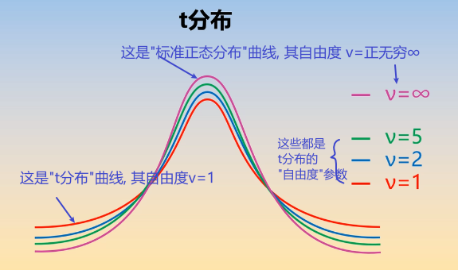
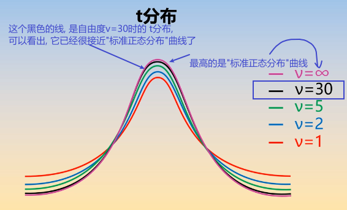

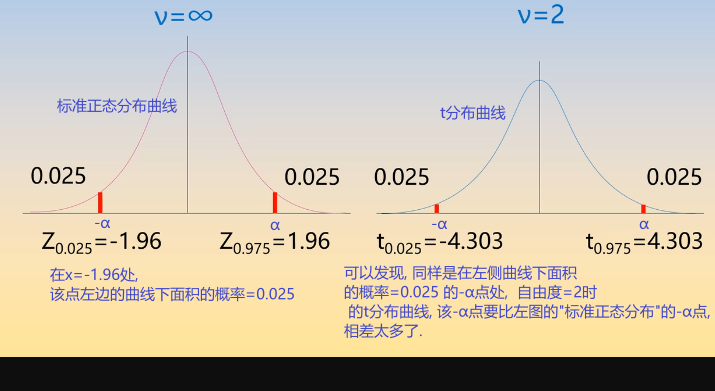
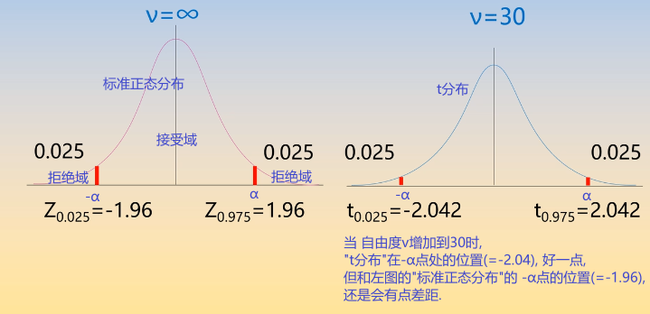

虽然, 当自由度v>30时, "t分布" 就很接近"标准正态分布"曲线了, 但我们依然没必要用"标准正态分布"来代替"t分布"来做计算, 因为我们是用电脑来帮我们算的. 你直接用"t分布"就行了.

---

=== 解释2

学生t-分布, 可简称为t分布。

T分布的特征:

- 曲线下面总面积为1
- 曲线以0为对称中心，比正态分布更加扁平
- 曲线向左右方向无限延伸，但没有碰到x轴
- 自由度, 简单理解为 : *T分布的自由度 =样本容量-1*
- 自由度增加时（样本增加），T分布接近正态分布, T分布拥有更大标准差。 +
如果样本数量大于30，数据分布近似"正态分布"； +
如果样本量小于30，数据分布呈"T分布".

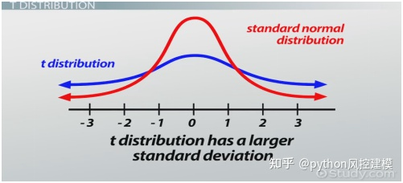

T分布在医药领域有广泛用途，因为临床实验有0-4期，花费高. 如果样本量小于30时，我们可以采用"T分布"来分析, 以节省开支。

---

== 单样本的 "t 均值"检验

.标题
====
例如： +
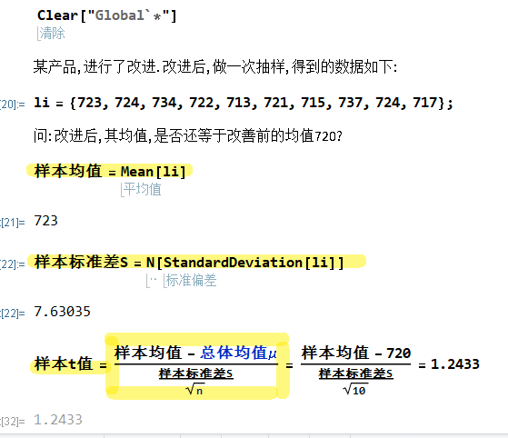

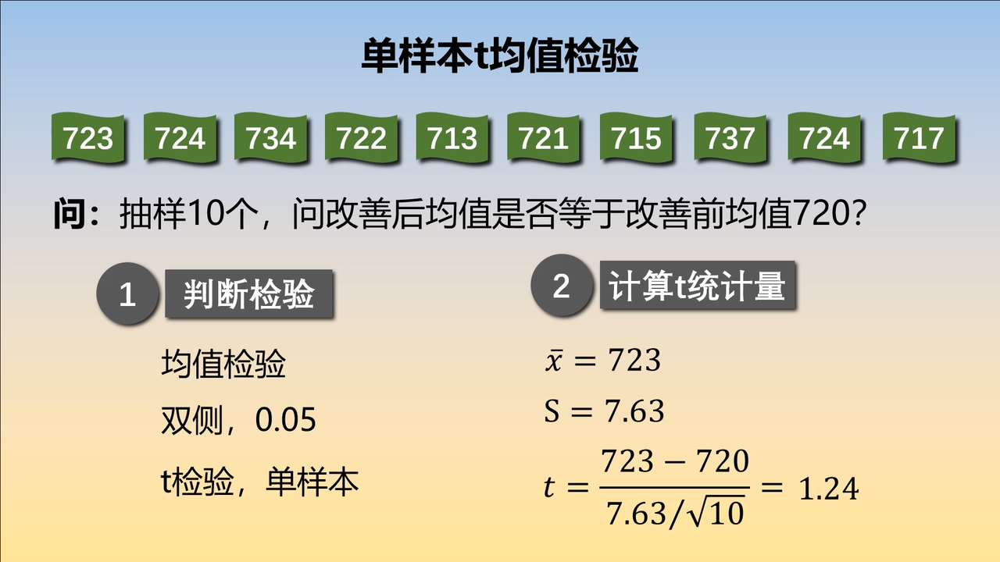

如下图, 因为t分布的式子, 是对应于 自由度 n-1 的. 所以本例, 样本抽取了10个数据, 其t分布对应的 "自由度参数v", 就 stem:[ = n-1 = 10-1 =9].

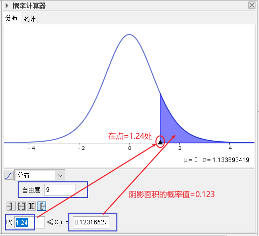

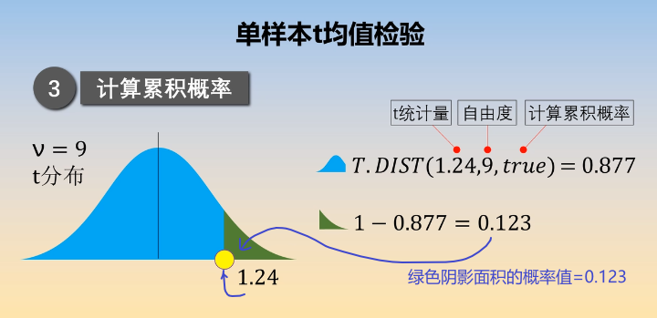

下面, 再求出 p值, p值就是"拒绝域"的总概率值. 因为单边的"拒绝域"概率论值是 0.123, 那么双边的"拒绝域"概率值 stem:[ =2 * 0.123 = 0.246]. 显然, 0.246 > 0.05, 说明改进后的10个样本的均值, 处在 "改进前"的t分布的"接受域"(即中间95%的面积)中. 依然处在"改进前"的t分布模型世界中. 即看不出改进的效果.
====

---

== 定理:

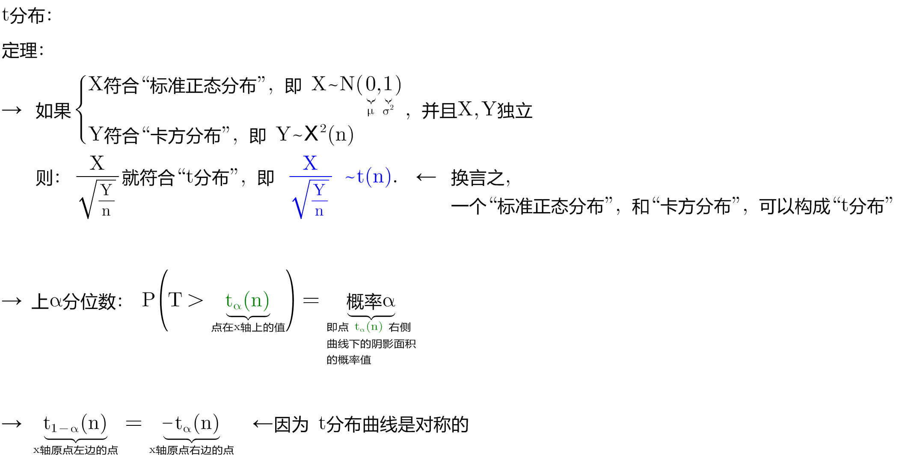

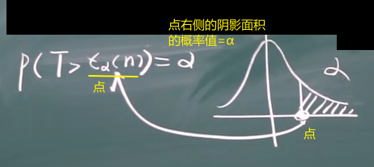
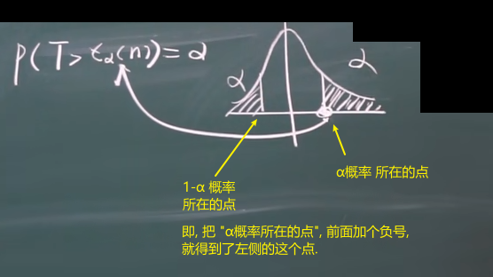

.标题
====
例如： +
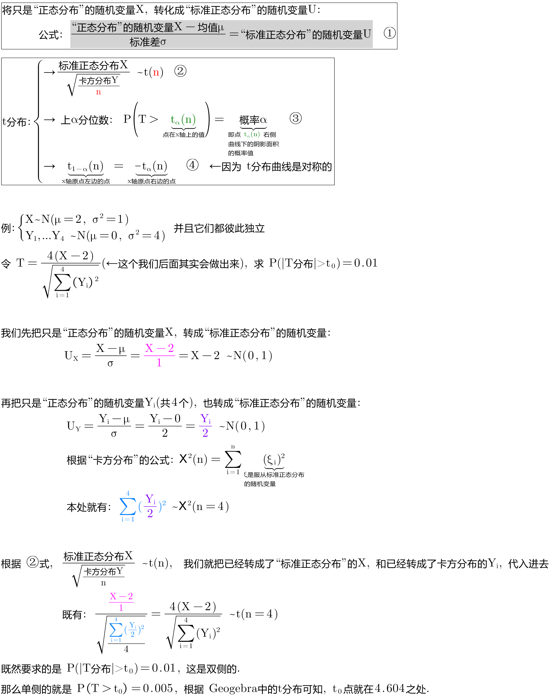

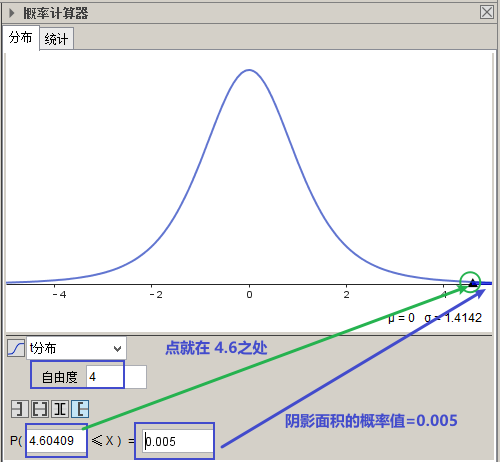
====

---

