= F分布
:sectnums:
:toclevels: 3
:toc: left

---

== F分布 F-distribution

image:img/221114_040.png[,45%]
image:img/221114_041.png[,35%]

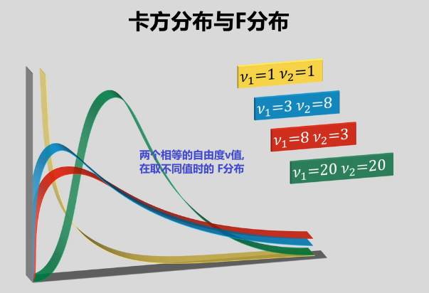

所以, 两个独立"卡方分布"的随机变量, 各自除以其自由度v后, 它们的比值, 就是F分布. 即: "F分布是"两个"卡方分布"除以其"自由度"之后的比值.

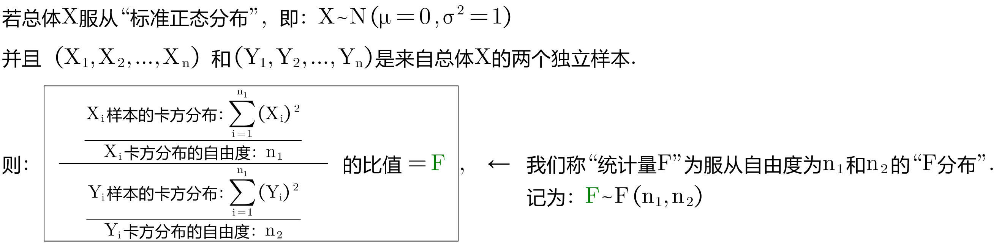

image:img/221114_044.png[,]

- F分布, 是一种非对称分布. 它是右偏的.
- 它有两个自由度，且位置不可互换。两个自由度, 决定了F分布的形状.
- 两个自由度越大时, "F分布"的形状, 越接近于"正态分布".

F分布的 PDF 概率(密度)函数如下. 可以看出, 该函数只与两个自由度v1, v2有关.

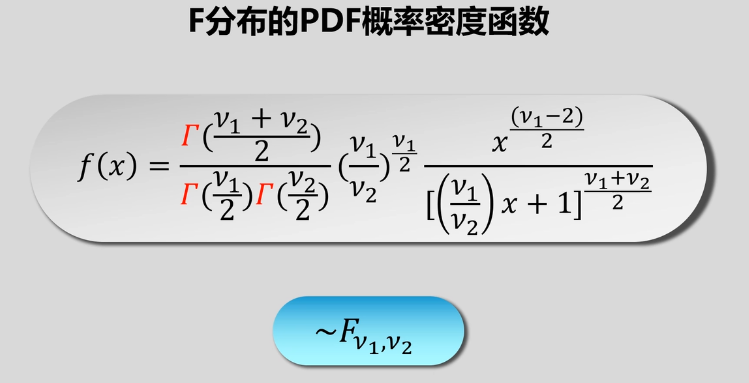

F分布有什么用呢? 主要用在两个目的上: +
1.双样本方差检验 +
2.离差"均方和"的检验

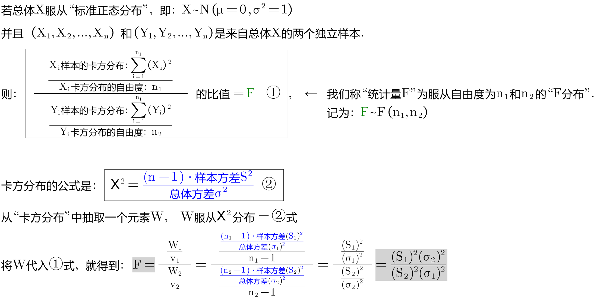

F分布, 有两个参数. stem:[ F(n_1, n_2)]

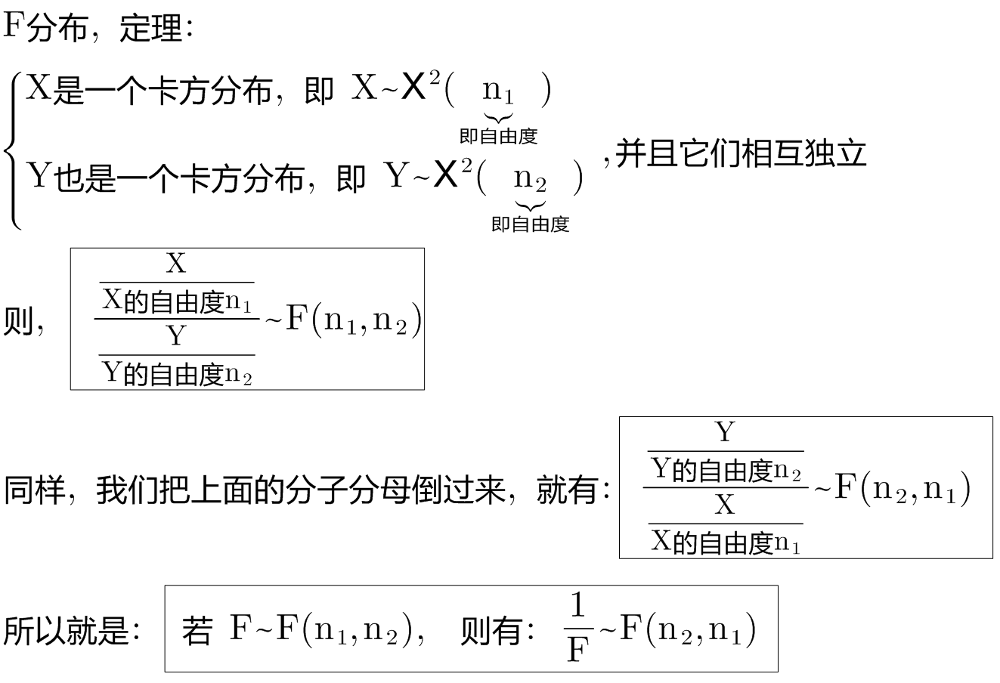

.标题
====
例如： +
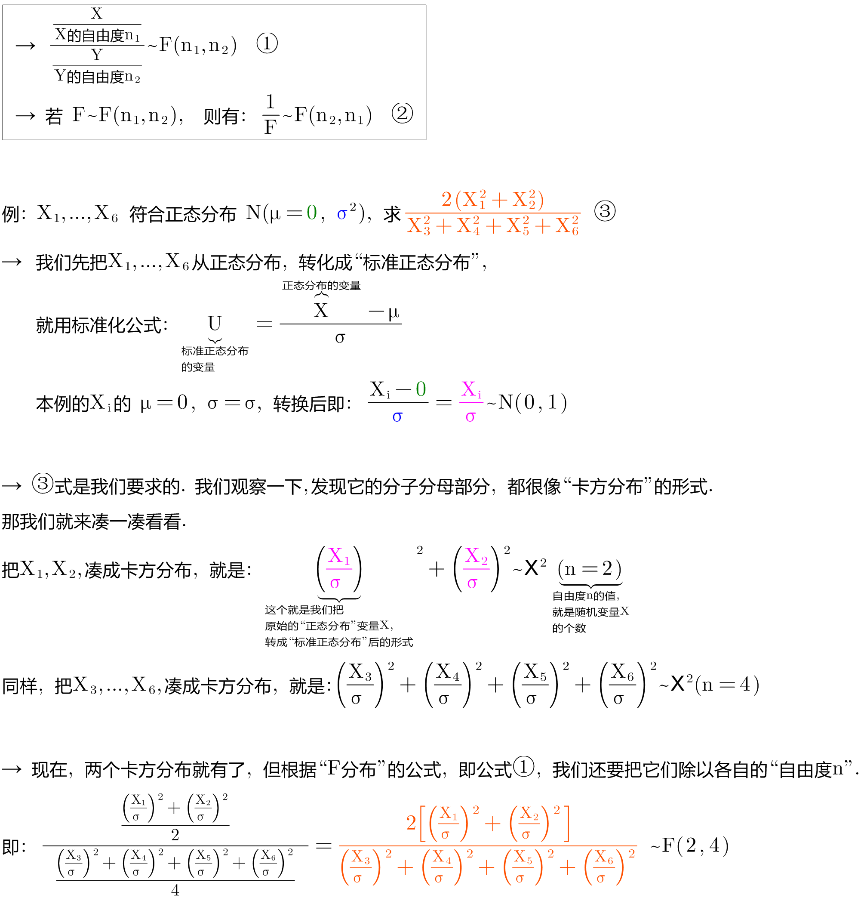
====

---

== F分布的"上, 下分位数"

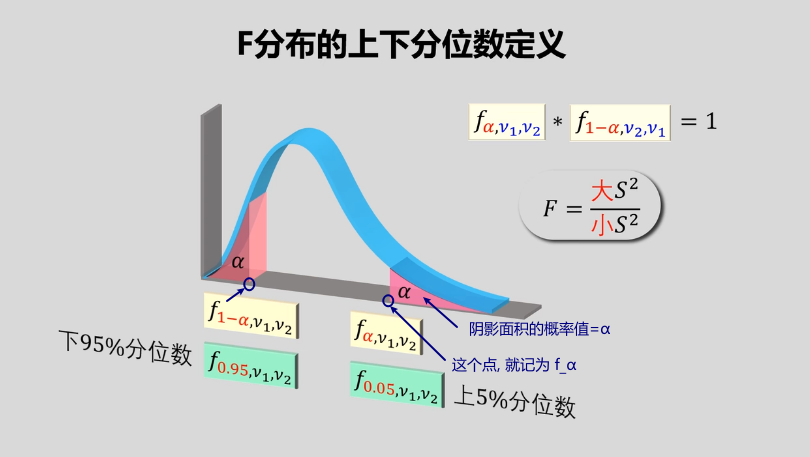
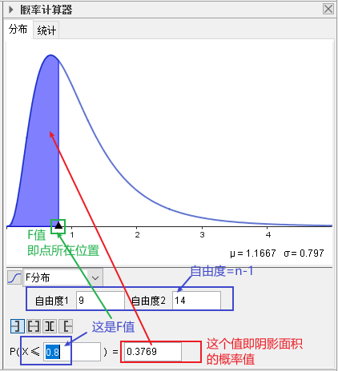

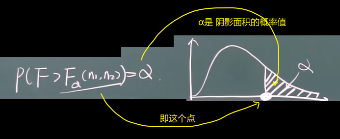
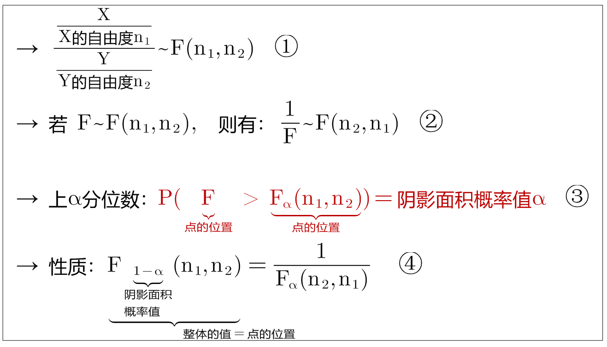

.标题
====
例如： +
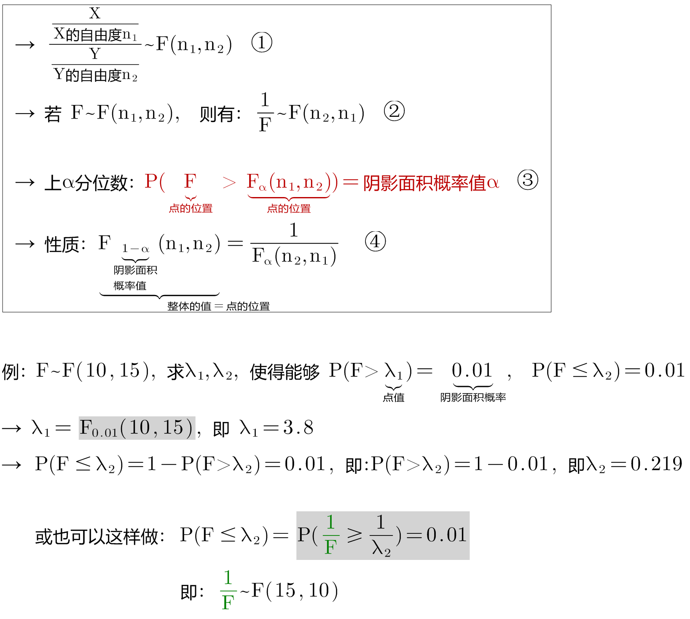

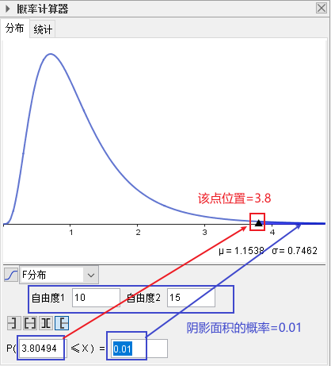
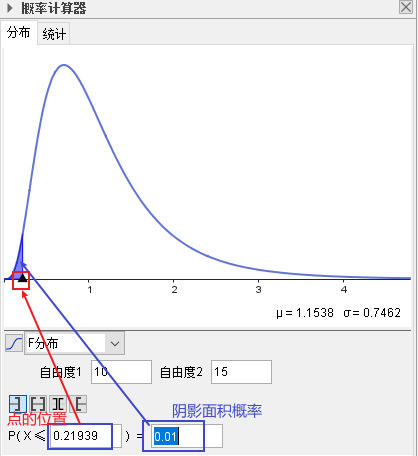
====

---

== 双样本方差 F检验

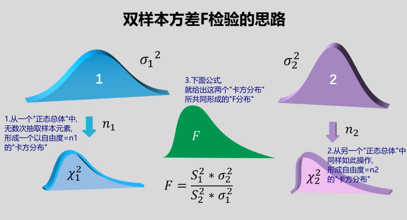
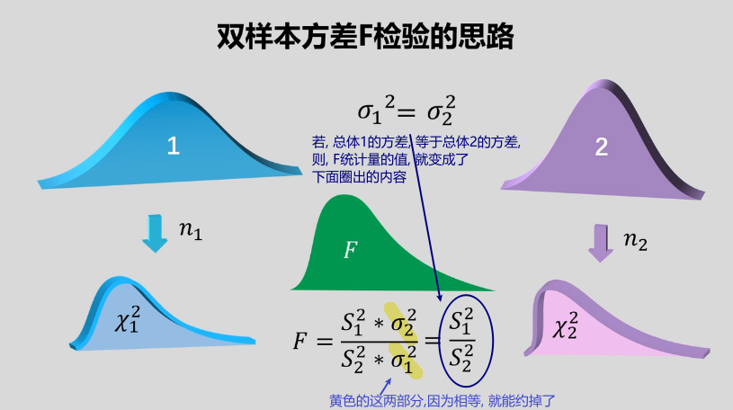

---

