= 极大似然估计法
:sectnums:
:toclevels: 3
:toc: left

---

在统计领域，有两种对立的思想学派："贝叶斯学派"和"经典学派"（也称"频率学派"）. 他们之间最重要的区别就是: 如何看待被估计的"未知参数": +
-> 贝叶斯学派的观点是: 将其看成是已知分布的"随机变量". +
-> 而经典学派的观点是: 将其看成未知的待估计的"常量".

比如, 我们要通过一个物理试验, 来测量某个粒子的质量. +
-> 从经典学派的观点来看，虽然粒子的质量未知，但他本质上是一个确定的常数，不能将其看成是一个随机变量。 +
-> 而贝叶斯学派则截然不同，会将待估计的粒子质量, 看做是一个随机变量. 并利用人们对该粒子的已有的认知, 给它一个"先验分布"，按照分布的概率模型，使其集中在某个指定的范围中。

---

== 极大似然估计法 maximum likelihood estimation method

.标题
====
例如： +

有两个盒子，一号盒子里面有100个球，其中99个是白球，1个是黑球; 二号盒子里面也有100个球，其中99个是黑球，1个是白球。 +
现在我告诉你，我从其中某一个盒子中随机摸出来一个球，这个球是白球，那么你说，我更有可能是从哪个盒子里摸出的这个球? +
显然，你会说是一号盒子。道理很简单，因为一号盒子当中，摸出白球的概率是0.99，而二号盒子摸出白球的概率是0.01。显然更有可能是—号盒子了。

第二个, 丢硬币的例子。 +
我有三个不均匀的硬币，其中 :  +

- 第一个硬币抛出正面的概率是 2/5，
- 第二个硬币抛出正面的概率是 1/2，
- 第三个硬币抛出正面的概率是 3/5.

这时我取其中一个硬币，抛了20次，其中正面向上的次数是13次，请问我最有可能是拿的哪—个硬币?

思考的过程也很简单: +
三枚硬币，抛掷20次，13次正面向上的概率分别是:

- 第1枚 : latexmath:[ C_{20}^{13}\underset{\text{出现正面概率}}{\underbrace{\left( \frac{2}{5} \right) }}^{13}\underset{\text{出现反面概率}}{\underbrace{\left( 1-\frac{2}{5} \right) }}_{}^{20-13}=0.0145]
- 第2枚 : latexmath:[ C_{20}^{13}\left( \frac{1}{2} \right) ^{13}\left( 1-\frac{1}{2} \right) ^{20-13}=0.0739288]
- 第3枚 : latexmath:[  C_{20}^{13}\left( \frac{3}{5} \right) ^{13}\left( 1-\frac{3}{5} \right) ^{20-13}=0.165882]

第三枚硬币抛掷出这种结果的概率最大，我更有可能拿的第三枚硬币? 这种直观的认识是正确的, 这种思维方式的背后, 正是我们要介绍的"极大似然估计法"， 它就是这么的简单粗暴而有效。
====

有了这个例子，我们就能开始介绍"极大似然估计方法"。

首先看"离散型"的情形，*随机变量 X 的概率分布已知，但是这个分布的参数, 是未知的，需要我们去估计，我们把它记作是 θ.* 好比上面抛掷硬币的试验中，硬币正面朝上的概率是未知的，需要我们去估计，那么此时 θ 就代表了这个"待估计的"正面向上的概率值。

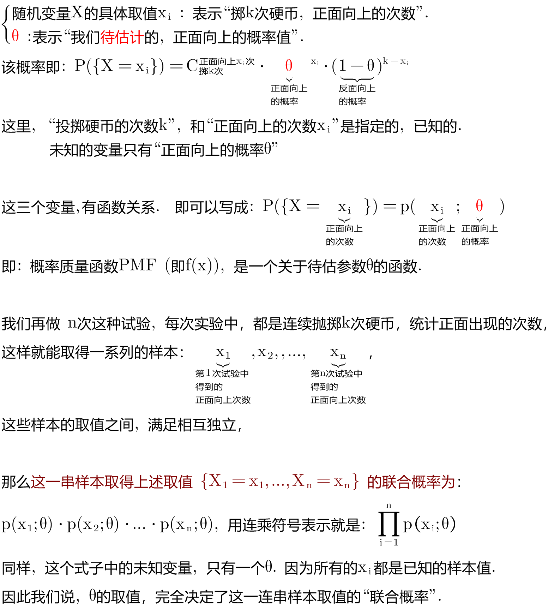

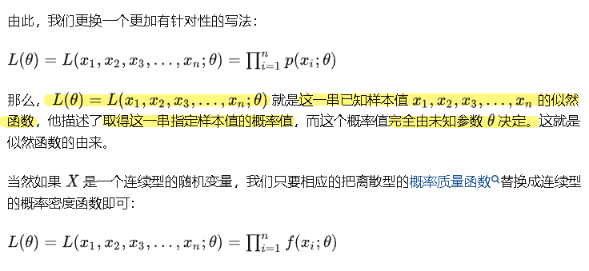

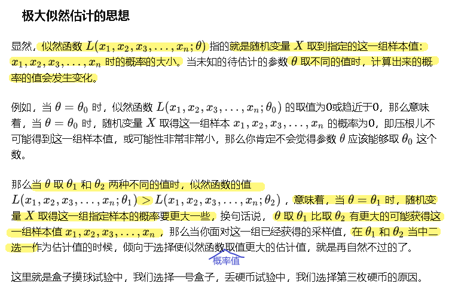

换言之, *我们要取到"能令 stem:[ L(x_1,...,x_n; θ)] 的输出值(其输出值是个概率值)最大" 的那个θ值.* 这个θ值, 能令我们最可能得到"多次试验中所得到的 stem:[ x_i]的实际观测值".

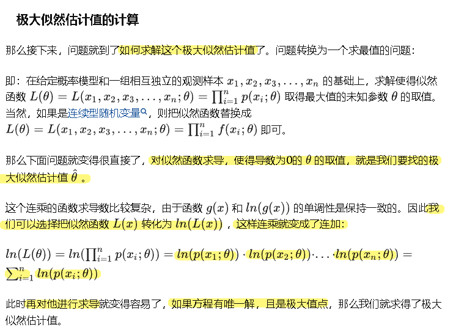

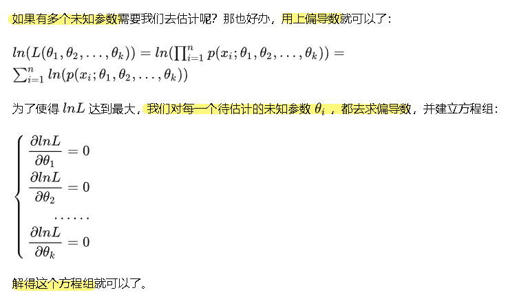

.标题
====
例如： +
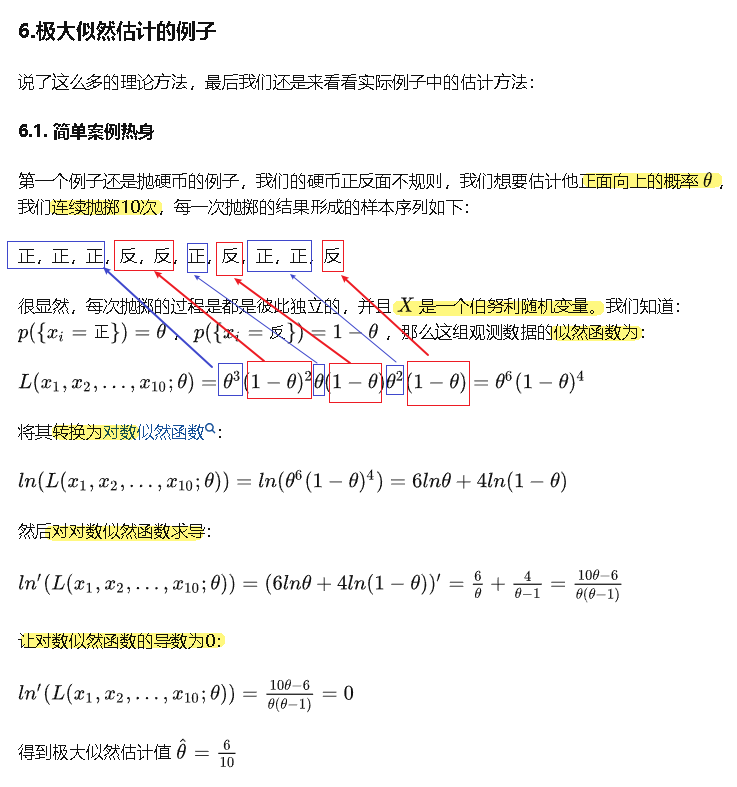
====

.标题
====
例如： +
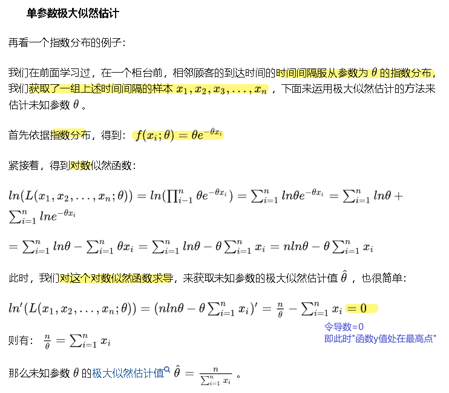
====

.标题
====
例如： +
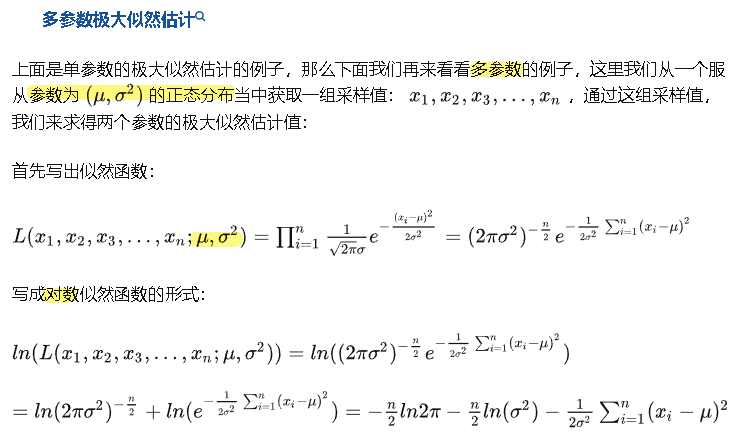

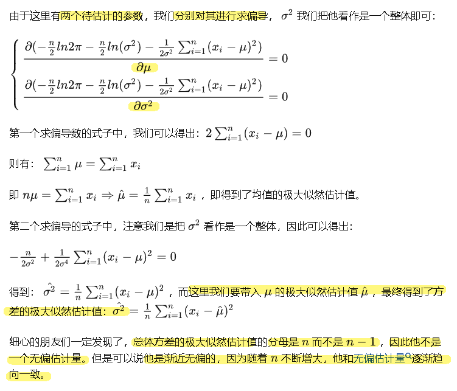
====

---

它是建立在"极大似然原理"的基础上的一个统计方法.

"极大似然原理"的直观想法是：一个随机试验如有若干个可能的结果A，B，C，…。若在一次试验中，结果A出现，则一般认为试验条件对A出现有利，也即A出现的概率很大。 **即: 概率大的事件, 比概率小的事件, 更容易发生. 我们就拿样本中"使事件A发生的概率, 最大的那个参数值", 来作为总体中的该参数的估计值.**

最大似然估计，只是一种概率论在统计学的应用，它是参数估计的方法之一。说的是: 已知某个随机样本满足某种概率分布，但是其中具体的参数不清楚，"参数估计"就是通过若干次试验，观察其结果，利用结果推出参数的大概值。

*"最大似然估计"是建立在这样的思想上：已知某个参数能使这个样本出现的概率最大，我们当然不会再去选择其他小概率的样本，所以干脆就把这个参数, 作为估计的真实值。*

.标题
====
例如： +
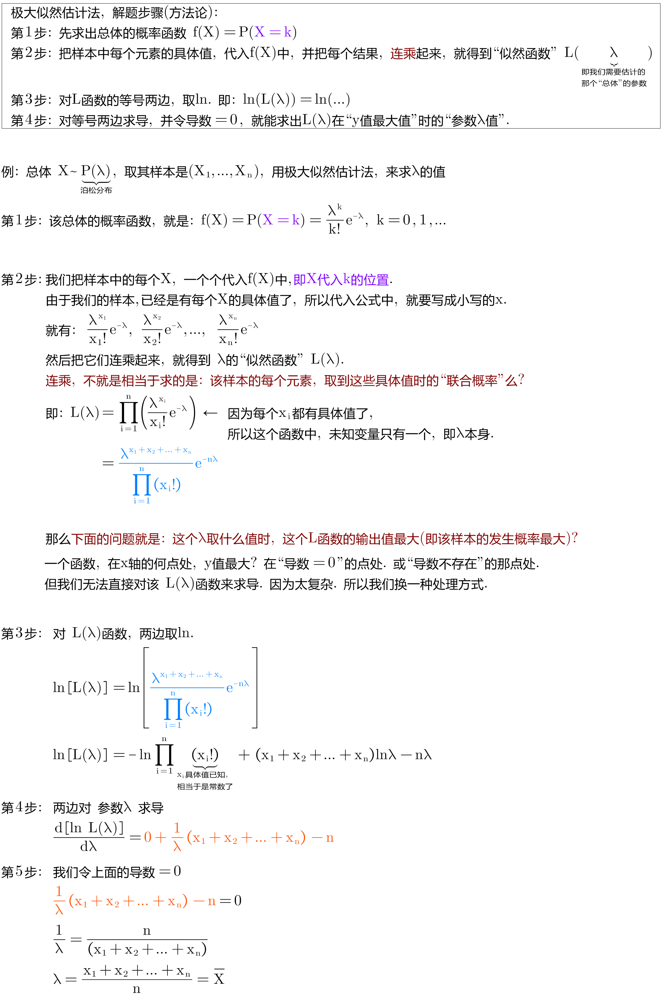
====

.标题
====
例如： +
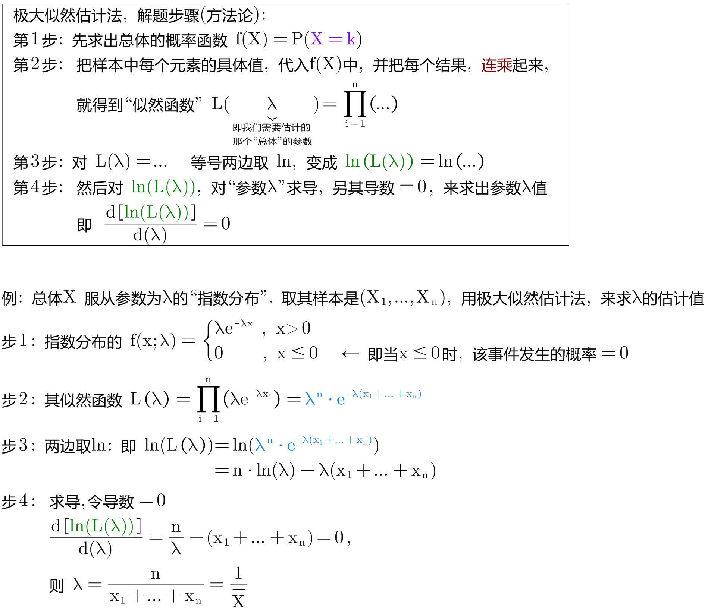
====

.标题
====
例如： +
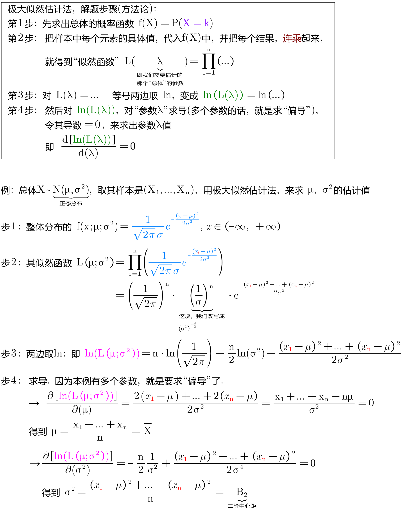
====

.标题
====
例如： +
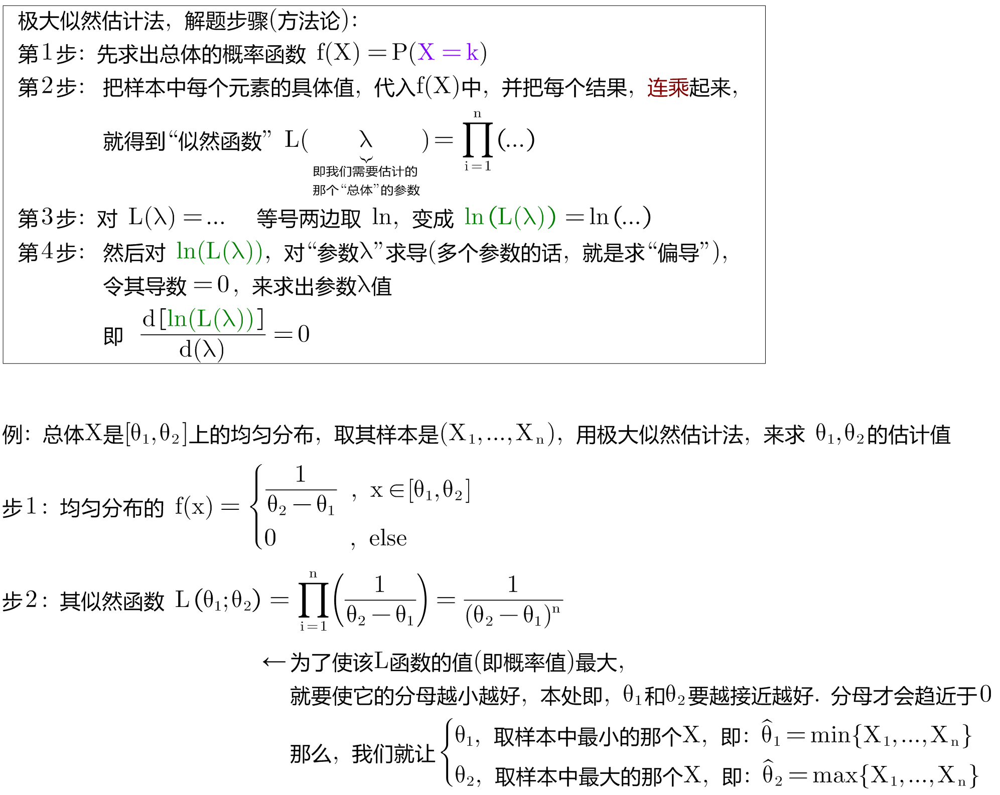
====

---

