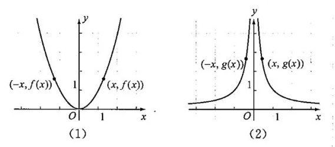
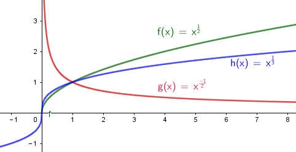
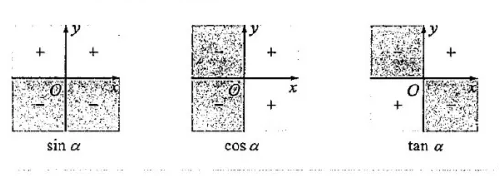
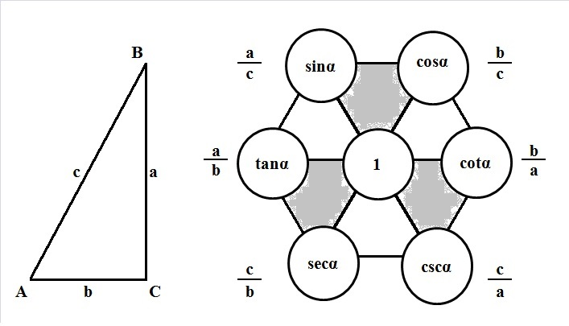
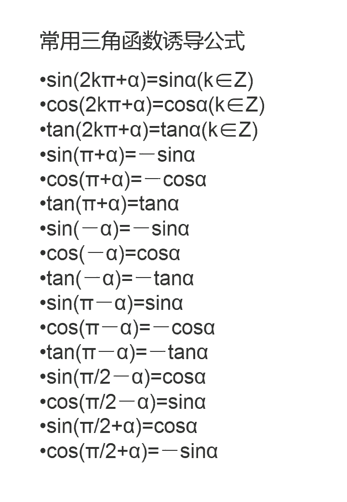

= 公式集
:toc:

---

== 整式 (公式)

\begin{align}
a^0 & =1 \\
a^{-n} & = \frac{1}{a^n} \quad (a  \ne  0) \\
\\
 a^m * a^n & = a^{m+n} \\
\frac{a^m} {a^n} & = a^{m-n} \\
\\
( a^m )^n & = a^{m * n} \\
\\
(ab)^n & = a^n * b^n  (n 是正整数) \\
 (\frac{a}{b})^n & = \frac{a^n} {b^n} \\
\end{align}

---

== 分式 (公式)

\begin{align}
\frac{a}{b} * \frac{c}{d} & = \frac{ac}{bd} \\
 \frac{a}{b} \div \frac{c}{d} & =\frac{a}{b} * \frac{d}{c} = \frac{ad}{bc}  \\
 (\frac{a}{b})^n & = \frac{a^n} {b^n} \\
\\
\frac{a}{c} \pm \frac{b}{c} & = \frac{a \pm b}{c} \\
\frac{a}{b} \pm \frac{c}{d} & = \frac{ad}{bd} \pm \frac{bc}{bd}= \frac{ad \pm bc}{bd}  \\
\end{align}

---

== 开方 (公式)

\begin{align}
\sqrt{a} * \sqrt{b} & = \sqrt{ab} \quad(a \ge 0, b \ge 0) \\
\frac{\sqrt{a}}{\sqrt{b}} & = \sqrt{\frac{a}{b}} \quad(a \ge 0, b > 0) \\
\end{align}

---

== 指数 (公式)

\begin{align}
a^m a^n & = a^{m+n} \\
(a^m) ^n & = a^{m n} \\
(ab)^m & = a^m b^m \\
\\
(\sqrt{a})^2 & = a \\
\sqrt{a} \sqrt{b} &= \sqrt{ab} \\
\frac{\sqrt{a}} {\sqrt{b}} &= \sqrt{\frac{a} {b}} \\
\\
(\sqrt[n]{a})^n &= a \\
\sqrt[n]{a^n} &= a <-  当 n 为奇数时 \\
\sqrt[n]{a^n} &= |a| <- 当 n 为偶数时 \\
\\
a^{\frac{1}{n}} &= \sqrt[n]{a} \\
a^{\frac{m} {n}} &= (\sqrt[n]{a})^m = \sqrt[n]{a^m} \\
a^{-s} &= \frac{1} {a^s}
\end{align}

---

== 因式分解 -> 把一个多项式, 化成几个整式的"积"的形式

\begin{align}
 a^2- b^2 & = (a+b)(a-b) \\
 a^2+ 2ab + b^2 & = (a+b)^2 \\
a^2 - 2ab + b^2 & = (a-b)^2 \\
x^2 + x(p+q) + pq & = (x+p)(x+q) \\
\end{align}

即
\begin{align}
\boxed{
x^2 + \underbrace{C}_{=a+b} x + \underbrace{D}_{=a*b} = (x+a)(x+b)
}
\end{align}

---

== ----- -----

---

== 函数

====  函数的平均变化率 : 斜率 stem:[ \frac{\Delta y} {\Delta x} = \frac{f(x_2) - f(x_1)} {x_2 - x_1}]

\begin{align}
\frac{\Delta y} {\Delta x}  & = 斜率 k \\
\Delta y & = k \Delta x <- 即: 自变量每增大一个单位时, 因变量会增大k个单位.
\end{align}

---

==== 函数的奇偶性 : ① 奇函数: stem:[  f(-x)= - f(x) ], ② 偶函数: stem:[  f(-x) = f(x)  ]

[options="autowidth"]
|===
|Header 1 |满足 |图像的对称性

|奇函数
|stem:[  f(-x)= - f(x)]
|图像关于"原点"对称

image:img_math/math_65.png[]

|偶函数
|stem:[  f(-x) = f(x)]
|图像关于"y轴"对称

|===

== ----- -----

---

== 一次函数(直线)

==== 正比例函数 (是经过原点的直线) -> y = kx

- k : 比例系数

---

==== 一次函数(直线) -> stem:[ f(x)=kx+b]（k，b是常数，k≠0）

[options="autowidth"]
|===
|Header 1 |Header 2

|斜率
|k

|图形与y轴的截距
|b
|===

---

== ----- -----

---

== 一元二次函数(抛物线) : 一般式 -> stem:[ y = ax^2 + bx + c ]

\begin{align}
\boxed{
 y = ax^2 + bx + c \quad（a≠0; a, b, c为常数)
}
\end{align}

[options="autowidth" cols="1a,1a"]
|===
|Header 1 |Header 2

|顶点
|stem:[ (-\frac{b}{2a},  \frac{4ac - b^2} {4a} ) ]

|对称轴
|stem:[ x = -\frac{b}{2a} ]. +
-> 当 b=0 时，抛物线的对称轴是y轴.

image:img_math/math_29.png[]

|图像开口方向
|a: 控制图像开口方向. 当 a > 0 , 图像开口向上; a<0 时, 开口向下. +
-> \|a\|越小，则抛物线的开口越大 +
-> \|a\|越大，则抛物线的开口越小

|抛物线与y轴的交点
|抛物线与y轴交于 点(0, c）

|抛物线与x轴交点的个数
| 由stem:[ \Delta ]来判定: stem:[ \Delta = b^2 - 4ac]

'''
-> 当 stem:[ \Delta>0 ]时，抛物线与x轴有 2个交点。 即 : +

stem:[ x_1 = \frac{-b+\sqrt{b^2-4ac}}{2a}] +
stem:[ x_2= \frac{-b-\sqrt{b^2-4ac}}{2a} ]

'''
-> 当 stem:[ \Delta =0 ]时，抛物线与x轴有 1个交点。 即 有两个相等的实数根 : +
stem:[ x_1= x_2 = -\frac{b}{2a} ]

'''
-> 当 stem:[ \Delta<0 ]时，抛物线与x轴 没有交点。即 无实数根.
|===

---

==== 一元二次函数 : 顶点式 -> stem:[y=a(x - horizontal)^2 + vertical ]

\begin{align}
\boxed{
 y=a(x - horizontal)^2 + vertical
}
\end{align}

[options="autowidth" cols="1a,1a"]
|===
|Header 1 |Header 2

|图像开口方向
|a: 控制图像开口方向.  +
-> 当 a > 0 , 图像开口向上;  +
-> a < 0 时, 开口向下.

|顶点
| (horizontal, vertical)

- stem:[ h = -
frac{b}{2a}]

- stem:[ k =
frac{4ac - b^2}{4a}]

|函数图像的对称轴
| x = horizontal
|===

---

==== 一元二次函数 : 交点式 -> stem:[ y=a(x - x_1)(x- x_2)]

函数图像与x轴, 相交于stem:[(x_1, 0) ] 和stem:[(x_2, 0) ]  两点。

---

==== 一元二次函数的配方法: -> stem:[ y = ax^2 + bx + c = a (x + \frac{b}{2a})^2 + \frac{4ac - b^2} {4a} ]

---

==== stem:[ax^2 + bx + c = 0 \quad (a \ne 0) ] 的两个"根" stem:[ x_1, x_2], 与 该方程的"系数" a, b, c 之间的关系 : stem:[ x_1 + x_2 = -\frac{b}{a} , \quad x_1 * x_2 = \frac{c}{a} ]

\begin{align}
\boxed{
 x_1 + x_2 = -\frac{b}{a} \\
 x_1 * x_2 = \frac{c}{a}
}
\end{align}

---

== 次数大于4 的多项式方程, 不存在通用的求根公式

---

== ----- -----

---

== 反比例函数 (是双曲线) -> stem:[ y= \frac{k}{x}]

\begin{align}
\boxed{
y= \frac{k}{x} \quad  (k为常数, k ≠ 0)
}
\end{align}

[options="autowidth" cols="1a,1a"]
|===
|性质 |反比例函数 stem:[y= \frac{k}{x}]

|k
|- 当 k > 0 时, 函数图像分别位于 第1, 第3象限.
 +
在每一个象限内, y随 x的增大, 而减小.

- 当 k < 0 时, 函数图像分别位于 第2, 第4象限.
 +
在每一个象限内, y随 x的增大, 而增大.

image:img_math/math_39.png[]

|\|k\|越大，反比例函数的图象, 离坐标轴的距离越远。
|image:img_math/math_41.png[]
|===

---

== 指数函数 -> stem:[y=a^x ]

\begin{align}
\boxed{
y=a^x \quad (a>0 且 a \ne 1)
}
\end{align}

[options="autowidth" cols="1a,1a"]
|===
|Header 1 |Header 2

|定义域
|实数集R

|值域
| (stem:[ 0, +\infty])

|过点
|函数图像一定过 点(0,1)

|增减性
|-> 当常数 a>1 时, stem:[ y= a^x ] 是增函数 +
-> 当常数 0<a<1 时, stem:[ y= a^x ] 是减函数

|
|stem:[ y = a^x ] 与 stem:[ y = a^{-x}] 的图像关于y轴对称
|===

image:img_math/math_85.png[300,300]

---

== 对数函数 -> stem:[ 原指数x = log_{原常数a}原y值], 其实算出来的就是原"指数"!

[options="autowidth"]
|===
|原函数 |-> 其反函数, 就是"对数函数"

|stem:[ a^x = y \quad (a>0, a \ne 1)]
|\begin{align}
\boxed{
x = log_aY \\
即: 原指数x = log_{原常数a}原y值
}
\end{align}

image:img_math/math_92.png[250,250]

|
|stem:[ log_{10}Y = lg Y] <- 常用对数

|
|stem:[log_eY = ln N] <- 自然对数
|===

对数函数的性质:
[options="autowidth" cols="1a,1a"]
|===
|Header 1 |Header 2

|定义域 (原指数函数中的Y)
|stem:[( 0, +\infty)]

|值域 (原指数函数中的x)
|是实数集 R

|必过点 (1,0)
|

|函数增减性
|-> 当 "原常数"a > 1 时,   stem:[ x = log_a Y] 是增函数 +
-> 当 0< a < 1 时,   stem:[ x = log_a Y] 是减函数
|===

公式法则:
\begin{align}
a^x &= Y <- 原函数 \\
log_a1 &=0 \\
log_a a &=1 \\
a^{log_aY } &= Y \\
\\
log_a Y_1 + log_a Y_2
&= log_a (Y_1 Y_2)
= x_1 + x_2 <- 即两个原指数相加 \\
\\
log_a (Y_1 * Y_2 * ... * Y_k)
&= log_a Y_1 +  log_a Y_2 + ... + log_a Y_k \\
\\
log_a Y^k &= k * log_aY \quad (k 是正整数) <- 指数k 可以拿到前面去 \\
\\
\log_{a^t} b^s &= \frac{s}{t} \log_a b \\
\\
log_a{\frac{M}{N}}  &=   log_aM - log_a N \quad
(其中 a>0 且 a \ne 1, M>0, N>0, a \in R) \\
\\
\log_a b &= \frac{\log_c b} {\log_c a}
=  \frac{\ln b} {\ln a}
(其中 a>0, 且 a \ne 1, b>0, c>0 且 c \ne 1) <- 换底公式
\end{align}

---

== 反函数 (即倒流时光机) -> 两个函数的输入值x 和输出值y, 互为颠倒 <- 它们的图像, 关于直线 stem:[ y=x] 对称.

[options="autowidth"]
|===
|原函数 |其反函数

|stem:[ y=f(x)]
|stem:[ x = f^{-1} (Y)] +
一般把x和y对调, 写作 stem:[ Y = f^{-1} (x)]
|===

image:img_math/math_93.png[300,300]

- stem:[ y = f(x)] 的"定义域", 就是其反函数 stem:[ x = f^{-1} (Y)] 的"值域"
- stem:[ y = f(x)] 的"值域", 就是其反函数 stem:[ x = f^{-1} (Y)] 的"定义域"

---

== 幂函数 -> stem:[ y = x^n] , 即 n个自变量相乘

性质:
[options="autowidth" cols="1a,1a"]
|===
|Header 1 |Header 2

|定义域, 值域, 奇偶性, 单调性
|幂函数 stem:[ y = x^n], 随着 a 的取值不同, 函数的 定义域, 值域, 奇偶性, 单调性, 也不尽相同.

|必过点(1,1)
|

|指数n 对函数增减性的影响
|n > 0 时, 幂函数的图像会通过原点

- 当 stem:[ n > 1] 时，幂函数图形下凹（竖抛）
image:img_math/math_94.svg[300,300]

- 当 stem:[ 0<n<1]时，幂函数图形上凸（横抛）

|===

---

== ----- -----

---

== 衡量角度的现代方法: 弧度制

==== 传统"角度", 与"弧度"之间的换算 -> stem:[360° = 2\pi 弧度 ]

圆 的一圈, 就是 stem:[2 \pi ]弧度(rad), 所以:
\begin{align}
360° &= 2\pi \; 弧度 \\
180° &=  \pi \; 弧度 \\
90° &= \frac{\pi}{2} \; 弧度 \\
270° &= \frac{3\pi}{2} \; 弧度 \\
\\
1° &= \frac{2 \pi (rad)}{360°} <- 1角度,对应 ?弧度 \\
1 (rad) &=  \frac{360°}{2 \pi (rad)} \approx 57.3°
\end{align}

image:img_math/math_109.png[]

以后, rad 可以省略不写, 如:

[options="autowidth"]
|===
|Header 1 |表示的意思

|stem:[  \alpha = 2  ]
|stem:[ \alpha ] 是一个 2 rad 的角

|stem:[ \sin \frac{\pi}{3} ]
|弧度角是 stem:[\frac{\pi}{3}]这个角 的正弦
|===

---

==== stem:[  1° arcL 弧长 = \frac{2 \pi R} {360°} = \frac{ \pi R} {180°} ]

1°的圆心角所对的弧长 (即圆心角1° 所对应的圆的周长上的片段)就是 :
\begin{align}
\boxed{
    1° arcLength = \frac{2 \pi R} {360°} = \frac{ \pi R} {180°}
}
\end{align}

所以, n°的圆心角所对的弧长 (arc length), 就是 :
\begin{align}
\boxed{
    n° arcLength = n  \frac{\pi R} {180°}
}
\end{align}

---

== 三角函数

image:img_math/math_111.svg[250,250]

即某个弧度角(α), 它的 sin/cos...等值

[options="autowidth"]
|===
|正 |余

|正弦 stem:[ \sin \alpha = \frac{y}{r} ]
|余弦 stem:[ \cos \alpha = \frac{x}{r}]

|正切 stem:[\tan \alpha = \frac{y}{x} ]  +
<- "远边" 比 "近边"
|余切 stem:[ \cot \alpha = \frac{x}{y}]

|正割 stem:[ \sec \alpha = \frac{r}{x}] +
<- 是 cos 的倒数, 即: stem:[ sec \alpha = \frac{1}{\cos \alpha}]
|余割 stem:[  \csc \alpha = \frac{r}{y}] +
<- 是 sin 的倒数, 即: stem:[ csc \alpha = \frac{1}{\sin \alpha}]
|===

可以看出: 三角函数的本质, 其实就是某个"弧度角"的两条边的比值而已, 至于是哪两条变来比, 可以是任意两条!

---

==== 三角函数在四象限中的正负号

下图中, 阴影为负号

即: *永远以第一象限为尊. 正数为 : 横(sin), 竖(cos), 上坡正斜杠/ (tan).*

---

==== ★ Mnemonics in trigonometry 六边形记忆法 -> 上弦/中切/下割，左正/右余/1中间

人们借助 "六边形记忆法" Mnemonics in trigonometry (#图形结构为 :“上弦/中切/下割，左正/右余/1中间”#),  来记忆三角函数的基本关系: 图中:

[cols="2a,1a"]
|===
|规律 |Header 2

|规律1: 六边形对角线, 互为倒数（倒数关系）. 即: 对角线上, 两个函数的积为 1.

image:img_math/math_118.png[]

即:  +
1 - 4 是倒数关系 +
2 - 5 是倒数关系 +
3 - 6 是倒数关系

|即:
\begin{align}
\sin x = \frac{1}{\csc x } \\
\cos x = \frac{1}{\sec x} \\
\tan x = \frac{1}{\cot x}
\end{align}

|规律2: 三角形最高两端的平方之和, 等于低端平方（平方关系）

即上图中就是:
\begin{align*}
⑥^2 + ①^2 = 0^2 \\
⑤^2 + 0^2 = ④^2 \\
0^2 + ②^2 = ③^2
\end{align*}

|即:
\begin{align}
\sin^2 \alpha + \cos^2 \alpha = 1 \\
\tan^2 \alpha + 1^2 = \sec^2 \alpha \\
1^2 + \cot^2 \alpha = \csc^2 \alpha
\end{align}

|规律3: 任意一点的值, 等于这一点顺时针的第一个值 与第二个值的比值.

即上图中就是:
\begin{align}
⑥ = \frac{①}{②} \\
① = \frac{②}{③}
\end{align}

|即:
\begin{align}
\sin x = \frac{cos x}{cot x} , \quad
\cos x = \frac{cot x}{csc x} \\
\tan x = \frac{sin x}{cos x}, \quad
\cot x = \frac{csc x}{sec x} \\
\sec x = \frac{tan x}{sin x}, \quad
\csc x = \frac{sec x}{tan x}
\end{align}

|规律4: 任意一点的值, 等于紧挨着这一点的外围两个端点的值的积.

即上图中就是:
\begin{align}
① = ⑥ * ② \\
② = ① * ③
\end{align}

|即:
\begin{align}
\sin x = \cos x * \tan x, \quad
\cos x = \sin x * \cot x \\
\tan x = \sin x * \sec x, \quad
\cot x = \cos x * \csc x \\
\sec x = \csc x * \tan x, \quad
\csc x = \cot x * \sec x
\end{align}
|===

---

==== ★ 诱导公式 -> stem:[  sin , cos , tan , cot (k *\frac{\pi}{2} \pm \alpha) = ?, \quad 其中 k \in Z] : k奇变偶不变,符号看象限(按原式的弧度角的正负号, 来决定最终式子的正负号)

“奇变偶不变,符号看象限”是记忆三角函数"诱导公式"的口诀。

诱导公式的一般形式是:
\begin{align}
\boxed{
sin / cos /tan / cot (k *\frac{\pi}{2}弧度 \pm \alpha 弧度) = ?, \quad 其中 k \in Z
}
\end{align}
如何化简这个式子, 就是依据“奇变偶不变,符号看象限”这句口诀。

[cols="1a,4a"]
|===
|Header 1 |Header 2

|奇变,偶不变 ->
|- 如果参数k 是奇数（的奇数倍），则: +
-> 正弦（sin）变余弦（cos）， +
-> 余弦（cos）变正弦（sin）， +
-> 正切（tan）变余切（cot）， +
-> 余切（cot）变正切（tan）， +
即函数名, 变为原来的余函数。
-  如果参数k 是偶数（的偶数倍），则: 保持与原式相同的函数名。

|符号看象限 ->
|假设stem:[ \alpha]为锐角，则根据 原式的 stem:[ k * \frac{\pi}{2} \pm \alpha] 所在象限，再判断三角比符号:

- 如果原式为负，则最后转换的式子前面要加负号；
- 如果原式为正，则最后转化的式子的就是正号。

符号情况依据三角比的象限符号图确定，如下：

可以把这张图记为一句口诀，即“一全正，二正弦，三正切，四余弦”，含义是:

- 在第一象限内，正弦、余弦、正切都为正；
- 在第二象限内，只有"正弦"为正；
- 在第三象限内，只有"正切"为正；
- 在第四象限内，只有"余弦"为正。
|===

常用诱导公式(部分)如下:

[cols="1a,4a"]
|===
|Header 1 |Header 2

|奇变偶不变
|#*我们观察以上所有公式的左边，有: 2kπ，π，0，π/2。分别是90°(= stem:[ \pi/2]) 的4k倍，2倍，0倍，1倍。*# +
口诀中的"奇偶" 就是指的这些倍数关系:

- 当它为奇的时候，正弦变余弦，余弦变正弦；
- 当它为偶的时候则不会发生改变。

比如：

- stem:[ cos（270°- α）=﹣sin α]，其中的270°是90°的奇数倍（3倍），则cos要变成sin。
- stem:[sin（180° + α）=﹣sin α]，其中的180°是90°的偶数倍（2倍），则sin不需要改变。

|符号看象限
|我们把 α 看成是一个锐角，看原式中的角度是在第几象限，是正是负. 则最终式子的"正负号"就与此相同。

#*并且可以看到, 无论原式中的 stem:[ \alpha] 前面的符号为正为负, 最终式子中的 stem:[ \alpha] 都为正号.*#

比如：

- stem:[cos（270°-α）=﹣sinα] +
α为锐角（第一象限角），270°－α为第三象限角，第三象限的余弦（cos）为负，所以等式右边有负号。

- stem:[sin（180°+α）=﹣sinα] +
α为锐角（第一象限角），180°＋α为第三象限角，第三象限的正弦（sin）为负，所以等式右边有负号。
|===

有了上述的知识基础，我们就可以化简任意一个三角诱导公式

---

== ----- -----

---

== 正弦型(sine)函数 -> stem:[ y = A sin(\omega x +\phi) ]

image:img_math/math_132.svg[]

image:img_math/math_136.png[400,400]

一般地, 正弦型函数:

\begin{align}
\boxed{
f(x) = A sin(\omega x + \phi) \quad (A \ne 0, \omega \ne 0)
}
\end{align}

[options="autowidth"]
|===
|Header 1 |Header 2

|A
|称为振幅. +
控制图像的纵坐标(y轴) 伸长(A> 1) 或缩短(0<A<1) 到原来的A倍(横坐标不变)。

|ω
|称为"圆频率"或"角频率".  +
控制图像的横坐标(x轴) 缩短(ω>1) 或伸长(0<ω<1) 到原来的1/ω倍(纵坐标不变)

|φ
|称为"初相位"或"初相角"(在物理中, 比如弹簧的运动, stem:[ \phi]即决定在 time = 0 时, 该物的位置, 所以叫"初相"), 控制图像 向左(φ>0) 或向右(φ<0) 平行移动\|φ\|个单位.

|定义域
| R

|值域
|[- \|A\|, \|A\|]

|周期
|stem:[  \frac{2 \pi}{\|\omega\|}] +
比如物理中,  stem:[ 周期T =  \frac{2 \pi}{\|\omega\|}] 表示某物体完成一次运动所需要的时间 (即循环运动的周期).

此时, stem:[ f = \frac{1}{周期T} = \frac{\|\omega\|}{2 \pi} ] 表示单位时间内, 完成的运动次数, 即 "频率".
|===

---

== cos 余弦函数

image:img_math/math_137.png[400,400]

[options="autowidth"]
|===
|Header 1 |Header 2

|stem:[ f(x) = cos x  ]
|stem:[ f(x) = cos x  ] 的图像和性质, 与 stem:[ f(x) = sin(x+ \frac{\pi}{2}) ] 完全相同.

cos 是由 sin "向左"平移 stem:[ \pi/2 ] 个单位而得到.

|对称轴
|stem:[ x = k \pi ]

|对称中心点
|stem:[ (\pi/2 + k \pi, 0 )], 其中 stem:[ k \in Z ]

image:img_math/math_138.svg[500,500]

|===

---

== ----- -----

---

== 数列

==== 递推公式 -> 所谓"递推公式", 即表明了 前一项(stem:[ a_n])与后一项(stem:[a_{n+1} ])之间的数学联系的公式.

如: stem:[  a_n - a_{n-1} = 3],  这就是一个"递推公式". 因为它表明了相邻的两项, 即 前一项stem:[ a_{n-1} ] 和后一项stem:[  a_n ] 之间的关系. +
并且从相邻两项中, 就可以知道该数列的公差(Common difference)是多少, 比如本例, 公差 d = 3.

\begin{align}
公差 d =  a_{n+1} - a_n
\end{align}

---

== 等差数列 Arithmetic progression

==== 等差中项 arithmetic mean -> stem:[  a_2 = \frac{a_1+a_3}{2}]

---

==== "等差数列"的通项公式1. -> stem:[ a_n = a_1 +(n-1)d ] <- 知道 ①"首项" 和 ②"公差"后, 就能得到"通项公式".

---

==== "等差数列"的通项公式2. -> stem:[ a_n = a_m + (n-m) d] <- 知道: ①第m项 stem:[ a_m ]的值, 及 ②公差d的值后, 就能得到"通项公式".

---

==== stem:[ d = \frac{a_n - a_m}{n-m}] <- 只要知道了任意两个项的值, 就能算出该数列的公差d

---

==== "等差数列"的通项公式3. -> stem:[a_n = pn + q ] <- 即一次函数(直线)方程

\begin{align}
\boxed{
 a_n = pn + q \quad (p, q 为常数, 且 p \ne  0)
}
<- 它是等差数列
\end{align}

---

==== 等差数列有这种性质: 当"项的序号"的和, 若相等; 则这些项的"值"的和, 也相等. 即 -> 当序号 stem:[ m+n = p+q] 时, 总有项值 stem:[ a_m +a_n = a_p + a_q]

\begin{align}
 当序号:  m+n = p+q 时, \\
总有项的值: a_m +a_n = a_p + a_q
\end{align}
*意思就是: "项的序号"的和, 若相等; 则这些项的"值"的和, 也相等.*

image:img_math/math_140.svg[350,350]

同理 :
\begin{align}
\boxed{
若 序号 m + n = 2p \\
则: 项值 a_m + a_n = 2 a_p <- 可以看出, a_p 就是 a_m 和 a_n 的"等差中项"了
}
\end{align}

---

==== ----- -----

---

==== 等差数列前n项 的和 -> stem:[ s_n = \frac{n(a_1 + a_n)}{2}] <- 即只要知道 ①"第1项" 和 ②"第n项"的值, 就能算出前n项的和.

---

==== 等差数列前n项 的和 -> stem:[ S_n = na_1 + \frac{n(n-1)}{2} d] <- 即只要知道 ①"第1项" 和 ②"公差d"的值, 就能算出前n项的和.

---

==== stem:[  a_n = S_n - S_{n-1}]

---

== 等比数列 geometric progression -> stem:[  \frac{a_n}{a_{n-1}} = 公比q]

---

==== 等比中项(G) geometric mean -> stem:[ G^2 = a_{n-1} * a_{n+1}]

---

==== "等比数列"的通项公式1 -> stem:[ a_n = a_1 *q^{n-1}]

---

====  "等比数列"的通项公式2 ->  stem:[ a_n = a_m * q^{n-m}]

---

==== 若项数 stem:[ m+n = k+l], 则 stem:[ a_m * a_n = a_k * a_l]

---

==== 若项数 stem:[ m+n = 2k \quad (m,n,k \in N^+)], 则 stem:[a_m a_n = a_k^2 ]

---

====  stem:[ {a_n}, {b_n}] 是项数相同的等比数列, 则 stem:[{a_n b_n}, \frac{a_n}{b_n} ] 也是等比数列

---

====  等比数列前n项的和 -> stem:[ s_n = \frac{a_1 * (1-q^n)}{1-q} = \frac{a_1 - a_n q}{1-q}  (当 q \ne 1 时) ; \quad s_n = na_1  (当 q=1 时)]

---

====  stem:[ S_n = -Xq^n + X \quad (X \ne 0, q \ne 1, X和 -X 为相反数)]

---

==== stem:[(S_k), \quad (S_{2k} - S_k), \quad (S_{3k} - S_{2k}) \quad  (k \in N^*) ] 也是等比数列

---

==== 等比数列, 若项数为 stem:[ 2n (n \in N^+) ], 则 stem:[\frac{S_偶}{S_奇} = 公比q ]

---

