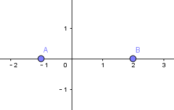
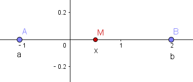
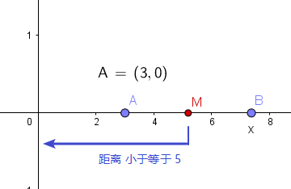

= 基本概念
:toc:
---

== 有理数 rational number -> = 整数 + 分数

\begin{align*}
有理数
    \begin{cases}
    整数
        \begin{cases}
        正整数 \\
        0 \\
        负整数
        \end{cases} \\
    分数
        \begin{cases}
        正分数 \\
        负分数
        \end{cases} \\
    \end{cases}
\end{align*}

事实上, 任何"有理数", 都可以写成"有限小数" 或 "无限循环小数" 的形式:

[options="autowidth"]

|===
|  有理数   | 都可以写成"有限小数" 或 "无限循环小数" 的形式

| 整数
| 1 = 1.0

| 分数
|\begin{align}
\frac{2}{5} = 2.5  \\
-\frac{11}{9} = 1.222...
\end{align}
|===

---

== 无理数 irrational number - 无限不循环小数

我们把那些 #不能写成"分数"形式的数, 就称为"无理数".# 即"无限不循环小数".

如 :

\begin{align*}
\sqrt{2}, -\sqrt{5}, \sqrt[3]{2}, \sqrt[3]{3}, -\pi
\end{align*}

---

== 实数 -> = 有理数(包括0, 有限小数, 无限循环小数) + 无理数(无限不循环小数)

\begin{align*}
实数 =
\begin{cases}
有理数
    \begin{cases}
    0 \\
    有限小数 \\
    无限循环小数
    \end{cases} \\
无理数
    \begin{cases}
    无限不循环小数
    \end{cases}
\end{cases}
\end{align*}

==== 无理数的每一个, 都能映射到数轴上存在

虽然无理数, 小数点后无穷无尽, 但神奇的是, #每一个无理数, 都可以对应到用数轴上的一个点来表示出来!#

.比如:
====
半径为 1/2 的圆, 从原点(O点)沿着数轴向右滚动一周(到达O'点), 这个O'点 = stem:[2\pi r$ = $\pi] , 即是一个无理数.

image:img_math/math_1.gif[]
====

即 : "实数"与"数轴上的点", 是一一对应的.

---

== 倒数

倒数 : 乘积是1 的两个数, 互为"倒数".

\begin{align*}
(- \frac{1}{2}) * (-2) = 1
\end{align*}

所以, -(1/2) 和 -2 互为倒数.

---

== ----- -----

---

== 幂 power -> a^n的结果

乘方 stem:[a^n]的结果叫做"幂".

---

== 乘方 -> a^n 的操作

乘方: 求n个相同因数的积的运算. 即 stem:[a^n]

\begin{align}
a^n = a * a_2 * a_3 * ... a_n
\end{align}

[options="autowidth"]
|===
|Header 1 |Header 2

|a
|底数 base number

|n
|指数 exponent

|a^n
|a的n次幂 +
如, stem:[9^4], 念做 "9的4次方" 或 "9的4次幂".
|===

---

== 平方根 arithmetic square root

若 stem:[x^2=a] , 则 :

[options="autowidth"]
|===
|Header 1 |Header 2

|x
|叫做 a 的"算术平方根". 记为 stem:[\sqrt{a}] , 读作"根号a" .

|a
|被开方数 radicand. /ˈrædəˌkænd/
|===

[cols="1a,3a"]
|===
|Header 1 |算术平方根

|0
|0

|正有理数
|许多"正有理数"的算术平方根 (例如 stem:[\sqrt{3}, \sqrt{5}, \sqrt{7}] 等), 都是"无限不循环小数".
|===

---

== 开平方根 extraction of square root -> 对 a 开平方, 就是求 stem:[\sqrt{a}]

求一个数 a 的"平方根 x" 的运算, 叫做"开平方".

若 stem:[x^2 = a] , 则对 a 开平方, 就是求 stem:[\sqrt{a}] , 即求 x.

所以, "平方"与"开平方"互为逆运算:

[options="autowidth"]
|===
|Header 1 |Header 2 |Header 3

|stem:[\pm2]
|- 平方 -> +
<- 开平方 -
|stem:[2^2]
|===

[options="autowidth"]
|===
|     | 平方根

| 正数 a  | 有两个平方根 : 它们互为相反数, 即 stem:[\pm\sqrt{a}]
| 0  | 0
| 负数  | 没有平方根
|===

---

== 二次根式 quadratic radical -> stem:[ \sqrt{2} ]

二次根式:: 一般地, 我们把形如 stem:[ \sqrt{2}
\quad (a \ge 0) ] 的式子, 叫做"二次根式. +
stem:[ \sqrt ] 叫做 "二次根号".

[options="autowidth"]
|===
|Header 1 |Header 2

|stem:[  (\sqrt{a})^2 = a \quad(a \ge 0) ]
|

|stem:[ \sqrt{a^2} = a \quad(a \ge 0) ]
|

|stem:[ \sqrt{a} * \sqrt{b} = \sqrt{ab} \quad(a \ge 0, b \ge 0) ]
|
\begin{align*}
\sqrt{\frac{1}{3}} * \sqrt{27}
= \sqrt{\frac{1}{3}*27}
= \sqrt{9} = 3
\end{align*}

例
\begin{align*}
\sqrt{4a^2 b^3}
= \sqrt{4} * \sqrt{a^2} * \sqrt{b^3} \\
= 2* a * \sqrt{b^2} * \sqrt{b}
= 2ab \sqrt{b}
\end{align*}

例
\begin{align*}
& 3 \sqrt{5} * 2 \\
& = 3*2* \sqrt{5*10} \\
& = 6 \sqrt{5*5*2} \\
& = 6*5*\sqrt{2} \\
& =30 \sqrt{2}
\end{align*}

|stem:[ \frac{\sqrt{a}}{\sqrt{b}} = \sqrt{\frac{a}{b}} \quad(a \ge 0, b > 0) ]

上下两个人, 每人一件雨衣,  +
能等同于上下两个人共用一件大雨衣.
|\begin{align*}
\sqrt{\frac{3}{2}} \div \sqrt{\frac{1}{18}}
= \sqrt{\frac{3}{2} \div \frac{1}{18}}
= \sqrt{\frac{3}{2} * 18}
= 3\sqrt{3}
\end{align*}

例
\begin{align*}
\sqrt{\frac{75}{27}}
= \frac{\sqrt{75}}{\sqrt{27}}
= \frac{\sqrt{25*3}}{\sqrt{9*3}}
=\frac{5\sqrt{3}}{3\sqrt{3}}
= \frac{5}{3}
\end{align*}

例
\begin{align*}
\frac{3\sqrt{2}}{\sqrt{27}}
= \frac{...}{3\sqrt{3}}
= \frac{\sqrt{2}}{\sqrt{3}}
= \frac{\sqrt{2}*\sqrt{3}}{\sqrt{3}*\sqrt{3}}
= \frac{\sqrt{6}}{3}
\end{align*}

例
\begin{align*}
\sqrt{8} + \sqrt{18}
= 2\sqrt{2} + 3 \sqrt{2}
= 5\sqrt{2}
\end{align*}

例
\begin{align*}
& 2\sqrt{12} - 6\sqrt{\frac{1}{3}} + 3\sqrt{48} \\
& = 4\sqrt{3} - 6\sqrt{\frac{1*3}{3*3}} +3\sqrt{16*3} \\
& = ... -\frac{6\sqrt{3}}{\sqrt{3^2}} +... \\
& = 4\sqrt{3} - 2\sqrt{3} + 12\sqrt{3} \\
& = 14\sqrt{3}
\end{align*}

|===

最简二次根式 simplest quadratic radical:: 形如: stem:[ 2\sqrt{2}, \frac{\sqrt{3}}{10}, \frac{2\sqrt{2}}{a} ] +
它们都满足这两个条件 : +
(1) 被开方数, 不含分母 +
(2) 被开方数中, 不含能开得尽方的因数或因式. +
(3) 分母中不含二次根式.

.标题
====
例如：
\begin{align}
& 2\sqrt{12} - 6\sqrt{\frac{1}{3}} + 3 \sqrt{48} \\
& = 2 \sqrt{4*3} - 6\sqrt{\frac{1*3}{3*3}} + 3 \sqrt{16*3} \\
& = 4\sqrt{3} - \frac{6\sqrt{3}}{3} + 12 \sqrt{3} \\
& = 14 \sqrt{3}
\end{align}

====

---

== 立方根
\begin{align*}
\sqrt[3]{a}
\end{align*}

其中, 3 : 是"根指数" radical exponent

---

== ----- -----

---

== 单项式 monomial -> 数字或字母的积, 如 100t, mn, stem:[a^2h]

单项式 :

- 就是数字或字母的积, 如 :  100t, 0.8p, -n, mn, stem:[a^2h]. +
- 单独的一个数或一个字母, 也是单项式.

---

==== 系数 coefficient -> 100t 中的 100

就是"单项式"中的"数字因数"

[options="autowidth"]
|===
|  单项式   | 系数
| 100t  | 100
| -n  | -1
|stem:[a^2h]|1
|===

---

== 次数

==== 单项式的次数 degree of monomial

即一个单项式中, 所有字母的指数的和.

[options="autowidth"]
|===
|  单项式   | 次数
| 100t   | 字母t 的指数是1, 所以100t 的次数是1.
| stem:[a^2h] | 字母 a 和 h 的指数的"和"是3, 所以stem:[a^2h] 的次数是3.
|===

==== 多项式的次数 degree of a polynomial

就是多项式中, 那个"次数最高项"的次数.

---

== 多项式 polynomial -> 几个单项式的和

多项式: 就是几个单项式的和.

如 :

\begin{align*}
x^2 + 2x + 18 \\
3x + 5y + 2z
\end{align*}

---

==== 项 term

多项式中的每个单项式, 叫做多项式的"项".

如: stem:[x^2 + 2x + 18] 中, "项"为 : x^2, 2x, 18.

---

==== 常数项 constant term

如: stem:[x^2 + 2x + 18] 中, 18就是"常数项".

---

== 因式分解  factorization -> 把一个多项式, 化成几个整式的"积"的形式

#把一个多项式, 化成几个整式的"积"的形式(即, 从原来的加法, 变成乘法), 像这样的变形过程, 就叫做"因式分解".# 也叫做把这个多项式"分解因式".

可以看出, #"因式分解", 与"整式乘法", 是方向相反的变形# :

[options="autowidth"]
|===
|Header 1 |Header 2 |Header 3

|(x+1)(x-1)
|-整式乘法-> +
<-因式分解-
|stem:[ x^2-1 ]
|===

因式分解的两种基本方法:

==== 1. 提"公因式"法

公因式::
即"公共的因式", 存在于各项之中. 如下面的 p 就是公因式.

stem:[ pa+pb+pc = p(a+b+c) ]

.标题
====
例如：
\begin{align*}
8 a^3 b^2 + 12a b^3 c \\
= 4a b^2 (2a^2 + 3bc)
\end{align*}

可以看出, 从原始的加法, 变成最终的乘法. 即"分解因式".
====

.标题
====
例如：
\begin{align*}
2a(b+c) - 3(b+c) \\
= (b+c)(2a-3)
\end{align*}
同样, 从加法, 变成乘法.
====

---

==== 2. 公式法

[options="autowidth"]
|===
|公式 |例如

|stem:[ a^2-b^2 = (a+b)(a-b) ]
|\begin{align*}
& x^4 - y^4 \\
& = (x^2 + y^2) * (x^2 - y^2) \\
& =(x^2 + y^2)(x+y)(x-y)
\end{align*}

|stem:[ a^2+2ab+b^2 = (a+b)^2 ]
|\begin{align*}
& 3ax^2 + 6axy + 3ay^2 \\
& = 3a(x^2 + 2xy + y^2) \\
& = 3a(x+y)^2
\end{align*}

|stem:[ a^2-2ab+b^2 = (a-b)^2 ]
|

|\begin{align*}
x^2+x(p+q)+pq \\
= (x+p)(x+q)
\end{align*}

怎么推导出来的? 因为倒过来看, 就是 :
\begin{align*}
(x+p)(x+q) \\
= x^2 +qx + px + pq \\
= x^2+x(p+q)+pq
\end{align*}
|\begin{align*}
x^2 + 3x + 2
\end{align*}

对其进行因式分解,  +
#中间的3, 是两个数字相加得到的.#  +
#最后的2, 是两个数字相乘得到的.#  +
那么这两个数字是多少呢? 就是1和2了.  +
= (x+1)(x+2)

例:  因式分解
\begin{align*}
x^2 + 7x-18
\end{align*}

中间的7 是两个数字相乘的结果,  +
-18是两个数字相加的结果, +
那么这两个数字是多少呢? 就是 9 和 -2 了.  +
所以, 因式分解的结果就是 : (x+9)(x-2)

|===

---

== 同类项

同类项 : 所含字母相同, 且相同字母的指数也相同的项, 叫做"同类项".  +
几个常数项也是同类项.

如:

\begin{align*}
3x^2 \\
2x^2 \\
3ab^2 \\
-4ab^2
\end{align*}

---

==== 合并同类项

把多项式中的"同类项"合并成一项, 叫做"合并同类项".

合并同类项后, 所得项的系数, 是合并前各同类项的系数的和, 且字母连同它的指数不变.

如:

\begin{align}
4a^2 + 3b^2 + 2ab - 4a^2 - 4b^2 \\
=(4a^2 - 4a^2) + (3b^2 - 4b^2) + 2ab \\
= -b^2 + 2ab
\end{align}

---

== ----- -----

---

== 整式 integral expression -> = 单项式 + 多项式

==== 整式的乘除等法则

[options="autowidth"]
|===
|公式 |例如

|stem:[ a^0=1 ]
|\begin{align}
a^0 = a^{1-1} = \frac{1} {1} = 1
\end{align}

|stem:[ a^{-n} = \frac{1}{a^n}] (a stem:[ \ne ] 0) +
即 : stem:[ a^{-n} \quad (a \ne 0)] 是 stem:[a^n] 的倒数
|stem:[ a^3 * a^{-5}
= \frac{a^3}{a^{5}}
= \frac{1}{a^2}
= a^{-2}
= a^{3-5} ]

stem:[ a^{-2} b^2 * (a^2 b^{-2})^{-3}
= a^{-2} b^2 * a^{-6} b^6
= a^{-8} b^8
= \frac{b^8}{a^8} ]

stem:[ 2.57*10^{-5} = 0.000,025,7 ]

|
stem:[ a^m * a^n = a^{m+n} ]
(m, n 都是正整数)
|stem:[ x^2*x^5=x^{2+5}=x^7 ]

|
stem:[ ( a^m )^n = a^{m * n} ]
(m, n 都是正整数)
|stem:[ (x^3)^5=x^{3*5}=x^{15} ]

例

\begin{align}
& ac^5 * bc^2 \\
& = (a * b) * (c^5 * c^2) \\
& = abc^7
\end{align}

例

\begin{align*}
& (2x)^3 * (-5xy^2) \\
& = 2^3 * (-5) * x^3 xy^2 \\
& = -40 x^4 y^2
\end{align*}

|stem:[ (ab)^n = a^n*b^n ] (n 是正整数)
|

|\begin{align*}
& (a+b)(p+q)  \\
& = a(p+q) + b(p+q) \\
& = ap + aq + bp + bq
\end{align*}

image:img_math/math_2.png[300,300]
|

|stem:[ \frac{a^m}{a^n} = a^{m-n} ] +
(a stem:[\ne] 0; m, n 都是正整数; 且 m>n)
|\begin{align*}
\frac{12 a^3 b^2 x^3}{3a b^2} = 4a^2 x^3
\end{align*}

例
\begin{align*}
& \frac{12 a^3-6 a^2+3a}{3a}  \\
& = \frac{12 a^3}{3a} -\frac{6 a^2}{3a} + \frac{3a}{3a}  \\
& = 4a^2 - 2a +1
\end{align*}

|stem:[ (\frac{a}{b})^n = \frac{a^n}{b^n} ]
|

|stem:[ (a+b)(a-b) = a^2 - b^2 ]
|\begin{align*}
& (x+2y-3)(x-2y+3) \\
& = [x+(2y-3)][x-(2y-3)] \\
& = x^2 - (2y-3)^2
\end{align*}

|stem:[ (a+b)^2 = a^2 + 2ab + b^2 ]
|\begin{align*}
& (a+b+c)^2 \\
& = [(a+b)+c]^2 \\
& = (a+b)^2 + 2(a+b)c + c^2 \\
& = a^2 + 2ab + b^2 + 2ca + 2cb + c^2 \\
& = a^2 + b^2 + c^2 + 2ab + 2ac + 2bc
\end{align*}

|stem:[ (a-b)^2 = a^2 - 2ab + b^2 ]
|

|===

---

== 分式 fraction

==== "无限循环小数" 如何转写成"分数"

.标题
====
例如：
stem:[ 0.\dot{7}] 的分数形式是什么?

\begin{align}
& 设 0.\dot{7} 的分数形式 是x. \\
& ∵ 0.\dot{7} = 0.777\cdots \\
& ∴ x = 0.777\cdots \\
& 10x = 7.77\cdots \\
& 10x - x = 7.77\cdots - 0.77\cdots = 7 \\
& 9x = 7 \\
& x = \frac{7}{9}
\end{align}
====

---

==== 分式的乘除等法则

[options="autowidth"]
|===
|Header 1 |Header 2

|stem:[\frac{a}{b} * \frac{c}{d} = \frac{ac}{bd}]
|

|stem:[ \frac{a}{b} \div \frac{c}{d} =\frac{a}{b} * \frac{d}{c} = \frac{ad}{bc} ]
|

|stem:[  (\frac{a}{b})^n = \frac{a^n}{b^n}
 ]
|\begin{align*}
& (\frac{a^2 b}{-c d^3} )^3 \div \frac{2a}{d^3} * (\frac{c}{2a})^2 \\
& = \frac{a^6 b^3 }{-c^3 d^9} * \frac{d^3}{2a} * \frac{c^2 }{4a^2} \\
& = -\frac{a^6 b^3 c^2 d^3 }{8a^3 c^3 d^9} \\
& = -\frac{a^3 b^3 }{8cd^6}
\end{align*}

|stem:[ \frac{a}{c} \pm \frac{b}{c} = \frac{a \pm b}{c} ]
|

|stem:[ \frac{a}{b} \pm \frac{c}{d} = \frac{ad}{bd} \pm \frac{bc}{bd}= \frac{ad \pm bc}{bd} ]
|\begin{align*}
& (\frac{x+2}{x^2-2x} - \frac{x-1}{x^2-4x+4}) \div \frac{x-4}{x} \\
& = (\frac{x+2}{x(x-2)} - \frac{x-1}{(x-2)^2}) * \frac{x}{x-4} \\
& = \frac{(x+2)(x-2) - x(x-1)} { \cancel{x} (x-2)^2} * \frac{ \cancel{x} } {x-4} \\
& = \frac{x^2-4 - x^2 +x}{(x-2)^2 (x-4)} \\
& = \frac{x-4}{(x-2)^2 (x-4)} \\
& = \frac{1}{(x-2)^2}
\end{align*}

|===

---

==== 约分 reduction of a function

把一个分式的分子与分母的"公因式"约去, 叫做分式的"约分".

---

==== 最简分式 fraction in a lowest terms -> 分子与分母没有"公因式"的分式

分子与分母没有"公因式"的分式, 就叫做"最简分式".

.标题
====
例如：
\begin{align*}
& \frac{6x^2 - 12xy + 6y^2}{3x-3y} \\
& = \frac{6 (x^2 - 2xy + y^2)}{3(x-y)} \\
& = \frac{2 (x-y )^2}{x-y} \\
& = 2(x-y)
\end{align*}
====

---

==== 通分 reduction of fractions to a common denominator -> 化成分母相同

把几个异分母的分式, 分别化成与原来分式相等值的同分母的分式, 就叫做分式的"通分".

因为将分式的分子和分母同时乘上适当的整式, 不会改变分式的值. +
比如, 我们可以把 stem:[ \frac{1}{ab} ] 和   stem:[\frac{2a-b}{a^2} ] 化成分母相同的分式.

#为"通分", 要先确定各分式的"公分母". 一般取各分母的所有因式的最高次幂的"积", 作为"公分母",# 它叫做"最简公分母".

.标题
====
例如：
stem:[ frac{3}{2 a^2 b} ] 与 stem:[ frac{a-b}{a b^2 c} ] 做通分:

它们的最简公分母就是 stem:[ 2a^2 b^2c ]

stem:[ \frac{3}{2a^2 b} = \frac{3*b c}{2a^2 b *bc} = \frac{3bc}{2a^2 b^2c} = \frac{3bc}{2 a^2 b^2c} ]

stem:[  \frac{a-b}{a b^2 c} = \frac{(a-b)*2a}{a b^2 c*2a} = \frac{2a^2 - 2ab}{2a^2 b^2c} ]
====

.标题
====
例如：
stem:[ \frac{2x}{x-5} ] 与 stem:[ \frac{3x}{x+5} ] 做通分 :

它们的最简公分母是 stem:[  (x-5)(x+5) ]

stem:[ \frac{2x}{x-5} = \frac{2x * (x+5)}{(x-5)(x+5)} = \frac{2x^2+10x}{x^2-25}  ]

stem:[ \frac{3x}{x+5} =\frac{3x*(x-5)}{(x+5)(x-5)}  ]
====

---

==== 分式方程 fractional equation ->  分母中含有未知数

即分母中含有未知数的方程.

如
stem:[\frac{90}{30+v} = \frac{60}{30-v} ] +
分母中含有未知数.

注意 : 分母不能为0. 即, 如果你求出的解, 代入分母(具体说就是"最简公分母")后, 使得"最简公分母"为0了, 那么该解就不是本方程的解了! 即本方程无此解.

.标题
====
例如：
\begin{align*}
& \frac{2}{x-3} = \frac{3}{x} \\
& 2x = 3(x-3)  \\
& 2x - 3x = -9 \\
& x = 9
\end{align*}

把 x=9 代入原方程的最简公分母 x(x-3) 中, 确认了它不为0, 即 stem:[  x(x-3) \ne 0 ] +
所以x=9 是原分式方程的解.
====

---

== ----- -----

---

== 分配率 -> a(b+c) = ab + ac

---
== ----- -----

---

== 不等式

==== 不等式的性质

[options="autowidth" cols="1a,1a"]
|===
|Header 1 |Header 2

|\begin{align}
如果 a>b,  \\
那么 a \pm c > b \pm c
\end{align}
|不等式两边加上(或减去)同一个数(或式子), 不等号的方向不变

|\begin{align}
如果 a>b, c>0 \\
那么 ac>bc \\
(或 \frac{a} {c}> \frac{b} {c})
\end{align}
|不等式两边乘以(或除以)同一个正数, 不等号的方向不变

.标题
====
例如：
\begin{align}
& \frac{2} {3} x > 50 \\
& \frac{2} {3}x * \frac{3}{2}  > 50* \frac{3}{2} \\
& x > 75
\end{align}
====

|\begin{align}
如果 a>b, c<0 \\
那么 ac <bc \\
(或 \frac{a} {c} < \frac{b} {c})
\end{align}
|不等式两边乘以(或除以)同一个负数, 不等号的方向要改变

.标题
====
例如：
\begin{align}
-4x > 3 \\
x < - \frac{3}{4}
\end{align}
====

|===

---

== 绝对值

==== 绝对值的性质

---

==== 数轴上两点之间的距离 -> stem:[ AB = \|a-b\|]

一般地, 如果实数a,b 在数轴上对应的点, 分别为A, B, 即 A(a), B(b), 则线段AB的长为:
\begin{align}
AB = \|a-b\| \quad (或 \|b-a\| 也是一样)
\end{align}

这就是数轴上两点之间的距离.

比如图上的例子,  stem:[AB = \| b-a \| =\| 2-(-1) \| =3]

---

==== 中点坐标公式 -> stem:[ midP = \frac{a+b}  {2}]

如果线段AB的中点M 对应的数为 x, 则由 AM=BM 可知: stem:[\|b-x\| = \|x-a\| ]

所以 stem:[ x = \frac{a+b} {2}] 这就是数轴上的"中点坐标公式".

.标题
====
例如：数轴上, A点在3的位置, B点在x的位置, AB线段的中点到原点的距离, 不大于5. 问x (即B点)的取值范围是多少?

根据中点公式 : AB的中点就是 stem:[ \frac{3+x} {2} ]

\begin{align}
& | \frac{3+x} {2}| \le 5 \\
& |3+x| \le 10 \\
& -10 \le 3+x \le 10 <- 比 -10大, 就是-8, -5 ...这个区间 \\
& -13 \le x \le 7
\end{align}

====

2019高一数学b版, 缺少页数 68-73 页

