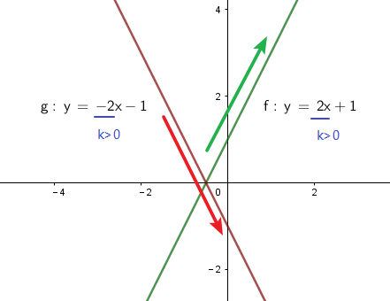
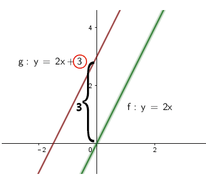
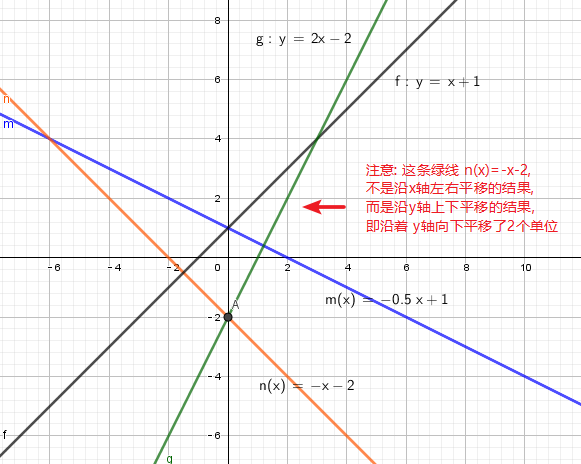
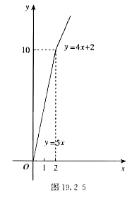
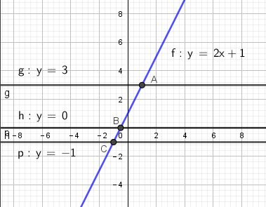
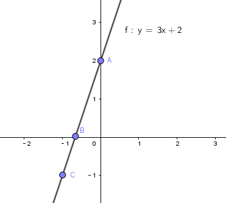

= 一次函数(线性)
:toc:
---

== 一元一次方程 linear equation with one unknown -> 只含有一个未知数x, 最高次数是1

- 只含有一个未知数(元),
- 未知数的次数都是1 ,
- 等号两边都是整式.

这样的方程叫做"一元一次方程".

如: 4x = 24

等式两边乘以同一个数, 结果仍然相等.

.标题
====
例如：

\begin{align}
& \frac{2}{3}x + \frac{1}{2}x + \frac{1}{7}x + x = 33 \\
& 等式两边乘以同一个数, 结果仍然相等.  \\
& 本方程中, 各分母的最小公倍数是 3*2*7 = 42, 所以我们把该方程等式两边同时乘以42. \\
& 42*\frac{2}{3}x + 42*\frac{1}{2}x + 42*\frac{1}{7}x + 42x = 42*33 \\
& 14*2x + 21x  + 6x +42x = 1386 \\
& 97x = 1386 \\
& x = \frac{1386}{97}
\end{align}
====

.标题
====
例如：
你开的店, 在某天卖出两件衣服, 每件收入60元. 其中一件赚了25%, 另一件亏了25%, 那么你的总收入到底是赚是亏?

分析:   +
注意: 以每件60元卖出, 这个是售价, 不是该衣服的成本(或进货价). 所以, 我们需要先算出这两件衣服的成本是多少.

设: 赚25%的那件衣服, 成本是x元, +
亏25%的那件衣服, 成本是y元

\begin{align}
\begin{cases}
x(1+25\%) = 60 \\
y(1-25\%) = 60
\end{cases} \\
\begin{cases}
x = 48 \\
y = 80
\end{cases}
\end{align}

两件衣服的总成本 = x+y = 48+80 =128 +
你的盈亏 = 总收入 - 总成本 = 60*2 - 128 = -8元 +
所以, 你亏了8元.
====

.标题
====
例如：
电信运营商, 计费方式有如下, 你应选哪种最便宜?

[options="autowidth"]
|===
|计费方案   | 方案1  | 方案2

| 月基本使用费 /元  | 58 |88
| 可使用时间 / min  | 150 |350
|超时后的费用 /(元/min)|0.25|0.19
|===

根据上表中, 我们可以列出更详细的 电话使用时长的 费用表 :

[options="autowidth"]
|===
|  电话使用时长 /min   | 方案1 /元 |方案2 /元

| t<150 min  | 58 |88
| t =150  | 58 | 88
| 150 < t <350  | 58元 + (实际使用时长t-150分钟)*0.25元 | 88
|  t = 350  | 58元 + (350分钟-150分钟)*0.25元 | 88
|  t > 350  | 58元 + (实际使用时长t-150分钟)*0.25元 | 88元 + (实际使用时长t-350分钟)*0.19元
|===

====

---

== ----- -----

---

== 二元一次方程 linear equation in two unknowns -> 含有两个未知数, 最高次数是1

- 方程中含有两个未知数(比如x 和 y)
- 含有未知数的项的次数是1.

==== 二元一次方程的解法 : 1. 消元法

"消元"思想::
二元一次方程组中, 有两个未知数, 如果消去其中一个未知数, 那我们就把它转化为了一元一次方程.  +
用这种方式, 即, 我们先求出其中一个未知数, 再求另一个未知数, 这种将未知数的个数"由多化少", 逐一解决的思想, 就叫做"消元"思想.

.标题
====
例如：你的公司生产消毒洗手液, 每天能生产22.5t.  +
根据市场调查, 你的产品销量中, 大瓶装(500g) 和 小瓶装(250g) 的销售数量(按瓶算), 比例为 2:5.  +
那么, 你每天生产的洗手液, 应该分配给大瓶和小瓶, 各多少瓶呢?

1吨=1000千克=stem:[1*10^6]克

解:
设, 大瓶数应为 x, 小瓶数 y

\begin{cases}
500x + 250y = 22.5 * 10^6 \\
\dfrac{2}{5} = \dfrac{x}{y}
\end{cases}

\begin{cases}
... \\
x = 2y/5
\end{cases}

x有了, 就把它代入y中

\begin{cases}
500(2y/5) + 250y =... \\
...
\end{cases}
====

.标题
====
例如：
你有22名员工, 每人每天可以生产铅笔1200个, 或橡皮2000个, 你的套装是一支笔配2块橡皮, 为了使每天生产的这两样产品配对 (1笔+2橡皮), 那么你应该对生产铅笔和橡皮各分配多少名员工?

分析:
为了连成方程, 你要首先找到一个共同的变量, 即, 等式左右两边都是它, 才能让等式"等于="起来. 即, 这个"共同的变量"起到方程的桥梁的作用.

那么本题中的共同变量是哪个呢? 是"比率", 即你生产铅笔和生产橡皮的员工, 在"一天的时间内", 生产出可以形成"套装"的产品数量之比率, 必须是 1:2,  (即1笔 vs 2橡皮).

解 :
设, 每一天中, 生产铅笔的员工是 x人, 生产橡皮的员工人数是 y人.

\begin{cases}
x+y = 22 \\
1200x : 2000y = 1:2
\end{cases}

\begin{cases}
x = 22-y \\
\frac{1200x} {2000y} = \frac{1}{2}
\end{cases}

我们先来算第二个式子, 算出y :
\begin{align}
& 2*1200x = 2000y \\
& 2*1200(22-y) = 2000y \\
& y = 12
\end{align}

再来算x :
\begin{align}
& ∵ x + y = 22 \\
& x +12 =22 \\
& x =10
\end{align}

所以, 每天, 应安排生产铅笔的为 x=10人, 生产橡皮的为 y=12人.
====

---

==== 二元一次方程的解法 : 2. 加减消元法

.标题
====
例如：
\begin{cases}
x+y = 10  \\
2x + y = 16
\end{cases}

可以看出, 直接第二个方程减去第一个方程, 就能消去y.
====

.标题
====
例如：
\begin{cases}
3x+4y = 16  & ① \\
5x + 6y = 33 & ②
\end{cases}

将 ①*3, ②*2

\begin{cases}
9x+12y = 16*3  \\
10x + 12y = 33*2
\end{cases}

这样, 就能两个公式相减, 消掉y了.
====

---

== ----- -----

---

== 三元一次方程

==== 三元一次方程的解法 : 消元法

[options="autowidth"]
|===
|Header 1

|三元一次方程组 +
↓ (消元) +
二元一次方程组  +
↓ (消元) +
一元一次方程组
|===

.标题
====
例如：
\begin{cases}
3x+4z =7  & ① \\
2x+3y+z=9 & ② \\
5x-9y+7z=8 & ③
\end{cases}

方程①只含x, z, 所以,可以由 ②, ③ 来消去y, 组成一个"二元一次方程组".
====

.标题
====
例如：
\begin{cases}
a-b+c=0 & ① \\
4a + 2b + c = 3 & ② \\
25a + 5b + c =60 & ③
\end{cases}

将 ②-①, 消掉c,  +
将 ③-①, 消掉c,   +
就得到了一个"二元一次方程组".
====

---

== ----- -----

---

== 正比例函数 -> y = kx

正比例函数 proportional function:: 一般地, 形如
\begin{align}
\boxed{y=kx (k是常数, k≠0) }
\end{align}
的函数, 叫做"正比例函数". +
其中, k 叫做"比例系数".

如:
stem:[y = kx]  (k是常数, 且 stem:[k \ne 0] )

一般地, 正比例函数 y = kx 的图像, 是一条经过坐标系原点的直线.

[cols="1a,4a" options="autowidth"]
|===
|y = kx |Header 2

|k>0
|- 直线 y=kx, 经过第3, 第1象限.
- 从左向右上升, 随着x的增大, y也增大.

| k<0
|- 直线 y=kx 经过 第2, 第4 象限.
- 从左向右下降, 随着x的增大, y减小.
|===

---

==== 用两点法, 画出一条直线的图像

由于两点可以确定一条直线, 所以我们可以用"两点法" 画出 y= kx (k ≠ 0) 的图像.

一般地, 过原点(0,0) 和 点(1, k) (k是常数, k≠0) 的直线, 即是 y= kx (k ≠ 0) 的图像.

.标题
====
例如：
已知 一次函数的图像, 过点(3,5) 和 (-4,-9), 那么它的公式(解析式)是什么?

解 : 我们的目的是求出 y = kx + b 的 k 和 b (都叫做"待定系数"), 就能知道它的具体解析式.

把两个点的坐标代进去.

\begin{cases}
3k + b = 5 \\
-4k + b = -9
\end{cases}

\begin{cases}
k = 2 \\
b = -1
\end{cases}

所以, 该直线的解析式就是 y = 2x - 1
====

---

== 一次函数 linear function -> y=kx + b ( k≠0)

一般的, 形如
\begin{align}
\boxed{y=kx + b (k, b 是常数, k \ne 0) }
\end{align}
的函数, 叫做"一次函数". 该图像也是一条直线.

当 b = 0 时, y= kx + b 即 y=kx, 所以说, "正比例函数"是一种特殊的"一次函数".

比较一次函数 y=kx+b (k ≠ 0),  与 正比例函数 y=kx (k ≠ 0) 的图像, 可以看出 :

[cols="1a,1a"]
|===
|y=kx (k ≠ 0) |y=kx+b (k ≠ 0)

|
|y=kx+b (k ≠ 0) 的图像, 可以由直线 y=kx 沿y轴上下平移 \|b\| 个各单位长度得到. 即 :

- 当 b>0 时, 图像沿着y轴向上平移,
- 当 b<0 时, 图像沿着y轴向下平移.

|===

.标题
====
例如：买种子, 其重量(kg)我们用 x 来表示.  +
-> 当 0 ≤ x  ≤ 2kg 时, 种子的价格为 5元/kg  +
-> 当 x > 2kg 时, 在x≤2的部分, 仍按 5元/kg来算; x超出2kg的部分(即 x-2 kg), 种子价格按4元/kg 计算 (即打8折)

你来得出函数公式, 与函数图.

设 : 你买的种子的总重量为x,  总价格为y

\begin{align}
& \begin{cases}
y = 5x & (0 ≤ x  ≤ 2kg ) \\
y = 5*2kg + (x-2kg)*4 & (x>2)
\end{cases} \\
& \begin{cases}
y = 5x \\
y = 10 + 4x - 8
\end{cases} \\
& \begin{cases}
y = 5x & (0 ≤ x  ≤ 2kg )\\
y = 4x +2 & (x>2)
\end{cases} \\
& \begin{cases}
x = 2 \\
y = 10  \\
\end{cases}
\end{align}

====

.标题
====
例如：下面3个方程, 有是什么意味? +
(1) 2x +1 =3 +
(2) 2x+1=0   +
(3) 2x+1=-1

这三个方程, 等号左边的函数体都一样, 只是等号右边的数字不一样, 其实等号的右边, 就是 y的不同取值而已.

即 : 解这3个方程相当于在 y = 2x+1 的函数值(y值)分别为 3, 0, -1 时, 求自变量 x 的值. +
或者说, 是在直线  y = 2x+1 上取 y = 3, 0, -1 的点, 看这些点的 x 坐标是多少.

解"一元一次方程", 相当于在某个一次函数 y=ax+b 的函数值(即y值)为0时, 求自变量 x 的值.
====

.标题
====
例如：

(1) 3x+2>2 +
(2) 3x+2<0 +
(3) 3x+2<-1

可以看出, 上面3个不等式的不等号左边, 都是 3x+2, 不等号及不等号右边不一样.

从函数的角度看, 解这3个不等式, 就相当于在一次函数 y=3x+2 的函数值分别大于2, 小于0, 小于 -1 时, 求自变量 x 的取值范围.

因为任何一个以 x 为未知数的"一元一次不等式" 都可以变形为 ax + b >0 或 ax + b < 0 (a ≠ 0) 的形式, 所以解"一元一次不等式", 就相当于在某个一次函数 y=ax+b 的值大于0 或小于0 时, 求自变量 x 的取值范围.

====

.标题
====
例如：
你坐热气球, 从海拔5m处出发, 以1m/min 的速度上升. 与此同时, 她从海拔15m处出发, 以 0.5m/min 的速度上升. 你们两个热气球上升的时间都是 1h.

思考 :

- 你们两个热气球, 上升时间(time)和到达海拔(elevation), 这两个变量的函数关系是怎样的?
- 什么时候, 你们两个气球会位于同一高度? 这时气球上升了多少时间? (你们两个气球是同时出发的)

如果两个气球能达到同一高度 (elevation相同), 则必能连成方程组(同一上升用时, 同一到达海拔高度), 我们就来算算它们有没有解?

\begin{align}
\begin{cases}
5 + (1*t)  = e \\
15 + 0.5t = e
\end{cases} \\
\begin{cases}
t-e = -5 \\
t-2e= -30
\end{cases} \\
\begin{cases}
time = 20 min \\
elevation = 25 m
\end{cases}
\end{align}

也就是说当上升20min时, 两个气球都位于海拔25m的高度.

image:img_math/math_12.png[]
====

一般地, 每个含有未知数x和y的二元一次方程, 都可以改写为y=kx+b (k,b是常数, k≠0) 的形式.  +
所以每个这样的方程, 都对应一个一次函数, 于是也对应一条直线. 这条直线上每个点的坐标(x,y) 都是这个二元一次方程的解.

由两个二元一次方程, 组成的方程组, 其解就是这两条直线的"交点"处的坐标.

---
