= 二次函数(抛物线)
:toc:
---

== 一元二次方程 quadratic equation in one unknown -> stem:[ ax^2 + bx + c = 0 \quad (a \ne 0) ]

一元二次方程:: 即: 只有一个未知数(一元)x, 且x的最高次方是2. +
形如  stem:[ x^2+2x-4=0 ]

....
quadratic  /kwɒˈdrætɪk/
a. ( mathematics 数 ) involving an unknown quantity that is multiplied by itself once only 平方的；二次方的
-> quadr-,四，-atic,形容词后缀。用于数学名词平方。
....

一元二次方程的一般形式是 :
\begin{align}
\boxed{ax^2 + bx + c = 0 \quad (a \ne 0)}
\end{align}

- stem:[ax^2]  : 是二次项
- a : 是二次项的系数
- bx : 是一次项
- b : 是一次项的系数
- c : 是常数项

.

根 root:: 使方程左右两边相等的未知数的值, 就是这个一元二次方程的解. 一元二次方程的解, 也叫做一元二次方程的"根".

---

==== 解一元二次方程: 1. 配方法

配方法:: 配方是为了将次, 把一个一元二次方程, 转化为两个一元一次方程来解.

.标题
====
例如：

\begin{align}
& 2x^2 - 3x = -1 \\
& x^2 - \frac{3x}{2} = -\frac{1}{2} \\
& x^2 -  \frac{3}{2}x + (\frac{3}{4})^2 = -\frac{1}{2} +(\frac{3}{4})^2  \\
& 上面进行配方, 目的是为了把x未知数的次数, 从二次降维成一次. \\
& (x-\frac{3}{4})^2 = \frac{1}{16} \\
& 现在, 就已经降级成一元一次方程了 \\
& x-\frac{3}{4} = \pm\frac{1}{4} \\
& x_1 = 1, \quad x_2 = \frac{1}{2}
\end{align}
====

一般地, 对于方程 stem:[ x^2 = p ]

[options="autowidth"]
|===
| stem:[ x^2 = p ] |root根

|p>0
|方程有两个不等的实数根 :  +
stem:[ x_1=\sqrt{p} ] +
stem:[ x_2=-\sqrt{p} ]

|p=0
|有两个相等的实数根 :  +
stem:[ x_1= x_2= 0 ]

|p<0
|无实数根
|===

---

==== 解一元二次方程: 2. 公式法 -> 根的判别式: stem:[\Delta = b^2-4ac]

任何一个一元二次方程, 都可以写成一般形式:

stem:[ax^2 +bx +c =0 \quad (a \ne 0)  ]

我们继续用配方法来算下去:

\begin{align}
& ax^2 + bx + c =0 \\
& ax^2 + bx = -c  \\
& x^2 + \frac{b}{a}x = -\frac{c}{a} \\
& 下面进行配方 \\
& x^2 + \frac{b}{a}x + (\frac{b}{2a})^2= -\frac{c}{a} + (\frac{b} {2a})^2 \\
& ... = \frac{b^2} {4a^2} - \frac{c*4a}{a*4a} \\
& (x+\frac{b}{2a})^2 = \frac{b^2 -4ac}{4a^2} \quad ①
\end{align}

因为 stem:[a \ne 0], 所以 stem:[4a^2 > 0] , 那么等号右边的整体是大于, 等于, 还是小于0呢? 这就要看分子 stem:[b^2-4ac] 的情况了: 它有三种情况:

[options="autowidth"]
|===
|情况 |Header 2

|情况1 +
若 stem:[b^2-4ac >0]
|\begin{align}
& 这时, \frac{b^2 -4ac} {4a^2} >0 \\
& 则, 由①得: \\
& (x+\frac{b}{2a})^2 = \frac{b^2-4ac} {4a^2}  \\
& x+\frac{b}{2a} = \pm\frac{\sqrt{b^2 -4ac}}{2a}\\
& x  = -\frac{b}{2a}\pm\frac{\sqrt{b^2 -4ac}}{2a}\\
& 所以, 方程有两个不等的实数根: \\
& x_1 = \frac{-b+\sqrt{b^2-4ac}}{2a} \\
& x_2= \frac{-b-\sqrt{b^2-4ac}}{2a}
\end{align}

|情况2 +
若 stem:[b^2-4ac =0]
|\begin{align}
& 这时, \frac{b^2-4ac} {4a^2} =0 \\
& 则, 由①得: \\[7px]
& (x+\frac{b}{2a})^2 = \frac{b^2-4ac} {4a^2}  \\
& ... = 0 \\
& 所以, 方程有两个相等的实数根 : \\
& x_1= x_2 = -\frac{b}{2a}
\end{align}

|情况3 +
若 stem:[b^2-4ac <0]
|\begin{align}
& 这时, \frac{b^2-4ac} {4a^2} <0 \\
& 则, 由①得: \\
& (x+\frac{b}{2a})^2 = \frac{b^2-4ac} {4a^2}  \\
& ... < 0
\end{align}

等号左边是平方, 平方的值不可能小于0, 所以 x 取任何实数都做不到. 所以此方程无解.

|===

所以, 一般地, 式子 stem:[b^2-4ac] 就叫做一元二次方程 stem:[ax^2+bx+c=0] 的根的判别式. 通常用希腊字母 Δ 表示它. 即:

\begin{align}
\boxed{\Delta = b^2-4ac}
\end{align}

[options="autowidth"]
|===
|stem:[ \Delta = b^2-4ac ] |方程 stem:[ax^2+bx+c=0 \quad (a ≠ 0)] 根的情况

|stem:[ \Delta>0 ]
|有两个不等的实数根 : +
stem:[ x_1 = \frac{-b+\sqrt{b^2-4ac}}{2a}] +
stem:[ x_2= \frac{-b-\sqrt{b^2-4ac}}{2a} ]

这个就是 一元二次方程 stem:[a x^2 + bx +c =0] 的求根公式. +
求根公式表达了用"配方法"来解一般的一元二次方程的结果.

|stem:[ \Delta=0 ]
|有两个相等的实数根 : +
stem:[ x_1= x_2 = -\frac{b}{2a} ]

|stem:[ \Delta<0 ]
|无实数根

|===

.标题
====
例如：
\begin{align}
5x^2 -3x = x+1 \\
5x^2 -4x -1 = 0 \\
a = 5 , \quad b=-4, \quad c=-1 \\
\Delta = b^2 -4ac = 16+4*5*1 = 36 > 0 \\
所以, 方程有两个不等的实数根: \\
x = \frac{-b \pm \sqrt{b^2-4ac}}{2a} \\
= \frac{-(-4) \pm \sqrt{(-4)^2 - 4*(5)(-1)}} {2*5} \\
= \frac{4 \pm 6}{10} \\
即: x_1 = 1 , \quad x_2 = -\frac{1}{5}
\end{align}
====

.标题
====
例如：
\begin{align}
2x^2 - 2\sqrt{2}x +1 =0 \\
a = 2; \quad b= -2\sqrt{2}; \quad c=1 \\
\Delta = b^2 -4ac = (-2\sqrt{2})^2  - 4*2*1 = 0 \\
所以方程有两个相等的实数根: \\
x_1 = x_2 = - \frac{b}{2a} = - \frac{-2\sqrt{2}}{2*2} = \frac{\sqrt{2}}{2}
\end{align}
====

---

==== 解一元二次方程: 3. 因式分解法(之一) -> 十字相乘法

因式分解法:: 先因式分解, 把方程化为两个"一次式"的乘积等于0的形式, 再使这两个一次式分别等于0, 从而实现降次. 这种解"一元二次方程"的方法, 叫做"因式分解法".

因为
\begin{align}
(x+a)(x+b) = x^2 +(a+b)x +ab
\end{align}

所以, 当我们见到这个式子: stem:[ x^2 + Cx + D] , 如果能找到 a和b, 使得 D=ab, 且 C=a+b, 则:

\begin{align}
\boxed{
x^2 + \underbrace{C}_{=a+b} x + \underbrace{D}_{=a*b} = (x+a)(x+b)
}
\end{align}
即: 前面加起来, 后面乘起来.

为了寻找 a 和 b,  可以使用"十字相乘法", 它是"因式分解"中14种方法之一.

十字相乘法:: 如下图, 两条交叉的线, 就表示我们要让对应的数字相乘后, 再相加, 要等于C.

.标题
====
例如：
\begin{align}
3x^2 + 11x +10 = (x+2)(3x+5)
\end{align}

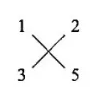

(1*5) + (2*3) = 11.  即一次项的系数. 所以这种分法就是对的.

====

.标题
====
\begin{align}
5x^2 - 2x - \frac{1}{4} = x^2 - 2x + \frac{3}{4} \\
4x^2 - 1 = 0 \\
(2x+1)(2x-1)=0  <- 因式分解 \\
x_1 = -\frac{1}{2}, \quad x_2 = \frac{1}{2}
\end{align}
====

.标题
====
例如： 解
\begin{align}
x- 2 \sqrt{x} -1 = 0
\end{align}

这不是一个一元二次方程, 但是我们可以用这种方法来把它转化为一个一元二次方程 : 哪种方法呢? 把 stem:[ \sqrt{x}] 看做是一个整体.

设 stem:[ \sqrt{x} = y], 则y的值肯定就是大于0了, 即 stem:[ y \ge 0 ]. +

原方程现在就变为了:

\begin{align}
y^2 - 2y -1 =0 \\
(y^2 - 2y + 1 ) -2 =0 \\
(y-1)^2 = 2 \\
y-1 = \pm \sqrt{2} \\
y = 1 \pm \sqrt{2} \\
因为 y \ge 0, \quad 所以 y= 1+ \sqrt{2} \\
因为我们之前设了  \sqrt{x} = y \\
所以 x = (1+\sqrt{2})^2 = 1+ 2 \sqrt{2} +2 = 3 + 2 \sqrt{2}
\end{align}

====

总结:

[cols="1a,3a"]
|===
|Header 1 |Header 2

|配方法
|先配方, 再降次

|公式法
|通过配方法, 可以推导出求根公式.

|因式分解法
|先将方程一边, 化为两个一次因式相乘, 另一边为0. 再分别使各一次因式等于0.
|===

- 配方法, 公式法:  适用于所有一元二次方程
- 因式分解法: 在解某些一元二次方程时, 比较简便.
- 总之,
#解一元二次方程的基本思路就是 : 将二次方程, 化为一次方程, 即"降次".#

---

==== ---- 一元二次方程的根, 与系数的关系

求根公式
stem:[ x = \frac{-b \pm \sqrt{b^2-4ac}}{2a}] 反映了"根"与"系数"之间的联系.

那么, 思考一下, #一元二次方程的"根"与"系数"之间, 还存在其它的关联方式吗?# 有的. 推导如下:

.从因式分解法为出发, 会得到这个结果:
====
因式分解法的最后, 会得到 stem:[(x-x_1)(x-x_2)=0 ], 即 它的两根出 stem:[ x_1] 和 stem:[ x_2].

我们把该方程的等号左边展开 :
\begin{align}
(x-x_1)(x-x_2) = 0 \\
x^2 - x*x_2 - x*x_1 +x_1x_2 = 0 \\
x^2 - (x_1+x_2)x + x_1x_2 = 0 \\
\end{align}

即: 这个方程:

[options="autowidth"]
|===
|Header 1 |系数为

|二次项:  stem:[x^2 ]
|1

|一次项 : stem:[-(x_1+x_2)x ]
|stem:[ -(x_1+x_2)], 令其 = p

|常数项 : stem:[ x_1 * x_2]
|stem:[ x_1 * x_2], 令其 = q
|===

'''

p和 q 具体等于什么? 其实你只要把两个根(stem:[ x_1, x_2])具体的值代进去, 就能知道了.

stem:[ x_1, x_2]具体的值, 可以通过"公式法"知道, 即:

stem:[ x = \frac{-b \pm \sqrt{b^2-4ac}}{2a}]

所以:

\begin{align}
x_1+x_2 =  \frac{-b + \sqrt{b^2-4ac}}{2a} +\frac{-b - \sqrt{b^2-4ac}}{2a} \\
= \frac{-2b}{2a} = -\frac{b}{a}
\end{align}

\begin{align}
x_1 * x_2 =  \frac{-b + \sqrt{b^2-4ac}}{2a} * \frac{-b - \sqrt{b^2-4ac}}{2a} \\
= \frac{(-b)^2 -(b^2 - 4ac)} {4a^2} = \frac{c}{a}
\end{align}
====

因此:

\begin{align}
\boxed{
 x_1 + x_2 = -\frac{b}{a} \\
 x_1 * x_2 = \frac{c}{a}
}
\end{align}

这就是方程(stem:[ax^2 + bx + c = 0 \quad (a \ne 0) ])的两个"根" stem:[ x_1, x_2], 与 该方程的"系数" a, b, c 之间的另一种联系.

.标题
====
例如：

\begin{align}
3x^2 +7x -9 = 0 \\
因为 x_1 + x_2 = -\frac{b}{a}, \quad x_1 x_2 = \frac{c}{a} \\
所以 x_1 + x_2 = -\frac{7}{3}, \quad x_1 x_2 = \frac{-9}{3}
\end{align}
====

---

==== 生活中的问题, 可用一元二次方程进行建模

.标题
====
例如：某人换了一种流感, 经过两轮传染后, 共有121人中招. 问该案例中, 每轮传染中, 平均一人会传给几个人(设为x)?

分析:

- 刚开始 : 1人中招(0号病人)
- 第一轮传染 : 0号病人传染给x个人, 即第一轮受害者. 即 1*x
- 第二轮传染 : ① 第一轮受害者中的每个人, 都分别再次传染给x人, 即第二轮受害者.  ②别忘了0号病人依然会自己再传染给x 个人. 即 x*x + 1*x

所以:
\begin{align}
[1] + [1*x] + [(1+x)*x] = 121  \\
1 + x + x + x^2 = 121 \\
x^2 + 2x - 120 = 0 \\
(x-10)(x+12) = 0 \\
x = 10
\end{align}

即, 平均一人传染给 10个人.
====

.标题
====
例如：有两种药品, 成本如下:

[options="autowidth"]
|===
|成本(ton/元) |A药 | B药

|两年前
|5000
|6000

|现在
|3000
|3600
|===

那么哪种药的成本的"年平均下降率"更大?

设: 某药的"年平均下降率"为 x . 比如A药, 一年后成本为 5000(1-x)元; 两年后成本为 stem:[5000(1-x)^2 ]元.

[options="autowidth"]
|===
|Header 1 |年平均下降率 = x

|A药
|\begin{align}
5000(1-x)^2 = 3000 \\
x_1 \approx 0.23, \quad x_2 \approx 1.77 \\
取x_1 的结果.
\end{align}

|B药
|\begin{align}
6000(1-x)^2 = 3600
\end{align}
|===

====

---

== ----- -----

---

== 二次函数 quadratic function -> stem:[y =  ax^2 + bx + c]

\begin{align}
\boxed{
    y = f(x) = ax^2 + bx + c \quad (a, b, c 是常数, a \ne 0)
}
\end{align}

叫做 : y 是 x 的函数. +
a 是"二次项系数"; b是"一次项系数"; c是"常数项".

---

== 抛物线 -> stem:[ y= x^2 ]

实际上, 二次函数的图像, 都是抛物线(是轴对称图形). 它们的开口或者向上, 或者向下. +
注意 : 二次函数的图像是抛物线，但抛物线不一定是二次函数。因为圆、椭圆、双曲线也都属于"二次函数".

[cols="1a,4a"]
|===
| |抛物线 stem:[ y= x^2 ]

|对称轴
|y轴

|顶点
|抛物线stem:[ y= x^2 ] 与它的对称轴的交点(0,0), 叫做该抛物线的"顶点". 它是 stem:[ y= x^2 ] 的最低点.  +
(不同开口方向的抛物线, 顶点可能是它的"最低点", 也可能是它的"最高点".)
|===

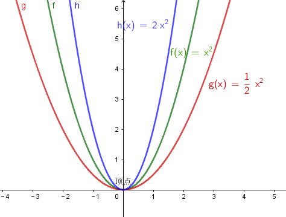

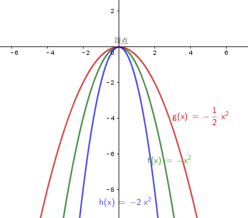

对于 stem:[ y=ax^2 ] 一般地:

- 当 a>0, 抛物线开口向上. a越大, 抛物线的开口越小.
- 当 a<0, 抛物线开口向下. a越小, 抛物线的开口越小.

换言之就是 : #|a|越大, 抛物线的开口越小.#

---

== stem:[ y=a(x - horizontal)^2 + vertical ]

==== stem:[ y=a(x - horizontal)^2 + vertical ] 的参数, 与图形变化的对应规律

.标题
====
例如：
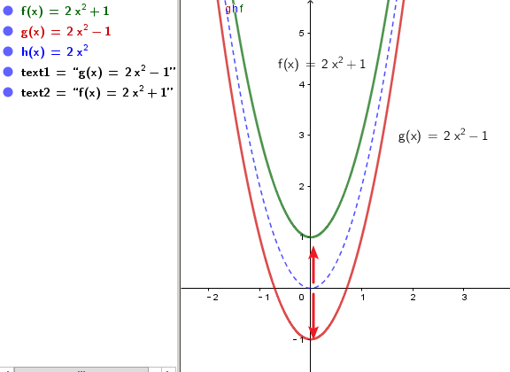

从上图可以看出 :

- stem:[y=2x^2 +1 ], 是把 stem:[y=2x^2 ] 沿着 y轴 "向上"平移1个单位的长度.
- stem:[y=2x^2 -1 ], 是把 stem:[y=2x^2 ] 沿着 y轴 "向下"平移1个单位的长度.
====

.标题
====
例如：
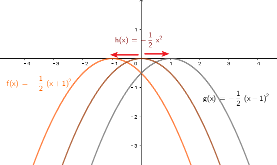

从上图可以看出,  stem:[ y = a(x-h)^2 + k ] 的规律 :

-  因为 a<0, 所以函数图开口向下.
- stem:[y=-\frac{1}{2}(x+1)^2] 是把 stem:[y=-\frac{1}{2} x^2] 沿x轴"向左"平移1个单位的结果.
- stem:[y=-\frac{1}{2}(x-1)^2] 是把 stem:[y=-\frac{1}{2} x^2] 沿x轴"向右"平移1个单位的结果.
====

.标题
====
例如：
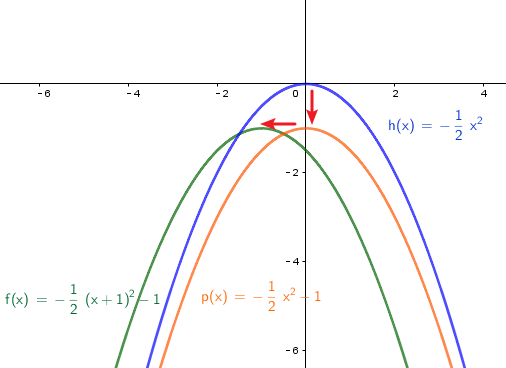

stem:[y=-\frac{1}{2}(x+1)^2 -1] 的图像是怎么得来的?

- 把 stem:[y=-\frac{1}{2}x^2 ] "向下"平移一个单位, 得到 stem:[y=-\frac{1}{2}x^2 -1 ]
- 再把 stem:[y=-\frac{1}{2}x^2 ] "向左"平移一个单位, 得到 stem:[y=-\frac{1}{2}(x+1)^2 -1]

====

从上面, 可以看出, 抛物线
\begin{align}
\boxed{
    y=a(x - horizontal)^2 + vertical
}
\end{align}
 与
\begin{align}
y=ax^2
\end{align}
的形状相同. 只是位置不同而已. +
#在x轴上"水平移动"的距离, 由 horizontal 的值来决定.# +
#在y轴上"上下移动"的距离, 由 vertical 的值来决定.#

- #当 a > 0 , 图像开口向上; a<0 时, 开口向下.#
- #对称轴是 x = horizontal#
- #顶点是 (horizontal, vertical)#

.标题
====
例如：
\begin{align}
y = -\frac{1}{2} (x+1)^2 - 3 \\
y = -\frac{1}{2} (x-(-1))^2 - 3 <- 以符合 y=a(x - horizontal)^2 + vertical
\end{align}

- stem:[a = -\frac{1}{2} <0], 所以图像开口向下
- 对称轴是 x = horizontal = -1
- 顶点是 (horizontal, vertical), 即 (-1,-3)

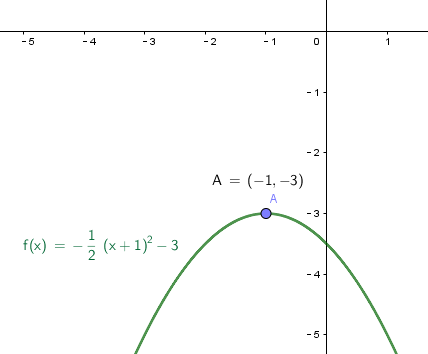

====

.标题
====
例如：

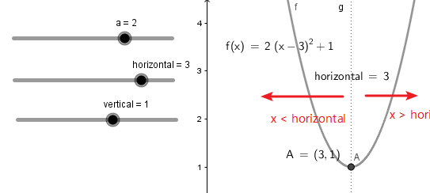

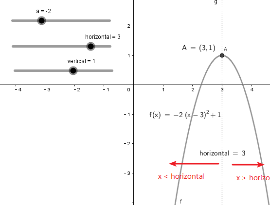

从二次函数
\begin{align}
 y=a(x - horizontal)^2 + vertical
\end{align}
的图像(如上图) 可以看出:

[options="autowidth" cols="1a,1a"]
|===
|Header 1 |Header 2

|a>0 时
|- 图像开口向上
- 当 x < horizontal 时, y值随x的增大, 而减小.
- 当 x > horizontal 时, y值随x的增大, 而增大.

|a<0 时
|- 图像开口向下
- 当 x < horizontal 时, y值随x的增大, 而增大.
- 当 x > horizontal 时, y值随x的增大, 而减小.
|===

====

---

==== 生活中的应用

.标题
====
例如：
有这样一个抛物线, 那么它与y轴的交点坐标是什么?

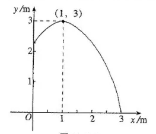

解: 根据抛物线公式 :

.抛物线
****
\begin{align}
\boxed{
 y=a(x - horizontal)^2 + vertical
}
\end{align}

- 当 a > 0 , 图像开口向上; a<0 时, 开口向下.
- #对称轴是 x = horizontal#
- #顶点是 (horizontal, vertical)#
****

顶点已知, 是(1,3),  即 horizontal=1, vertical=3, 代入进公式中, +
所以该抛物线公式就是 : stem:[y=a(x-1)^2+3 \quad (0 \le x \le 3)]

由于该抛物线经过点(3,0), 所以也代入进公式中, 就能求得a:
\begin{align}
y=a(x-1)^2+3 \\
0 = a(3-1)^2 +3 \\
a = -\frac{3}{4}
\end{align}

现在, 把 a, horizontal, vertical 的具体数值, 都代入进抛物线公式中, 就得到:
\begin{align}
y=a(x−horizontal)^2+vertical \\
y = -\frac{3}{4} (x-1)^2 + 3 \quad (0 \le x \le 3)
\end{align}

该抛物线和y轴的交点坐标是什么呢? 就是x=0 时, y的值. 即:
\begin{align}
y = -\frac{3}{4} (0-1)^2 + 3 \\
y= 2.25
\end{align}

====

---

== 二次函数 quadratic function -> stem:[y =  ax^2 + bx + c] 的参数, 与图形变化的对应规律

.标题
====
例如：
画出 stem:[y=\frac{1}{2} x^2 - 6x +21] 的图像, 并思考其"参数"如何使图像变化的性质规律.

先配方, 把x未知数的次数,从二次降维成一次. 即: +
二次函数 stem:[ y = ax^2 +bx +c ] 可以通过配方, 化成
\begin{align}
 y=a(x−horizontal)^2 + vertical
\end{align}
的形式, 推导过程即:

.一元二次_配方法
****
对一元二次函数, 做配方法:

\begin{align}
y = ax^2 + bx + c \\
= a(x^2 + \frac{b}{a} x) + c \\
= a[x^2 + \frac{b}{a} x + (\frac{b}{2a})^2] - a (\frac{b}{2a})^2 + c \\
上一步即加上"一次项系数"一半的平方 \\
=a (x + \frac{b}{2a})^2 - \frac{a b^2} {4a^2} + \frac{4ac}{4a} \\
=a (x + \frac{b}{2a})^2 + \frac{4ac - b^2} {4a}
\end{align}

所以,
\begin{align}
\boxed{
    y = ax^2 + bx + c \\
    =a (x + \frac{b}{2a})^2 + \frac{4ac - b^2} {4a}
}
\end{align}
****

套用到下例上:
\begin{align}
y=\frac{1}{2} x^2 - 6x +21 \\
a = 1/2, \quad b= -6, \quad c=21 \\
= \frac{1}{2} (x + \frac{-6} {2*\frac{1}{2}})^2 + \frac{4* \frac{1}{2}*21 - (-6)^2} {4* \frac{1}{2}} \\
= \frac{1}{2} (x-6)^2 + \frac{42-36}{2} \\
=\frac{1}{2} (x- 6)^2 +3 \\
所以, 由配方法可知, 该抛物线的顶点是 (6,3)
\end{align}

这个stem:[ \frac{1}{2} (x- 6)^2 +3 ] 的图像, 可以通过两步完成:  +
把 stem:[ \frac{1}{2} x^2 ] 的图像, "向右"平移 6 个单位, 再"向上"平移 3个单位.

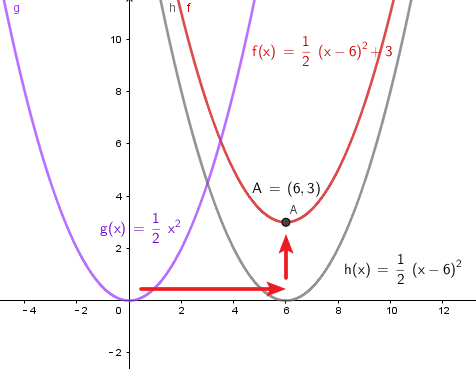

====

所以, 从下面的公式

\begin{align}
\boxed{
    y = ax^2 + bx + c \\
    =a (x + \frac{b}{2a})^2 + \frac{4ac - b^2} {4a}
}
\end{align}

可以看出 :

[cols="1a,1a" options="autowidth"]
|===
|stem:[ y = ax^2 + bx + c ]|Header 2

|对称轴
|stem:[ x = -\frac{b}{2a} ]

|顶点
|stem:[ (-\frac{b}{2a},  \frac{4ac - b^2} {4a} ) ]
|===

并且:

[cols="1a,1a" options="autowidth"]
|===
|Header 1 |Header 2

|如果 a>0
|- 图像开口向上
- 当 stem:[ x< -\frac{b}{2a}] 时, y随 x的增大, 而减小.
- 当 stem:[ x> -\frac{b}{2a}] 时, y随 x的增大, 而增大.

|如果 a<0
|- 图像开口向下
- 当 stem:[ x< -\frac{b}{2a}] 时, y随 x的增大, 而增大.
- 当 stem:[ x> -\frac{b}{2a}] 时, y随 x的增大, 而减小.
|===

image:img_math/math_29.png[]

---

==== 由几个点的坐标, 可以确定二次函数 stem:[ y= ax^2 + bx +c ]? -> 三个点的坐标 a, b, c

[cols="1a,3a"]
|===
|Header 1 |Header 2

|对于一次函数 stem:[ y= kx +b  ]
|只要求出 k, b 两个值 (给方程代入两个点的坐标(两点的连线不与坐标轴平行), 就能算出 k 和 b), 就能得到该具体的一次方程.

|对于二次函数 stem:[ y= ax^2 + bx +c  ]
|需要求出 a, b, c 三个值后 (给方程代入三个点的坐标(三点不在同一条直线上), 即可算出 a, b, c), 就能得到该具体的二次方程.
|===

.标题
====
例如： 一个二次函数的图像, 经过三个点: (-1,10), (1,4), (2,7), 那么这个二次函数的具体解析式是什么?

将这三个点的坐标, 代入二次函数公式 stem:[ y= ax^2 + bx +c ], 我们先来算出 a, b, c的值是什么?

\begin{cases}
1^2 * a - 1 * b  + c =10 \\
1^2 *a + 1*b +c = 4 \\
a*2^2 + b*2 + c = 7
\end{cases}

\begin{cases}
a = 2 \\
b = -3 \\
c = 5
\end{cases}

所以, 这个二次函数的解析式是 : stem:[ y = 2x^2 -3x +5  ]
====

---

==== 二次函数与二次方程的对应关系

二次函数 stem:[y=ax^2 + bx +c ] 的图像 与x轴的位置, 有三种关系: 1.没有公共点, 2.有一个公共点, 3.有两个公共点. 这其实就对应着一元二次方程 stem:[ax^2 + bx +c = 0 ] 的"根"的三种情况. +
所以, 我们就能利用二次函数的图像, 来求一元二次方程的根.

---

==== 生活中的应用

.标题
====
例如：
你从地面上抛一个球, 假设在某种投射角度下, 其球体高度height(单位m), 和运动时间time(单位s) 之间的函数关系为:
stem:[h = 30t - 5t^2 \quad (0 \le t \le 6)]

那么, 思考下:

- 你抛球后, 它会在空中飞多久才落地?
- 小球最高能到多少高度?
- 小球到达最高点时, 飞了多久?

该函数, 其实就是个抛物线. 那么我们就可以用它的顶点公式 stem:[ (-\frac{b}{2a},  \frac{4ac - b^2} {4a} ) ], 来计算了:

在顶点处, 小球的高度最高, 所以此时 :
\begin{align}
t = - \frac{b}{2a} = - \frac{30}{2*(-5)} = 3 \\
h =\frac{4ac - b^2} {4a}
=\frac{4*(-5) * 0 - 30^2} {4*(-5)}
= \frac{900}{20}
= 45
\end{align}

即, 3秒后, 小球达到最高点 45m.

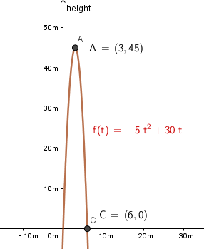

====

.标题
====
例如：
给你60m的绳子, 来圈一块矩形的土地, 边长为L (length of side), 那么为了使圈出的面积(area)最大, L应为多少?

思考: 矩形的边长 = 60, 其中一边为 L, 则另一边的长度 = (60-2L)/2 = 30-L

\begin{align}
area = length(30-length) <- 矩形面积公式 \\
a = 30l - l^2 \quad (0 < l < 30)
\end{align}

这是一个二次函数, #当图像处在顶点处时, 此处的 y坐标最大# (即 area 最大). 所以我们套用顶点公式 stem:[ (-\frac{b}{2a},  \frac{4ac - b^2} {4a} ) ]

\begin{align}
length = -\frac{b}{2a} = -\frac{30}{2(-1)} = 15 \\
area = \frac{4ac - b^2} {4a}
= \frac{4*(-1) * 0 - 30^2} {4*(-1)}
= \frac{30^2}{4}
= 225
\end{align}

所以, 当Length =15米时, area为最大值225平米.

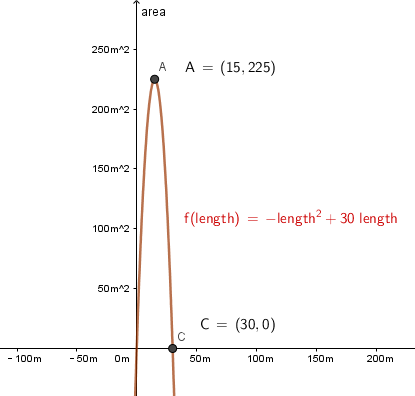
====

.标题
====
例如：你公司的产品, 数据如下:

- 进货成本: 40元/件
- 售出价: 60元/件
- 每周销量 : 300件
- 每涨价1元, 则每周销量下降10件
- 每降价1元, 则每周销量上升20件

那么你该定什么价格, 才能令你的利润最大化?

思考 : 我们分别来计算"涨价x元", 和"降价x元", 对你利润的影响程度.

'''

-> 若采取涨价x元, 则: 涨1元, 减10件; 涨x元,减10x件.

\begin{align}
利润 = (单件售价 * 每周销量) - (每件的进货成本 * 每周销量) \\
= (60+x) * (300-10x) - 40 * (300-10x) \\
= -10x^2 + 100x + 6000
\end{align}

这是个二次函数, 用顶点公式 stem:[ (-\frac{b}{2a},  \frac{4ac - b^2} {4a} ) ], 来算出该顶点处的y轴值(即利润最大值)为多少.

\begin{align}
涨价额度(顶点处的x坐标) = -\frac{b}{2a} = -\frac{100}{2*(-10)} = 5 \\
最大利润(顶点处的y坐标)= \frac{4ac - b^2} {4a}
= \frac{4* (-10) * 6000 - 100^2} {4*(-10)} = 6250
\end{align}

即: 当每件涨价 5元时, 总利润能达到最大, 即每周利润 6250元.

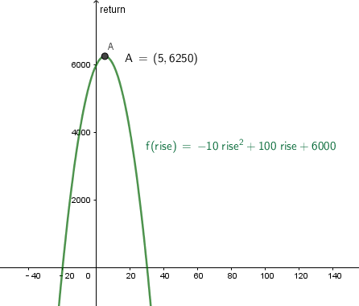

'''

-> 若采取降价x元, 则:

每降价1元, 则每周销量上升20件

\begin{align}
利润 = (单件售价 * 每周销量) - (每件的进货成本 * 每周销量) \\
= (60-x) * (300+20x) - 40 * (300+20x) \\
= -20x^2 + 100x + 6000
\end{align}

根据顶点公式:

\begin{align}
降价额度(顶点处的x坐标) = -\frac{b}{2a} = -\frac{100}{2*(-20)} = 2.5 \\
最大利润(顶点处的y坐标) = \frac{4ac - b^2} {4a}
= \frac{4* (-20) * 6000 - 100^2} {4*(-20)} = 6125
\end{align}

即: 当每件降价 5元时(顶点的x坐标值), 总利润(顶点的y坐标值)能达到最大, 即每周利润 6125元.

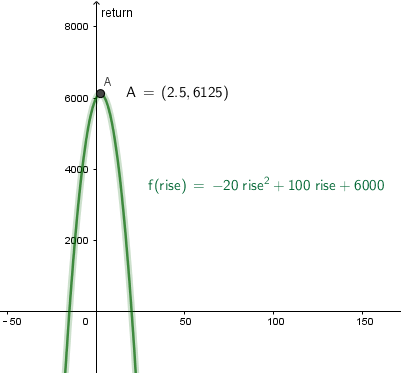

'''

比较下来后:

 - 涨价时, 函数能达到的最高顶点y值(即最大利润) 是 6250 元;
 - 降价时, 函数能达到的最高顶点y值(即最大利润) 是 6125 元;
- 所以, 应该涨价 5 元.

====

---

