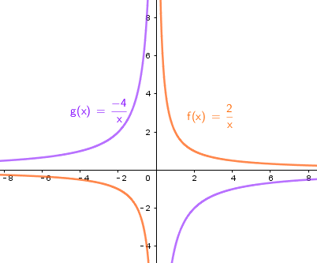
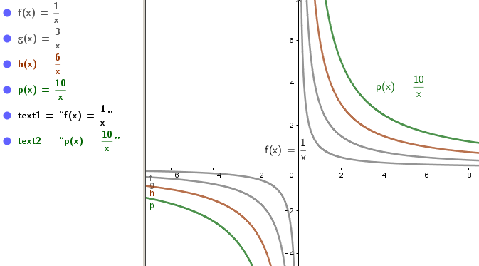
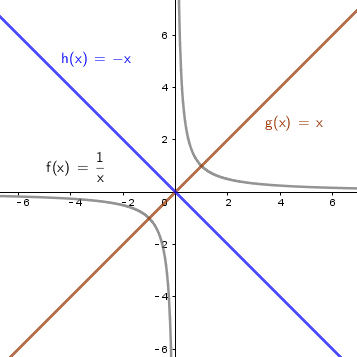

= 反比例函数
:toc:
---

== 反比例函数 inverse proportional function -> stem:[ y= \frac{k}{x}]  (k为常数, k ≠ 0)

[options="autowidth"]
|===
|Header 1 |图像

|一次函数 stem:[y=kx + b \quad (k \ne 0)]
|是一条直线

|二次函数 stem:[y = ax^2 + bx +c \quad (a \ne 0) ]
|是一条抛物线

|反比例函数 stem:[y= \frac{k}{x}]  (k为常数, k ≠ 0)
|图像由两条曲线组成, 它是双曲线.
|===

[options="autowidth" cols="1a,1a"]
|===
|性质 |反比例函数 stem:[y= \frac{k}{x}]

|k
|- 当 k > 0 时, 函数图像分别位于 第1, 第3象限.
 +
在每一个象限内, y随 x的增大, 而减小.

- 当 k < 0 时, 函数图像分别位于 第2, 第4象限.
 +
在每一个象限内, y随 x的增大, 而增大.

|\|k\|越大，反比例函数的图象, 离坐标轴的距离越远。
|

|
| 反比例函数 stem:[y= 1/2] 的图像, 关于直线 y=x 对称, 有关于 y= -x 对称

|x不能为0，y也不能为0
|#因为在 stem:[ y=k/x (k \ne 0)] 中, x不能为0，y也不能为0，所以反比例函数的图象不会与x轴相交，也不会与y轴相交，只能无限接近x轴，y轴。#

|===

---

== 生活中的应用

日常生活中的两个变量之间, 许多都具有"反比例关系".

.标题
====
例如：
\begin{align}
压强 Pressure = \frac{压力F} {受力面积S}
\end{align}
====

---
