= 指数函数, 对数函数, 反函数, 幂函数
:toc:
---

== 有理指数幂 运算法则

[options="autowidth" cols="1a,1a"]
|===
|运算法则 |Header 2

|整数指数幂
|
\begin{align}
\boxed{
a^m a^n = a^{m+n} \\
(a^m) ^n = a^{m n} \\
(ab)^m = a^m b^m
}
\end{align}

.标题
====
例如：

\begin{align}
& 8^{\frac{3} {5}} * 8^{\frac{2} {5}}
= 8^{\frac{3+2}{5}} = 8 \\
\\
& (a^{\frac{2}{3}} * b^{\frac{1}{4}} )^3
= a^{\frac{2}{3}*3} *  b^{\frac{1}{4}*3}
= a^2 * b^{\frac{3}{4}}
\end{align}
====

|二次根式
|
\begin{align}
\boxed{
(\sqrt{a})^2 = a \\
\sqrt{a} \sqrt{b} = \sqrt{ab} \\
\frac{\sqrt{a}} {\sqrt{b}}= \sqrt{\frac{a} {b}}
}
\end{align}

|根式
|
\begin{align}
\boxed{
(\sqrt[n]{a})^n = a \\
\sqrt[n]{a^n} =a <-  当 n 为奇数时 \\
\sqrt[n]{a^n} = \|a\| <- 当 n 为偶数时
}
\end{align}

.标题
====
例如：
\begin{align}
\sqrt[7]{(-2)^7} = -2
\end{align}
====

|分数指数幂
|如果n是正整数, 那么:

当
\begin{align}
\sqrt[n]{a}
\end{align} 有意义时, 则:

\begin{align}
\boxed{
a^{\frac{1}{n}} = \sqrt[n]{a} \\
a^{\frac{m} {n}} = (\sqrt[n]{a})^m = \sqrt[n]{a^m} \\
a^{-s} = \frac{1} {a^s}
}
\end{align}

.标题
====
例如：
\begin{align}
& 4^\frac{1} {2} = \sqrt{4} \\
\\
& (-27)^\frac{1} {3} = \sqrt[3]{-27} \\
\\
& 5^\frac{3} {4} = (5^3 )^\frac{1} {4} = (5^\frac{1} {4})^3 \\
\\
& 8^{\frac{2} {3}}
= (8^{\frac{1} {3}})^2
= (\sqrt[3]{8})^2
= 2^2 =4 \\
\\
& 3\sqrt{3} * \sqrt[3]{3}* \sqrt[6]{3}
= 3 * 3^{\frac{1} {2}} * 3^{\frac{1} {3}} * 3^{\frac{1} {6}}
= 3^{1+ \frac{1}{2} + \frac{1}{3} + \frac{1}{6} }
= 3^2 = 9
\end{align}
====

|===

---

== 实数指数幂

.标题
====
例如：
\begin{align}
\frac{\sqrt[3]{\sqrt{3^{10}}}} {\sqrt[3]{9}}
= [(3^{10} )^{\frac{1} {2}}]^{\frac{1}{3}} * (3^2 )^{-\frac{1}{3}}
= 3^{10 * \frac{1} {2} * \frac{1} {3} + 2*(-\frac{1} {3})}
= 3^1 =3
\\
\end{align}

image:img_math/math_82.png[]

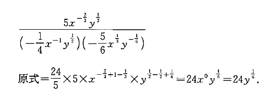

image:img_math/math_84.png[]

====

---

== 指数函数 (即 x 是指数) (stem:[y=a^x ])  -> stem:[y=2^{-x}  ] 与  stem:[ y=2^x] (指数是相反数) 的图像, 关于y轴对称

image:img_math/math_85.png[]

可以看出, 指数函数 stem:[ y=2^x] 与 stem:[ y=(\frac{1}{2})^x] 的图像, 关于y轴对称. +
而stem:[(\frac{1}{2})^x = 2^{-x}], 所以就是 stem:[y=2^{-x}  ] 与  stem:[ y=2^x] 的图像关于y轴对称. 即, #指数是相反数, 则它们的图像关于y轴对称.#

stem:[y=a^x ] 的图像一定过 点(0,1). 因为你把0代入x就知道: stem:[ a^0 = 1].

所以指数函数 stem:[y=a^x  (a>0 且 a \ne 1) ] 有以下性质:

[cols="1a,3a"]
|===
|Header 1 |Header 2

|定义域
|定义域是实数集R

|值域
|值域是 (stem:[ 0, +\infty]). 所以函数图像一定是在x轴上方. 即对于任何实数x, 都有 stem:[ a^x >0]

|过点(0,1)
|函数图像一定过 点(0,1)

|增减性
|- 当常数 a>1 时, stem:[ y= a^x ] 是增函数
- 当常数 0<a<1 时, stem:[ y= a^x ] 是减函数
|===

.标题
====
例如：判断 stem:[ 0.8^{-0.1}] 与 stem:[0.8^{-0.2} ] 的大小

思考: 因为常数 a=0.7 < 1 , 所以该指数函数是"减函数". +
因为 -0.1 > -0.2, 对于减函数来说, 就是 stem:[ 0.8^{-0.1} < 0.8^{-0.2}] 了.

image:img_math/math_86.png[]
====

.标题
====
例如：已知实数 a, b 满足 stem:[(\frac{3} {7})^a > (\frac{3}{7})^b ], 判断 stem:[ 6^a ] 与 stem:[ 6^b] 的大小.

思考:

- 常数 stem:[ \frac{3}{7} < 1], 所以该指数函数是"减函数", 即x值越大时, y值就越小. 所以指数 a < b. +
- 现在来判断 stem:[ 6^a ] 与 stem:[ 6^b] 的大小. 因为指数6 >1, 所以该指数函数是"增函数", 因为刚刚我们算出指数 a < b. 所以  stem:[ 6^a < 6^b ] 了.
====

---

== 对数函数 -> stem:[ 原指数x = log_{原常数a}原y值], 其实算出来的就是原"指数"!

如果 stem:[ a^x = y \quad (a>0, a \ne 1)],  那么 x 就叫做以a为底的 y的"对数"(logarithm ). 记作 :
\begin{align}
\boxed{
x = log_aY \\
即: 原指数x = log_{原常数a}原y值
}
\end{align}
其中:

- a : 叫做对数的"底数". 其实就是原"常数". +
常数又称"定数"，是指一个数值不变的"常量"，与之相反的是"变量"。
- y : 叫做"真数".  +
只有 Y>0 时, stem:[log_aY ] 才有意义. 即: #0和负数没有对数.# 即: stem:[ log_0Y 和 log_-nY ] 这种的不存在.
- x : 叫做以a为底的 y的"对数"(logarithm). #其实就是原"指数".#

因为 stem:[ x = log_aY ] 就是原指数, 所以我们可以把 x 代入回 原指数方程 stem:[ a^x = Y], 就会得到:
\begin{align}
a^x = Y \\
a^{log_aY } = Y
\end{align}

....
logarithm  对数
/ˈlɔːɡərɪðəm/
-> 来自logos,词，思考，比例，词源同logic,arithmos,数字，词源同arithmetic.
....

.标题
====
例如：
因为 stem:[ 2^6 = 64 ], 所以 stem:[ log_{2}64 = 6] <- #对数函数求出来的, 就是原"指数".#
====

.标题
====
例如：
\begin{align}
4^1 = 4 \\
log_4 4 = 1 <- 原指数是1
\end{align}

image:img_math/math_87.png[]

从上图最后一题, 可以看出:  +
#对数的意思就是: 5 要 变成 0.04, 则5自身要"自己乘以自己" 多少次?#
====

[cols="1a,3a"]
|===
|Header 1 |Header 2

|stem:[ log_a1 =0]
|1的对数为0.  +
即: a要变成1, a自己要乘以自己多少次? 0次. 即: stem:[ a^0 =1]

|stem:[ log_a a =1]
|底的对数为1.  +
即: a要变成a, a自己要乘以自己多少次? 不乘, 就原地保留自己1次就行了. 即: stem:[ a^1 =1]

|stem:[ a^{log_aY } = Y]
|\begin{align}
& 因为: a^x = Y, -> x = log_aY \\
& 所以: a^{log_aY } = Y
\end{align}

.标题
====
例如：
\begin{align}
& 2^{log_2 32} = 2^{原指数}= 32 \\
\\
& log_{10}10^3 => 10要变成10^3, 得10自己乘以自己多少次? = 3
\end{align}
====
|===

.标题
====
例如：
\begin{align}
& log_2 \frac{1}{2} \\
& 思考: 2要变成\frac{1}{2}, 则2自己要乘以自己多少次? 即: 2^x = \frac{1}{2} \\
& 显然, x=-1, \\
& 所以, log_2 \frac{1}{2} = -1
\end{align}
====

.标题
====
例如：
\begin{align}
& 5^{2 log_5 3} \\
& = 5^{2 (log_5 3)}
= (5^{log_5 3})^2 \\
& 思考: 对于 log_5 3, 即 5要变成 3, 则5自己要乘以自己多少次? 即 5^x = 3. \\
& 但这里的原指数x其实没必要求出来, 因为我们会发现: 本题的 5^{log_5 3} 的值就是Y, 要求的是Y, 而不是x.  \\
& 而 Y是多少? 它已经告诉我们了, 就是3了. \\
& 所以, (5^{log_5 3})^2 = 3^2 = 9
\end{align}
====

---

==== ① 常用对数 stem:[ log_{10}Y = lg Y], ② 自然对数 stem:[log_eY = ln N]

[cols="1a,3a"]
|===
|Header 1 |Header 2

|常用对数 stem:[ log_{10}Y]
|以10为底的对数, 就是"常用对数". +
底数10(即原"常数")可以省略不写, 就把 log 改写成 lg. 即: +
stem:[ \log_{10}Y ] 可简写成 stem:[lg Y ]

后续如果没有指出对数的底, 则默认指的就是"常用对数". 例如,"100(原Y)的对数是2(原x)", 就是指"100的常用对数是2".

|自然对数  stem:[log_eY ]
|以无理数 e = 2.71828... 为底的对数, 叫做"自然对数". e叫做"自然常数". +
自然对数 stem:[log_eY ] 通常简写为 stem:[ln N ]
|===

.标题
====
例如：
\begin{align}
\lg 10 \\
& 即原指数函数是 : 10^x  = 10 \\
& x = 1 \\
\\
\lg 0.01 \\
& 即原指数函数是 : 10^x = \frac{1}{10^2} \\
& x= -2 \\
\\
\ln e^5 \\
& 即原指数函数是 :  e^x = e^5 \\
& x=5
\end{align}
====

.标题
====
例如：已知 stem:[ \log_4a = \log_{25}b = \sqrt{3}] , 求 stem:[ \lg(ab)]的值.

因为
\begin{align}
& \log_4a =\sqrt{3} <- 原指数是\sqrt{3} \\
& 即: 4^{\sqrt{3}} = a \\
\\
& \log_{25}b =\sqrt{3} <- 原指数是\sqrt{3} \\
& 即: 25^{\sqrt{3}} = b \\
\\
& ab = 4^{\sqrt{3}}  25^{\sqrt{3}} \\
& = (4*25)^{\sqrt{3}}  = 10^{2 \sqrt{3}} \\
\\
& 所以 \lg(ab) = \lg 10^{2 \sqrt{3}} \\
& 即,原指数方程是 : 10^x = 10^{2 \sqrt{3}} \\
& x= 2 \sqrt{3}
\end{align}

====

.标题
====
例如：历史地震的计算公式为:
\begin{align}
里氏震级 M= \lg \frac{被测地震的最大振幅 A}{标准地震的振幅 A_0}
\end{align}

所以, 7.8级地震就是:
\begin{align}
原指数 7.8 = \lg \frac{A_{7.8}}{A_0} \\
即 10^{7.8} = \frac{A_{7.8}}{A_0} \\
A_{7.8} = 10^{7.8} A_0
\end{align}

8.0级地震就是:
\begin{align}
原指数 8.0 = \lg \frac{A_{8.0}}{A_0} \\
即 10^{8.0} = \frac{A_{8.0}}{A_0} \\
A_{8.0} = 10^{8.0} A_0
\end{align}

所以, 8级比上7.8级地震, 威力相差倍数就是:
\begin{align}
\frac{A_{8.0}}{A_{7.8}}
= \frac{10^{8.0} A_0}{10^{7.8} A_0}
= \frac{10^{8.0}} {10^{7.8}}
\approx 1.58
\end{align}
====

---

==== 对数的运算法则

[cols="1a,2a"]
|===
|Header 1 |Header 2

|\begin{align}
\boxed{
log_a Y_1 + log_a Y_2  \\
= log_a (Y_1 Y_2)  \\
= x_1 + x_2 <- 即两个原指数相加
}
\end{align}
|
\begin{align}
& 一般地, 设 : \\
& a^{x_1} = Y_1 > 0, & ① \\
& a^{x_2} = Y_2 > 0, \\
& 则: \\
& \log_a Y_1 = x_1, & ② \\
& \log_a Y_2 = x_2 \\
\\
& a^{x_1 + x_2} = a^{x_1} a^{x_2}  = Y_1 Y_2 <- 把 ①继续算下去\\
& 即头尾就是:  a^{x_1 + x_2} = Y_1 Y_2 \\
& log_a (Y_1 Y_2) = x_1 + x_2 <- 原指数 \\
& 把②代入进来, 即得: \\
& log_a (Y_1 Y_2) = log_a Y_1 + log_a Y_2
\end{align}

即:
\begin{align}
\boxed{
log_a Y_1 + log_a Y_2  \\
= log_a (Y_1 Y_2)  \\
= x_1 + x_2 <- 即两个原指数相加
}
\end{align}

例如：
\begin{align}
log_6 3 + log_6 2 = log_6 (3*2) = 1
\end{align}

.标题
====
例如： 计算器诞生前, 人们花了大量精力, 求出一些常用对数的近似值, 列成表格供查询使用. 这样, 人们就可以根据公式, 来求出另一些对数的值. 如:

由 stem:[ lg 3 \approx 0.4771, \quad lg 5 \approx 0.699 ] 可得出: +
stem:[  lg 15 = lg(3*5) = lg 3 + lg5   \approx  0.4771 + 0.699 \approx  1.1761]

那么还能不能借助 lg 3, lg 5, 来求比如 stem:[ log_3 5 ] 的值呢?

\begin{align}
& log_3 5 的值就是原"指数方程"中的指数 :  即 3^x = 5 \\
& 从而 lg 3^x = lg 5 \\
&  x lg 3 = lg 5 \\
& x = \frac{lg 5} {lg 3} \\
& 也就是说  log_3 5 = \frac{lg 5} {lg 3}
\approx \frac{0.669} {0.4771}
\approx 1.4651
\end{align}

所以, 一般地, 我们有"换底公式":
\begin{align}
\boxed{ log_a b = \frac{log_c b} {log_c a} \\
其中 a>0, 且 a \ne 1, \\
b>0, \\
c>0 且 c \ne 1
}
\end{align}

====

|可以继续推导出有:

\begin{align}
\boxed{
log_a (Y_1 * Y_2 * ... * Y_k) \\
= log_a Y_1 +  log_a Y_2 + ... + log_a Y_k
}
\end{align}
|\begin{align}
& lg 4 + lg 25
= lg(4*25)
= lg 100 \\
& 即 10^x=100 \\
& x = 2
\end{align}

|特别的, 当"正因数"全部相等时, 可得:
\begin{align}
\boxed{
log_a Y^k = k * log_aY \quad (k 是正整数)
}
\end{align}
|

\begin{align}
lg 0.001
= lg 10^{-3}
= -3* lg 10
\end{align}

|\begin{align}
\boxed{
log_a{\frac{M}{N}}  =   log_aM - log_a N \quad \\
(其中 a>0 且 a \ne 1, M>0, N>0, a \in R)
}
\end{align}
|
进一步, 由上面两个结论可知:

\begin{align}
& log_a{\frac{M}{N}} \\
& = log_a (MN^{-1}) \\
& = log_aM + log_a N^{-1} \\
& =  log_aM - log_a N
\end{align}

即:
\begin{align}
\boxed{
log_a{\frac{M}{N}}  =   log_aM - log_a N \quad \\
(其中 a>0 且 a \ne 1, M>0, N>0, a \in R)
}
\end{align}

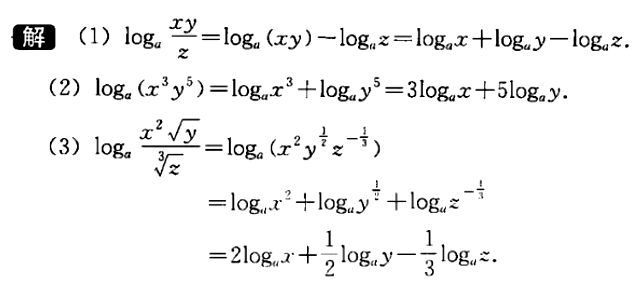

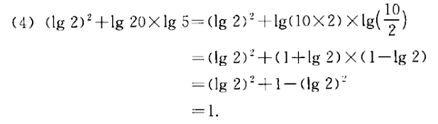

|换底公式 +
\begin{align}
\boxed{ \log_a b = \frac{\log_c b} {\log_c a}
=  \frac{\ln b} {\ln a} \\
其中 a>0, 且 a \ne 1, \\
b>0, \\
c>0 且 c \ne 1
}
\end{align}
|计算器在计算任意"对数"的值时, 就是使用"换底公式"先转化为"常用对数"或"自然数", 来计算的.

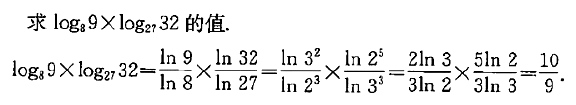

|\begin{align}
\boxed{
\log_{a^t} b^s = \frac{s}{t} \log_a b
}
\end{align}
|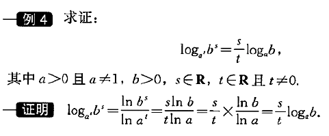

|===

---

==== 对数函数的性质, 与图像 -> stem:[ x = log_a Y ]

对数函数是
\begin{align}
\boxed{
x = log_a Y
}
\end{align}

- a 是 原常数, stem:[  a>0 且 a \ne 1]

我们先来看这两个对数函数的图像: stem:[ x = \log_2 Y] 和 stem:[ x= \log_{\frac{1}{2}} Y]

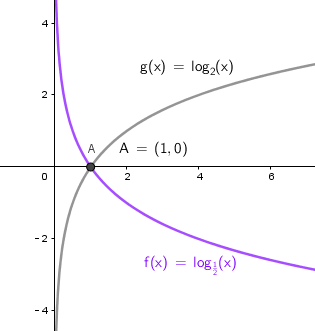

注意到:
\begin{align}
& x= \log_{\frac{1}{2}} Y \\
& = \log_{2^{-1}} Y \\
& = - log_2 Y
\end{align}

即 : stem:[\log_2 Y ], 同 stem:[  \log_{2^{-1}} Y ] 或 stem:[ - log_2 Y] 的图像, 关于x轴对称. 即它们对于的函数值, 互为相反数.

从上例, 我们就能归纳出对数函数 stem:[ x = log_a Y] 的性质来:

[cols="1a,3a"]
|===
|Header 1 |Header 2

|定义域 (原指数函数中的Y)
|stem:[( 0, +\infty)], 因此函数图像只在 y轴的右边.

|值域 (原指数函数中的x)
|是实数集 R

|必过点 (1,0)
|

|函数增减性
|- #当 "原常数"a > 1 时,   stem:[ x = log_a Y] 是增函数#
- #当 0< a < 1 时,   stem:[ x = log_a Y] 是减函数#
|===

.标题
====
例如：比较大小 stem:[log_{0.3} 3 ] 与 stem:[log_{0.3} 5 ]

思考:  原常数a = 0.3, 是  0< a < 1, 所以该对数函数是"减函数".  +
所以, stem:[ log_{0.3} 3  > log_{0.3} 5]
====

.标题
====
例如： 比较大小 stem:[\log_7 0.5 ] 与 stem:[ 0]

思考: 0 就是 = stem:[ log_7 1] +
而原常数 a = 7 > 1 , 该对数函数就是增函数. +
所以, stem:[\log_7 0.5 < log_7 1 = 0]
====

.标题
====
例如： 已知 stem:[ log_{0.7} 2m < log_{0.7} (m-1)], 求 m 的取值范围.

思考: 原常数a = 0.7 , 说明该对数函数是减函数. +
所以, stem:[ 2m>m-1] +
又因为"对数函数"的定义域, 永远在y轴右边, 本例即: stem:[ 2m>0, 同时 m-1>0]

所以就是:
\begin{cases}
2m>m-1 \\
m-1>0
\end{cases}

\begin{cases}
m> -1 \\
m > 1
\end{cases}

所以最终就是 stem:[ m>1]

====

---

== 反函数 -> 两个函数的输入值, 输出值, 互为颠倒

.标题
====
例如： +
指数函数是 stem:[ y = a^x] +
对数函数是 stem:[ x = log_a Y]

所以, 他们的自变量和因变量, 是对调的. 他们其实就是互为"反函数".
====

"反函数"即: 对于 stem:[ y=f(x)], 如果 stem:[ g(y)=g(f(x))=x], 即 输入原y值, 又能重新输出原x值. (苹果汁进去, 苹果出来). 则这两个函数互为"反函数".

一般地, 函数 stem:[ y = f(x)] 的反函数, 记作 stem:[ x = f^{-1} (Y)]

互为"反函数"的两个函数的性质有:

[cols="1a,2a"]
|===
|Header 1 |Header 2

|反函数的图像, 关于 直线 stem:[ y=x] 对称.
|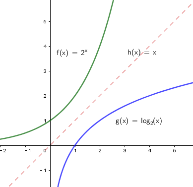

#可以看出 : 指数函数 和 对数函数, 关于直线 stem:[ y=x] 对称.#

|可以看出 : 因为两个函数的 自变量x 和 因变量y,  是对调的
|所以 :

- stem:[ y = f(x)] 的"定义域", 就是 stem:[ x = f^{-1} (Y)] 的"值域"
- stem:[ y = f(x)] 的"值域", 就是 stem:[ x = f^{-1} (Y)] 的"定义域"

|一个函数是否有"反函数"的判断:
|如果 stem:[ y=f(x)] 是单调函数, 那么它一定就有反函数 stem:[ y=f^{-1}(x)] 存在. +
此时:

- 如果 stem:[ y=f(x)] 是增函数, 则   stem:[ y=f^{-1}(x)] 也是增函数
- 如果 stem:[ y=f(x)] 是减函数, 则   stem:[ y=f^{-1}(x)] 也是减函数
|===

---

== 幂函数 -> stem:[ y = x^n] 即 n个自变量相乘

幂函数的性质:

[cols="1a,3a"]
|===
|Header 1 |Header 2

|定义域, 值域, 奇偶性, 单调性
|幂函数 stem:[ y = x^n], 随着 a 的取值不同, 函数的 定义域, 值域, 奇偶性, 单调性, 也不尽相同.

|必过点(1,1)
|所有的幂函数, 在区间 stem:[( 0, +\infty)] 上都有定义, 在第一象限内都有图像, 并且图像都通过点 (1,1)

|指数n 对函数增减性的影响
|- n > 0 时, 幂函数的图像会通过原点, 并在区间stem:[( 0, +\infty)] 上是"增函数". 如下图中的 stem:[ f(x) = x^3]
- n < 0 时, 幂函数在区间stem:[( 0, +\infty)] 上是"减函数". 并且在第一象限内:  +
-> 当x 从右边趋于原点时, 图像无限逼近y轴 +
-> 当x 无限增大时, 图像在x轴上方, 且无限逼近x轴.

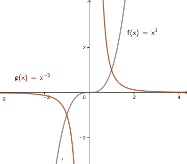

|===

---

== 增长速度的比较 -> 看斜率 stem:[ \frac{\Delta y}{\Delta x}]

\begin{align}
斜率 = \frac{\Delta y}{\Delta x}
= \frac{f(x_2)-f(x_1)} {x_2 - x_1}
\end{align}

意思就是: 当自变量每增加 1个单位, 函数值(即y值)平均将增加 stem:[\frac{\Delta y}{\Delta x} ] 个单位.

.标题
====
例如：对于 y = 2^x 这个函数, 它在区间 [1,2] 与 [2,3]上的斜率是多少?

在 [1,2]区间上的斜率就是:

\begin{align}
斜率 = \frac{\Delta y}{\Delta x}
= \frac{2^{x_2} - 2^{x_1}} {x_2 - x_1}
= \frac{2^2 - 2^1}{2-1} = 2
\end{align}
====

.标题
====
例如： stem:[ h(x) = log_2 x] 在区间 [a, a+1] (a>1) 上的平均变化率 (即斜率) 是多少?

\begin{align}
& \frac{\Delta h}{\Delta x}
= \frac{log_2(a+1) - log_2 a} {(a+1) - a} \\
& = \frac{log_2{\frac{a+1}{a}}}{1} <- 根据对数的性质: log_aM - log_a N =  log_a{\frac{M}{N}}  \\
& = \log_2 (1+ \frac{1}{a})
\end{align}

本对数函数的"原常数"是2, 大于了1, 即它是一个增函数.

又因为题目给出 a>1, 即: stem:[ \log_2 (1+ \frac{1}{a})] 中的 stem:[ 1+ \frac{1}{a} ] 的值是 "1点几", 不超过2.

于是就有:

\begin{align}
 \log_2 (1+ \frac{1}{a}) <  \log_2 (1+ \frac{1}{1}) = 1
\end{align}

即:
\begin{align}
& \frac{\Delta h}{\Delta x}
= \log_2 (1+ \frac{1}{a}) < 1
\end{align}

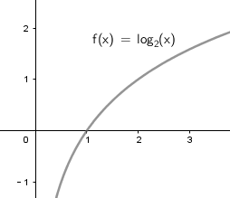
====

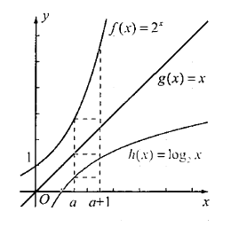

从图上可以看出 :

- #指数函数 stem:[ Y= 2^x],  当自变量x 每增加 1个单时, y值的增长会越来越快.#  +
#所以人们把类似"指数函数"的增长, 称为"指数级增长". (即"飞轮效应")#

- 对数函数 stem:[ x = log_2 Y ], 增长会越来越慢.

指数函数的增长是非常惊人的 :

.标题
====
例如： 你认为  stem:[0.99^365 ] 和 stem:[1.01^365 ] 和 stem:[1.02^365 ] 的差别有多大?

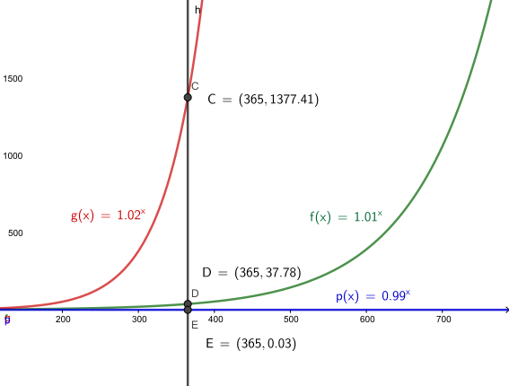

注意到 stem:[0.99^365 ] 是个减函数
====

.标题
====
例如： 有一套房子, 目前价格200万, 假设放假每年上涨 10%, 而你每年能固定储蓄下 40 万元. 并且你在不贷款, 收入不增加的前提下, 你要多少年才能买得起这套房?

思考: 就要比较你的存款收入增长, 和房价增长, 两条函数曲线是否有相交了:

[options="autowidth"]
|===
|Header 1 |当前 |1年后 | 2年后

|你的存款总额 +
stem:[y = 40 * (0+x) ]
|0
|40万
|40*2 = 80万

|房价额 +
stem:[ y = 200 (1+10%)^x]
|200万
|200 * (1+10%) = 220万
|\begin{align}
200 * (1+10\%) * (1+10\%)  \\
= 200 * (1+10\%)^2 = 242 万
\end{align}
|===

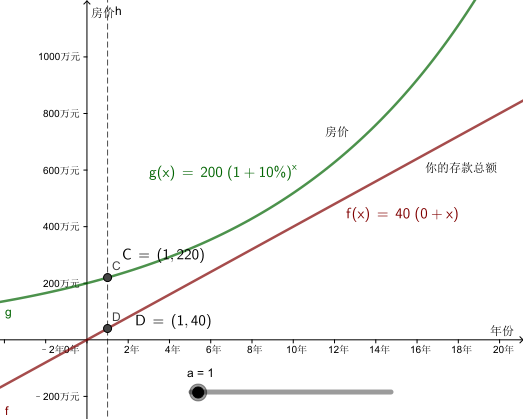

可以看出, 你的存款曲线, 无法超越房价曲线. 因此, 你永远也买不起这套房

====

---

== 生活中的应用

生活中有很多量与量的关系, 都可以归结到 "指数关系". 因此, 指数函数, 对数函数 和 幂函数, 有着广泛的应用.

.标题
====
例如：假设, 你最开始的本金是 a 元, 每期的利率是 r, 存 x期后的"本息和", 是 f(x) 元. +
那么要经过多少期后, 你的"本息和"会超过本金的2倍?

|===
|Header 1 |当前|1年后 | 2年后

|本息和
|a 元
|a (1+r)
|stem:[ a (1+r)^2]

|===

即, 我们要算 :
\begin{align}
&a(1+r)^x \ge 2a \\
& x \ge \frac{\ln 2}{\ln (1+r)} <- 求原指数, 就是"对数函数"要排上用场了
\end{align}
====

.标题
====
例如： 中国的二氧化碳排放量, 要求2020年控制在1580万吨以下, 即比2015年下降15%.  +
那么2019年时, 要求是多少呢?

思考: 本题依然可以转化为"投资回报率"的形式, 不过注意: 本题中, 它是递减的, 而不是递增的 :

[options="autowidth"]
|===
|年利率 (rate 或 i) |2015年 |...|2020年

|
\begin{align}
\boxed{
PV(1- i )^n = FV
}
\end{align}
|现值 PV = ?
|n 期
|本息和 (终值 FV) = 1580

|===

根据题目给出的信息, 可知:
\begin{cases}
PV (1-i)^{2020-2015} = FV \\
FV = 1580 \\
FV = PV (1-15\%)
\end{cases}

\begin{align}
PV = \frac{1580}{1-0.15}
= \frac{31600}{17}
\end{align}

所以进而能知道 i 了 :
\begin{align}
& PV (1-i)^{2020-2015} = FV \\
& \frac{31600}{17} (1-i)^{2020-2015}  =1580 \\
& (1-i)^5 = \frac{17}{20} \\
& 1-i =  (\frac{17}{20})^{\frac{1}{5}} \\
& i = 1- (\frac{17}{20})^{\frac{1}{5}}
\end{align}

那么2019年时 (n=4), 就是:
\begin{align}
& PV (1-i)^n= FV \\
& = \frac{31600}{17} * (1- (1- (\frac{17}{20})^{\frac{1}{5}} ))^4 \\
& \approx 1632
\end{align}

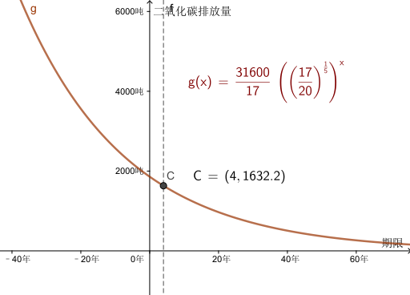

====

.标题
====
例如：某强度(x)的声音, 和其对应的分贝数 f(x), 有这种物理关系:

\begin{align}
\boxed{
分贝数 f(x) = 10 \lg \frac{某强度x的声音}{ 1* 10^{-12}}
}
\end{align}

那么:

- 0 dB (是y值) 的声音的强度(x)是多少?

把 y = 0 dB 代入进物理公式中:

\begin{align}
& 0 = 10 \lg \frac{x}{ 1* 10^{-12}} \\
& \log_{10} \frac{x}{ 1* 10^{-12}} =0  <- log_{原常数} Y = 原指数 x \\
& 还原成 原"指数函数", 就是 : \\
& 10^0 = \frac{x}{ 1* 10^{-12}} \\
& x = 1* 10^{-12}
\end{align}

即 等级为 0 dB 的"声音强度", 是 stem:[  1* 10^{-12}]

- 90 dB 和 60 dB 声音的 强度之比, 是多少?

即: 算 stem:[  \frac{分贝数 f(90)} {分贝数 f(60)} ]

\begin{cases}
10 \lg \frac{90分贝声音的强度}{ 1* 10^{-12}} = 90 \\
10 \lg \frac{60分贝声音的强度}{ 1* 10^{-12}} = 60
\end{cases}

\begin{cases}
90分贝声音的强度 = 10^{-3} \\
60分贝声音的强度 = 10^{-6}
\end{cases}

所以 90 dB 的声音强度, 是 60 dB的 1000倍!

====

.标题
====
例如：数据显示, 中国 7岁以下女童的身高, 增长速度越来越慢. 即, 一开始增长速度比较快, 后来慢慢变缓. 在我们熟悉的函数中, 只有幂函数 stem:[ y=\sqrt{x} ] 具有这种性质. 因此, 女童的生长规律可以用:
\begin{align}
身高 fnHeight(age) = a\sqrt{age} + b
\end{align}
来描述.
====

.标题
====
例如：某农作物, 在不同生长阶段的植株高度, 是先慢, 后快, 然后又变慢.

- 在前半段 先慢后快 : 在我们熟悉的函数中, 只有指数函数 stem:[ y=a^x \quad (a > 1)] 具有这种性质. 因此可以用 stem:[ height(x) = ae^{bx}  ] 来描述.

- 要完整描述 "慢-快-慢" 的增长规律, 人们一般用 Logistic growth model (逻辑斯蒂增长模型, 又称"自我抑制性方程").

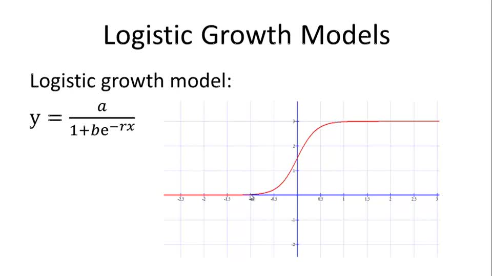

====

---

