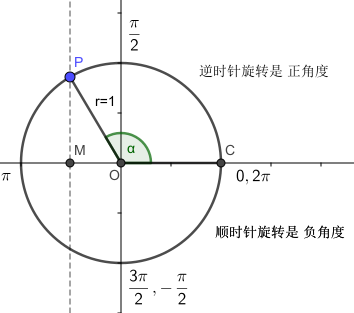
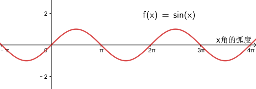
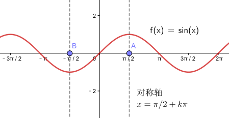
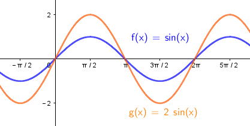
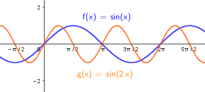
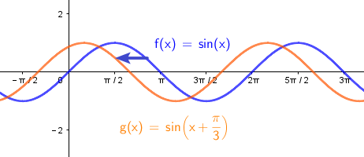
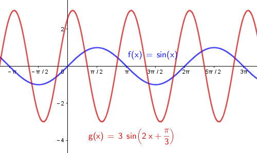
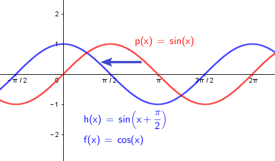
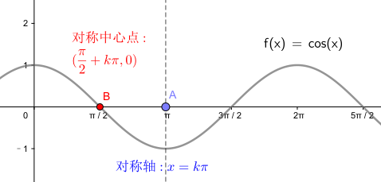

= sin, cos, tan, cot
:toc:
---

== sin 的性质与图像

上图, 圆的半径 r = 1

[cols="1a,3a"]
|===
|stem:[ \alpha] 或 x 是角度 |Header 2

|角x 的"正弦线" ->
|\begin{align}
\overrightarrow{MP}
\end{align}

|f(x) = sin x 的定义域:
|因为任意角, 都有正弦, 所以 f(x) = sin x 的定义域, 即x 的取值范围, 显然是 stem:[  x \in R]

|f(x) = sin x 的值域:
|从图中的正弦线可以看出: MP在y值上的高度, 最大也只能是1, 最小是0.  +
所以, f(x) = sin x 的值域是: [-1, 1]

|f(x) = sin x 的最大值 和 最小值:
|x是角度. 可以看出:

- 当它的角度是 stem:[ \pi/2]时, y值最大 = 1.
- 当它的角度是 stem:[ 3\pi/2]时, y值最小 = -1.

所以:
\begin{align}
& 当且仅当 x =  2 \pi k +\frac{\pi}{2}, k \in Z 时, 函数 f(x) = sin(x) 有最大值 y_{max} = 1 \\
& 当且仅当 x =  2\pi k +\frac{3\pi}{2}, k \in Z 时, 函数 f(x) = sin(x) 有最小值 y_{min} = -1
\end{align}

|y=零点处
|从图上可以看出, f(x) = sin(x), 要y值为零点, 则x 在stem:[ k *\pi] 处, 即 OP 就处在x坐标轴上.

|周期性
|从图上可知, 圆的一周为 stem:[ 2\pi]角度, 所以当 x角 stem:[ \pm 2\pi] 时, 即进入下一个圆周循环转动, y值就会重复出现.  +
所以, sin 的最小正周期是 stem:[ 2\pi].  +
stem:[ 2 \pi k] 都是它的周期.

|单调性
|
从图上可以看出:

- 当 x角 从stem:[- \pi/2 ] 变到 stem:[ \pi/2] 时, y值是递增的, 从 -1 变到 1
- 当 x角 从stem:[\pi/2 ] 变到 stem:[ 3\pi/2] 时, y值是递减的, 从 1 变到 -1

|===

.标题
====
例如：
\begin{align}
& 比较 sin(-\frac{17 \pi}{4}) 和 sin(-\frac{23 \pi}{5}) 的大小 \\
&   sin(-\frac{17 \pi}{4}) \\
& = - sin(\frac{17 \pi}{4})  <- sin是奇函数, 所以 sin(-x) = - f(x) \\
& = - sin( 4 \pi + \frac{ \pi}{4})  \\
& = - sin( \frac{ \pi}{4})  \\
& \\
& sin(-\frac{23 \pi}{5}) \\
& = - sin(\frac{23 \pi}{5})  <- sin是奇函数 \\
& = - sin(4 \pi + \frac{3 \pi}{5}) \\
& = - sin( \frac{3 \pi}{5}) \\
& = - sin( \pi - \frac{2 \pi}{5}) \\
& = - sin( 2 \frac{\pi}{2} - \frac{2 \pi}{5}) <- ① k=2, 奇变偶不变, 所以最终依然是 sin. ② \pi - \frac{2 \pi}{5} 在第2象限, sin为正号 \\
& = - (+sin  \frac{2 \pi}{5})
\end{align}

又因为 stem:[ f(x) =  sin(x)] 是在定义域stem:[ \[ - \pi/2, \pi/2\]] 内递增的, 且:
\begin{align}
- \frac{\pi}{2} < \frac{\pi}{4} < \frac{2\pi}{5} < \frac{\pi}{2}
\end{align}

所以:
\begin{align}
& -\frac{\pi}{4} > -\frac{2\pi}{5} \\
& sin(-\frac{17 \pi}{4}) > sin(-\frac{23 \pi}{5})
\end{align}
====

sin 的图像:

|===
|Header 1 |Header 2

|对称轴
|stem:[ x = \pi/2 + k \pi, (k \in Z)]

|对称中心点
|stem:[ 点(k \pi, 0), (k \in Z) ]
|===

---

== 正弦型函数 Sinusoidal function -> stem:[ y = A sin(\omega x +\phi) ]

一般地, 形如
\begin{align}
\boxed{
 y = A sin(\omega x +\phi), \quad A \ne 0, \omega \ne 0 \\
其中, A, \omega, \phi 都是常数.
}
\end{align}
的函数, 在物理, 工程等学科中 , 经常遇到. 这种类型的函数称为 "正弦型函数".

[cols="1a,3a"]
|===
|Header 1 |Header 2

|stem:[ f(x) = 2 sin x ] 的性质
|

从上图可以看出, stem:[  y= 2 sin x] 是把 stem:[  y = sin x] 的y值的波动, 放大了2倍.

所以, 一般地:
\begin{align}
\boxed{
f(x) = A sin x, (A \ne 0) \\
定义域 : R \\
值域 :[ -\|A\|, \|A\| ] \\
周期 :2 \pi
}
\end{align}

|stem:[ f(x) = sin 2x ] 的性质:
|

可以看出, stem:[ f(x) = sin 2x ] 的图像 是把 stem:[ f(x) = sin x ] 的图像, 横坐标x 变为原来的 stem:[  1/2] 得到.

所以, 一般地:
\begin{align}
\boxed{
f(x) = sin (\omega x), (\omega \ne 0) \\
定义域 : R \\
值域 :[ -1,1 ] \\
周期 : \frac{2 \pi}{\|\omega\|}
}
\end{align}

| stem:[ f(x) = sin(x + \frac{\pi}{3})] 的性质:
|

从图上可以看出, stem:[   f(x) = sin(x + \frac{\pi}{3})] 的图像, 是由 stem:[ f(x) = sin x ] 的图像向左平移 stem:[ \pi/3 ] 个单位而得到.

所以, 一般地:
\begin{align}
\boxed{
f(x) =  sin (x + \phi), (A \ne 0) \\
定义域 : R \\
值域 : [-1, 1] \\
周期 :2 \pi
}
\end{align}

| stem:[ f(x) =3 sin(2x + \frac{\pi}{3})] 的性质:
|

把 stem:[ y = sin x ] 横坐标变为原来的 stem:[  1/2]  => 得到 stem:[ y = sin 2x ] ,  +
再纵坐标变为原来的3倍 => 得到 stem:[ y =3 sin 2x ],  +
再向左平移 stem:[  \pi/6]个单位 => 得到 stem:[ f(x) =3 sin(2x + \frac{\pi}{3})]

|===

所以: 一般地, 正弦型函数:

\begin{align}
\boxed{
f(x) = A sin(\omega x + \phi) \quad (A \ne 0, \omega \ne 0)
}
\end{align}

[options="autowidth"]
|===
|Header 1 |Header 2

|A
|称为振幅. +
控制图像的纵坐标(y轴) 伸长(A> 1) 或缩短(0<A<1) 到原来的A倍(横坐标不变)。

|ω
|称为"圆频率"或"角频率".  +
控制图像的横坐标(x轴) 缩短(ω>1) 或伸长(0<ω<1) 到原来的1/ω倍(纵坐标不变)

|φ
|称为"初相位"或"初相角"(在物理中, 比如弹簧的运动, stem:[ \phi]即决定在 time = 0 时, 该物的位置, 所以叫"初相"), 控制图像 向左(φ>0) 或向右(φ<0) 平行移动\|φ\|个单位.

|定义域
| R

|值域
|[- \|A\|, \|A\|]

|周期
|stem:[  \frac{2 \pi}{\|\omega\|}] +
比如物理中,  stem:[ 周期T =  \frac{2 \pi}{\|\omega\|}] 表示某物体完成一次运动所需要的时间 (即循环运动的周期).

此时, stem:[ f = \frac{1}{周期T} = \frac{\|\omega\|}{2 \pi} ] 表示单位时间内, 完成的运动次数, 即 "频率".
|===

---

== cos 余弦函数

[options="autowidth"]
|===
|Header 1 |Header 2

|stem:[ f(x) = cos x  ]
|stem:[ f(x) = cos x  ] 的图像和性质, 与 stem:[ f(x) = sin(x+ \frac{\pi}{2}) ] 完全相同.

cos 是由 sin "向左"平移 stem:[ \pi/2 ] 个单位而得到.

|对称轴
|stem:[ x = k \pi ]

|对称中心点
|stem:[ (\pi/2 + k \pi, 0 )], 其中 stem:[ k \in Z ]

|===

.标题
====
例如：
\begin{align}
& y = -3 cos x +1 的值域是多少? \\
& 思考: cos 的值域是和 sin 一样的, 都是 [-1, 1], 所以: \\
& -1 \le cos x \le 1 \\
& 3 \ge -3 cosx \ge -3 <- 上式两边同时乘以(-3)\\
& 4 \ge -3 cosx +1 \ge -2 <- 上式两边同时加上 1\\
& 所以, 原式 的值域就是: -2 \le y \le 4
\end{align}
====

---

52

---

