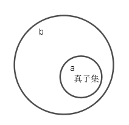
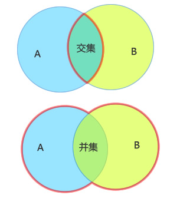
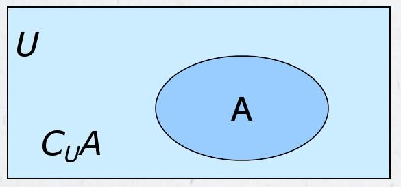
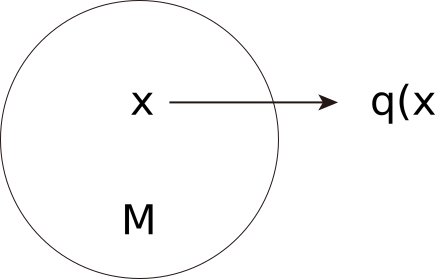
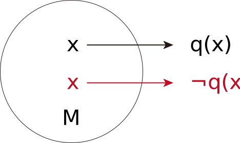
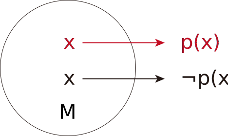
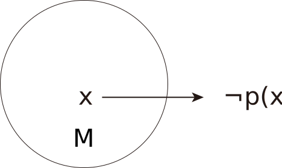
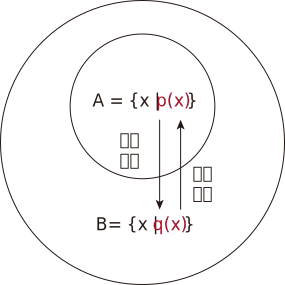
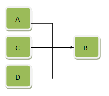
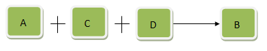

= 集合
:toc:
---

= 集合 set

==== 集合中元素的性质 -> 1. 条件确定性, 2.互异性,唯一性, 3. 无序性

集合的元素, 具有以下特点:

[cols="1a,3a"]
|===
|Header 1 |Header 2

|确定性
|集合的元素必须是确定的. 因此, 不能确定的对象, 不能组成集合. +
即, 给定一个集合, 则任何对象是不是这个集合的元素, 应该可以明确地判断出来.

比如:

- "你的公司中, 高个子的人能组成一个集合吗?" <- 不能组成集合. 因为什么才能算做"高个子"? 不满足确定性. 没有给出判定条件.
- "你的公司中, 身高不低于175cm的人能组成一个集合吗?" <- 可以组成集合.

|互异性
|对于一个给定的集合, 集合中的元素一定是不同的. +
因此, 集合中的任意两个元素, 必须都是不同的对象. 相同的对象归入同一个集合中时, 只能算作集合中的一个元素.

例如 : success 所的所有字母组成的集合, 包含的元素只有4个: s, u, c, e

|无序性
|集合中的元素无所谓前后顺序
|===

---

==== "有限集"中包括"空集"
\begin{align}
集合
    \begin{cases}
    有限集 (含有有限个元素)
        \begin{cases}
        ... \\
        空集 (包含0个元素的集合)
        \end{cases} \\
    无限集 (含有无限个元素)
    \end{cases}
\end{align}

---

==== 常见数集的符号 ->

image:img_math/math_47.svg[]

按从小到大的范围, 如下:
[cols="1a,3a"]
|===
|Header 1 |Header 2

|N (natural number)
|自然数集 : 即所有"非负整数"组成的集合.

'''

注意: 0 是 自然数集N 中的一个元素:
stem:[ 0 \in N]

'''

可以看出: 如果 stem:[ a \in N, b \in N], 则:

- 一定有 stem:[ ab \in N]
- 但 stem:[a-b \in N ] 和 stem:[ \frac{a}{b} \in N] 都不一定成立.

例如:

stem:[ 1 \in N, 3 \in N], 但 stem:[1-3= -2 \notin N ] 且 stem:[ 1/3 \notin N]

|stem:[ N_+] 或 stem:[ N^\ast]
|正整数集: 即自然数集N中, 去掉元素0之后的集合.

|Z (integer, 德语是 Zahlen)
|整数集 : 即所有"整数"组成的集合.

与自然数集N 不同的是 : 对于整数集, 如果 stem:[ a \in Z, b \in Z ], 则:

- 一定有 stem:[a-b \in Z ]
- 但 stem:[ \frac{a} {b} \in Z] 不一定成立.

|Q (rational number, 商 quotient)
|由于两个整数相比的结果(商)叫做有理数,商的英文是quotient, 所以就用Q了.

quotient  /ˈkwəʊʃnt/ -> 来自拉丁语quot,多少，词源同quality,quantity. 用于数学名词"商"。 +
( mathematics 数 ) a number which is the result when one number is divided by another 商（除法所得的结果）

'''

有理数集 : 即所有"有理数"组成的集合. 什么叫做"有理数"? 就是凡是能够表示成"分数"的数, 就称为"有理数".

因此, 如果 stem:[a \in Q, b \in Q, 且 b \ne 0, 则 \frac{a} {b} \in Q]

例如: stem:[3 \in Q, 1/2 \in Q, 则 \frac{3} {1/2} =6 \in Q]

|R ( real number)
|实数集 : 即所有实数组成的集合.

|C (complex number)
|复数集
|===

---

== 特征性质描述法

特征性质:: 一般地, 如果属于集合A的任意一个元素x, 都具有性质 p(x), 而不属于集合A的元素都不具有这种性质, 则, 性质p(x) 就称为集合A 的一个"特征性质".

特征性质描述法 (简称"描述法"):: 此时, 集合A 可以用它的"特征性质" p(x) 表示为: +
stem:[ {x | p(x)} ] +
这种表示集合的方法, 就称为"特征性质描述法".

例如: 所有能被3整除的整数, 组成的集合, 可以用描述法表示为: +
stem:[{x | x=3n, \quad n \in Z}]

---

== 集合的基本关系

==== 子集

子集:: 如果集合A的任何一个元素, 都是集合B中的元素, 那么集合A 就称为是集合B 的子集.

[cols="1a,3a"]
|===
|Header 1 |Header 2

|包含于
|若集合A 是集合B 的子集, 就记作:

\begin{align}
A \subseteq B \quad (或 B \supseteq A)
\end{align}

读作 "A包含于B" (或"B包含A")

|不包含于
|如果 A 不是 B 的子集, 则记作:
\begin{align}
A \nsubseteq B \quad 或 (B \nsupseteq A)
\end{align}

读作 "A不包含于B" (或"B不包含A")
|===

[options="autowidth"]
|===
|Header 1 |Header 2

|\begin{align}
A \subseteq A
\end{align}
|任意集合A , 都是它自身的子集

|\begin{align}
\varnothing \subseteq A
\end{align}
|空集是任意一个集合A 的子集.
|===

---

==== 真子集

真子集:: 如果集合A 是集合B 的子集, 并且集合B中 *至少有一个元素不属于A*, 那么集合A 就称为集合B 的"真子集".

记作:
\begin{align}
A \subsetneqq B \quad (或 B \supsetneqq A)
\end{align}

读作 "A真包含于B" (或 "B真包含A")

根据子集, 真子集 的定义可知:
对手集合 A, B, C :

\begin{align}
如果 A \subseteq B, \quad B \subseteq C, \quad 则 A \subseteq C \\
如果 A \subsetneqq B, \quad B \subsetneqq C, \quad 则 A \subsetneqq C
\end{align}

image:img_math/math_49.png[]

.标题
====
例如：写出集合A = {6,7,8} 中的所有子集和真子集.

思考: 集合A中含有3个元素, 因此它的"子集"含有的元素个数, 最少就为0个, 最大就为3个:

[options="autowidth"]
|===
|Header 1 |Header 2

|子集中的元素个数为0个的
|即 \begin{align}
\varnothing
\end{align}

|子集中的元素个数为1个的
|有 {6}, {7}, {8}

|子集中的元素个数为2个的
|有 {6,7}, {6,8}, {7,8}

|子集中的元素个数为3个的
|有 {6,7,8}
|===

在上述子集中, 除去集合A本身, 即 {6,7,8}, 剩下的都是A的"真子集".

====

.标题
====
例如：
已知
\begin{align}
& S = \{ x \mid (x+1)(x+2)=0\}, \\
& T= \{ -1, -2 \}
\end{align}

问 : 这两个集合的元素有什么关系?  stem:[S \subseteq T] 吗? stem:[T \subseteq S] 吗?

因为**集合之间的关系, 是通过元素来定义的. **所以只要针对集合中的元素进行分析即可.

其实, 组成S的元素, 和组成T的元素, 完全相同, 都是{-1, -2}. 所以 S = T.

另外, 从子集的定义可知:

- 如果 stem:[ A \subseteq B] 且 stem:[ B \subseteq A], 则 stem:[ A=B]. 即 两者互为对方子集的话, 它们就相等.
- 如果 stem:[ A = B], 则 stem:[  A \subseteq B], 则 stem:[ B \subseteq A]. 即 如果两者相等, 则它们就互为对方的子集.

====

---

==== 全集 U (universal set)

---

== 集合的基本运算

==== intersection 交集 -> stem:[A \cap B]

交集 (intersection). A 交 B

性质有:

\begin{align}
\boxed{
A \cap B = B \cap A \\
A \cap A = A \\
A \cap \varnothing  = \varnothing \cap A = \varnothing \\
如果 A \subseteq B, 则 A \cap B = A, 反之也成立
}
\end{align}

---

==== union set 并集 -> stem:[ A \cup B ]

并集 (union set). A 并 B

---

==== complementary set /supplementary set 补集 -> \begin{align}\complement_UA \end{align}

补集 (complementary set /supplementary set) :: 如果集合A 是全集U (universal set) 的一个子集, 则: 由 U 中不属于 A 的所有元素组成的集合, 称为 A 在 U 中的"补集".

记做:

\begin{align}
\boxed{
\complement_UA
}
\end{align}

读作 "集合A 在全集U 中的补集".

给定全集U, 和任意一个子集A, 补集运算具有如下性质:

\begin{align}
\boxed{
A \cup (\complement_UA) = U \\
A \cap  (\complement_UA) = \varnothing \\
\complement_U(\complement_UA) = A
}
\end{align}

---

== ----- -----

---

== 命题与量词

==== 命题 mathematical proposition

....
proposition   /ˌprɒpəˈzɪʃn/

n. an idea or a plan of action that is suggested, especially in business 提议，建议（尤指业务上的） /( formal ) a statement that expresses an opinion 见解；主张；观点
-> pro-前,公开 + -posit-放置 + -ion名词词尾

- I'd like to put a business proposition to you. 我想向您提个业务上的建议。
....

命题 (mathematical proposition) :: 类似于"对顶角相等"这样的可供"真假判断"的陈述语句, 就是命题. +
-> 判断为"真"的语句, 称为"真命题". +
-> 判断为"假"的语句, 称为"假命题".

数学中的定义、公理、公式、性质、法则、定理, 都是数学命题。

注意: 一个"命题", 要么是"真命题", 要么是"假命题", 不能同时既是"真命题"又是"假命题". 也不能模棱两可, 无法判断是"真命题"还是"假命题".

命题可以用小写英文字母表示, 如, 若记为

\begin{align}
\boxed{
p: A \subseteq (A \cup B)
}
\end{align}

则可知 p是一个真命题.

数学中, 有些命题至今还未能判断真假. 它们就只能称为"猜想".

---

====  量词 -> 全称量词 ∀;  存在量词 ∃

==== ---- 全称量词 ∀

全称量词 ∀ (universal quantification) :: 一般地, "任意", "所有", "每一个" 在陈述中表示所述事物的全体, 称为"全称量词". 用符号 stem:[  \forall  ] 表示.  #stem:[  \forall  ] 就表示"任意, 概无例外"的意思.# 在汉语中，该符号就读作"任意"。

全称量词命题:: 含有"全称量词stem:[ \forall ]" 的命题, 就称为"全称量词命题". +
因此, 全称量词命题, 就是形如 "对集合 M 中的所有元素 x, r(x)" 的命题. 可简记为:

\begin{align}
\boxed{
\forall x \in M, \quad  r(x)
}
\end{align}
#r(x) 表示某种带"等号"或"大于小于符号"的表达式, 比如 stem:[ x^2 +1 > 0, \quad x^2=3] 等等#

.标题
====
例如："任意给定实数x, stem:[x^2 \ge 0]", <- 这个就是一个"全称量词命题"(因为里面含有"任意"这个词). 可简记为:

\begin{align}
\forall \quad x \in R, \quad x^2 \ge 0
\end{align}
====

---

==== ---- 存在量词 ∃

存在量词 ∃ (there exists /existential quantification):: 像"存在", "有", "至少有一个", 都有表示"个别"或"一部分"的含义, 它们就称为"存在量词". 用符号 stem:[\exists ] 表示.

存在量词命题 :: 含有"存在量词 ∃"的命题, 就称为"存在量词命题". +
因此, 存在量词命题, 就是形如"存在集合M中的元素x, s(x)" 这种的命题(里面含有"存在"两个字). 可简记为:

\begin{align}
\boxed{
\exists \quad x \in M, \quad s(x)
}
\end{align}

.标题
====
例如：存在有理数x, 使得 3x-2 = 0" <- 这是一个"存在量词命题", 可简记为:

\begin{align}
\exists x \in Q, \quad 3x-2=0
\end{align}
====

---

== 如何创造一个"命题"? -> 1. 指定x所在的集合类型是哪个? (R, Q, Z, ...), 2.添加上"量词"(stem:[ \forall 或 \exists] )

如果记 stem:[p(x): x^2-1 = 0, \quad q(x): 5x-1 ]  是整数, 则 #只要通过两步, 就能让它变成一个"命题"# :

- #第1步: 指定x到底在哪个集合中?  (实数集R, 有理数集Q, 整数集Z, ...)#
- #第2步: 添加上"量词" (stem:[ \forall 或 \exists] )#

---

== 如何判断一个命题的真假? -> 如何验证"天鹅都是白的"?

.标题
====
例如:
\begin{align}
& p_1 : \forall x \in Z, p(x) <- p1命题 : 1.指定x属于Z集合, 2.量词为\forall \\
& q_1 : \forall x \in Z, q(x) <- q1命题
\end{align}

\begin{align}
& p_2 : \exists x \in Z, p(x) <- p2命题: 1.指定x属于Z集合, 2.量词为\exists \\
& q_2 : \exists x \in Z, q(x) <- q2命题
\end{align}

问: 上述4个命题, stem:[ p_1, q_1, p_2, q_2] 中, 哪些是真命题?
====

事实上:

---

==== 要判定"∀ 全称量词命题"为真 -> 必须其中的每个元素x, 都能r(x)成立才行!

*要判定"全称量词命题" stem:[ \forall x \in M, r(x)] 是否是真命题, 必须对限定集合 M 中的每个元素 x, 验证r(x)成立.* (要证明天鹅都是黑的, 就需要把所有的天鹅都一个不漏的验证颜色)

---

==== 要判定"∀ 全称量词命题"为假 -> 只要找到一个反例存在即可.

*要判定其是"假命题", 只需举出集合M中的一个元素stem:[x_0 ], 使得 stem:[r(x_0) ]不成立即可.* (即只需举出一个反例, 即可推翻该命题为真)

.标题
====
例如：
\begin{align}
\forall x \in N, \sqrt{x} \ge 1
\end{align}

该命题是真是假?

既然是 "全称量词命题", 我们只要找到一个反例证明它是错的, 则该命题就不成立了.

那么对于本命题, 有反例吗? 有. 即 x=0 的情况:

由于 stem:[0 \in R ], 当 x=0 时, stem:[\sqrt{0} \ge 1] 就不成立了. +
所以该"全称量词命题"为"假", 是个假命题.

====

---

==== 要判定"∃ 存在量词命题"为真 -> 只需一个正例存在即可

只需在限定集合M中, 找到一个元素 stem:[x_0 ], 使得 stem:[r(x_0) ]成立即可. (即, "举案例说明")

.标题
====
例如：
下面的"存在量词命题", 是真是假?

\begin{align}
\exists x \in Z, x^3 <1
\end{align}

既然是"存在量词命题", 只要提出一个真例存在(即"至少有一个真的"存在), 就能证明该命题为真.

我们来取 x = -1 的情况:

由于 stem:[ -1 \in Z ], 当 x= -1 时, 的确有 stem:[(-1)^3 <1 ], 所以该命题为真.

====

---

==== 要判定"∃ 存在量词命题"为假 -> 必须证明每一个 s(x)都不成立才行

需要说明集合M中的每一个x, 都使得 s(x)不成立才行.

---

注意: ∀ 全称量词命题, 和 ∃存在量词命题, 都可以包含多个变量.

.标题
====
比如：
stem:[ a^2 - b^2 = (a+b)(a-b)],
因为这个公式对所有实数 a, b 都成立, 所以我们可以把它改写成"全称量词命题" :

\begin{align}
\forall a, b \in R, \quad  a^2 - b^2 =(a+b)(a-b)
\end{align}
====

.标题
====
例如：对于函数 y=x+1 来说, 任意给定一个 x值, 都有唯一的 y值 与它对应. 所以可以改写成"全称量词命题":

\begin{align}
\forall x \in R, \quad \exists y \in R, \quad  y=x+1
\end{align}
叫做: " #任意# 给定一个x, 都 #存在# 一个y, 使得等式成立."
====

---

== 命题的否定 -> stem:[ \neg p]

命题s : 3 的相反数是 -3 <- 真命题 +
命题t : 3 的相反数不是 -3 <- 假命题

可以看出, 命题s 是对命题t 的否定, 反过来, 命题t 也是对命题s 的否定.

一般地, 的命题 p 加以否定, 就得到一个新的命题, 记作 "stem:[ \neg p]", 读作 "非p" 或 "p的否定".

如果一个命题是真命题, 那么这个命题的否定, 就是一个假命题; 反之亦然.

---

==== 全称量词命题的否定

.标题
====
例如：

-> 命题s : 每一个有理数都是实数. (是真命题) <- 是一个"全称量词命题" +
命题s 的否定就是 : +
-> 命题 stem:[\neg s ] : 并非每一个有理数都是实数. (是假命题) <- 是一个"存在量词命题".

所以就是 :

\begin{align}
& s: \forall x \in Q, \quad x \in R <- x 是有理数, 同时它也是实数, 这种情况没有例外. \\
& \neg s : \exists x \in Q, \quad x \notin R <- x属于有理数, 但它不属于实数, 这种情况存在.
\end{align}
====

所以 :

[cols="1a,1a"]
|===
|"全称量词命题"的否定, 是 -> | "存在量词命题"

|一般地, "全称量词命题"
\begin{align}
\boxed{
\forall x \in M, \quad q(x)
}
\end{align}

的否定, 是"存在量词命题" ->
|\begin{align}
\boxed{
\exists x \in M, \quad \neg q(x)
}
\end{align}

|x属于天鹅 (stem:[x \in M]), 它是白色的(stem:[q(x)]), 这种情况对所有天鹅都成立(stem:[\exists]).
|x属于天鹅, 它不是白色的, 这种情况存在. (有黑天鹅存在)
|===

---

==== "存在量词命题"的否定 -> stem:[ \exists x \in M, \quad p(x)] 的否定是 stem:[\forall x \in M, \quad \neg p(x) ]

.标题
====
例如：

-> s命题 : "整数是自然数"存在 <- 是"存在量词命题" +
-> 该命题的否定是 stem:[ \neg s] : 不存在"整数是自然数". <- 即它的意思是 "每一个整数都不是自然数" . 即, stem:[ \neg s] 是一个"全称量词命题".

所以就是:

\begin{align}
& s : \exists x \in Z , \quad x \in N <- x是整数, 也是自然数 \\
& \neg s : \forall x \in Z , \quad x \notin N <- x是整数, 但不是自然数
\end{align}
====

所以:

[cols="1a,1a"]
|===
|"存在量词命题"的否定, 是 -> | "全称量词命题"

|一般地, 存在量词命题
\begin{align}
\boxed{
\exists x \in M, \quad p(x)
}
\end{align}

的否定, 是"全称量词命题" ->

|
\begin{align}
\boxed{
\forall x \in M, \quad \neg p(x)
}
\end{align}

|x属于天鹅(stem:[ x \in M ]), 它是黑色的(p(x)), 这种情况存在(∃). 哪怕只有一例, 也是存在.

该命题的否定就是 ->
|绝不存在黑天鹅的情况.  +

即 : x属于天鹅 (stem:[ x \in M ]), 它肯定不是黑色的 stem:[ \neg p(x)]. 这种情况对所有的天鹅来说都成立 (∀).

|===

---

== ----- -----

---

== 充分条件, 必要条件

形如 "如果p, 那么q"的命题中:

- p : 称为命题的"条件"
- q : 称为命题的"结论"

[cols="1a,1a"]
|===
|Header 1 |Header 2

|若"如果p, 那么q" 是一个真命题, 则可以记作:

\begin{align}
p \Rightarrow q
\end{align}

读作 "p 推出 q".

此时, 我们就称:

- p 是 q 的"充分条件"
- q 是 p 的"必要条件"

|\begin{align}
p \nRightarrow q
\end{align}

读作 "p 推不出 q"

此时, 我们就称:

- p 不是 q 的"充分条件" (sufficient condition)
- q 不是 p 的"必要条件" (A necessary condition for)
|===

.标题
====
例如：
如果 x = -y, 则 stem:[x^2 = y^2 ]

该命题是真命题, 所以 :
\begin{align}
x=-y \quad \Rightarrow \quad x^2 = y^2
\end{align}

所以:

- stem:[ x=-y] 是 stem:[x^2 = y^2 ] 的充分条件
- stem:[x^2 = y^2 ]  是 stem:[ x=-y] 的必要条件
====

即: 如果 stem:[ A={x | p(x)}, \quad B={x | q(x)} ], 且 stem:[ A \subseteq B ],  +
那么 stem:[ p(x) \Rightarrow q(x) ],  +
因此也就有:

- p(x) 是 q(x) 的充分条件
- q(x) 是 p(x) 的必要条件

.标题
====
例如：
A = {x | x是无锡出生的人},  B = {x| x是中国出生的人}   +
则: stem:[  A \subseteq B] +

所以:

- "无锡出生的人" 是 "中国出生的人" 的充分条件. 即 : 只要"满足无锡"出生这一个条件就够了, 就能推导出他是"中国出生". 不需要其他条件了.

- "中国出生的人" 是 "是无锡人" 的必要条件. 即: "中国出生" 只是"是无锡人"的的条件之一. "是无锡人"这个结论还必须满足其他条件才行.
====

[cols="1a,1a"]
|===
|充分条件 Sufficient conditions (孤胆英雄一个人就能拯救世界了) |必要条件 Necessary conditions (必须师徒四人取经, 缺一不可)

|如果条件A是结论B的充分条件:: A与其他条件是并连关系，即A、C、D….中任意一个存在, 都能使B成立. （即, 每一个都能独当一面）

'''

用法：

- 如果条件A存在，B肯定成立，即A→B（箭头表示能够推导出）
- 如果B不成立，则说明所有可能的条件都不存在，因此A肯定也不存在，即非B→非A
- 如果条件A不存在，而条件C、D可能存在，也可以使得B成立，即不能导出非A→非B

|条件A是结论B的必要条件:: A与其他条件是串联关系，即条件A必须存在，且条件C、D….也必须全部存在, 才可能导致B结论。（必须环环相扣, 如同团队的力量, 缺一不可）

如: *女性 + ... => 怀孕*

'''

用法：

- 如果B成立, 说明团队中没有任何一人缺席, 所有条件都存在，所以肯定存在条件A. 即 "B -> A"。
- 如果条件A不存在，串联少了一个条件，B也肯定不能成立，即 "非A-> 非B"。
- 如果B不成立，可能是因为C，D不存在 但A存在，所以, 不能导出 "非B -> 非A"。

|===

试题中的用法： +
先判断出各个关键词之间, 是充分还是必要关系，然后用关键词和箭头, 画出之间的关系， +
例如：A 是B的充分条件，A’ 是B的必要条件，则画出来
\begin{align}
A -> B  <- ... + A'
\end{align}

注意: A 和 A'没有任何关系.

然后根据必要条件 A’+…→B (只有师徒四人齐心, 孙悟空A' 才能取得真经, 缺一不可), 能推导出 B→A’(即:既然取得了真经B, 则一定不缺孙悟空A', 能推导出孙悟空A'存在), 整体看就是: A→B→A’

---

==== ①判定定理(充分条件 => 结论); ②性质定理(结论 <= 必要条件)

充分条件, 必要条件, 还与数学中的"判定定理", "性质定理"有关.

例如：

|===
|Header 1 |Header 2

|"如果一个函数是正比例函数(条件,而且是一个"充分条件"), 那么这个函数是一次函数(结论)".
|<- 它可以看成是一个"判定定理". 即: 充分条件 => 结论.

|"矩形(结论)的对角线相等(必要条件)"
|<- 它可以看成是一个"性质定理". 即: 必要条件 => 结论 +
即 : "四边形的对角线相等" 是 "四边形是矩形"的必要条件. (即: 使结论成立所必需的"n个连环"中的"一环"而已)
|===

---

== 充要条件

.标题
====
如 : 女性 + ... => 怀孕

可以看出 : 女性是怀孕的"必要条件" (n个连环扣中的一环), 而不是"充分条件". 所以综合后 : 女性就是怀孕的"必要而不充分条件".
====

.标题
====
例如：因为 stem:[ x>3 => x>2], 所以 x>3 是 x>2 的充分条件 (满足既能成立结论). +
又因为 stem:[x>2 ⇏ x>3 ], 所以 x>3 不是 x>2 的必要条件.
====

未完

---

https://mp.weixin.qq.com/s/QQuUN0onX49OrN8idXWHjQ

33

