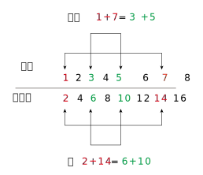
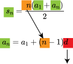

= 等差数列
:toc:

---

== 数列

数列:: 数列的一般形式为:
\begin{align}
a_1, a_2, a_3, ... a_n, ...
\end{align}

- 其中 stem:[ a_n ]表示数列的第 n 项. 也称 n 为 stem:[ a_n ]的序号.
- n: 称为数列的"通项".
- 此时, 一般将整个数列, 简记为 stem:[  {a_n}]

通项公式 general formulas :: 如果数列 stem:[  {a_n}] 的第 n 项stem:[  a_n], 与n之间的关系, 可以用一个公式来表示，那么这个公式就叫做数列的 "通项公式"（general formulas）。 显然, 只要知道了某个数列的"通项公式", 就能写出该数列中的任意一项. 这与函数异曲同工, 输入一个x, 输出相应的y ! +
有的数列的通项, 可以用两个或两个以上的式子来表示。 +
没有通项公式的数列也是存在的，比如, 所有质数组成的数列。

.标题
====
例如：某数列的通项公式是 stem:[ b_n = \sin \frac{n \pi}{2} ], 那么该数列中的第 2 项是什么?
即:
\begin{align}
b_2 = \sin \frac{2 \pi}{2} = \sin \pi = 0
\end{align}
====

.标题
====
例如：这个数列: 0, 2, 0, 2, ... 的通项公式是什么?
即:
\begin{align}
a_n = \begin{cases}
0, \quad n为奇数 \\
2, \quad n为偶数
\end{cases}
\end{align}
====

---

== 数列的递推关系

递推公式:: 如果数列 stem:[  {a_n}] 的第n项, 与它前一项或几项的关系, 可以用一个式子来表示，那么这个公式, 就叫做这个数列的"递推公式"。 注意: 递推公式还需要给出首项(或者前几项)的值.

.标题
====
例如：已知 stem:[ a_1 = 1] , stem:[ a_n = 1 + \frac{1}{a_{n-1}} (n \ge 2) ], 写出这个数列的 前5项.

思考: 上面的式子, 给出了 stem:[ a_n ] 和 stem:[ a_{n-1} ] 的关系. 它们是相邻的两项, 所以这个式子, 就是该数列的"递推公式".

显然, 我们只要知道了前面一项 stem:[ a_{n-1} ]的值, 就能通过这个"递推公式", 知道它的后一项, 即 stem:[ a_n ] 的值.

那么我们就来一项项算: 我们让 stem:[a_1 ] 来代表  stem:[ a_{n-1} ] , 则:

\begin{align}
& a_n = 1 + \frac{1}{a_{n-1}} \\
& a_2 = 1 + \frac{1}{a_1} = 1 + \frac{1}{1} = 2 \\
& a_3 = 1 + \frac{1}{a_2} = 1 + \frac{1}{2} = \frac{3}{2} \\
& a_4 = 1 + \frac{1}{a_3} = 1 + \frac{1}{\frac{3}{2}} = \frac{5}{3} \\
& a_5 = 1 + \frac{1}{a_4} = 1 + \frac{1}{\frac{5}{3}} = \frac{8}{5} \\
\end{align}

====

.标题
====
例如：有一个数列stem:[ {a_n} ] , 已知 stem:[ a_1 = 5, \quad a_n = a_{n-1} +3 \quad (n \ge 2)], 那么该数列的前5项是什么?

思考: 从它的递推公式 stem:[  a_n = a_{n-1} +3], 可以看出: stem:[  a_n - a_{n-1} = 3] , 即相邻两项的差是3, 那么结果就简单了: 该数列每项之间相差3.

即它的前 5 项是: 5, 8, 11, 14, 17
====

.标题
====
例如： 写出数列 1, 3, 6, 10, ... 的一个递推公式.

思考: 从上面我们可以知道:
\begin{align}
& a_2 - a_1 = 3-1 = 2 <- 和前一项的序号n一致, 本处即和 a_2 的序号 2 一致 \\
& a_3 - a_2 = 6-3 = 3 <- 和前一项的序号n, 即3 一致\\
& a_4 - a_3 = 10-6 = 4 <- 和前一项的序号n, 即4 一致\\
\end{align}

所以, 该数列的递推公式就是:
\begin{align}
a_n - a_{n-1} = n \quad (n \ge 2), \quad 且 a_1 = 1
\end{align}

====

== 等差数列

==== 等差数列 Arithmetic progression -> stem:[  a_{n+1} - a_n = d]

等差数列 Arithmetic progression:: 等差数列是指从第二项起，每一项与它的前一项的差, 等于同一个常数. 常用A、P表示。 +
这个常数叫做等差数列的"公差"(Common difference)，公差常用字母 d (difference) 表示。

....
Arithmetic  /əˈrɪθmətɪk/  n. 算术.
progression [ C ] a number of things that come in a series 系列；序列；连续
....

"等差数列"的数学定义, 可以表示为:
\begin{align}
& a_{n+1} - a_n = d \quad (n \in N^*), 其中 d 为常数. \\
& 或 \; a_n - a_{n-1} = d, \quad (n \ge 2)
\end{align}

可以看出, 当:

- 公差d > 0 时, stem:[ {a_n} ] 为 递增数列
- 公差d < 0 时, stem:[ {a_n} ] 为 递减数列
- 公差d = 0 时, stem:[ {a_n} ] 为 常数列

---

==== 等差中项 arithmetic mean -> stem:[  M = \frac{a+b}{2}]

等差中项 arithmetic mean:: 若 a, M, b 成 等差数列, 则 M 叫做 a与b 的"等差中项", 且: stem:[ M-a = b - M ], 即: stem:[ 2M = b+a ]
\begin{align}
\boxed{
M = \frac{a+b}{2}
}
\end{align}

....
mean : ~ (between A and B) a quality, condition, or way of doing sth that is in the middle of two extremes and better than either of them 中间；中庸；折中 /平均数；平均值；算术中项
....

.标题
====
例如： 在 -1, 5 这两个数中间插入一个数, 使这三个数组成一个"等差数列". 即是问这两个数的"等差中项"是什么?

根据"等差中项"的公式:
\begin{align}
M & = \frac{a+b}{2} \\
&  = \frac{-1 +5}{2} = 2
\end{align}

====

---

==== ★ "等差数列"的通项公式 -> stem:[ a_n = a_1 +(n-1)d ]

如果已知等差数列 stem:[ {a_n} ] 的首项是 stem:[  a_1], 公差是 d, 那么可以求出该"等差数列"的通项公式吗? 可以.

方法1 (不完全归纳法): 可知:

\begin{align}
& a_2 = a_1 + d \\
& a_3 = a_2 + d  =  a_1 + 2d \\
& a_4 = a_3 + d  =  a_1 + 3d \\
& ... \\
& \boxed{
a_n = a_1 + (n-1) d
}
\end{align}

方法2: 叠加法:

\begin{align}
已知:
& a_2 - a_1 = d <- 第1个d, 即与后一项的系数相同 \\
& a_3 - a_2 = d <- 第2个d\\
& a_4 - a_3 = d <- 第3个d\\
& ... \\
& a_n - a_{n-1} = d <- 第 n-1 个d\\
& 把上面所有式子, 等号左边全加起来, 等号右边也全加起来, 就是: \\
& (- a_1 + a_2) + (- a_2 + a_3 ) + (- a_3 + a_4 ) + ... + (- a_{n-1} + a_n) = d+d+d+...+d \\
& -a_1  + a_n = (n-1)d \\
即: & \boxed{
 a_n = a_1 +(n-1)d
}
\end{align}

.标题
====
例如：求 10, 5, 0, -5 的通项公式.

思考: 使用等差数列的通项公式即可. 可知:
\begin{align}
& a_1 = 10 \\
& 公差d = 5-10 =-5
\end{align}

代入等差数列的通项公式 :
\begin{align}
a_n & =  a_1 +(n-1)d \\
& = 10  +(n-1)(-5) \\
& = 10 -5n +5 = -5n + 15
\end{align}
====

.标题
====
例如： 等差数列 8, 5, 2, ... 的第20项是多少?

\begin{align}
& 可知: \\
& a_1 = 8, \\
& d = 5-8 = -3 \\
& 所以代入等差数列的通项公式 : a_n  =  a_1 +(n-1)d \\
& a_n = 8 -3(n-1) <-这就是本等差数列的通项公式 \\
& a_{20} = 8-3(20-1) = 8 - 3*19 = -49 <- 第20项的值
\end{align}
====

.标题
====
例如：问: -401 是不是 等差数列 -5, -9, -13, ... 中的项?

我们用方程来做一做就能知道.

先算出该等差数列的通项公式:
\begin{align}
& a_1 = -5 \\
& d = -9 -(-5) = -4 \\
& 代入差数列的通项公式  a_n  =  a_1 +(n-1)d \\
& a_n = -5 -4(n-1) <- 即本例等差数列的通项公式
\end{align}

把 -401 代入上面的通项公式中, 只要 n 是整数(项的序数不存在分数的), 就说明 -401 的确是本等差数列中的项.

\begin{align}
& -401 = -5 -4(n-1) \\
& n = 100 <- 的确是整数, 说明 -401是本等差数列中的第100项
\end{align}

所以 -401 是本等差数列中的项.
====

.标题
====
例如： 已知等差数列stem:[ {a_n} ]中, stem:[ a_5 = 10 ], 若 stem:[ a_{12} = 31 ], 问 stem:[ a_25 =?]

可以列方程:
\begin{align}
& \begin{cases}
a_5 = a_1 + 4d = 10 \\
a_{12} = a_1 + 11d = 31
\end{cases} \\
& 解得 \begin{cases}
a_1 = -2 \\
d =3
\end{cases}
\end{align}
====

所以该数列的通项公式就是:
\begin{align}
\boxed{
a_n = a_1 + (n-1)d
}
= -2 + 3(n-1)
\end{align}

所以
\begin{align}
a_{25} = -2+3*(25-1) = 70
\end{align}
---

---

==== ★ "等差数列"的通项公式2 -> stem:[a_n = a_m + (n-m) d  ]

.标题
====
例如：已知等差数列stem:[ {a_n} ]中, stem:[ a_5 = 10 ],  若 stem:[ d=2 ], 问 stem:[ a_10 = ? ]

\begin{align}
已知 \; a_5 & = 10 = a_1 + 4d \\
要求 \; a_{10} & = a_1 + 9d \\
& =  (a_1 + 4d) + 5d \\
& = a_5 + 5d \\
& = 10 + 9*2 <- 因为已知 d=2 \\
& = 28
\end{align}
====

这里可以得出一个规律:

*在等差数列stem:[ {a_n} ]中, 若知道: ①第m项 stem:[ a_m ]的值, 及 ②公差d的值, 就能知道第n项的值*:
\begin{align}
\boxed{
a_n = a_m + (n-m) d
}
\end{align}

例如:
\begin{align}
a_5 = a_3 + (5-3)d = a_3 + 2d
\end{align}

进一步, 我们就可以知道, 公差 d 也就等于:
\begin{align}
& \because a_n = a_m + (n-m) d \\
& \therefore \boxed{
d = \frac{a_n - a_m}{n-m} \\
<- 这个公式的意味 换言之, 我们只要知道了任意两个项的值, 就能算出该数列的公差d
}
\end{align}

.标题
====
例如：已知在等差数列 stem:[ {a_n} ]中, stem:[  a_1 + a_3 = 6, \quad a_7 = 18], 问 stem:[ a_10 = ? ]

思考: +
根据公式 stem:[  a_n = a_m + (n-m) d], 可知  stem:[  a_7 + 3d = a_{10}] <- 即, 要求的 stem:[ a_{10}] 可以拆分成 stem:[  a_7 + 3d]. +
stem:[ a_7  ]是已知的, 只要再知道 公差d, 就能算出题目.

那么 d 怎么求呢? 因为上面说过, 只要知道数列中任意两项的值, 就能算出公差d来. 现在我们只知道其中的一项 stem:[  a_7], 那么另一项能从哪里来呢?

[options="autowidth"]
|===
|步骤 |Header 2

|用"等差中项",来得到这个另一项
|我们注意到: stem:[  a_1 + a_3 = 6], 而我们可以用"等差中项"公式, 来得到其"中项", 即 stem:[  a_2],这样, 两项就齐了.

\begin{align}
\boxed{ 等差中项公式: M = \frac{前1项 + 第3项}{2}} \\
即: a_2 = \frac{a_1 + a_3}{2} = \frac{6}{2} = 3
\end{align}

所以, 现在我们手里就有两项的值了:
\begin{align}
& a_7 = 18 \\
& a_2 = 3
\end{align}

|通过任意两项, 来得出公差d
|所以我们就能通过任意两项, 来得出公差d:
\begin{align}
& \boxed{
d = \frac{a_n - a_m}{n-m}
}
= \frac{a_7 - a_2}{7-2}
= \frac{18-3}{5} = 3
\end{align}

|知道任意一项stem:[ a_m ]的值, 和公差d, 就能算出其他的任意一项stem:[ a_n ]的值
\begin{align}
\boxed{
 a_n = a_m + (n-m) d
}
\end{align}
|所以
\begin{align}
a_{10} = a_7 + 3d = 18 + 3*3 = 27
\end{align}
|===

====

---

==== "等差数列"的通项公式3 -> stem:[a_n = pn + q ] <- 即一次函数(直线)方程

.标题
====
例如：思考:stem:[ a_n = pn + q], 其中 p, q 为常数, 且 stem:[p \ne  0], 该数列是否是一个"等差数列"?

如果它是等差数列, 那么它的公差d, 一定是个常数! 那么我们就来看看它的公差是否是一个常数? 若是, 则的确是"等差数列", 如果不是常数, 那么它就不是"等差数列".

\begin{align}
d &= a_n - a_{n-1} \\
&= (pn + q) - (p(n-1)+q) \\
&= pn +q - pn + p - q \\
&= p <- p和项数n毫无关系, 项数n 是个变量, 而p是个常量
\end{align}

所以,  stem:[a_n = pn + q ] 的确是个等差数列.
====

这里, 我们就能得出 如何判断一个数列是"等差数列"的方法:
\begin{align}
\boxed{
 a_n = pn + q \quad (p, q 为常数, 且 p \ne  0)
}
<- 它是等差数列
\end{align}

*可以看出:该公式的本质其实就是个一次函数 (stem:[ f(x) = kx + b] )! 是一条直线.* 一条直线上的各x点, 的确是个等差关系.

---

==== ★ 等差数列有这种性质: 当"项的序号"的和, 若相等; 则这些项的"值"的和, 也相等. 即 -> 当序号 stem:[ m+n = p+q] 时, 总有项值 stem:[ a_m +a_n = a_p + a_q]

在等差数列stem:[ {a_n} ]中, 若 stem:[ m, n, p, q \in N_+], 则:
\begin{align}
\boxed{
 当序号:  m+n = p+q 时, \\
总有项的值: a_m +a_n = a_p + a_q
}
\end{align}
*意思就是: "项的序号"的和, 若相等; 则这些项的"值"的和, 也相等.*

证明如下:
\begin{align}
a_m +a_n \\
&= [a_1 + (m-1)d] + [a_1 + (n-1)d] \\
&= a_1 + md -d + a_1 + nd -d \\
&= 2a_1 +md + nd - 2d  \\
&= 2a_1 + d(m+n-2) \\
\\
a_p + a_q \\
&= [a_1 + (p-1)d] + [a_1 + (q-1)d] \\
&= a_1 + pd -d + a_1 + qd -d \\
&= 2a_1 + pd + qd - 2d  \\
&= 2a_1 + d(p+q-2) \\
\\
\because m+n = p+q \\
& \therefore  a_m +a_n = a_p + a_q
\end{align}

同理 :
\begin{align}
\boxed{
若 序号 m + n = 2p \\
则: 项值 a_m + a_n = 2 a_p <- 可以看出, a_p 就是 a_m 和 a_n 的"等差中项"了
}
\end{align}

.标题
====
例如：已知等差数列  stem:[ a_6 + a_9 + a_12 + a _15 = 20], 求 stem:[ a_1 + a_20]

思考: 序号 1+20 = 21 +
而 前面的序号 stem:[ 6+9+12+15 = (6+15) + (9+12) = 21*2] +
所以: stem:[ a_6 + a_9 + a_12 + a _15]的值, 也两倍于 stem:[ a_1 + a_20], +
即: stem:[ a_1 + a_20 = 10]
====

---

==== ----- -----

---

==== ★ 等差数列前n项 的和 -> stem:[ s_n = \frac{n(a_1 + a_n)}{2}] <- 即只要知道 ①"第1项" 和 ②"第n项"的值, 就能算出前n项的和.

.标题
====
例如： 思考: stem:[ 1+2+3+...+n = ?]

我们可以把上式写成:
\begin{align}
1 + 2+ ... + (n-1) +n
\end{align}

然后我们把它, 加上它的 倒序, 即:

[options="autowidth"]
|===
|Header 1 |Header 2 |Header 3 |Header 4 |Header 5||

|要求的问题:
|1
|2
|...
| n-1
|n
|

|把上面的数列顺序, 倒序过来
|n
|n-1
|...
|2
|1
|

|把上面两项加起来
|1+n
|2+(n-1) = n+1
|...
|(n-1) + 2 = n+1
|n+1
|总和 stem:[ = n (n+1)]
|===

所以, stem:[ 1+2+3+...+n = \frac{n(n+1)}{2}]

====

数列stem:[ {a_n}] 的前 n 项的和, 即 stem:[ a_1 +a_2 + ... + a_n] , 常用 stem:[ s_n] 表示 (即 sum):
\begin{align}
s_n =  a_1 +a_2 + ... + a_n
\end{align}

所以, stem:[ S_10] 的意思, 就是计算该数列 前10项的和.

那么该方法( 倒序相加法), 也能应用到 "等差数列"前n项的求和公式 的推导上, 就有:

\begin{align}
& s_n =  a_1 +a_2 + ... + a_n  \tag{1} \\
& s_n =  a_n +a_{n-1} + ... + a_1  \tag {2} <- 把该等差数列倒序过来 求和 \\
& 把上面两项的各项, 竖着加起来 \\
& 2 s_n = (a_1 + a_n) + (a_2 + a_{n-1}) + ... + (a_n + a_1) <- "序号"的和,若相同, 则"项值"的和,也相同 \\
& = n(a_1 + a_n) \\
& s_n = \frac{n(a_1 + a_n)}{2}
\end{align}

所以: 等差数列的"前 n 项的和" 的公式就是:
\begin{align}
\boxed{
s_n = \frac{n(a_1 + a_n)}{2}
}
\end{align}

*即: 首项加尾项的和 (stem:[ a_1 + a_n ]), 乘以总项数的一半 (stem:[ n/2 ])*

---

==== ★ 等差数列前n项 的和 -> stem:[ S_n = na_1 + \frac{n(n-1)}{2} d] <- 即只要知道 ①"第1项" 和 ②"公差d"的值, 就能算出前n项的和.

把 stem:[ a_n = a_1 + (n-1)d], 代入上面的 stem:[ s_n] 公式, 就有:
\begin{align}
& s_n = \frac{n(a_1 + a_n)}{2} \\
&  =  \frac{n [a_1 +  (a_1 + (n-1)d)]}{2} \\
& = \frac{n[2a_1 + (n-1)d]}{2} \\
& = na_1 + \frac{n(n-1)}{2} d
\end{align}

即:
\begin{align}
\boxed{
 S_n = na_1 + \frac{n(n-1)}{2} d
}
\end{align}

*即: 总项数量个首项 (stem:[ na_1 ]), 加上 倒数两项序数的乘积(stem:[ n(n-1) ]) 乘以公差的一半(stem:[ d/2 ])*

.标题
====
例如： 问: 等差数列 -10, -6, -2, ... 的前多少项的和,为54?

思考: 从已知条件中, 我们可以知道 首项 stem:[a_1] (stem:[ =-10]), 和公差d的值( stem:[= -6+10 = 4]), 所以就可以套用这个公式 stem:[ S_n = na_1 + \frac{n(n-1)}{2} d ]

\begin{align}
& S_n = na_1 + \frac{n(n-1)}{2} d  \\
& 54 = n*(-10) + \frac{n(n-1)}{ 2}*4 \\
& 整理得 \; n^2-6n-27 = 0 \\
& 即: n=9 \; 或 \; n=-3 \\
& \therefore n=9 <- 即该数列的前9项的和, 为54
\end{align}

====

.标题
====
例如： 已知一个等差数列 stem:[ {a_n}] 的前10项的和 是310, 前20项的和是1220, 问这个等差数列的通项公式, 即 前n项的和的公式, 是什么?

思考: 为了得到公差d, 我们要代入第二个求和公式 stem:[  S_n = na_1 + \frac{n(n-1)}{2} d]中:

\begin{align}
& \begin{cases}
310 = 10 a_1 + \dfrac{10(10-1)}{2}d \\
1220 = 20 a_1 + \dfrac{20(20-1)}{2}d \\
\end{cases}  \\
& \begin{cases}
a_1 = 4 \\
d = 6
\end{cases} \\
所以:
& a_n = a_1 + (n-1)d
= 4 + 6(n-1) = 6n-2 \\
&  S_n = na_1 + \frac{n(n-1)}{2} d \\
& S_n = 4n +  \frac{n(n-1)}{2}* 6
= 3n^2 +n
\end{align}

====

.标题
====
例如：
已知在等差数列stem:[  {a_n}]中, stem:[  a_1 =1, \quad a_n = -512, \quad S_n = -1022], 求 公差d.

下图, 绿色代表已知参数, 红色代表要求的参数, 那么我们就可以通过算出黄色参数, 来连锁得到红色参数的值.

\begin{align}
& -1022 = \frac{n}{2} (1-512) <- 即 : S_n = \frac{n}{2} (a_1 + a_n)\\
& n = 4 \\
& -512  = 1 + 3d <- 即 : a_n = a_1 +(n-1)d  \\
& d = -171
\end{align}

====

---

==== stem:[  a_n = S_n - S_{n-1}]

推导过程很简单:
\begin{align}
\because S_n &= a_1 + a_2 + ... + a_{n-1}, + a_n \tag{1} \\
S_{n-1} &= a_1 + a_2 + ... + a_{n-1} \quad(n \ge 2) \tag{2}\\
(1) - (2) 就能得到: \\
S_n - S_{n-1} &= a_n
\end{align}

即:
\begin{align}
\boxed{
a_n = S_n - S_{n-1} \quad(n \ge 2)
}
\end{align}

同时能看出:
\begin{align}
\boxed{
当 n =1 时, a_1 = S_1
}
\end{align}

故:
\begin{align}
\boxed{
a_n =
\begin{cases}
S_1 , & 当 n=1 \\
S_n - S_{n-1} & 当 n \ge 2
\end{cases}
}
\end{align}

当 stem:[ n=1]时, stem:[S_1 = a_n ] 这个很好理解, 因为当一个数列只有唯一的一项存在时, 该数列的和, 就是等于该唯一的一项的值本身.

---

未完待续

https://www.bilibili.com/video/BV1bE411T7cA?p=151

3:54

---

