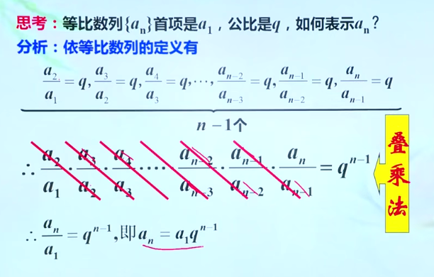
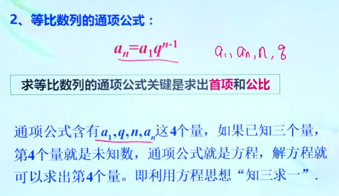
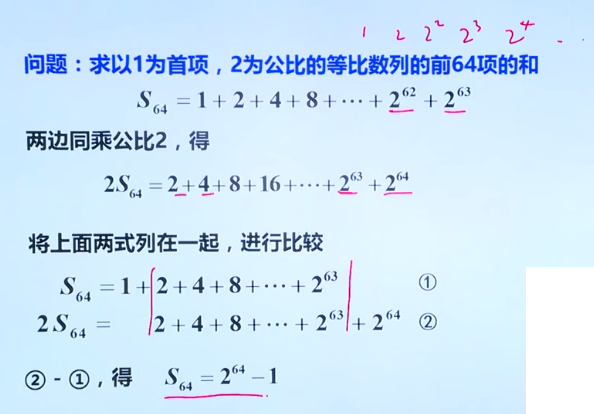
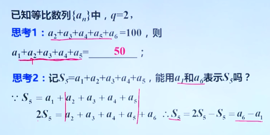
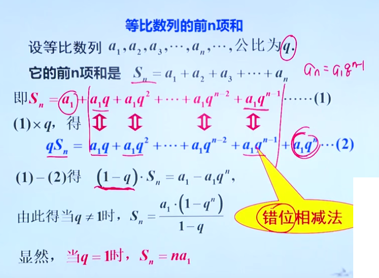

= 等比数列
:toc:

---

== 等比数列 geometric progression -> stem:[  \frac{a_n}{a_{n-1}} = 公比q]

等比数列 geometric progression :: 等比数列是指从第二项起，每一项与它的前一项的比值, 都等于同一个常数的一种数列，常用G、P表示。这个常数叫做等比数列的"公比"，常用字母q (Common ratio)表示.

即:
\begin{align}
& \frac{a_n}{a_{n-1}} = q \quad (n \ge 2, \; q \ne 0 ,  \; a_n \ne 0 ) \\
& 或 \quad \frac{a_{n+1}}{a_n} = q \quad (n \in N^*)
\end{align}

.标题
====
例如：
1, -1, 1, -1 , ... 是等比数列, 它的公比q 是 -1

a,a,a,a,... 是等比数列吗? 不一定. 因为"等比数列"必须满足其每一项 不为0, 而这里的a是不是0呢? 不确定. 所以: +
-> 当 stem:[ a = 0] 时, 就不是"等比数列" +
-> 当 stem:[a \ne 0] 时, 才是"等比数列", q = 1

====

即:

- 若 公比 stem:[ q>0], 则各项的符号与stem:[ a_1] 相同
- 若 公比 stem:[ q<0], 则各项的符号 "正负相间"

.标题
====
例如：下面的两个树中, 能否插入一个数, 让它们变成 geometric progression 等比数列 ?

[options="autowidth"]
|===
|Header 1 |Header 2

|stem:[ -12, ? , 0]
|<- 因为等比数列中, 每一项都不能=0, 所以这里出现了0 , 就不能变成等比数列.

|2, ?, 8
|\begin{align}
& \frac{x}{2} =\frac{8}{x} <- 如果能组成"等比数列", 就会有 \\
& x^2= 16, x = \pm 4 <- 所以可行
\end{align}

|-3, ? , 3
|\begin{align}
\frac{x}{-3} = \frac{3}{x}, \quad x^2 = -9
\end{align}
显然x是个复数, 无法满足等比数列中"项"的条件.
|===

====

---

==== 等比中项(G) geometric mean -> stem:[ G^2 = a_{n-1} * a_{n+1}]

等比中项 geometric mean:: 如果在等比数列a项和b项中，插入一个数G, 使a、G、b 成 "等比数列"，那么G 就叫做a、b的"等比中项"。即有:

\begin{align}
\frac{G}{a} = \frac{b}{G} \\
\boxed{
G^2 = ab \\
G = \pm \sqrt{ab}
}
\end{align}

但倒过来, 如果已知 stem:[ x^2 = ac], 则 a, x, c 就一定是"等比数列"吗? 不一定, 因为 如果 a=x = 0 的话, 该式子也成立. 但显然, 0, 0, c 不是等比数列. 等比数列要求其中的每一项都不为0.

注意: *若 a, c 有"等比中项G", 则 a, c 的正负符号相同.* +
因为如果有 stem:[ G^2 = ab], 等号左边>0, 则等号右边的 a 和 b , 肯定要么同为正数, 要么同为负数.

---

==== ★ "等比数列"的通项公式1 -> stem:[ a_n = a_1 *q^{n-1}]

从"等比数列"的定义, 我们可以知道:
\begin{align}
& a_1 \\
& a_2 = a_1 * q \\
& a_3 = a_1 * q * q = a_1 * q^2 <- 可以看出, q的指数, 和等号左边 a的项目数, 只相差1位 \\
& ... \\
& a_n = a_1 q^{n-1}
\end{align}

所以, 等比数列的通项公式, 即为:
\begin{align}
\boxed{
a_n = a_1 * q^{n-1} \quad (n \in N^*)
}
\end{align}

同"叠乘法", 也能推导出来:

---

====  ★ "等比数列"的通项公式2 ->  stem:[ a_n = a_m * q^{n-m}]

推论: 数列stem:[ {a_n}] 是"等比数列", 则:
\begin{align}
\boxed{
a_n = a_m * q^{n-m} \quad (n>m)\\
\frac{a_n}{a_m } =  q^{n-m}
}
\end{align}

证明过程:

\begin{align}
从通项公式1出发: a_m & = a_1 * q^{m-1} \\
a_n & = a_1 * q^{n-1} \\
& =  a_1 * q^{n-1 +m -m} \\
& =  a_1 * q^{m-1} * q^{n-m} <- 前面两个的乘积, 就是 a_m \\
& = a_m * q^{n-m} <- 推导成功
\end{align}

.标题
====
例如：一个等比数列的第3,4项, 分别是 12和18, 求它的第1, 2 项.

[options="autowidth"]
|===
|步骤 |Header 2

|求公比q
|方法1:
\begin{align}
& 已知 a_3 = 12, a_4 = 18,  代入通项公式: \boxed{ \frac{a_n}{a_m } =  q^{n-m} }\\
& \frac{a_4}{a_3} = q^{4-3} \\
& 公比 q = \frac{18}{12}= \frac{3}{2}
\end{align}

方法2: +
直接利用通向公式
\begin{align}
\boxed{
a_n  = a_1 * q^{n-1}
}
\end{align}

\begin{align}
\begin{cases}
12 = a_1 * q^2 \; ① \\
18 = a_1 * q^3
\end{cases}
\quad q = \frac{3}{2} \; ③
\end{align}

|求首项stem:[ a_1]
|把 ③ 代入 ①
\begin{align}
& 12 = a_1 * (\frac{3}{2})^2 \\
& a_1 = \frac{16}{3}
\end{align}

|就能求出 stem:[ a_1, a_2] 项的值了
|\begin{align}
a_2 = a_1 * q^{2-1} =  \frac{16}{3} *  \frac{3}{2} = 8
\end{align}
|===
====

---

==== ★ 若项数 stem:[ m+n = k+l], 则 stem:[ a_m * a_n = a_k * a_l]

证明过程:
\begin{align}
& a_m * a_n = a_1 q^{m-1} * a_1 q^{n-1} = a_1 q^{m+n-2} \\
& a_k * a_l = a_1 q^{k-1} * a_1 q^{l-1} = a_1 q^{k+l-2} \\
& \because m+n = k+l \\
& \therefore  a_1 q^{m+n-2} = a_1 q^{k+l-2} \\
& 即 a_m * a_n = a_k * a_l
\end{align}

---

==== 若项数 stem:[ m+n = 2k \quad (m,n,k \in N^+)], 则 stem:[a_m a_n = a_k^2 ]

推导过程:
\begin{align}
& 既然:  若项数  m+n = k+l, 则 a_m * a_n = a_k * a_l \\
& 即有: m+n = k+k, 则: a_m * a_n = a_k * a_k =   a_k^2 \\
\end{align}

.标题
====
例如：在等比数列中, stem:[ a_n >0], 且 stem:[ a_1 a_9 = 64, a_3 + a_7 = 20], 求 stem:[ a_11]

[options="autowidth"]
|===
|过程 |Header 2

|算出stem:[ a_3 和 a_7] 的具体值

方法: 利用
\begin{align}
\boxed{
若项数 m+n = k+l, \\
则  a_m * a_n = a_k * a_l
}
\end{align}

|根据公式 :
\begin{align}
\boxed{
若项数 m+n = k+l, \; 则  a_m * a_n = a_k * a_l
}
\end{align}

就有:
\begin{align}
a_3 a_7 = a_1 a_9 = 64
\end{align}

那么我们就可以用方程来得出 stem:[ a_3 和 a_7]的值了:
\begin{cases}
a_3 a_7 = 64 \\
a_3 + a_7 = 20
\end{cases}

解得 stem:[ a_3 和 a_7] 的值, 其中某一个为 4, 另一个为 16. 即 stem:[a_3 =4,  a_7=16]  或 stem:[a_3 =16,  a_7=4].

|用哪个"通项公式", 来计算 stem:[ a_{11}] 的思考:
|stem:[ a_{11} ] +
-> stem:[= a_1 q^{10} \quad ① ] +
-> 或 stem:[= a_m q^{11-m}  \quad ②]

有两个通向公式可以选择, 那我们选① 还是② ? +
-> ①中, 我们要求出两个变量: stem:[ a_1 和 q] +
-> ②中, 我们只要要求一个变量即可: stem:[ q] +

所以我们采用 通项公式②.

|算出公比q.

方法: 利用
\begin{align}
\boxed{
\frac{a_n}{a_m } =  q^{n-m}
}
\end{align}

|stem:[ a_{11} ] +
-> stem:[= a_1 q^{10} \quad ① ] +
-> 或 stem:[= a_m q^{11-m}  \quad ②]

有两个通向公式可以选择, 那我们选① 还是② ? +
-> ①中, 我们要求出两个变量: stem:[ a_1 和 q] +
-> ②中, 我们只要要求一个变量即可: stem:[ q] +

所以我们采用 通项公式②.

那么 q 怎么求? 利用公式:
\begin{align}
\boxed{
\frac{a_n}{a_m } =  q^{n-m}
}
\end{align}

-> 当 stem:[a_3 =4,  a_7=16] 时:
\begin{align}
& \frac{a_7}{a_3} = q^{7-3} \\
& \frac{16}{4} = q^4 \\
& q^4 = 4
\end{align}

-> 当 stem:[a_3 =16,  a_7=4] 时:
\begin{align}
& \frac{a_7}{a_3} = q^{7-3} \\
& \frac{4}{16} = q^4 \\
& q^4 = \frac{1}{4} \\
\end{align}

|算出 stem:[  a_{11}]

方法: 利用公式
\begin{align}
\boxed{
a_n = a_m * q^{n-m} \quad (n>m)
}
\end{align}

|-> 当 stem:[ q^4 = 4] 时, stem:[a_{11} = a_7 q^{11-7} = 16*4 = 64 ]  +
-> 当 stem:[ q^4 = \frac{1}{4}] 时, stem:[a_{11} = a_7 q^{11-7} = 16*\frac{1}{4} = 4 ]

|===
====

.标题
====
例如： 在等比数列中, stem:[ a_3=4, a_7 = 9], 则 stem:[ a_5=?]

\begin{align}
& a_3  a_7 = a_5  a_5 \\
& 4*9 = a_5^2 \\
& a_5 可能 = \pm 6 <- 我们需要判断一下 a_5的正负号 \\
& \because  a_5 = a_3 q^2 > 0 \\
& \therefore a_5 = 6
\end{align}
====

---

====  stem:[ {a_n}, {b_n}] 是项数相同的等比数列, 则 stem:[{a_n b_n} ] 也是等比数列

.标题
====
例如： 已知 stem:[ {a_n}, {b_n}] 是 项数相同的等比数列, 那么 stem:[{a_n b_n} ] 也是等比数列吗?

我们用"等比数列"必须满足的性质, 来验证一下:

假设 stem:[{a_n b_n} ] 是等比数列, 那么就有 后一项比前一项, 是一个常数. 即:
\begin{align}
\frac{a_{n+1} b_{n+1}}{a_n b_n} = 常数
\end{align}

那么我们来验证一下上面的比值, 是否是一个常数? +
设 stem:[ {a_n} ]的公比为p, stem:[ {b_n} ]的公比为q, 则:
\begin{align}
\frac{a_{n+1} b_{n+1}}{a_n b_n}
= \frac{a_1 p^n * b_1 q^n} {a_1 p^{n-1} * b_1 q^{n-1}}
= qp <- 它是一个与变量n 无关的常数.
\end{align}

所以,  stem:[{a_n b_n} ] 的确是一个"等比数列".
====

---

==== stem:[ {a_n}, {b_n}] 是项数相同的等比数列, 则 stem:[\frac{a_n}{b_n}] 也是等比数列

.标题
====
例如：已知 stem:[ {a_n}, {b_n}] 是 项数相同的等比数列, 那么 stem:[\frac{a_n}{b_n}] 也是等比数列吗?

依然来验证一下: 我们来看后一项比前一项, 是否是一个常数?

\begin{align}
& \frac{\dfrac{a_{n+1}} {b_{n+1}}} {\dfrac{a_n} {b_n}}
= \frac{a_{n+1}} {b_{n+1}}  * \frac{b_n}{a_n} \\
& = \frac{a_{n+1}}{a_n} * \frac{b_n}{b_{n+1}}
= p * \frac{1}{q}  <- 它是一个与变量n 无关的常数.
\end{align}

所以,   stem:[\frac{a_n}{b_n}] 的确是一个"等比数列".

====

.标题
====
例如：已知 stem:[ {a_n}, {b_n}] 是 项数相同的等比数列, 那么 stem:[a_n + b_n] 也是等比数列吗? 不一定.
====

.标题
====
例如：若 stem:[ {a_n}] 是公比为q 的等比数列, c为常数, 则下列这些数列, 也是等比数列吗?

[options="autowidth"]
|===
|Header 1 |Header 2

|stem:[ {\frac{1}{a_n}}]
|是等比数列, 公比是 stem:[ 1/q]

|stem:[ {a_n^2}]
|是等比数列, 公比是 stem:[ q^2]

|stem:[ {c a_n}]
|\begin{cases}
c = 0 时, 就不是等比数列 \\
c \ne 0 时, 才是等比数列, 公比是 = \dfrac{c *a_{n+1}}{c * a_n} = q
\end{cases}

|stem:[ { a_n +c}]
|\begin{cases}
c = 0 时, 是等比数列 \\
c \ne 0 时, 无法判断是否是等比数列, 因为 \dfrac{a_{n+1} + c} {a_n + c} 不好计算它的比值是否是常数.
\end{cases}
|===
====

.标题
====
例如： 已知三个数成等比数列, 它们的和=14, 乘积 = 64, 求这三个数.

可以设这三个数分别是: stem:[ x/q, x, xq], 则有:
\begin{align}
& \frac{x}{q} * x * xq = 64, \; x^3 = 64,\; x = 4 \\
& \frac{x}{q} + x + xq = 14, \; 将 x=4代入, 能得到 q = 2 或 \frac{1}{2}
\end{align}

所以, 这三个数就是:
\begin{cases}
\dfrac{x}{q} = \frac{4}{2或 \frac{1}{2}}\\
x = 4 \\
xq = 4* (2或 \frac{1}{2})
\end{cases}
====

.标题
====
例如：已知 stem:[ a_n] 满足 stem:[ a_1 = 1, a_{n+1} = 2a_n +1] +
(1) 求证数列 stem:[ {a_n+1}] 是等比数列 +
(2) 求数列stem:[ {a_n}]的通项公式

我们来看, 后项比前项, 是否是一个常数?
\begin{align}
q = \frac{a_{n+1}+1} {a_n+1}
= \frac{(2a_n +1) +1 } {...}
= \frac{2(a_n +1) } {...}
= 2 <- 是一个常数, 因此 {a_n+1} 的确是等比数列
\end{align}

现在, 已知 stem:[ a_1 = 1, q= 2], +
所以 stem:[ a_n = a_1 + q^{n-1} = 1*2^{n-1}]
====

---

==== ----- -----

---

==== ★ 等比数列前n项的和 -> stem:[ s_n = \frac{a_1 * (1-q^n)}{1-q} = \frac{a_1 - a_n q}{1-q}  (当 q \ne 1 时) ; \quad s_n = na_1  (当 q=1 时)]

.标题
====
例如： 已知等比数列stem:[ {a_n}], q = 2, +
若 stem:[ a_2 +a_3 + ... + a_6 =100],  问:

[cols="1a,3a"]
|===
|Header 1 |Header 2

|stem:[ a_1 + a_2 + ... + a_5 = ?]
|思考: 事实上, 下面的第一项 stem:[ a_1] 乘以 公比2,  就等于上面的第一项stem:[ a_2], +
下面的第2项 : stem:[ a_2] * 公比2,  就等于上面的第2项stem:[ a_3], +
所以, 上面的每一项, 其实就是下面"每一项 * 公比2" 的值.

即: stem:[a_2 +a_3 + ... + a_6 = 2( a_1 + a_2 + ... + a_5) ],  +
所以 stem:[ a_1 + a_2 + ... + a_5 = 100/2]

|记 stem:[ S_5 =  a_1 + a_2 + ... + a_5 ], 能用 stem:[ a_1 和 a_6] 来表示 stem:[ S_5] 吗?
|可以. +
把stem:[ S_5] 中的每一项, 都乘上公比2, 就有: stem:[ a_2 + a_3 +  ... + a_6], +
把 stem:[ 2S_5 - S_5 = S_5 = a_6 - a_1]

|===
====

等比数列前 n 项的和, 公式为:
\begin{align}
\boxed{
\begin{cases}
s_n = \dfrac{a_1 * (1-q^n)}{1-q}
= \dfrac{a_1 -a_1 q^n}{...}
= \dfrac{a_1 -a_1 q^{n-1} * q}{...}
= \dfrac{a_1 - a_n q}{1-q} & 当 q \ne 1 时 \\
s_n = na_1 & 当 q=1 时
\end{cases}
}
\end{align}

推导过程如下图:

.标题
====
例如：求 stem:[ \frac{1}{2}, \frac{1}{4}, \frac{1}{8}, \frac{1}{16}, ... ] 的前 n 项的和.

可知: 首项 stem:[ a_1 = 1/2], 公比 stem:[ q = 1/2], 知道这两个变量后, 就可以利用公式:

\begin{align}
& \boxed{
s_n = \frac{a_1 * (1-q^n)}{1-q}
} \\
& s_n = \frac{ \frac{1}{2} * (1 - (\frac{1}{2}))^n } {1- \frac{1}{2}}
= 1- (\frac{1}{2})^n
\end{align}
====

.标题
====
例如：求 stem:[ a, a^2, a^3, ... ] 的前 n 项的和.

显然一看就知道, 首项 stem:[ a_1 = a], 公比 stem:[ q = \frac{a^2}{a} = a],  +
不过在直接套用公式前, 还要判断 a本身的值 :
\begin{cases}
当 a=0 时, 该数列不是等比数列, &  S_n = 0 \\
当 a=1 时,即公比q=1时,   &  S_n = 1 \\
当 a \ne 0 且 a \ne 1 时, 即公比 q \ne 1 时, & S_n = \dfrac{a_1 * (1-q^n)}{1-q}
= \dfrac{a * (1-a^n)}{1-a}
\end{cases}

====

---

====  stem:[ S_n = -Xq^n + X \quad (X \ne 0, q \ne 1, X和 -X 为相反数)]

等比数列的 通项stem:[ a_n], 与其 前n项的和 stem:[ S_n] 有什么样的关系呢?

\begin{align}
s_n & = \frac{a_1 * (1-q^n)}{1-q}  \\
& = \frac{a_1 - a_1 q^n }{...} \\
& = \frac{a_1}{1-q} - \frac{ a_1 q^n}{1-q} \\
& = ...  - q^n(\frac{a_1}{1-q}) \\
& = - q^n(\frac{a_1}{1-q}) + \frac{a_1}{1-q}  <- 就相当于:  -Xq^n + X
\end{align}

所以:
\begin{align}
\boxed{
S_n = -Xq^n + X \\
或 S_n = Aq^n + B, 其中A,B是相反数关系, 即 A+B=0; A \ne 0, q \ne 1
}
\end{align}

.标题
====
例如： 若等比数列中, stem:[ S_n = m*3^n + 1], 则实数m=?

根据公式 stem:[S_n = -Xq^n + X ], 显然 stem:[ m = -1]
====

---

==== stem:[(S_k), \quad (S_{2k} - S_k), \quad (S_{3k} - S_{2k}) \quad  (k \in N^*) ] 也是等比数列

stem:[ S_n] 为等比数列 前n项的和, stem:[ S_n \ne 0], 那么可以推导出:
\begin{align}
\boxed{
(S_k), \; (S_{2k} - S_k), \; (S_{3k} - S_{2k}) \quad  (k \in N^*)
}
\end{align}
它也是等比数列.

.标题
====
例如：等比数列 stem:[ {A_n}]中, stem:[ S_{10} = 10,  S_{20} = 30], 则 stem:[
S_{30}=? ]

根据上面方框中的公式, 显然有:
\begin{align}
& (S_{10}), (S_{20} - S_{10}), (S_{30} - S_{20}) <- 是个等比数列 \\
& 即这个等比数列: 10, 30-10, S_{30} -30 \\
& 公比q = \frac{30-10}{10} = 2 \\
& A_3  = A_2 *q = 20 * 2 = 40  = S_{30} - 30 \\
&  S_{30}= 70
\end{align}
====

---

==== 等比数列, 若项数为 stem:[ 2n (n \in N^+) ], 则 stem:[\frac{S_偶}{S_奇} = 公比q ]

.标题
====
例如：在等比数列中, 若项数为 stem:[ 2n (n \in N^+) ],公比为q, stem:[ S_偶 与 S_奇] 分别为"偶数项"的和, 与"奇数项"的和. 那么:
\begin{align}
\boxed{
\frac{S_偶}{S_奇} = 公比q
}
\end{align}

推导过程: +
stem:[S_偶 = a_2 + a_4 + ... + a_{2n-2}, a_{2n} ] +
stem:[S_奇 = a_1 + a_3 + ... + a_{2n-3}, a_{2n-1} ] +

你能看出 : 下面数列中的每一项, 乘以公比q, 就是上面数列中的每一项. +
即:
\begin{align}
& S_偶 = q * S_奇 \\
& \frac{S_偶}{S_奇} = 公比q
\end{align}
====

.标题
====
例如：等比数列 stem:[ {a_n}] 共有 2n 项, 其和为 -240, 且奇数项的和, 比偶数项的和, 大80, 则 公比q =?

\begin{align}
& \begin{cases}
S_奇 - S_偶 = 80 \\
S_奇 + S_偶 = -240
\end{cases} \quad
 \begin{cases}
S_奇 = -80 \\
S_偶 = -160
\end{cases} \\
\\
& 根据 "共有2n 项"的等比数列, 具有这个公式: \\
& \frac{S_偶}{S_奇} = 公比q \\
& 即: q = \frac{-160}{-80} = 2
\end{align}
====

---

https://www.bilibili.com/video/BV1bE411T7cA?p=159

