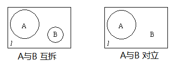
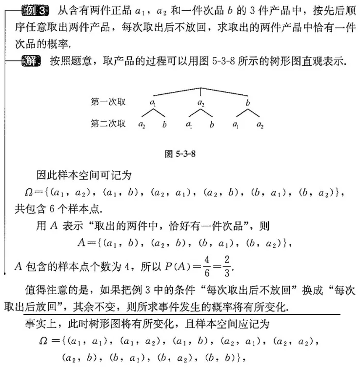

= 61 概率
:toc:
---

== 概率 probability

对于一个随机事件A, 它发生的概率, 就记为 P(A).

#我们用某事件所包含的各种可能的结果的个数, 在全部可能的结果总数中所占的比, 表示该事件发生的概率.# +
比如: "投色子, 结果是偶数"的事件, 包含三种可能结果 : 2, 4, 6.  在每次投筛子的全部6种可能结果中, 所占的比例为 3/6, 所以这个事件的概率就是:

stem:[ P(投到偶数的事件) = \frac{1}{2}]

即 : 如果在一次试验中, 有 n 种可能的结果, 并且它们发生的可能性都相等, 事件A包含其中m种结果, 那么事件A 发生的概率就是:

stem:[ P(A) =\frac{m}{n} \quad (0 \le m \le n)]

因此, stem:[0 \le \frac{m}{n} \le 1],

即: stem:[0 \le P(A) \le 1]

[cols="1a,3a"]
|===
|Header 1 |Header 2

|样本点 sample point (ω)
|我们把随机试验中, 每一种可能出现的结果, 都称为"样本点".

|样本空间 Ω
|把由所有"样本点"组成的集合, 称为"样本空间". +
即 :把随机实验的一切可能结果的全体, 称为"样本空间".

.标题
====
例如： 抛一枚硬币, 如果"样本点"记为"出现正面", "出现反面", 则"样本空间"为:
\begin{align}
\Omega = \{出现正面, 出现反面\}
\end{align}
====

|随机事件
|- 如果随机试验的"样本空间"为Ω, 则"随机事件"A 就是Ω 的一个非空真子集. +
例如: 掷一个骰子, 出现的点数为奇数, 即 A = {1,3,5}, 则 A 就是一个随机事件. +
- 通常用大写英文字母(A, B, ...) 来表示"事件". +
- 事件, 一定是"样本空间 Ω"的子集.

|基本事件
|只含一个"样本点"的事件, 称为"基本事件".

|概率
|事件A 发生的概率, 通常用 P(A) 来表示. +
则:
\begin{align}
P(\varnothing) = 0 <- 不可能发生的事件, 概率为0 \\
P(\Omega) = 1 <- 必然事件, 发生的概率为1
\end{align}

对于任意事件A 来说, 显然有:
\begin{align}
P(\varnothing) \le P(A) \le P(\Omega)
\end{align}
|===

.标题
====
例如：一个骰子, 先后投掷两次. 问:

[cols="1a,2a"]
|===
|Header 1 |Header 2

|问1: 正面朝上的点数, 样本空间是什么?
|比如第一次掷出 1点, 第二次掷出 2点, 则所有的样本点, 就可以写成 (i, j) 的形式. 其中 i, j 都是 1到6 中的数字.

因此, 样本空间就是:
\begin{align}
\Omega = \{(i,j) \|  \quad 1 \le i \le 6, \quad 1 \le j\ \le 6, \quad i \in N, j \in N  \}
\end{align}

|点数之和为3, 用事件A来表示; +
点数之和不超过3, 用事件B来表示
|A = {(1,2), (2,1)} +
B = {(1,1), (1,2), (2,1)}

|===

====

---

== 事件之间的关系

==== exclusive event 互拆 -> stem:[ A \cap B = ∅ ]

[cols="1a,3a"]
|===
|Header 1 |Header 2

|互拆
|事件A 与 事件B 不能同时发生, 则称 A与B "互拆". +
则:
\begin{align}
& A \cap B = \varnothing \\
& 或 AB= \varnothing <- 积(乘积)事件
\end{align}

不难看出:

- 任意两个"基本事件", 都是互拆的.
- ∅ 与任意事件 互拆.

|互拆事件的"概率加法公式"
|当A与B 互拆时, 有:
\begin{align}
P(A+B) = P(A) + P(B )
\end{align}
|===

---

==== The opposite event 对立事件 -> stem:[ \overline{A}]

对立事件:: 由样本空间Ω 中所有不属于事件A 的样本点, 组成的事件, 称为A的"对立事件". +
记作: stem:[ \overline{A}]

用集合的观点来看 :  stem:[ \overline{A}] 就是 A 在 Ω 中的补集.

从图上可以看出:

- 互拆事件: 是中原群雄逐鹿, A 与 B 只是群雄中的两个而已.
- 对立事件: 是 A 与 stem:[ \overline{A}] 是两个人平分天下.

---

== 事件的混合运算

古典概率模型 classical models of probability:: 如果一个随机试验的"样本空间", 1. 所包含的"样本点"的个数是有限的(简称为"有限性"), 2. 且 每个只包含一个"样本点"的事件(即"基本事件"), 发生的可能性大小都相等 (简称为"等可能性"), 则: 称这样的随机试验, 为"古典概率模型"(古典概型).

.标题
====
例如 : 假设"样本空间"包含allNum个样本点, 而如果事件A 包含 aNum 个样本点, 则可知:
\begin{align}
P(A) = \frac{aNum}{allNum}
\end{align}

因为 stem:[ \overline{A}] 中包含的"样本点"的个数, 为 n-m, 所以:
\begin{align}
P(\overline{A}) = 1- \frac{aNum}{allNum} = 1- P(A)
\end{align}

即: stem:[ P(A) + P(\overline{A}) = 1]

若事件B 包含有 bNum 个样本点, 而且A与B互斥, 那么 A+B 就一共包含 aNum + bNum 个样本点. 从而:
\begin{align}
P(A+B)= \frac{aNum + bNum}{allNum}
=  \frac{aNum }{allNum}  +  \frac{bNum}{allNum}
= P(A) + P(B)
\end{align}
====

---

https://www.bilibili.com/video/BV147411K7xu?p=166

