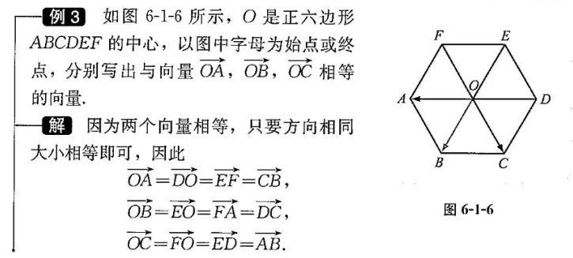

= 向量 vector
:toc:
---

== 向量 vector

向量 vector:: 像"位移"这样, 既有"距离数值大小, 又有"方向"(东西南北)的量, 称为"向量"(或"矢量").

模(或长度):: 向量的大小, 也称为"模"(或长度).

标量 scalar:: 只有"数值大小"的量, 称为"标量".  +
比如, 长度, 面积等, 都是"标量". 它们没有方向.

[cols="1a,1a"]
|===
|向量 |向量的"模"(长度)

|起点为A, 终点为B 的有向线段, 所表示的向量, 可以记为:
\begin{align}
\overrightarrow{AB}
\end{align}
|\begin{align}
\|\overrightarrow{AB}\|
\end{align}

|- 画图中, 还可以用小写字母(a, b, c) 来表示向量线段.

- 书写中, 还可以用带箭头的小写字母, 如:
\begin{align}
\overrightarrow{a},
\overrightarrow{b},
\end{align}
等, 来表示向量.

|此时, 向量的"模", 也用
\begin{align}
\|a\| 或 \|\overrightarrow{a}\|
\end{align}
来表示
|===

---

==== 零向量 zero vector -> 模 = 0

零向量:: "起始点"和"终点"相同的向量, 称为"零向量". 零向量本质上是一个"点", 因此可以认为零向量的方向是不确定的.

零向量直接写为 "0". 或
\begin{align}
\overrightarrow{0}
\end{align}

显然, 0向量的"模", 也为0 :
\begin{align}
|0| = 0
\end{align}

---

==== 非零向量 -> 模 ≠ 0

非零向量:: "模"不为0的向量, 通常称为"非零向量".

---

==== 单位向量 -> 模 = 1

单位向量:: 模 = 1

这就是说, 如果 e 是单位向量, 则:
\begin{align}
|e| = 1 <- e向量的模, 是1
\end{align}

---

==== 相等的向量 -> 长度大小相等, 方向相同 ->  a = b

相等的向量:: 一般地, 把大小相等, 方向相同的向量, 称为"相等的向量". +
比如, 向量 a 和 b 相等, 则记为: a = b

---

==== 平行(共线)的向量 ->  a // b

平行的向量:: 如果两个非零向量, 方向相同或相反, 则称这两个向量平行. +
两个向量 a 和 b 平行, 记作: a // b

两个向量平行, 也称为两个向量"共线".

---

== 向量的加法

---

https://mp.weixin.qq.com/s/sfK-dws_jgjdiFON2ILP6A

137
