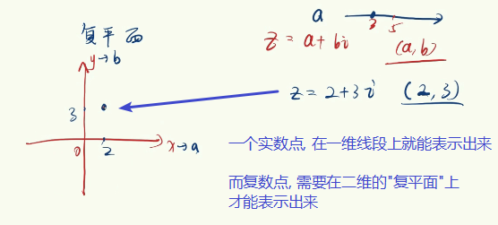
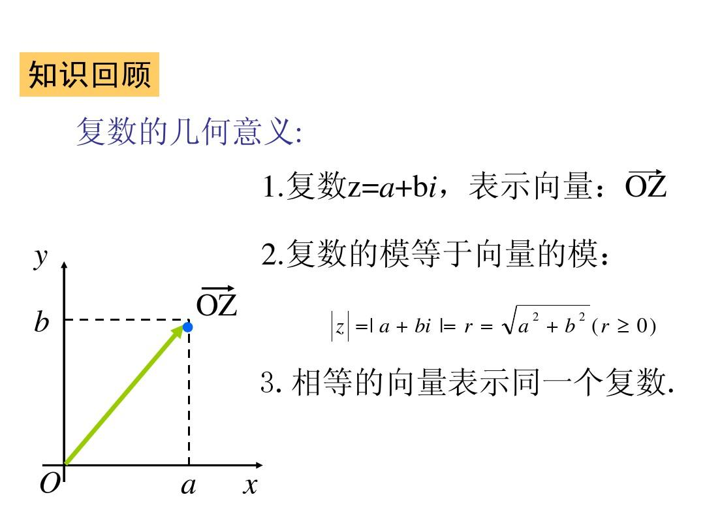

= 复数
:toc:

---

== 复数 complex number -> stem:[ \sqrt{-1} = i], 或 stem:[ i^2 = -1]

\begin{align}
& x^2 + 1 = 0 \\
& x^2  = -1 \\
& x = \pm \sqrt{-1 } \\
& 我们人物规定 \sqrt{-1} = i <- 即复数 (即 i^2 = -1 )
\end{align}

.标题
====
例如：
\begin{align}
\sqrt{-7} = \sqrt{7 * (-i)} = \sqrt{7} * i
\end{align}
====

复数:: 我们把形如 stem:[ z=a+bi],（a、b均为实数）的数, 称为"复数"(复数常用 z 来表示)。其中，a 称为实部，b 称为虚部，i 称为虚数单位。

- 当 z 的虚部 b＝0 时，则 z 为实数；
- 当 z 的虚部 b≠0 时，实部 a＝0 时，常称 z 为纯虚数。

复数平面 complex plane :: 即是z=a+bi ,它对应的坐标为（a,b) . 其中，

 - a表示的是复平面内的横坐标. 实数a的点都在x轴上，所以x轴又称为“实轴”；
- b表示的是复平面内的纵坐标. 表示纯虚数bi的点都在y轴上，所以y轴又称为“虚轴”。 +
y轴上有且仅有一个实点, 即为原点"0"。

复数可以比大小吗? 可以, 通过复平面上的"复数点"与"原点"(0,0)的距离长度(称为"模"), 来比较复数间的大小.

即: 设复数 z=a+bi (a,b∈R), 则: +
复数z的模 :
\begin{align}
|z|= \sqrt{a^2 + b^2} <- 根据勾股定理
\end{align}

.标题
====
例如：stem:[ (3x + 2y) + (5x -y) i = 17 - 2i, \quad (x,y \in R) ], 求 x,y

这个很简单, 只要让两个虚数的 实部与实部, 虚部与虚部相等就行了.
\begin{cases}
3x + 2y = 17 \\
5x -y = -2
\end{cases}
====

.标题
====
例如： 化简
\begin{align}
\frac{1+2i}{3-4i}
= \frac{(1+2i)(3+4i)} {(3-4i)(3+4i)}
= \frac{3 + 4i + 6i + 8 i^2} {9 - 16 i^2}
= \frac{-5 + 10i}{25} \\
= - \frac{1}{5} + \frac{2}{5}i <- 写成复数的标准形式 a + bi
\end{align}
====

.标题
====
例如：求 stem:[ i^{2003}]

\begin{align}
& 已知: \\
& i^1 = i \\
& i^2 = -1 \\
& i^3 = i^2 * i = -1 * i = -i  \\
& i^4 = (i^2) ^2 = (-1) * (-1) = 1 \\
& i^5 = i * i^4 = i  <- 新的循环 \\
& 所以 i 是一个周期函数 \\
& \\
& i^{2003}
= i^{2000} *  i^3
= (i^4) ^{500} * i^3
= 1 * (-i) = -i
\end{align}
====

---

https://www.bilibili.com/video/BV147411K7xu?p=124

