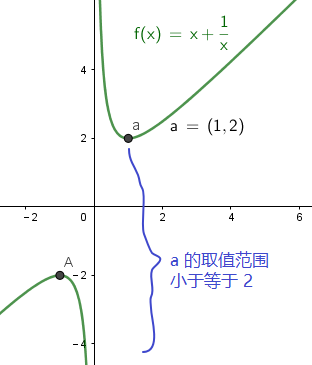
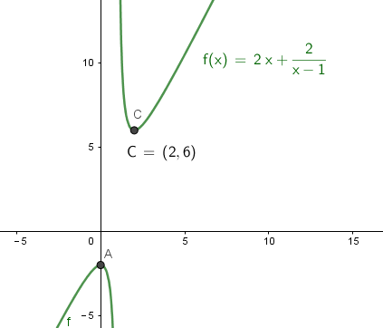
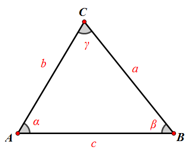
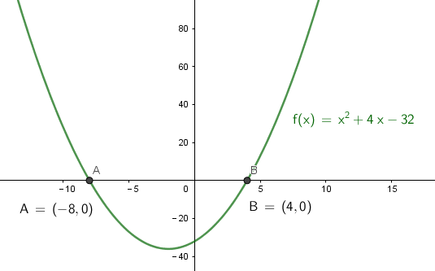
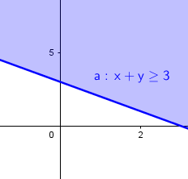
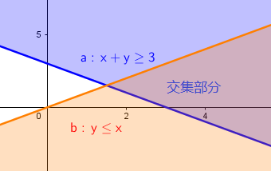
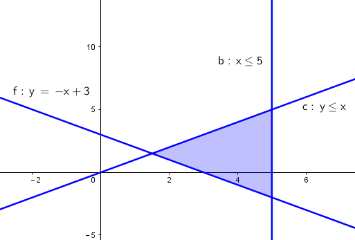

= 不等式
:toc:

---

== 做题的过程, 始终问自己两个问题: 1.中间推导出了什么? 2. 推导出这个结论的目的是什么? 即得到这个"中间结论", 是为什么目的服务? 这个目的最终会指向最终的终点问题.

== 如何比较两个数字的大小? -> 作差法 -> stem:[ 若A-B>0，则A>B]

比较两个数字(a,b)大小的方法, 可以用"作差法" : 即将一个数减去另一个数 (比如让 a-b), 来看其值是否等于0? 如果不等于0, 就说明两数不相等.

- 若A-B>0，则A>B
- 若A-B<0，则A<B
- 若A-B=0，则A=B

.标题
====
例如： stem:[ a, b \in (0,+\infty) , \quad A =  \sqrt{a} + \sqrt{b},  \quad B = \sqrt{a+b}], 问 A , B 的大小关系?

*既然 a,b 都是正数, 那么取它们的平方, 不会改变两者的大小关系, 即 : 如果 a>b, 则依然 stem:[ a^2 > b^2].*

即:
\begin{align}
\boxed{
若 a>b>0,  \quad 则  a ^n > b^n, \quad (n \in N^*)
}
\end{align}

所以, 本题中, 为了把根号消掉, 我们就来比较下它们取平方后的大小关系:
\begin{align}
& A^2 = a + b+ 2\sqrt{ab} \\
& B^2 = a+b \\
& A^2  -B^2 =  2\sqrt{ab} > 0 \\
& \therefore  A^2 > B^2 \\
& 即 \; A>B
\end{align}
====

.标题
====
例如：如果 stem:[ a>b>0, t>0], 设 stem:[ M = \frac{b}{a}, N = \frac{b+t}{a+t}], 那么, 下面哪个是对的?

\begin{align}
& A. M<N \\
& B. M>N \\
& C. M=N \\
& D. M与N 的大小关系, 和 t 有关
\end{align}

要比较 M 与 N 的大小, 我们可以用"作差法", 或"作商法"来比较:

比如作差法:
\begin{align}
& N-M =  \frac{b+t}{a+t} - \frac{b}{a} \\
& = \frac{ab + at - ab - bt} {a(a+t)} \\
& = \frac{t(a-b)} {a(a+t)} <- \frac{t>0, a>b, 所以分子>0} {a,t 都 >0, 所以分母>0} \\
& 即: N-M > 0 <- N>M, 选项 A 正确
\end{align}
====

---

== 如何比较两个数字的大小? -> 作商法 -> stem:[  a>0,\quad b>0, 若 \quad \frac{a}{b}>1, 则 a>b]

[options="autowidth" cols="1a,1a"]
|===
|Header 1 |Header 2

|- stem:[  a>0,\quad b>0, 若 \quad \frac{a}{b}>1, 则 a>b]
|即:
\begin{align}
& \frac{a}{b}>1 \\
& \frac{a}{b}*b > 1*b <- 两边同时乘上一个正数, 大小符号不变 \\
& 即得出: a>b
\end{align}
|===

.标题
====
例如： stem:[ a>b>0], 比较 stem:[ \frac{a^2-b^2}{a^2 + b^2}] 与 stem:[ \frac{a-b}{a+b}] 的大小.

我们就用"作商法", 来比较它们的大小:
\begin{align}
& 设 A= \frac{a^2 - b^2} {a^2 + b^2}, \quad B = \frac{a-b}{a+b} \\
& \frac{A}{B} = \frac{(a+b)(a-b)}{a^2 + b^2} * \frac{a+b}{a-b} \\
 &= \frac{(a+b)^2} {a^2 + b^2} \\
&= \frac {a^2 + b^2 + 2ab}  {a^2 + b^2} \\
&= 1 + \frac {2ab}  {a^2 + b^2} <- 由于a, b 都是正数, 显然, 这里的和 > 1 \\
& \therefore A>B
\end{align}
====

---

.标题
====
例如：
已知 stem:[ a>b>0, c<0], 求证 stem:[ c/a > c/b]

*我们使用"倒推法"来做, 假设要求证的内容为"真", 来倒推回去, 看看是否能得出最开始的已知条件 (即, 从"终点"往"起点"走, 看看能不能走通). 如果有矛盾, 则要求证的内容就为"假", 否则, 的确为"真".*

\begin{align}
& 证: 假如  \frac{c}{a} > \frac{c}{b} 为真, \\
& 则: \frac{c}{a} *ab > \frac{c}{b} * ab <- 两边同时乘上一个正数, 大小关系不变 \\
& 就有 \; bc > ac \\
& 从这个式子上, 我们可以得出: 若 c>0, 则 b>a;  若c<0, 则 a>b \\
& 结果发现, "若c<0, 则 a>b 部分", 和题目给出的条件完全相符, 无矛盾之处. 所以证明要求证的内容完全正确.
\end{align}

====

---

== 基本不等式(均值不等式) Inequality of arithmetic and geometric means -> stem:[ x+y \ge 2 \sqrt{xy}  ]

首先, 我们要知道两个概念:

[options="autowidth"  cols="1a,1a"]
|===
|Header 1 |Header 2

|算数平均数 Arithmetic mean
|设一组数据为X1，X2，...，Xn，简单的"算术平均数"公式为：
\begin{align}
AM = \frac{x_1 + x_2 + ... + x_n}{n}
\end{align}

|几何平均数 Geometric Mean
|简单几何平均数, 计算公式为:
\begin{align}
GM = \sqrt[n]{x_1 * x_2 *  ... * x_n}
= \sqrt[n]{\prod_{i=1}^n X_i}
\end{align}
即: 简单几何平均数,是n个变量值连乘积, 的n次方根。
|===

下面, 我们来推导出"基本不等式":

\begin{align}
& (a-b)^2 \ge 0 <- 无论a,b为何数, 这个式子都成立. 如果 a=b, 该式子的确也 = 0 \\
& 展开后就有 \; a^2 + b^2 - 2ab \ge 0 \\
& a^2 + b^2  \ge 2ab \\
& 我们引入两个变量 x, y, 令 x = a^2, \; y = b^2 \\
& 就有: x+y \ge 2 \sqrt{xy} \\
& \boxed{
\frac{x+y}{2} \ge \sqrt{xy} \quad (x＞0, y＞0), (并且 当 x=y时, 该式子能取到等号.)
} \\
& <- 这个就是"基本不等式". 即: 两个正实数的"算术平均数", 大于或等于它们的"几何平均数"。
\end{align}

那么这个"基本不等式"什么时候取等号呢?  原式是 a=b 时, 原式就能取等号. 这里就是 x=y 时, 这个式子能取到等号.

上面"基本不等式"的完整形态, 其实是:
\begin{align}
\boxed{
\sqrt{\frac{x^2+ y^2}{2}} \ge \frac{x+y}{2} \ge \sqrt{xy} \ge \frac{2}{\frac{1}{a} + \frac{1}{b}} \\
即: 平方均值 \ge 算术均值 \ge 几何均值 \ge 调和均值
}
\end{align}

其实:
[options="autowidth"]
|===
|Header 1 |Header 2

|\begin{align}
\frac{x+y}{2}
\end{align}
|<- 这部分, 就是"算数平均数 AM".

|\begin{align}
\sqrt[2]{xy}
\end{align}
|<- 这部分, 就是"几何平均数 GM".
|===

.标题
====
例如： 当 x>0 时,  stem:[  x + 1/x \ge ?]

利用"基本不等式"公式: stem:[ x+y \ge 2 \sqrt{xy} ], 我们就能知道:
\begin{align}
 x + \frac{1}{x} \ge 2 \sqrt{x * \frac{1}{x}} = 2
\end{align}
并且, 当 stem:[ x= 1/x] 时, 即 x=1 时, 上面的式子就能取等号.

image:img_math/math_142.png[]

====

.标题
====
例如： 若 a > 0, 则 stem:[ a + \frac{4 - a}{a}] 的最小值为:

这里, 假如直接套用"基本不等式"公式: stem:[ x+y \ge 2 \sqrt{xy} ], 就会有:
\begin{align}
a + \frac{4 - a}{a} &\ge 2 \sqrt{a * \frac{4 - a}{a} } \\
& \ge 2 \sqrt{4-a}
\end{align}
<- 发现  stem:[ \sqrt{xy}] 做出来不是一个常数, 而是依然带有变量a存在. 于是就没法开根号, 来算出里面的具体值.

所以, 我们要先处理一下原式, 才能让 stem:[ \sqrt{xy}] 做出一个常数. 怎么处理呢? 可以把分数拆分一下试试:

\begin{align}
& a + \frac{4 - a}{a} = a+ \frac{4}{a} - \frac{a}{a}\\
&= (a + \frac{4}{a}) -1 <- a + \frac{4}{a} 就能套用"基本不等式"公式了,因为这两个数相乘能消掉变量,而变成常数 \\
& \ge 2 \sqrt{a *  \frac{4}{a}} -1 \\
& \ge 2 *2  -1 \\
& \ge 3
\end{align}

image:img_math/math_143.png[]
====

.标题
====
例如：若对任意的 stem:[ x \in (0, +\infty)], 都有 stem:[ x + 1/x \ge a], 则 a 的取值范围是?

我们先用"基本不等式"公式, 来算 stem:[ x + 1/x ] 大于或小于什么?
\begin{align}
& x + \frac{1}{x} \ge 2\sqrt{x *  \frac{1}{x}} <- 套用基本不等式公式 x+y \ge 2 \sqrt{xy} \\
& \ge 2
\end{align}
即,  stem:[ f(x) = x + 1/x] 中的所有点, y值只有一个是2, 其他都在2以上.  +
而 a 就是2. 所以就能知道, 曲线上的点的y值, 除了一个是等于a以外, 其他所有点的y值都超过了 a.  那么a就肯定是小于等于2的.

即: stem:[ a \in (- \infty, 2 \] ]

====

---

==== 1 的代换

常常用在这种题型里:

- 已知 stem:[ 1/a + 1/b =1] (分子上的1可以换成任何常数), 求 stem:[ a+b]的最小值. +
- 或 已知 stem:[ a+b=1] (前面往往还带有系数), 求 stem:[ a/b] 等分式的最小值.

具体来说:

- 题目是求"最值"
- 已知的部分, 是"和式"; 要求的部分, 也是"和式". 这两个和式中, 一个为"整式", 一个为"分式"（或可化为分式）.
- 已知的"和式", 可以变为常数1.
- 这两个和式, 都是齐次式, 或可变为齐次式.

符合上述特征的题目，就能通过“1的代换", 来轻松解决问题. +
即, 我们就在所要求的式子后面, 乘以一个1, 或者一个常数.

.标题
====
例如：已知 stem:[ mn >0, \quad 2m+n=1] , 则 stem:[ 1/m + 2/n]的最小值是?

解:
\begin{align}
& \frac{1}{m} + \frac{2}{n} \\
& = (\frac{1}{m} + \frac{2}{n} ) * 1 \\
& = (\frac{1}{m} + \frac{2}{n}) * (2m+n)  <- 因为题目已知 2m+n =1  \\
& = 2 + \frac{n}{m} + \frac{4m}{n} + 2 \\
& <- 中间两项, 变量互为倒数关系, 就可以用基本不等式来做了, 因为可以消去变量, 只剩下常数.  \\
& \ge 4 + 2 \sqrt{\frac{n}{m} * \frac{4m}{n} } \\
& \ge 4 + 2*2 = 8
\end{align}

所以, 本题 stem:[ 1/m + 2/n]的最小值是 8.

那么 stem:[ \frac{1}{m} + \frac{2}{n}]  什么时候取等号呢?
就是当 stem:[  \frac{n}{m} = \frac{4m}{n}] 时, 即:
\begin{align}
& \frac{n}{m} = \frac{4m}{n} \\
& n^2 = 4m^2 \\
& n = 2m
\end{align}

既然知道了 n 和 m 的关系, 进一步, 我们把 n 代入原式中, 就能求出 m和n 的具体值来了:
\begin{align}
& 2m+n=1 &① \\
& 2m + 2m = 1 \\
& m = \frac{1}{4} <- 把它代入 ①中\\
& \frac{1}{2} + n = 1 \\
& n = \frac{1}{2}
\end{align}

即, 当 stem:[ m=1/4, \quad n = 1/2] 时, stem:[  \frac{1}{m} + \frac{2}{n}] 就能取到等号 = 8.
====

.标题
====
例如： 已知 stem:[ m>0, n>0, 1/m + 4/n =1], 若不等式 stem:[ m+n \ge -x^2 + 2x +a] 对已知的 m,n, 及任意实数 x 恒成立, 则实数 a 的取值范围是?

既然我们看到了题目给出了 stem:[  1/m + 4/n =1], 那就明摆着可以用"1的代换"法来做做看了.

题目中不等式左边的部分:
\begin{align}
& m + n  = (m+n) * 1 \\
& = (m+n) * (\frac{1}{m} + \frac{4}{n}) \\
& = 1 +\frac{4m}{n} + \frac{n}{m} + 4 <- 中间两项使用"基本不等式"公式 \\
& \ge 5 + 2\sqrt{\frac{4m}{n} * \frac{n}{m} } \\
& \ge 5 + 4 \\
& \ge 9
\end{align}

所以 stem:[ m + n \ge 9] , 即 m + n 的最小值是9

所以, 题目中原式的 stem:[ m+n \ge -x^2 + 2x +a], 就可以写成:
\begin{align}
& 9 \ge -x^2 + 2x +a \\
& <- 既然 m+n 的所有区间都满足这个不等式, 那么我们就用 m +n的最小值9来代进去了 \\
& x^2 -2x -a +9 \ge 0 \\
\end{align}

这里, 我们可以把它看做是一个二次方程, 或二次函数 stem:[  f(x) = x^2 - 2x + (9-a)], 既然它的y值 >0, 即它的曲线和x轴只有一个交点, 或在x轴上方. 也就是说, 它的 stem:[ \Delta \le 0]

即:
\begin{align}
& \Delta = b^2 - 4ac \le 0 \\
 &(-2)^2 - 4(9-a) \le 0 \\
& a \le 8
\end{align}

所以, 本题问 a 的取值范围, 就是 stem:[ (-\infty, 8\]]
====

.标题
====
例如：已知 stem:[ x+2y = xy \quad (x>0, y>0)], 则 stem:[ 2x+y] 的最小值为 ?

\begin{align}
& x+2y = xy \\
& \frac{x}{xy} + \frac{2y}{xy} = 1 \\
& \frac{1}{y} + \frac{2}{x} = 1 <- 我们让这个式子转换成等于了1
\end{align}

这样, 我们就能用1的代换, 来做. 既然题目问的是  stem:[ 2x+y] 的最小值, 那么就 :
\begin{align}
 2x+y =  (2x+y) * 1 \\
=  (2x+y) * (\frac{1}{y} + \frac{2}{x} ) \\
\ge 2 \sqrt{ (2x+y) * (\frac{1}{y} + \frac{2}{x}) }
\end{align}
====

---

.标题
====
例如：函数 stem:[ y = 2x + \frac{2}{x-1} \quad  (x>1)] 的最小值是 ?

方法1:

这个式子, 我们不能直接套用"基本不等式公式"来做, 因为 stem:[ \sqrt{2x * \frac{2}{x-1}} ] 无法消掉未知数x.

所以, 我们用另一种变量替代(换元)法来做, 即 : 用 a 代表 x-1, 则就有:

- x-1 = a  <- 因为 x>1, 所以 x-1 = a > 0, a 就满足使用 "基本不等式公式"的条件了.
- x = a+1

这样, 原式就能变成:
\begin{align}
& y = 2x + \frac{2}{x-1} \\
&  = 2(a+1) + \frac{2}{a} \\
& = 2 + (2a +  \frac{2}{a} ) <- 括号中的, 我们就能套用"基本不等式公式"了, 因为可以消掉变量a \\
& \ge 2 + 2 \sqrt{2a * \frac{2}{a} } \\
& \ge 2 + 4 \\
& \ge 6
\end{align}

那么进一步, 原式什么时候能取到等号呢?

即 当 stem:[ 2a = 2/a] 时, 就能取到等号. 即 stem:[ a^2 =1 , a=1], +
而 stem:[ x = a+1] , 则 stem:[ x = 2] 时, 原式能取到等号.

换元法 method of substitution :: 解一些复杂的因式分解问题，常用到换元法，即对结构比较复杂的多项式，若把其中某些部分看成一个整体，用新字母代替(即换元)，则能使复杂的问题简单化.

'''

方法2: 既然原式是 stem:[ y = 2x + \frac{2}{x-1} \quad  (x>1)] , 为了可以套用"基本不等式"公式, 我们为了能消掉后面分母上的 x-1, 就对前面的 2x, 让它变成 2x - 2 + 2 , 即 stem:[ 2(x-1) + 2], 这样就能消掉 x-1 这个变量 :

\begin{align}
& y = 2x + \frac{2}{x-1} \\
& = 2(x-1) + \frac{2}{x-1} + 2 \\
& \ge 2\sqrt{2(x-1) * \frac{2}{x-1}} +2 \\
& \ge 2 * 2 + 2 \\
& \ge 6
\end{align}
====

---

==== 余弦定理 & 用"三角函数"来计算"三角形面积"

下题, 我们要用到"余弦定理", 和 "用三角函数公式来计算三角形面积".

.标题
====
余弦定理 The Law of Cosines :: 对于任意三角形(锐角, 钝角, 直角都行)，任何一边的平方, 等于其他两边平方的和, 减去这两边与它们夹角的余弦的积的两倍。

即:
\begin{align}
\boxed{
a^2 = b^2 + c^2 - 2bc *\cos \alpha \\
\cos \alpha  = \frac{b^2 + c^2 - a^2}{2bc} \\
\cos \alpha  = \frac{sin^2 \beta + sin^2 \gamma - sin^2 \alpha}{2 sin \beta sin \gamma}
} \\
\end{align}

====

.标题
====
三角函数公式, 来计算三角形面积

image:img_math/math_147.png[]

△ABC的面积是 stem:[ = \frac{ah}{2}]

\begin{align}
& 而 sin ∠C = \frac{h}{b} \\
& h = sin ∠C * b <- 把 h 代入 三角形的面积公式 \\
& △ABC的面积 = \frac{ah}{2} \\
& △ABC的面积 =\frac{a * (sin ∠C * b)}{2} \\
& \boxed{
△ABC的面积 = \frac{1}{2} ab \sin ∠C <- 用三角函数, 算面积
}
\end{align}

即: 三角形的面积, 等于(两邻边 及其夹角正弦值的乘积) 的一半。

完整的面积公式为:
若△ABC中, 角A，B，C 所对的三边是a,b,c, 则:
\begin{align}
\boxed{
S△ABC = \frac{1}{2} ab *  \sin C \\
= \frac{1}{2} bc *  \sin A \\
= \frac{1}{2} ac *  \sin B
}
\end{align}

====

.标题
====
例如：△ABC 中, 已知 a=1, stem:[∠A = \frac{\pi}{3}  ], 问: +
△ABC 的周长的最大值是? +
△ABC 的面积最大值是?

- 求周长的最值 :

周长 = a + (b + c), 由于 a 是已知的, 我们就要知道 b + c 的最值是什么?

*那么怎么知道 b + c 的最值呢? 换言之, 有没有什么公式, 是把 变量 a(值已知),b,c, 和 ∠A(值已知) 等连在一起的呢? 以至于能求出 b+c 的值的呢? 有的 -- 就是"余弦定理".*

余弦定理, 即:
\begin{align}
\boxed{
\cos \alpha  = \frac{b^2 + c^2 - a^2}{2bc}
}
\end{align}

由于题目给出  stem:[∠A = \frac{\pi}{3}  ], 所以 stem:[ cos A = cos \frac{\pi}{3} = \frac{1}{2}]

把已知的值, 代入余弦定理, 即:
\begin{align}
& \frac{1}{2} = \frac{b^2 + c^2 - 1}{2bc} \quad ① \\
& bc = b^2 + c^2 - 1 \\
& 1 = b^2 + c^2 - bc <- 为了配成(b+c)的形式, 我们给它加上一个2bc, 再减去一个2bc \\
& 1 =  b^2 + 2bc + c^2 - 2bc - bc\\
& 1 = (b+c)^2 - 3bc <-别忘了我们的初心, 我们想要知道的是 (b+c) 的值, 而不是bc的值\\
& <- bc能不能变换成 (b+c) 的形式? 可以. 套用基本不定式公式, 即: b + c \ge 2\sqrt{bc}, 就是 bc \le (\frac{b+c}{2})^2 \quad ②\\
& 1 \ge (b+c)^2 - 3  (\frac{b+c}{2})^2 <- 现在, 我们就得到了只含有 (b+c)的式子, 正是我们的初心想知道的东西 \\
& 1 \ge (b+c)^2 - 3 * \frac{1}{4} (b+c)^2  \\
& 1 \ge \frac{1}{4} (b+c)^2 \\
& 2 \ge b+c
\end{align}

所以, 就能知道 △ABC 的周长 是:
\begin{align}
a+ (b+c) \le 1 + 2
\end{align}
即, 周长的最大值, 就是 3.

那么进一步, 什么时候周长就等于3呢? 也就是在上面的式子, 从"等号"变成"不等号"的那一步中的 stem:[ b + c \ge 2\sqrt{bc}], 即当 b = c 时, 该式子就能取到等号, 而非不等号. +
那么当 b = c 时, 代入 ①, 就能求出b与c的具体值了 :
\begin{align}
& \frac{1}{2} = \frac{b^2 + c^2 - 1}{2bc} \quad  \\
& \frac{1}{2} = \frac{2b^2 -1 }{2b^2} \\
& 2b^2 = 4b^2 - 2 \\
&  2 = 2b^2 \\
& b = 1
\end{align}

所以, 当 b = c  = 1 时, △ABC 的周长能取到等于3 的值.

'''

- △ABC 的面积最大值是?

套用三角函数来计算面积的公式:
\begin{align}
\boxed{
S△ABC = \frac{1}{2} bc *  \sin A
}
\end{align}

其中 stem:[ sin A = sin \frac{\pi}{3} = \frac{\sqrt{3}}{2}]

而 bc 从上面的 ② 可知, stem:[ bc \le (\frac{b+c}{2})^2] , 因为 stem:[ b = c = 1], 即 stem:[ bc \le 1].

所以
\begin{align}
S△ABC &= \frac{1}{2} bc *  \sin A \\
&\le \frac{1}{2} * 1 * \frac{\sqrt{3}}{2} \\
&\le \frac{\sqrt{3}}{4}
\end{align}

所以, 当 stem:[ b = c = 1] 时, 三角形面积能取到最大值 stem:[\frac{\sqrt{3}}{4} ].
====

---

==== 总结 : 各种方法

[cols="1a,4a"]
|===
|Header 1 |基本不等式公式: stem:[ \sqrt{\frac{x^2+ y^2}{2}} \ge \frac{x+y}{2} \ge \sqrt{xy}]

|直接套用"基本不等式公式"法
|\begin{align}
& x + \frac{1}{x} 的极值是? \\
& 可以直接套用公式 : \\
& 原式 \ge 2 \sqrt{x * \frac{1}{x}} \ge 2
\end{align}

'''

例: +
\begin{align}
& \sqrt{(3-a)(a+6)} \\
& 直接套用公式 \sqrt{xy} \le \frac{x+y}{2} \\
& 即: 原式 \le  \frac{(3-a) + (a+6)}{2} \le \frac{9}{2}
\end{align}

|1 的代换
|例: 已知 stem:[ a>0, b>0, 2/x + 1/y =1], 求 x+2y 的最小值.

\begin{align}
& = (x+2y) * 1 \\
& = (x+2y) * (\frac{2}{x} + \frac{1}{y}) \\
& = 2 + \frac{x}{y} + \frac{4y}{x} + 2 \\
& 中间两项, 就互为倒数了, 我们可以使用"基本不等式公式", 来消去变量 \\
& \ge 2\sqrt{\frac{x}{y} * \frac{4y}{x}} + 4 \\
& \ge 8 <- 即, x+2y 的最小值是8
\end{align}

|补项法: 将缺少的部分补充回来, 以满足"基本不等式"的使用
|例1:  +
已知, stem:[ x>1], 求 stem:[ x + \frac{1}{x-1}] 的最小值?

\begin{align}
& x + \frac{1}{x-1} \\
& = (x-1) +1 + \frac{1}{x-1} \\
& <- 补项, 把其中一项凑成另一项的倒数, 方便使用"基本不等式公式"来消去变量. \\
& \ge 2 \sqrt{ (x-1) * \frac{1}{x-1}} +1 \\
& \ge 3
\end{align}

'''

例2: 在"1的代换"法中, 使用"补项"法:  +
已知 stem:[ a>0, b>1], 当 stem:[ a+b=2] 时, 问 stem:[ \frac{2}{a} + \frac{1}{b-1}] 的最小值是?

\begin{align}
& \because  a+b=2 \\
& a+(b-1) = 2-1 =1 \\
& <- ① 目的是凑成等于1, 可以使用1的代换. ② 并且凑成另一项的倒数, 方便使用"基本不等式公式"来消去变量.\\
& \\
& 题目要求的 \frac{2}{a} + \frac{1}{b-1} \\
& =  (\frac{2}{a} + \frac{1}{b-1}) *1 \\
& = (\frac{2}{a} + \frac{1}{b-1}) * [a+(b-1)]\\
& = 展开后, 中间两项就能用基本不等式公式
\end{align}

'''

例3: 已知 stem:[ a>b>0], 问 stem:[ a^2 + \frac{1}{ab} + \frac{1}{a(a-b)] 的极值?

基本不等式公式, 是两项的, 本题中有3项? 怎么处理呢? 看看能否将它们拆成四项, 或合并为两项?
\begin{align}
& a^2 + \frac{1}{ab} + \frac{1} {a(a-b)} \\
& 令 x = ab, \quad y = a(a-b) <- 换元法 \\
& 则 y = a^2 - ab = a^2 - x \\
& 即 : a^2 = y + x \\
& \therefore 原式 = (x+y) + \frac{1}{x} + \frac{1}{y} \\
& = (x +  \frac{1}{x}) + (y + \frac{1}{y}) \\
& \ge 2 \sqrt{x * \frac{1}{x}} + 2 \sqrt{y * \frac{1}{y}} \\
& \ge 4
\end{align}

|换元法
|例 stem:[a,b>0, a+b =5 ] , 求 stem:[ \sqrt{a+1} + \sqrt{b+3}] 的最大值?

\begin{align}
& 令 x = \sqrt{a+1}, \quad y =  \sqrt{b+3} <- 换元法 \\
& x^2 = a+1, \quad a= x^2 - 1 \\
& y^2 = b+3, \quad b = y^2- 3 \\
& \because  a+b =5 \\
& 即: (x^2 - 1) + (y^2- 3) = 5 \\
& x^2 + y^2 = 9 \\
& 根据基本不等式公式, 有
\boxed{
\sqrt{\frac{x^2+ y^2}{2}} \ge \frac{x+y}{2} \ge \sqrt{xy}
}\\
& 即  \frac{x+y}{2} \le  \sqrt{\frac{x^2+ y^2}{2}} \\
& \frac{x+y}{2} \le  \sqrt{\frac{9}{2}} \\
& x + y \le 2 *3 \sqrt{\frac{1}{2}} \\
& \le 3 \sqrt{2}
\end{align}

'''

例: stem:[ x,y>0, \quad x+2y + 2xy = 8], 求 stem:[ x+2y] 的最小值?

要求的是 x+2y, 而已知条件中也含有x+2y, 所以我们用换元法, 令 t = x+2y

\begin{align}
& 要求的 x + 2y \ge 2 \sqrt{x*2y} <- 根据"基本不等式"公式 \\
& x + 2y  \ge 2 \sqrt{2} \sqrt{xy} <- 两边再同时进行平方 , 把根号去掉\\
& (x + 2y)^2 \ge 8 xy <- 之前我们令 t = x+2y了, 代进去\\
& t^2 \ge 8 xy \\
& xy \le \frac{t^2}{8} <- 为了算出t的具体值, 我们要把它代入回题目给出的已知条件 x+2y + 2xy = 8 中 \\
& \\
& \because  (x+2y) + (2xy) = 8 \\
& 即: (t) + (2*  \frac{t^2}{8}) \ge 8 <- 两边同时乘上8 \\
& 8t + 2t^2 - 64 \ge 0 \\
& t^2 + 4t - 32 \ge 0 \\
& (t-4)(t+8) \ge 0 \\
& t \ge 4 \; 或 \; t \le -8 \\
& \\
& \because 一开始, 我们就已经令 t =  x+2y 了, 所以: \\
& x + 2y 就和t一样, 是 \ge 4 \; 或 \;  \le -8 \\
& 又因为题目给出  x,y>0, 所以 x + 2y 就只能是 \ge 4
\end{align}

|===

---

==== 不等式的性质

.标题
====
例如： 若 stem:[  a+b+c=0], 且 stem:[  a<b<c], 则 下列不等式,一定成立的是哪个?
\begin{align}
& A. \quad ab^2 < b^2c \\
& B. \quad ab < ac \\
& C. \quad ac < bc \\
& D. \quad ab < bc \\
\end{align}

既然 stem:[  a+b+c=0], 说明:

- a,b,c 三个数不可能都是正数, 否则它们的和就 >0 了. 因此最小的a不可能是正数, 否则必它大的 b和c 就都是正数了. 造成三个数都是正数.
- 这三个数也不可能都是负数, 否则它们的和就 <0 了. 因此最大的c不可能是负数, 否则比它小的b和a 就都是负数了.
- 所以: 这三个数中, a就是负数, c就是正数. b呢? 不确定, b可以为正, 也可为负, 也可为0.

所以:

[options="autowidth"]
|===
|Header 1 |stem:[ \underbrace{a}_{-} < \underbrace{b}_{-0+} < \underbrace{c}_{+} ]

|stem:[  A. \quad ab^2 < b^2c]
|<- 如果 b 是 0 的话, 则 选项A 就排除了.

|stem:[  B. \quad ab < ac ]
|已知 b<c, 但 a是负数, 所以就应该是 ab > ac 了. B选项错误.

|stem:[  C. \quad ac < bc]
|因为c是正数, 所以符号正确

|stem:[  D. \quad ab < bc ]
|虽然已知 a<c, 但 b 可正可负, 如果是负数, 则就应该是 ab > cb 了, 所以D选项也不精确.
|===

====

.标题
====
化为"相同形式"法, 来比大小 :

例如： 已知 stem:[ a = \sqrt{2} + \sqrt{11}, b=5, c = \sqrt{6} + \sqrt{7}], 则 a, b, c 的大小关系为?
\begin{align}
& A. a>b>c \\
& B. c>a>b \\
& C. c>b>a \\
& D. b>c>a \\
\end{align}

解体思路: 两个根号能否变成一个根号? 这样, 我们就能用"化为相同形式", 来对这三个数做比较了.
那么如何变成一个根号? 对它们同时做平方 (它们是正数, 因此做平方后, 彼此的大小关系不会改变).

即:
\begin{cases}
a^2 = 2+11 + 2\sqrt{2*11} & = 13 + 2 \sqrt{22} \\
b^2 = 5^2 = 25 = 13 + 2*6 & = 13 + 2 \sqrt{36} \\
c^2 = 6+7 + 2 \sqrt{6*7} & = 13 + 2 \sqrt{42}
\end{cases}

我们把 a, b, c 三个数, 都化为了相同的表达形式. 这样后, 一眼就能看出来: c>b>a, 选 C.
====

.标题
====
例如：设 a,b 为正实数, 则下列选项中, 正确的有?
\begin{align}
& A. 若 a^2 - b^2 = 1, 则 a-b<1 \\
& B. 若 \frac{1}{b} - \frac{1}{a} = 1, 则 a-b<1 \\
& C. 若|\sqrt{a} - \sqrt{b}| = 1, 则 |a-b|<1 \\
& D. 若 |a^3 - b^3| = 1,  则 |a-b|<1
\end{align}

验证 选项A:

[options="autowidth"]
|===
|推出了中间结论↓ |从已知条件 stem:[ a^2 - b^2 = 1] 出发

| a>b
|\begin{align}
& a^2 - b^2 = 1 \\
& (a+b)(a-b) = 1 \quad ① \\
& \because  a,b>0, 则 a+b>0 \\
& 正负号代入①可知,  正数 * (a-b) = 正数1 \\
& 则 (a-b)也是正数, >0 \\
& a-b>0, 则 a>b
\end{align}

|a+b 与 a-b 是倒数关系
|从①可知: 两个数的"乘积"是1, 则这两个数必定是倒数关系(如, x 与 stem:[ \frac{1}{x}] 之间的关系).  +
\begin{align}
& \because a>b \\
& \therefore  a+b > a-b
\end{align}
所以, ①式中, a+b是x, a-b 是 stem:[1/x ] +
显然, stem:[1/x ] 是个分数, 小于1的, 所以,  a-b < 1. 即 选项A 正确.
|===

'''

验证 选项B:
\begin{align}
& 问: 若 \frac{1}{b} - \frac{1}{a} = 1, 则 a-b<1 ? \\
& 既然 \frac{1}{b} - \frac{1}{a} = 1 \\
& \frac{a-b}{ab} = 1 \\
& a-b = ab <- 我们代个具体的数字进去看看, 算出满足这个式子的具体的 a, b, 假设a=10的话 \\
& 10 - b = 10b \\
& 11b = 10 \\
& b = \frac{10}{11} \\
& a- b = 10 - \frac{10}{11} <- 显然, a和b的差距远远大于1, 所以选项 B 错误.
\end{align}

'''

验证 选项C:

stem:[若|\sqrt{a} - \sqrt{b}| = 1, 则 |a-b|<1 ? ]

一个数字, "开方"后的值, 肯定会更小. 所以两个数字"开方"后的差(彼此相邻的距离), 肯定要比"开方"前更小的, 而不可能更大. 所以选项C 错误.

'''

验证 选项 D:

stem:[ 若 |a^3 - b^3| = 1,  则 |a-b|<1 ?]

\begin{align}
& 既然已知 |a^3 - b^3| = 1 \\
&  |(a-b)(a^2 + ab + b^2)| = 1 \\
& |a-b| * |a^2 + ab + b^2| = 1 <- 既然问题问的是 |a-b|, 那我们就凑出 |a-b| 的形式  \\
& |a-b| * |(a-b)^2 + 3ab| = 1 \\
& |a-b| * |(a-b)^2 | < 1 <- x*y , \; y变小后, x与y的乘积的值, 肯定也会缩小 \\
& |a-b|^3 < 1 \\
& |a-b| < 1 <- 一个正数x, 其开立方 \sqrt[3]{x}后的值, 肯定比x 更小
\end{align}

所以, 选项D 正确

====

---

====  stem:[ \frac{1}{n(n+1)} < \frac{1}{n^2} < \frac{1}{n(n-1)}] <- 分母越大, 分数值越小

[options="autowidth"]
|===
|Header 1 |Header 2

|stem:[\frac{1}{n^2} < \frac{1}{n(n-1)} ]
|<- 这个很好理解, stem:[  n*(n-1) 比 n*n 小], 分母越小,分数值越大, 所以: stem:[\frac{1}{n(n-1)}  > \frac{1}{n^2} ]

| stem:[ \frac{1}{n(n+1)} < \frac{1}{n^2} ]
|<- stem:[ n(n+1) > n*n], 分母越大, 分数值越小, 所以 stem:[ \frac{1}{n^2}  > \frac{1}{n(n+1)} ]
|===

连起来即:
\begin{align}
\boxed{
\frac{1}{n(n+1)} < \frac{1}{n^2} < \frac{1}{n(n-1)}
}
\end{align}

---

== 线性不等式的"可行域" feasible region

stem:[ x+y \ge 3] 怎么画图 (即它的"可行域"是什么)? 因为有两个变量, 所以必须在平面直角坐标系上来画了. 即, 相当于 f(x) = x+y , 在 y=3 以上的区域.

那么同时满足两个条件呢? 可行域是什么?

\begin{cases}
y \ge -x+3 \\
y \le x
\end{cases}

同时满足三个条件:
\begin{cases}
y \ge -x+3 \\
y \le x \\
x \le 5
\end{cases}

---

== 数列不等式

\begin{align}
\frac{1}{n^2} < \frac{1}{n(n-1)}
\end{align}
上式的逻辑是, 右边分母上的 stem:[ n^2 -n] 显然比左边分母上的 stem:[n^2  ] 小, 而分母越小, 分数值越大, 所以右边就大于左边.

所以就可以进一步知道:
\begin{align}
\boxed{
\frac{1}{n(n+1)} < \frac{1}{n^2} < \frac{1}{n(n-1)}
}
\end{align}

.标题
====
例如： 证明:  对于 stem:[ a_n = \frac{1}{(n+1)^2}, n \in N^*], 有 stem:[S_n <1 ]

我们从这个不等式出发:
\begin{align}
\boxed{
 \frac{1}{(n+1)^2} <  \frac{1}{n(n+1)}
}
\end{align}
很明显, 上式左边的分母, 展开后是 stem:[ n^2 + 2n +1], 右边的分母, 展开后是 stem:[ n^2 + n], 左边的分母比右边的分母, 值要大. 分母越大, 分数值越小. 所以左边的分式值, 小于右边.

那么我们就可以知道, 题目给出的stem:[ a_n] (通项公式) 就有 :

\begin{align}
a_n = \frac{1}{(n+1)^2} <  \frac{1}{n(n+1)}
\end{align}

对于 n项的和 stem:[ S_n], 其中的每一项, 也都有上面的不等式关系. 即:
\begin{align}
S_n & = \frac{1}{(1+1)^2} + \frac{1}{(2+1)^2} + \frac{1}{(3+1)^2} ... + \frac{1}{(n+1)^2} \\
& < \frac{1}{1(1+1)} + \frac{1}{2(2+1)}  + \frac{1}{3(3+1)} + ... +  \frac{1}{n(n+1)} \\
& < (1 - \frac{1}{2}) + (\frac{1}{2} - \frac{1}{3}) + ... + (\frac{1}{n} - \frac{1}{n+1}) \\
& < 1 -  \frac{1}{n+1} \\
& < 1 <- 证明完毕
\end{align}

====

---

https://www.bilibili.com/video/BV147411K7xu?p=122

6:16

